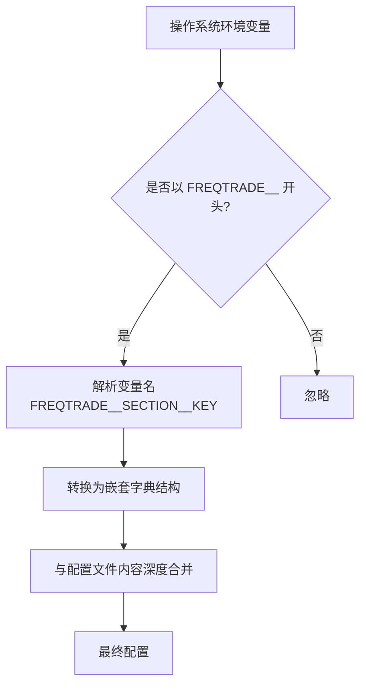
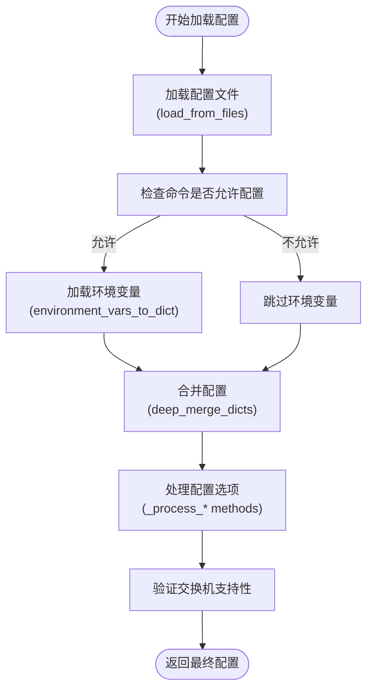
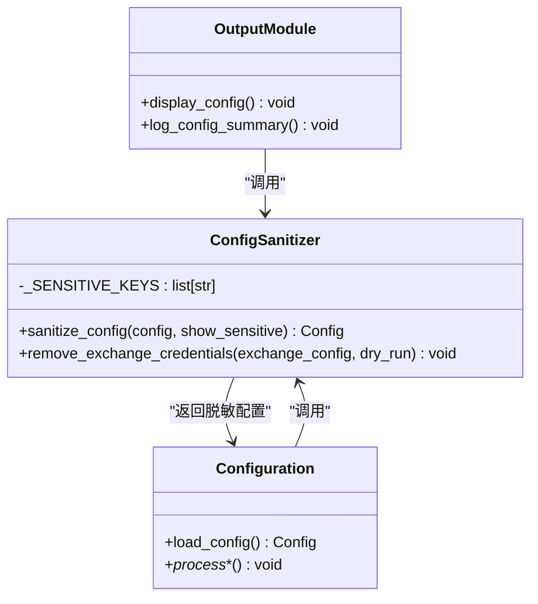
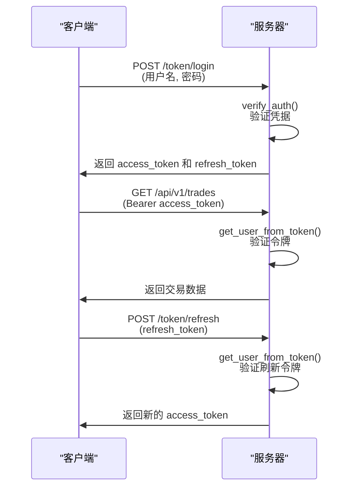

# 配置安全

<cite>
**本文档中引用的文件**   
- [config.json](file://user_data/config.json)
- [load_config.py](file://freqtrade/configuration/load_config.py)
- [environment_vars.py](file://freqtrade/configuration/environment_vars.py)
- [config_secrets.py](file://freqtrade/configuration/config_secrets.py)
- [api_auth.py](file://freqtrade/rpc/api_server/api_auth.py)
- [constants.py](file://freqtrade/constants.py)
</cite>

## 目录
1. [引言](#引言)
2. [配置文件结构与敏感信息](#配置文件结构与敏感信息)
3. [环境变量注入机制](#环境变量注入机制)
4. [配置加载与合并流程](#配置加载与合并流程)
5. [敏感信息保护与脱敏](#敏感信息保护与脱敏)
6. [API与JWT安全认证](#api与jwt安全认证)
7. [配置文件权限与存储最佳实践](#配置文件权限与存储最佳实践)
8. [安全审计与泄露防范](#安全审计与泄露防范)
9. [结论](#结论)

## 引言
Freqtrade 采用多层次的安全机制来保护交易机器人的配置文件，特别是其中包含的API密钥、JWT令牌等敏感信息。本文档系统化地阐述了其配置安全体系，重点分析了环境变量注入、配置文件权限管理、密钥隔离存储以及安全验证流程。通过深入解析代码实现，为用户提供防止配置泄露的实际案例和审计建议，确保交易环境的安全性。

## 配置文件结构与敏感信息
Freqtrade的配置文件（如`config.json`）是一个JSON格式的文件，包含了机器人运行所需的所有参数。该文件明确地将敏感信息集中管理，主要分布在以下几个关键部分：

- **交易所凭证**：`exchange`部分包含`key`（API密钥）、`secret`（API密钥密钥）和`password`（交易所密码），这些是访问交易所API的最高权限凭证。
- **通知服务密钥**：`telegram`部分包含`token`（Telegram机器人令牌）和`chat_id`（聊天ID），用于接收交易通知。
- **API服务器认证**：`api_server`部分包含`username`、`password`和`jwt_secret_key`（JWT密钥），用于保护Web UI和API接口。
- **自定义信息**：`custom_info`部分允许用户存储其他敏感信息，如SMTP邮箱密码、Twitter Bearer Token等。

这种结构化的配置方式使得敏感信息的识别和保护成为可能。

**Section sources**
- [config.json](file://user_data/config.json#L1-L93)

## 环境变量注入机制
Freqtrade提供了一种安全的机制，允许用户通过环境变量来覆盖或注入配置文件中的值，从而避免将敏感信息直接写入磁盘文件。

该机制的核心是`environment_vars.py`模块。它定义了一个前缀`FREQTRADE__`，所有以该前缀开头的环境变量都会被系统识别和处理。环境变量的命名遵循`FREQTRADE__{section}__{key}`的模式，例如`FREQTRADE__EXCHANGE__KEY`用于设置交易所API密钥。

在配置加载过程中，系统会调用`environment_vars_to_dict()`函数，该函数会遍历所有环境变量，根据前缀和命名规则，将它们转换为一个嵌套的字典结构。这个字典随后会与从配置文件中读取的内容进行深度合并，环境变量的值优先级更高，从而实现对配置文件的动态覆盖。

值得注意的是，为了保护某些特定的敏感信息（如密码），系统会将这些字段的值原样保留，不进行类型转换。

**Diagram sources **
- [environment_vars.py](file://freqtrade/configuration/environment_vars.py#L48-L81)

**Section sources**
- [environment_vars.py](file://freqtrade/configuration/environment_vars.py#L48-L81)

## 配置加载与合并流程
Freqtrade的配置加载是一个多步骤、多源合并的复杂过程，确保了配置的灵活性和安全性。

整个流程始于`configuration.py`中的`load_config()`方法。该方法首先调用`load_from_files()`函数，递归地加载用户通过命令行指定的一个或多个配置文件。这些文件可以相互包含，形成一个配置文件链。

在成功加载所有配置文件后，系统会立即检查当前命令是否允许配置文件。如果不允许（如某些工具命令），则跳过环境变量注入。否则，系统会调用`environment_vars_to_dict()`，将环境变量转换为字典，并使用`deep_merge_dicts()`函数将其与已加载的配置进行合并。环境变量的值会覆盖配置文件中的同名项。

最后，系统会对合并后的配置进行一系列处理，包括日志选项、运行模式、交易选项等的解析，并执行交换机支持性检查，最终返回一个完整的、可用于启动机器人的配置对象。

**Diagram sources **
- [configuration.py](file://freqtrade/configuration/configuration.py#L70-L120)
- [load_config.py](file://freqtrade/configuration/load_config.py#L79-L119)

**Section sources**
- [configuration.py](file://freqtrade/configuration/configuration.py#L70-L120)
- [load_config.py](file://freqtrade/configuration/load_config.py#L79-L119)

## 敏感信息保护与脱敏
为了防止敏感信息在日志、调试输出或错误信息中意外泄露，Freqtrade实现了一套完善的脱敏机制。

核心功能位于`config_secrets.py`模块中的`sanitize_config()`函数。该函数维护了一个名为`_SENSITIVE_KEYS`的敏感键名列表，包含了所有已知的敏感字段路径，如`exchange.key`, `telegram.token`, `api_server.password`等。

当需要输出或显示配置信息时（例如在日志中打印配置摘要，或在Web UI中展示），系统会调用`sanitize_config()`函数。该函数会创建配置的深拷贝，然后遍历`_SENSITIVE_KEYS`列表。对于列表中的每一个键，它会沿着配置的嵌套路径找到对应的值，并将其替换为`"REDACTED"`（已屏蔽）字符串。这样，即使配置被意外输出，敏感信息也已被安全地隐藏。

此外，对于回测、超优化等不需要真实交易所凭证的场景，系统会调用`remove_exchange_credentials()`函数，直接将这些凭证字段清空，从源头上杜绝了误用的风险。

**Diagram sources **
- [config_secrets.py](file://freqtrade/configuration/config_secrets.py#L26-L48)

**Section sources**
- [config_secrets.py](file://freqtrade/configuration/config_secrets.py#L1-L67)

## API与JWT安全认证
Freqtrade的Web服务器和API接口通过`api_auth.py`模块实现了强大的安全认证机制，主要依赖于HTTP基本认证和JWT（JSON Web Token）两种方式。

**HTTP基本认证**：用户可以通过`api_server`配置中的`username`和`password`进行登录。系统使用`secrets.compare_digest()`函数进行安全的密码比较，以防止时序攻击。

**JWT认证**：这是更现代和安全的无状态认证方式。当用户使用用户名和密码登录时，系统会调用`create_token()`函数生成一个JWT访问令牌（access token）和一个刷新令牌（refresh token）。访问令牌有效期为15分钟，刷新令牌有效期为30天。客户端在后续请求中携带访问令牌，服务器通过`get_user_from_token()`函数验证其有效性。当访问令牌过期后，客户端可以使用刷新令牌来获取新的访问令牌，而无需重新输入密码。

此外，系统还支持WebSocket的令牌认证，允许通过`ws_token`或JWT来建立安全的实时连接。

**Diagram sources **
- [api_auth.py](file://freqtrade/rpc/api_server/api_auth.py#L107-L160)

**Section sources**
- [api_auth.py](file://freqtrade/rpc/api_server/api_auth.py#L33-L160)

## 配置文件权限与存储最佳实践
为了最大限度地保护配置文件，建议遵循以下最佳实践：

1.  **使用环境变量**：将所有敏感信息（API密钥、密码、令牌等）存储在环境变量中，而不是写入`config.json`文件。可以在`config.json`中将这些字段留空或设置为占位符。
2.  **文件权限管理**：确保`config.json`文件的文件系统权限设置为仅所有者可读写（例如，在Linux上使用`chmod 600 config.json`）。这可以防止同一台机器上的其他用户读取该文件。
3.  **版本控制排除**：绝对不要将包含敏感信息的`config.json`文件提交到Git等版本控制系统中。应在`.gitignore`文件中添加`config.json`，并提供一个`config.json.example`作为模板。
4.  **使用强密码和密钥**：为API、Telegram、Web UI等设置复杂且唯一的密码和密钥。特别是`jwt_secret_key`，应使用一个长且随机的字符串。
5.  **定期轮换密钥**：定期更换交易所的API密钥，并在配置中更新。许多交易所允许为API密钥设置IP白名单和权限限制，应充分利用这些功能。

## 安全审计与泄露防范
为了主动防范配置泄露，建议进行以下安全审计：

- **代码审计**：定期检查代码库和配置文件，确保没有硬编码的敏感信息。
- **日志审计**：审查系统日志，确保`sanitize_config()`函数正常工作，没有敏感信息被意外记录。
- **网络审计**：使用网络监控工具，检查是否有配置文件被意外上传到公共服务器或通过不安全的连接传输。
- **依赖审计**：确保所有第三方库都是最新版本，没有已知的安全漏洞。

一个典型的泄露防范案例是：在开发环境中，使用一个不包含真实API密钥的`config.json`文件，并通过CI/CD管道的环境变量注入生产环境的密钥。这样，即使开发环境的代码库被泄露，生产环境的密钥仍然是安全的。

## 结论
Freqtrade通过环境变量注入、配置脱敏、JWT认证和严格的文件权限控制，构建了一个全面的配置安全体系。用户应充分利用这些机制，将敏感信息与配置文件分离，并遵循最佳实践，以确保交易机器人的安全稳定运行。理解这些安全机制的底层实现，对于构建一个安全可靠的自动化交易系统至关重要。