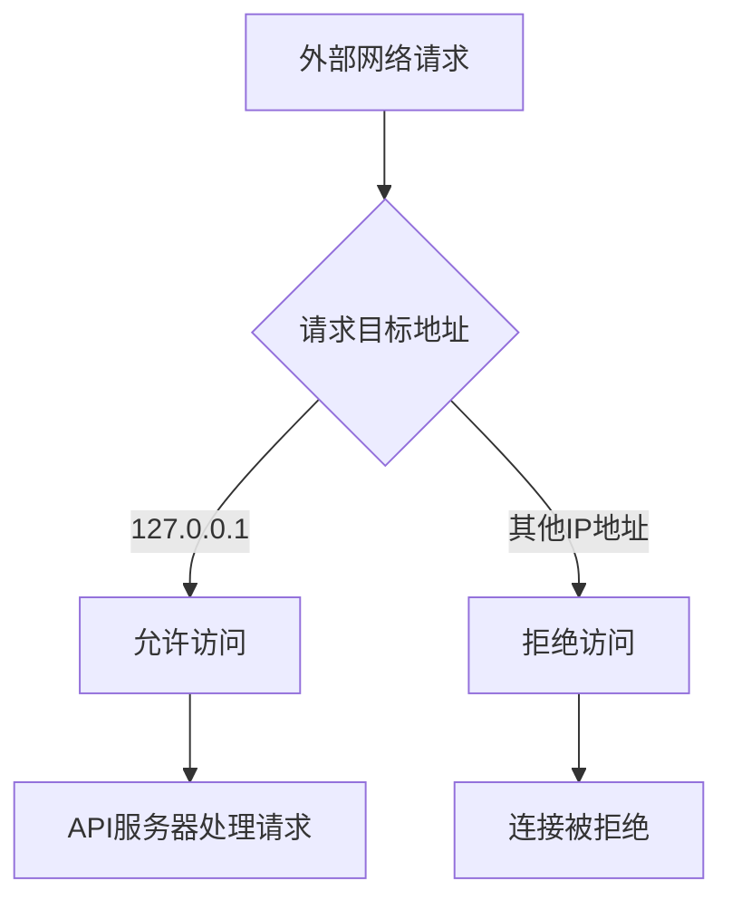
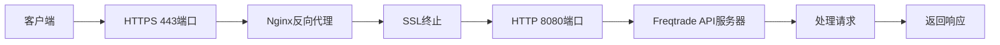
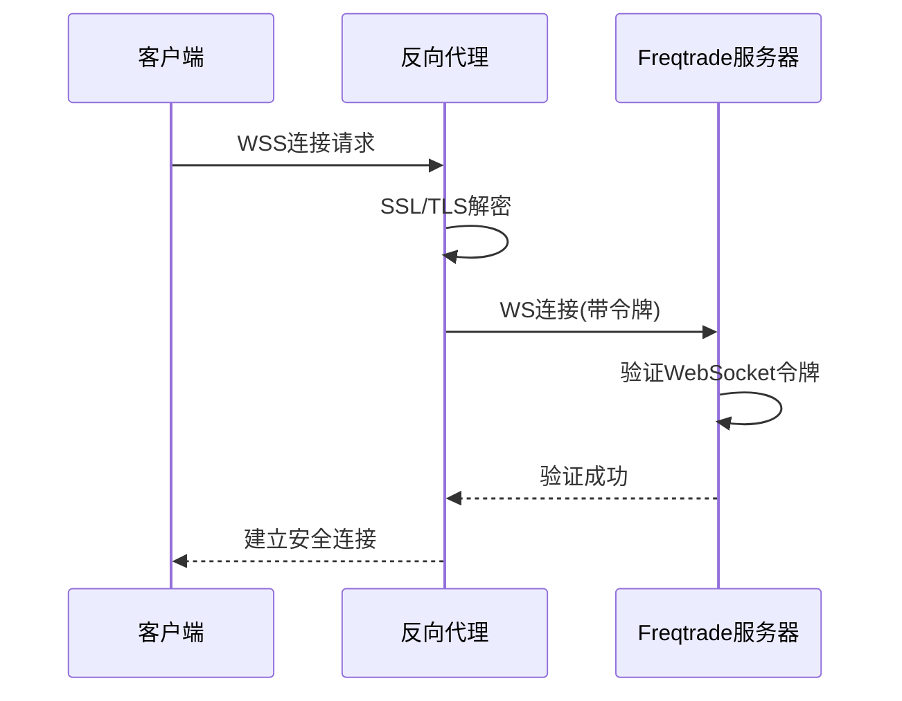

# 网络安全

<cite>
**本文档引用的文件**
- [docker-compose.yml](file://docker-compose.yml)
- [webserver.py](file://freqtrade/rpc/api_server/webserver.py)
- [deploy_config.py](file://freqtrade/configuration/deploy_config.py)
- [api_auth.py](file://freqtrade/rpc/api_server/api_auth.py)
- [api_ws.py](file://freqtrade/rpc/api_server/api_ws.py)
</cite>

## 目录
1. [API服务本地化访问限制](#api服务本地化访问限制)
2. [反向代理与HTTPS终止配置](#反向代理与https终止配置)
3. [防火墙规则与端口最小化暴露](#防火墙规则与端口最小化暴露)
4. [WebSocket安全连接防护](#websocket安全连接防护)
5. [生产环境安全访问方案](#生产环境安全访问方案)

## API服务本地化访问限制

Freqtrade通过`docker-compose.yml`中的端口绑定配置实现API服务的本地化访问限制。在`docker-compose.yml`文件中，端口映射配置为`127.0.0.1:8080:8080`，这表示容器内的8080端口仅绑定到主机的本地回环地址127.0.0.1，从而防止外部网络直接访问API服务。

API服务器的监听地址在配置中默认设置为`127.0.0.1`，当检测到非回环地址且不在Docker环境中运行时，系统会发出安全警告。这种双重保护机制确保了API服务不会意外暴露在公共网络中。

**Diagram sources**
- [docker-compose.yml](file://docker-compose.yml#L20-L21)
- [webserver.py](file://freqtrade/rpc/api_server/webserver.py#L195-L243)

**Section sources**
- [docker-compose.yml](file://docker-compose.yml#L20-L21)
- [webserver.py](file://freqtrade/rpc/api_server/webserver.py#L195-L243)

## 反向代理与HTTPS终止配置

对于生产环境部署，推荐使用Nginx或Apache作为反向代理服务器，并配置HTTPS终止。反向代理不仅提供SSL/TLS加密，还能实现负载均衡、缓存和额外的安全防护层。

Nginx配置示例应包含SSL证书配置、HTTP到HTTPS的重定向、适当的超时设置以及安全头信息。通过反向代理，可以将外部443端口的HTTPS请求转发到本地8080端口的HTTP服务，同时保持API服务的本地化访问限制。

**Diagram sources**
- [webserver.py](file://freqtrade/rpc/api_server/webserver.py#L65-L70)
- [api_auth.py](file://freqtrade/rpc/api_server/api_auth.py#L1-L161)

## 防火墙规则与端口最小化暴露

遵循端口暴露最小化原则，应配置防火墙规则以限制对Freqtrade服务的访问。仅允许必要的端口对外开放，如反向代理的443端口，而直接暴露API服务的8080端口应被禁止。

在Docker环境中，应使用网络隔离策略，创建专用的内部网络，确保API服务仅在内部网络中可访问。同时，应定期审查防火墙规则，移除不必要的开放端口，减少攻击面。

**Section sources**
- [docker-compose.yml](file://docker-compose.yml#L20-L21)
- [webserver.py](file://freqtrade/rpc/api_server/webserver.py#L195-L243)

## WebSocket安全连接防护

WebSocket连接通过JWT令牌或专用WebSocket令牌进行身份验证。在`api_auth.py`中实现了WebSocket令牌验证机制，确保只有经过认证的客户端才能建立WebSocket连接。

安全配置要求设置强密码和唯一的JWT密钥，避免使用默认值。系统会检测到使用默认JWT密钥的情况并发出安全警告。WebSocket连接应通过WSS（WebSocket Secure）协议进行加密传输，通常通过反向代理实现TLS终止。

**Diagram sources**
- [api_auth.py](file://freqtrade/rpc/api_server/api_auth.py#L1-L161)
- [api_ws.py](file://freqtrade/rpc/api_server/api_ws.py#L1-L124)

## 生产环境安全访问方案

在生产环境中暴露API服务的安全方案包括使用SSH隧道或VPN访问。SSH隧道可以通过端口转发将本地8080端口安全地暴露给远程客户端，而无需直接开放防火墙端口。

另一种方案是部署VPN服务器，要求所有访问API服务的客户端先通过VPN连接到内部网络。这种方式提供了更强的安全性，因为只有经过身份验证的VPN用户才能访问API服务。

对于需要公网访问的场景，应结合反向代理、HTTPS、强身份验证和IP白名单等多种安全措施，形成纵深防御体系，确保API服务的安全性。

**Section sources**
- [deploy_config.py](file://freqtrade/configuration/deploy_config.py#L183-L203)
- [webserver.py](file://freqtrade/rpc/api_server/webserver.py#L195-L243)
- [api_auth.py](file://freqtrade/rpc/api_server/api_auth.py#L1-L161)