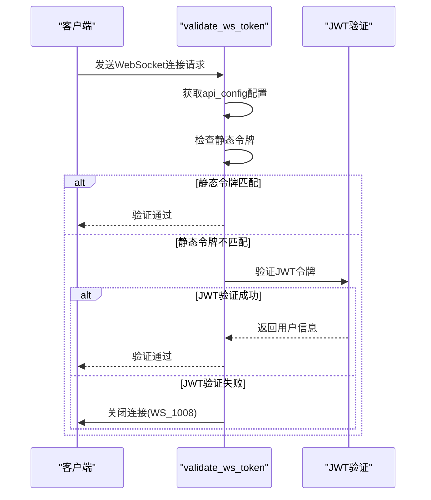
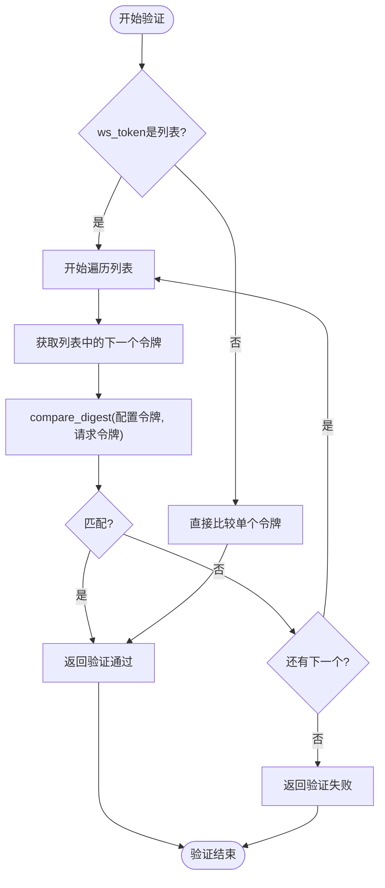
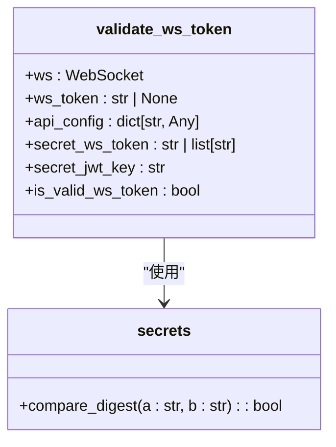
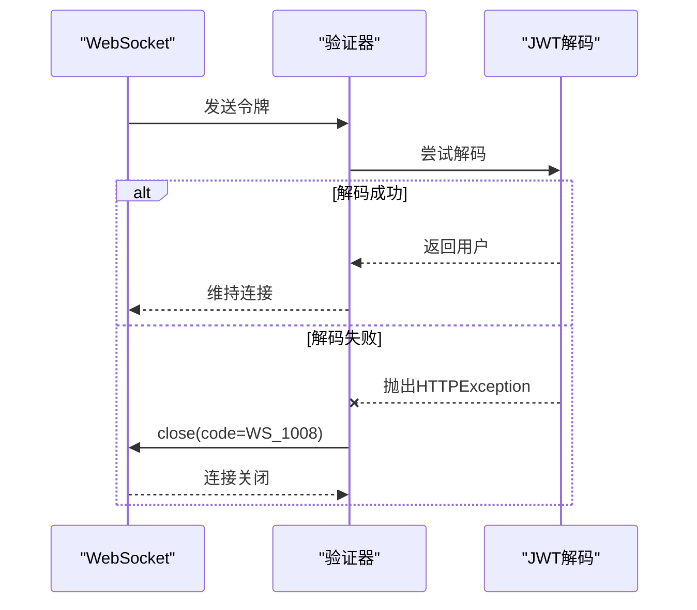
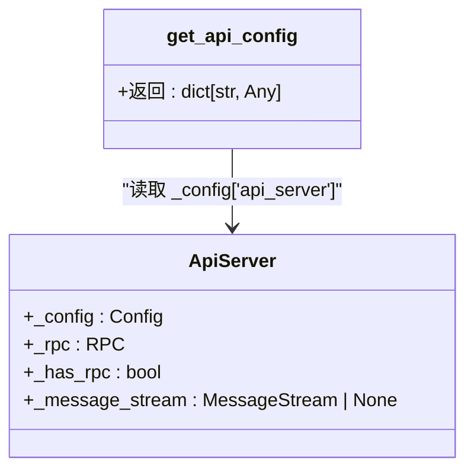

# WebSocket安全

<cite>
**Referenced Files in This Document**   
- [api_auth.py](file://freqtrade/rpc/api_server/api_auth.py)
- [deps.py](file://freqtrade/rpc/api_server/deps.py)
- [webserver.py](file://freqtrade/rpc/api_server/webserver.py)
</cite>

## Table of Contents
1. [WebSocket身份验证机制](#websocket身份验证机制)
2. [静态令牌与JWT令牌验证](#静态令牌与jwt令牌验证)
3. [多令牌匹配逻辑](#多令牌匹配逻辑)
4. [时序攻击防护](#时序攻击防护)
5. [安全连接关闭策略](#安全连接关闭策略)
6. [配置依赖注入](#配置依赖注入)

## WebSocket身份验证机制

WebSocket连接的身份验证通过`validate_ws_token`函数实现，该函数位于`api_auth.py`文件中，负责验证WebSocket连接的令牌安全性。

**Section sources**
- [api_auth.py](file://freqtrade/rpc/api_server/api_auth.py#L55-L85)

## 静态令牌与JWT令牌验证

`validate_ws_token`函数支持两种令牌验证方式：静态令牌和JWT令牌。函数首先检查提供的`ws_token`是否与配置中的`ws_token`匹配，如果匹配则验证通过。如果不匹配，则尝试将`ws_token`作为JWT令牌进行验证。

**Diagram sources**
- [api_auth.py](file://freqtrade/rpc/api_server/api_auth.py#L55-L85)

**Section sources**
- [api_auth.py](file://freqtrade/rpc/api_server/api_auth.py#L55-L85)

## 多令牌匹配逻辑

当`ws_token`配置为字符串列表时，函数实现多令牌匹配逻辑。通过遍历配置中的令牌列表，使用`secrets.compare_digest`函数逐一比较，只要有一个令牌匹配即验证通过。

**Diagram sources**
- [api_auth.py](file://freqtrade/rpc/api_server/api_auth.py#L55-L85)

**Section sources**
- [api_auth.py](file://freqtrade/rpc/api_server/api_auth.py#L55-L85)

## 时序攻击防护

为防止时序攻击，函数使用`secrets.compare_digest`函数进行令牌比较。该函数以恒定时间执行字符串比较，避免了基于响应时间差异的攻击。

**Diagram sources**
- [api_auth.py](file://freqtrade/rpc/api_server/api_auth.py#L55-L85)

**Section sources**
- [api_auth.py](file://freqtrade/rpc/api_server/api_auth.py#L55-L85)

## 安全连接关闭策略

当JWT验证失败时，函数会自动关闭WebSocket连接，并返回`WS_1008_POLICY_VIOLATION`状态码。这是一种安全策略，防止未经授权的连接持续存在。

**Diagram sources**
- [api_auth.py](file://freqtrade/rpc/api_server/api_auth.py#L55-L85)

**Section sources**
- [api_auth.py](file://freqtrade/rpc/api_server/api_auth.py#L55-L85)

## 配置依赖注入

`get_api_config`函数通过依赖注入提供`ws_token`和`jwt_secret_key`配置参数。该函数从`ApiServer._config`中获取API服务器配置，确保配置的一致性和安全性。

**Diagram sources**
- [deps.py](file://freqtrade/rpc/api_server/deps.py#L42-L43)
- [webserver.py](file://freqtrade/rpc/api_server/webserver.py#L34-L243)

**Section sources**
- [deps.py](file://freqtrade/rpc/api_server/deps.py#L42-L43)
- [webserver.py](file://freqtrade/rpc/api_server/webserver.py#L34-L243)