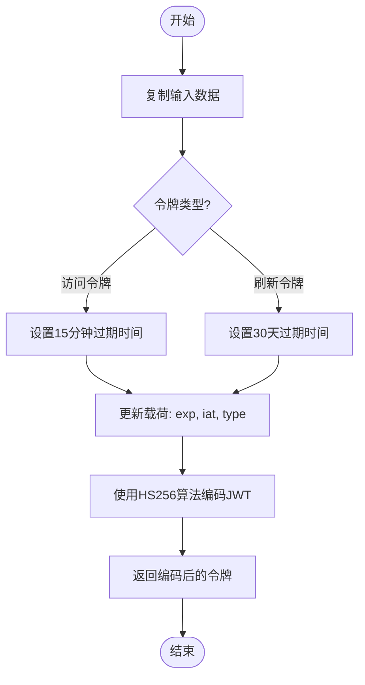
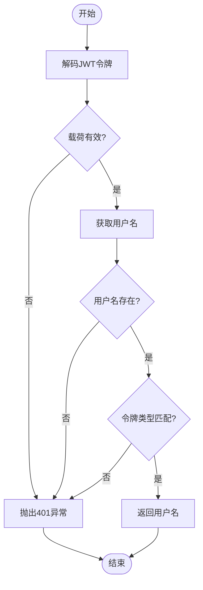
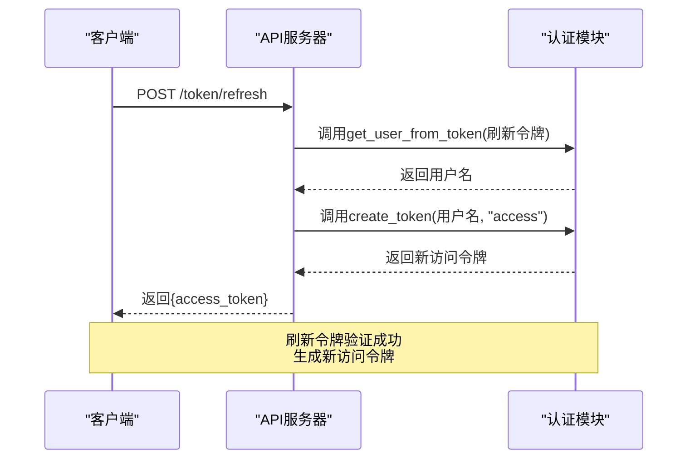

# 令牌管理

<cite>
**本文档中引用的文件**  
- [api_auth.py](file://freqtrade/rpc/api_server/api_auth.py)
- [config_schema.py](file://freqtrade/config_schema/config_schema.py)
- [webserver.py](file://freqtrade/rpc/api_server/webserver.py)
</cite>

## 目录
1. [介绍](#介绍)
2. [令牌创建机制](#令牌创建机制)
3. [令牌验证逻辑](#令牌验证逻辑)
4. [令牌刷新流程](#令牌刷新流程)
5. [过期策略与安全建议](#过期策略与安全建议)

## 介绍
Freqtrade系统通过JWT（JSON Web Token）实现安全的身份验证和授权机制。该系统采用双令牌策略，包含短期有效的访问令牌和长期有效的刷新令牌，以平衡安全性与用户体验。本文件深入分析令牌的创建、验证和刷新机制，详细说明相关函数的实现逻辑，并提供最佳实践建议。

**Section sources**
- [api_auth.py](file://freqtrade/rpc/api_server/api_auth.py#L1-L20)

## 令牌创建机制
系统通过`create_token`函数生成JWT令牌。该函数根据令牌类型设置不同的有效期：访问令牌有效期为15分钟，刷新令牌有效期为30天。函数接收数据字典、密钥和令牌类型作为参数，生成包含过期时间（exp）、签发时间（iat）和令牌类型（type）的载荷，并使用HS256算法进行签名。

**Diagram sources**
- [api_auth.py](file://freqtrade/rpc/api_server/api_auth.py#L88-L104)

**Section sources**
- [api_auth.py](file://freqtrade/rpc/api_server/api_auth.py#L88-L104)

## 令牌验证逻辑
`get_user_from_token`函数负责验证JWT令牌的有效性。该函数首先尝试解码令牌，然后检查载荷中的用户名是否存在，并验证令牌类型是否匹配。如果任何验证步骤失败，将抛出HTTP 401未授权异常。此函数确保只有有效的、类型正确的令牌才能通过验证。

**Diagram sources**
- [api_auth.py](file://freqtrade/rpc/api_server/api_auth.py#L33-L49)

**Section sources**
- [api_auth.py](file://freqtrade/rpc/api_server/api_auth.py#L33-L49)

## 令牌刷新流程
`token_refresh`端点处理刷新令牌以获取新访问令牌的请求。该流程首先使用`get_user_from_token`函数验证刷新令牌的有效性，然后使用提取的用户信息调用`create_token`函数生成新的访问令牌。此机制允许用户在不重新登录的情况下获取新的访问令牌，同时保持较高的安全性。

**Diagram sources**
- [api_auth.py](file://freqtrade/rpc/api_server/api_auth.py#L151-L160)

**Section sources**
- [api_auth.py](file://freqtrade/rpc/api_server/api_auth.py#L151-L160)

## 过期策略与安全建议
系统采用严格的令牌过期策略来增强安全性。访问令牌的短有效期（15分钟）限制了令牌泄露后的风险窗口，而刷新令牌的长有效期（30天）减少了用户频繁重新认证的需求。为确保系统安全，建议在配置文件中设置强密码和唯一的JWT密钥，避免使用默认值。

**Section sources**
- [config_schema.py](file://freqtrade/config_schema/config_schema.py#L678)
- [webserver.py](file://freqtrade/rpc/api_server/webserver.py#L216-L220)