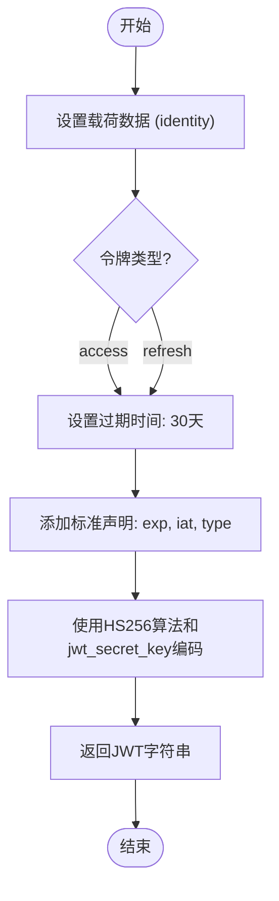
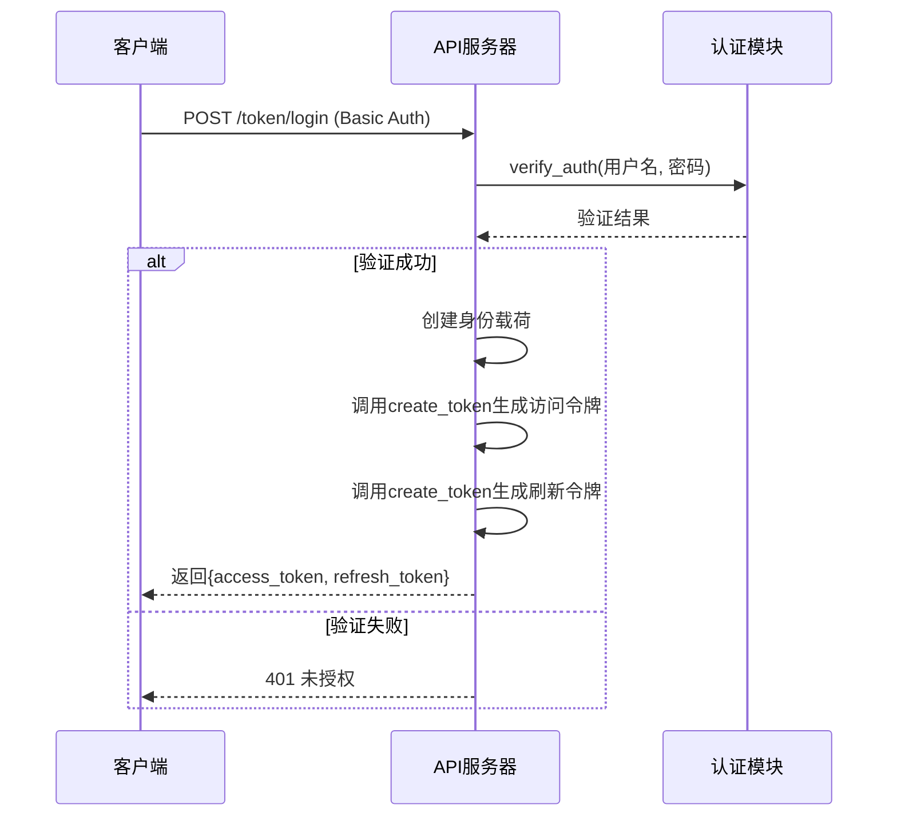
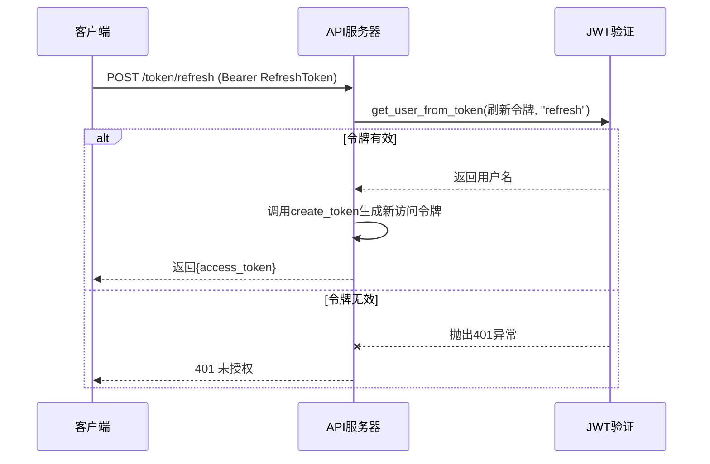
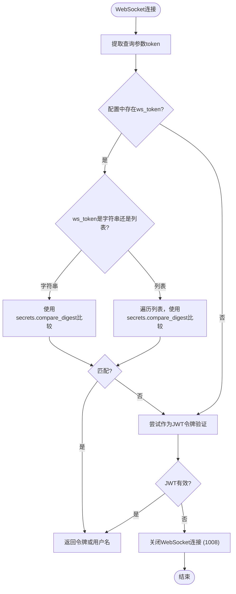

# 身份验证与授权

<cite>
**本文档引用的文件**  
- [api_auth.py](file://freqtrade/rpc/api_server/api_auth.py)
- [config_schema.py](file://freqtrade/config_schema/config_schema.py)
- [deps.py](file://freqtrade/rpc/api_server/deps.py)
- [webserver.py](file://freqtrade/rpc/api_server/webserver.py)
- [api_schemas.py](file://freqtrade/rpc/api_server/api_schemas.py)
</cite>

## 目录
1. [简介](#简介)
2. [身份验证机制概述](#身份验证机制概述)
3. [HTTP Basic Auth 认证流程](#http-basic-auth-认证流程)
4. [JWT 令牌认证系统](#jwt-令牌认证系统)
5. [访问令牌与刷新令牌的生成与验证](#访问令牌与刷新令牌的生成与验证)
6. [WebSocket 连接的令牌验证](#websocket-连接的令牌验证)
7. [API 密钥管理与权限分级](#api-密钥管理与权限分级)
8. [安全最佳实践](#安全最佳实践)

## 简介

Freqtrade 提供了多层身份验证和授权机制，以确保 API 接口和 WebSocket 通信的安全性。该系统结合了传统的 HTTP Basic Auth 和现代的 JWT（JSON Web Token）令牌认证，支持访问令牌（access token）和刷新令牌（refresh token）的双令牌机制，并为 WebSocket 连接提供了专用的令牌验证流程。本文档详细解析其核心实现逻辑，涵盖 `api_auth.py` 中的关键函数，如 `token_login`、`token_refresh` 和 `validate_ws_token`，并提供 API 安全配置的最佳实践。

## 身份验证机制概述

Freqtrade 的身份验证系统主要由以下几个组件构成：

- **HTTP Basic Auth**：基于用户名和密码的初始认证方式。
- **JWT 令牌认证**：用于 API 请求的身份验证，支持无状态会话管理。
- **双令牌机制**：包含短期有效的访问令牌和长期有效的刷新令牌。
- **WebSocket 令牌验证**：支持静态令牌和 JWT 令牌两种模式，可配置为单个字符串或字符串列表。
- **配置驱动**：所有认证参数均通过 `config.json` 文件中的 `api_server` 部分进行配置。

该系统通过 FastAPI 框架实现，利用依赖注入（Dependency Injection）机制将认证逻辑集成到各个 API 路由中。

## HTTP Basic Auth 认证流程

HTTP Basic Auth 是用户获取 JWT 令牌的初始入口。其流程如下：

1. 用户通过 `/token/login` 端点发送包含用户名和密码的 HTTP Basic 认证头。
2. 系统调用 `verify_auth` 函数，使用 `secrets.compare_digest` 安全地比较用户输入与配置文件中存储的凭据。
3. 如果凭据匹配，则生成一对新的访问令牌和刷新令牌并返回给客户端。
4. 如果凭据不匹配，则返回 401 未授权错误。

此流程确保了初始认证的安全性，防止了时序攻击。

**Section sources**
- [api_auth.py](file://freqtrade/rpc/api_server/api_auth.py#L21-L25)
- [api_auth.py](file://freqtrade/rpc/api_server/api_auth.py#L124-L147)

## JWT 令牌认证系统

JWT 令牌系统是 Freqtrade API 的主要认证方式。它基于 `PyJWT` 库实现，使用 HS256 算法进行签名。

### 令牌类型

系统支持两种类型的 JWT 令牌：

- **访问令牌 (Access Token)**：有效期为 15 分钟，用于访问受保护的 API 端点。
- **刷新令牌 (Refresh Token)**：有效期为 30 天，仅用于获取新的访问令牌。

### 认证流程

1. 客户端在请求头中包含 `Authorization: Bearer <token>`。
2. FastAPI 的 `OAuth2PasswordBearer` 依赖项提取令牌。
3. `get_user_from_token` 函数负责验证令牌：
   - 使用配置的 `jwt_secret_key` 解码 JWT。
   - 检查令牌中的 `type` 字段是否匹配预期类型。
   - 提取并返回用户名。
4. 如果验证失败，则抛出 401 未授权异常。

**Section sources**
- [api_auth.py](file://freqtrade/rpc/api_server/api_auth.py#L33-L49)
- [api_auth.py](file://freqtrade/rpc/api_server/api_auth.py#L88-L104)

## 访问令牌与刷新令牌的生成与验证

### 令牌生成 (`create_token`)

`create_token` 函数负责生成 JWT 令牌。其逻辑如下：

**Diagram sources**
- [api_auth.py](file://freqtrade/rpc/api_server/api_auth.py#L88-L104)

### 登录流程 (`token_login`)

当用户通过 Basic Auth 认证后，`token_login` 函数会调用 `create_token` 生成一对令牌。

**Diagram sources**
- [api_auth.py](file://freqtrade/rpc/api_server/api_auth.py#L124-L147)

### 令牌刷新 (`token_refresh`)

`token_refresh` 函数允许客户端使用刷新令牌获取新的访问令牌，而无需重新输入用户名和密码。

**Diagram sources**
- [api_auth.py](file://freqtrade/rpc/api_server/api_auth.py#L151-L160)

## WebSocket 连接的令牌验证

WebSocket 的验证由 `validate_ws_token` 函数处理，它支持多种令牌类型：

### 验证流程

**Diagram sources**
- [api_auth.py](file://freqtrade/rpc/api_server/api_auth.py#L55-L85)

### 多令牌支持

`ws_token` 配置项可以是一个字符串或一个字符串列表。当为列表时，`validate_ws_token` 会检查客户端提供的令牌是否与列表中的任何一个匹配，这为多客户端或轮换令牌提供了便利。

## API 密钥管理与权限分级

### 配置参数

API 服务器的安全性由 `config.json` 中的 `api_server` 部分控制：

| 配置项 | 类型 | 描述 | 安全建议 |
| :--- | :--- | :--- | :--- |
| `username` | 字符串 | API 认证用户名 | 避免使用默认值 `freqtrader` |
| `password` | 字符串 | API 认证密码 | 必须设置强密码 |
| `jwt_secret_key` | 字符串 | JWT 签名密钥 | 必须更改默认的 `somethingrandom` |
| `ws_token` | 字符串或字符串列表 | WebSocket 认证令牌 | 建议使用 `secrets.token_urlsafe()` 生成 |
| `CORS_origins` | 字符串列表 | 允许跨域请求的源 | 仅添加受信任的域名 |

**Section sources**
- [config_schema.py](file://freqtrade/config_schema/config_schema.py#L665-L678)
- [deploy_config.py](file://freqtrade/configuration/deploy_config.py#L183-L232)

### 权限分级

Freqtrade 的 API 权限主要通过路由和依赖项来实现：

- **公共端点**：如 `/ping`，无需认证。
- **认证端点**：如 `/version`，需要 Basic Auth 或有效的 JWT 访问令牌。
- **管理端点**：如 `/stop`，需要认证且仅在特定运行模式下可用。

这种分级通过 FastAPI 的 `Depends` 依赖项在 `webserver.py` 的 `configure_app` 函数中实现。

## 安全最佳实践

1. **强制更改默认值**：部署时必须更改 `username`、`password` 和 `jwt_secret_key` 的默认值。
2. **使用强密码和密钥**：`password` 和 `jwt_secret_key` 应使用强随机字符串生成。
3. **限制监听地址**：除非在 Docker 环境中，否则 `listen_ip_address` 应设置为 `127.0.0.1`。
4. **配置 CORS**：`CORS_origins` 应仅包含需要访问 API 的前端应用域名。
5. **定期轮换令牌**：对于 `ws_token`，建议定期生成新令牌并更新客户端。
6. **启用日志记录**：设置 `verbosity` 为 `info` 以监控认证尝试。
7. **使用环境变量**：敏感信息如密码和密钥应通过环境变量注入，避免硬编码在配置文件中。

遵循这些最佳实践可以显著提高 Freqtrade 实例的安全性，防止未授权访问和潜在的安全威胁。