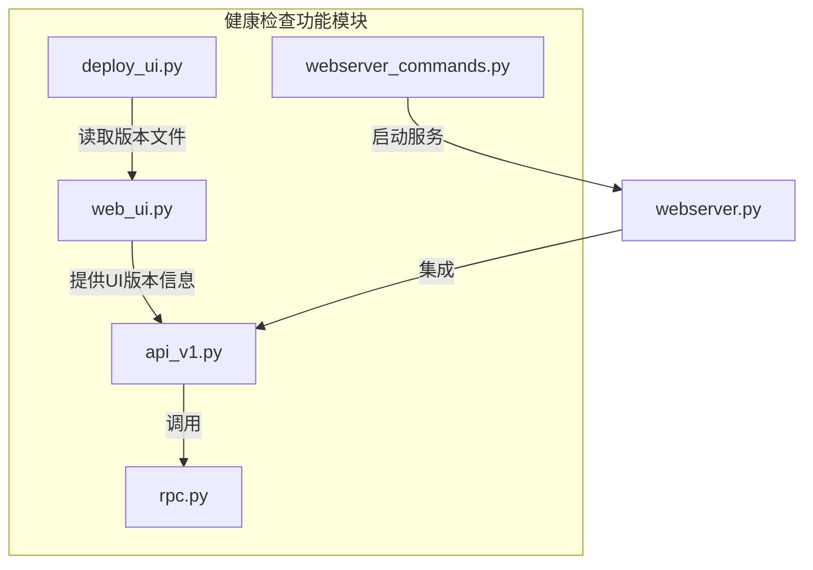
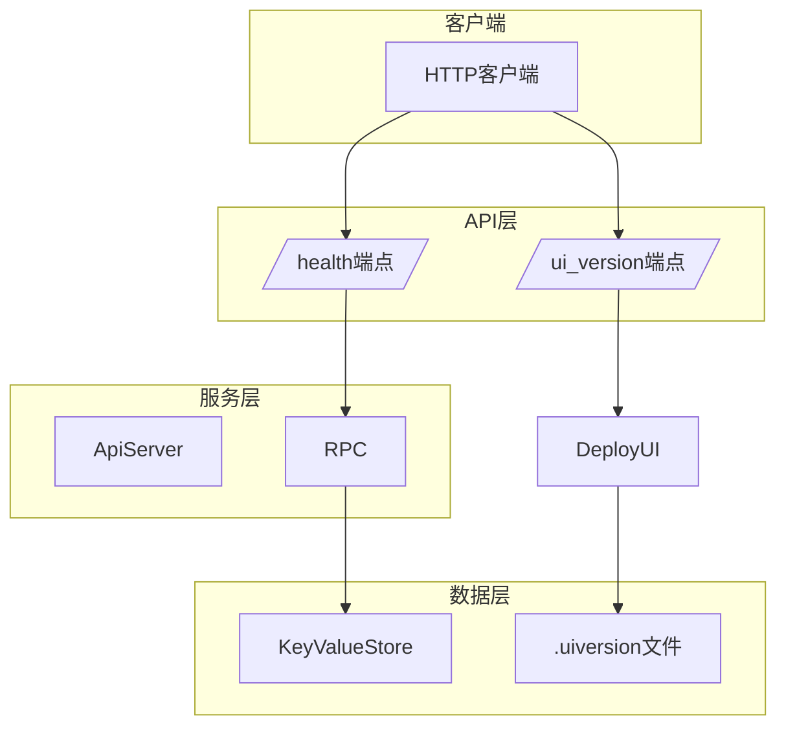
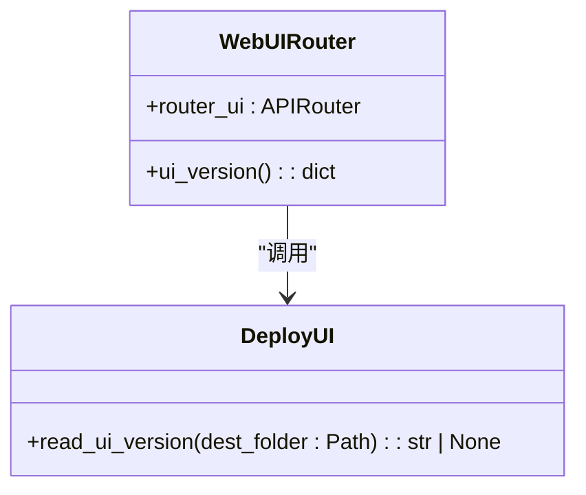
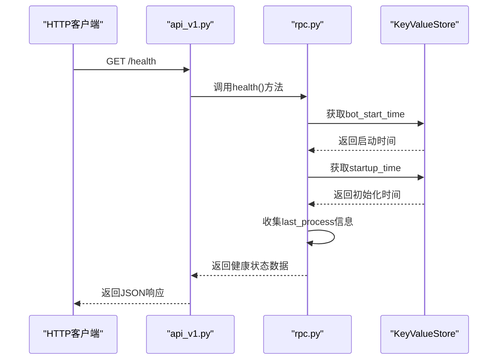
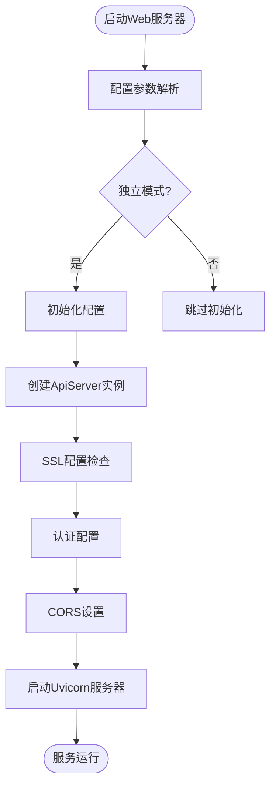
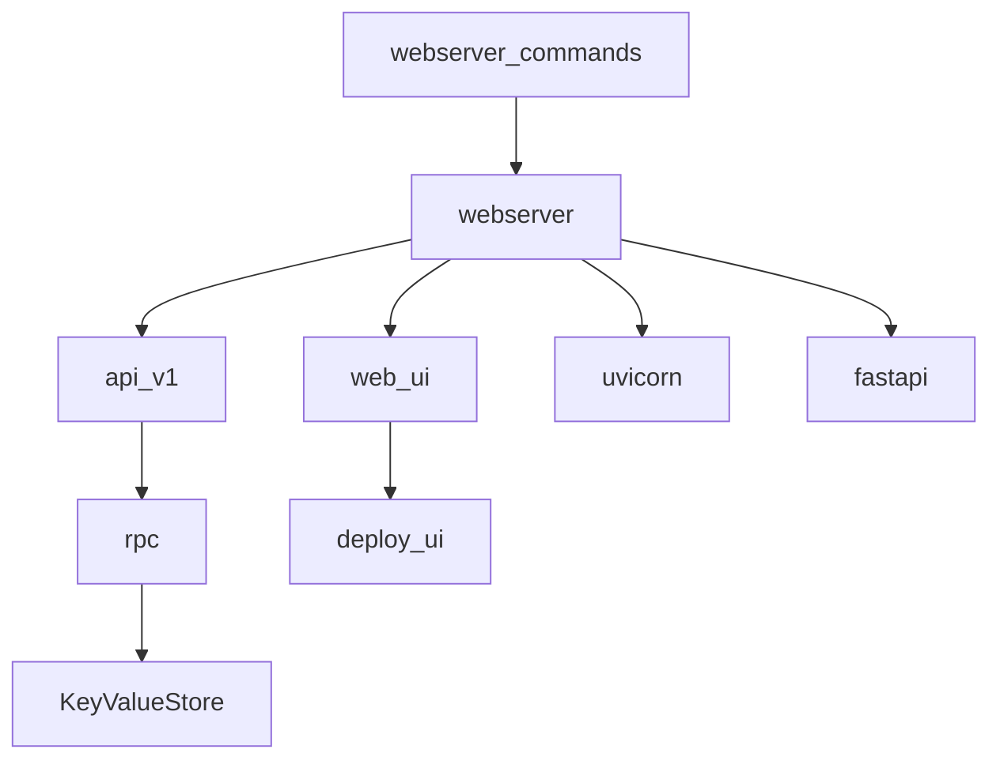

# 健康检查

<cite>
**本文档中引用的文件**  
- [web_ui.py](file://freqtrade/rpc/api_server/web_ui.py)
- [api_v1.py](file://freqtrade/rpc/api_server/api_v1.py)
- [webserver_commands.py](file://freqtrade/commands/webserver_commands.py)
- [rpc.py](file://freqtrade/rpc/rpc.py)
- [deploy_ui.py](file://freqtrade/commands/deploy_ui.py)
- [Dockerfile](file://Dockerfile)
</cite>

## 目录
1. [简介](#简介)
2. [项目结构](#项目结构)
3. [核心组件](#核心组件)
4. [架构概述](#架构概述)
5. [详细组件分析](#详细组件分析)
6. [依赖分析](#依赖分析)
7. [性能考虑](#性能考虑)
8. [故障排除指南](#故障排除指南)
9. [结论](#结论)

## 简介
本文档详细说明了Freqtrade系统中的健康检查机制，重点介绍API服务器的健康状态检测与报告功能。文档深入解析了前端UI版本信息获取、健康检查端点实现、服务启动配置、集成测试以及容器化部署集成等关键方面。

## 项目结构
Freqtrade项目的健康检查功能主要分布在RPC API服务器模块中，通过多个组件协同工作实现完整的健康监测体系。

**图示来源**
- [web_ui.py](file://freqtrade/rpc/api_server/web_ui.py#L21-L29)
- [api_v1.py](file://freqtrade/rpc/api_server/api_v1.py#L573-L574)
- [webserver_commands.py](file://freqtrade/commands/webserver_commands.py#L5-L15)

**节来源**
- [web_ui.py](file://freqtrade/rpc/api_server/web_ui.py)
- [api_v1.py](file://freqtrade/rpc/api_server/api_v1.py)
- [webserver_commands.py](file://freqtrade/commands/webserver_commands.py)

## 核心组件
健康检查机制由多个核心组件构成，包括UI版本端点、健康检查API端点、服务启动命令和版本管理功能。这些组件共同提供了系统状态的全面监控能力。

**节来源**
- [web_ui.py](file://freqtrade/rpc/api_server/web_ui.py#L21-L29)
- [api_v1.py](file://freqtrade/rpc/api_server/api_v1.py#L573-L574)
- [rpc.py](file://freqtrade/rpc/rpc.py#L1650-L1690)

## 架构概述
健康检查系统的架构采用分层设计，从底层数据收集到上层API暴露，形成了完整的健康监测链条。

**图示来源**
- [api_v1.py](file://freqtrade/rpc/api_server/api_v1.py#L573-L574)
- [rpc.py](file://freqtrade/rpc/rpc.py#L1650-L1690)
- [deploy_ui.py](file://freqtrade/commands/deploy_ui.py#L25-L31)

## 详细组件分析

### UI版本信息获取分析
系统通过特定端点提供前端UI版本信息，便于客户端验证界面兼容性。

#### 类图

**图示来源**
- [web_ui.py](file://freqtrade/rpc/api_server/web_ui.py#L21-L29)
- [deploy_ui.py](file://freqtrade/commands/deploy_ui.py#L25-L31)

### 健康检查端点分析
健康检查端点提供系统运行状态的关键指标，用于监控系统健康状况。

#### 序列图

**图示来源**
- [api_v1.py](file://freqtrade/rpc/api_server/api_v1.py#L573-L574)
- [rpc.py](file://freqtrade/rpc/rpc.py#L1650-L1690)

### 服务启动配置分析
系统通过命令行接口启动和配置健康检查服务，包括端口绑定、SSL设置和访问控制。

#### 流程图

**图示来源**
- [webserver_commands.py](file://freqtrade/commands/webserver_commands.py#L5-L15)
- [webserver.py](file://freqtrade/rpc/api_server/webserver.py#L50-L100)

**节来源**
- [webserver_commands.py](file://freqtrade/commands/webserver_commands.py#L5-L15)
- [webserver.py](file://freqtrade/rpc/api_server/webserver.py)

## 依赖分析
健康检查功能依赖于多个核心模块，形成了复杂的依赖关系网络。

**图示来源**
- [webserver_commands.py](file://freqtrade/commands/webserver_commands.py)
- [webserver.py](file://freqtrade/rpc/api_server/webserver.py)
- [api_v1.py](file://freqtrade/rpc/api_server/api_v1.py)
- [rpc.py](file://freqtrade/rpc/rpc.py)

**节来源**
- [webserver_commands.py](file://freqtrade/commands/webserver_commands.py)
- [webserver.py](file://freqtrade/rpc/api_server/webserver.py)

## 性能考虑
健康检查端点设计考虑了性能因素，避免对系统造成额外负担。所有健康检查操作都采用轻量级查询，确保快速响应。状态信息通过缓存机制获取，减少数据库访问频率。系统启动时间和最后处理时间等关键指标存储在内存中，保证读取效率。

## 故障排除指南
当健康检查功能出现问题时，可参考以下排查步骤：

1. 检查API服务器是否正常启动
2. 验证端口绑定和防火墙设置
3. 确认认证配置正确性
4. 检查日志文件中的错误信息
5. 验证KeyValueStore数据完整性

**节来源**
- [webserver.py](file://freqtrade/rpc/api_server/webserver.py#L200-L240)
- [rpc.py](file://freqtrade/rpc/rpc.py#L1650-L1690)

## 结论
Freqtrade的健康检查机制提供了全面的系统状态监控能力，通过分层架构设计实现了高可靠性和可维护性。该机制不仅支持基本的存活检测，还提供了详细的运行时信息，为系统运维提供了有力支持。在容器化部署环境中，该健康检查功能可与Kubernetes的探针机制无缝集成，确保系统的稳定运行。