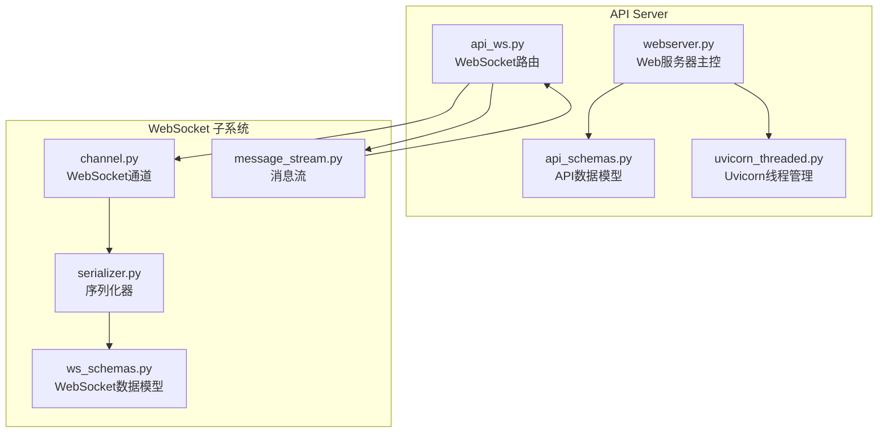
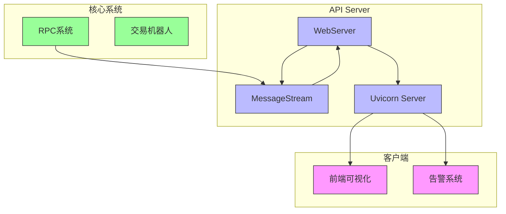
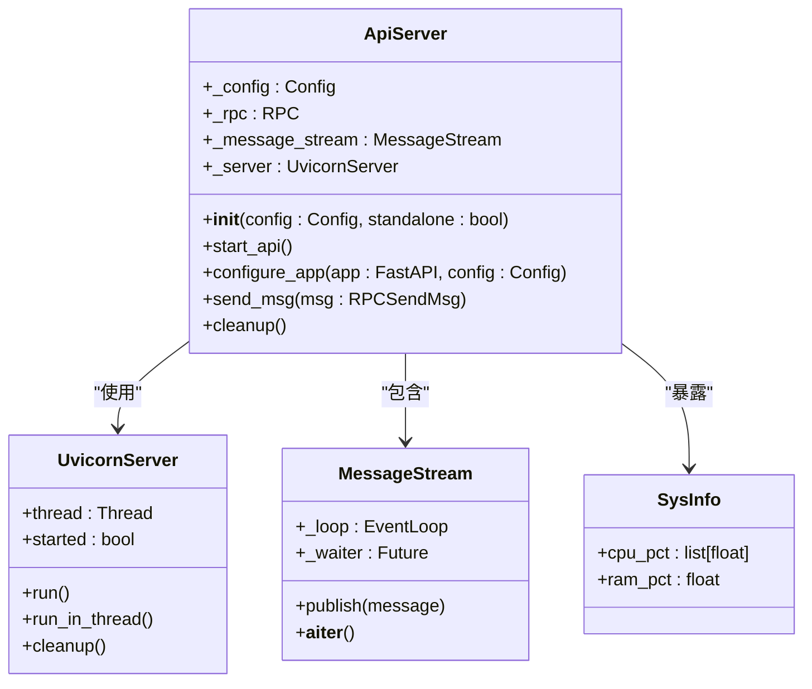
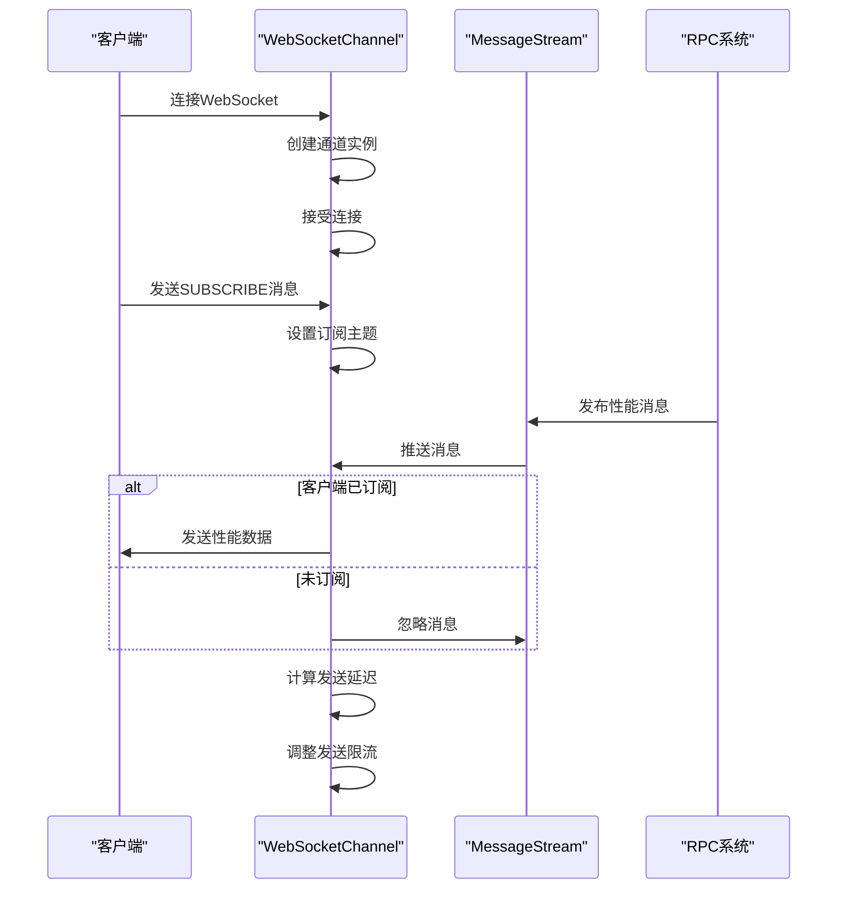
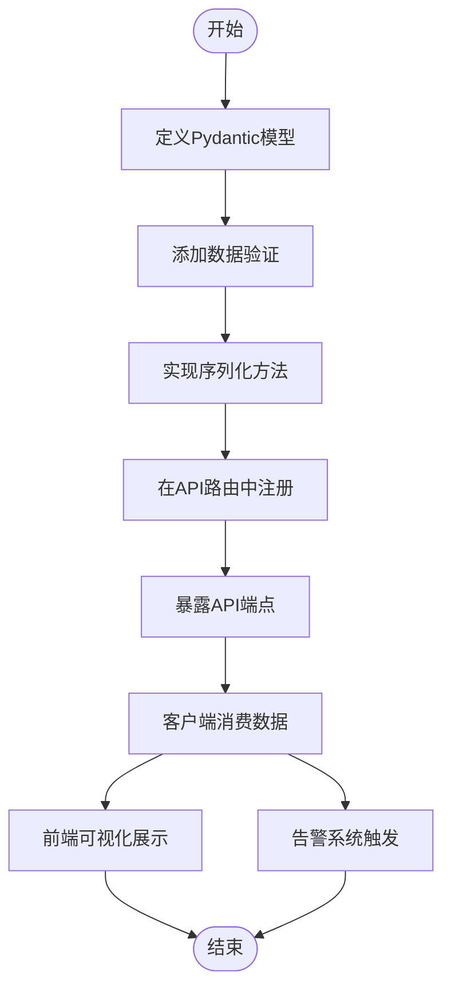
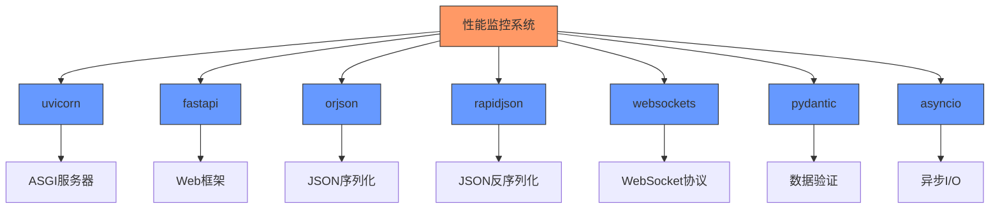

# 性能监控

<cite>
**本文档引用的文件**
- [webserver.py](file://freqtrade/rpc/api_server/webserver.py)
- [api_schemas.py](file://freqtrade/rpc/api_server/api_schemas.py)
- [channel.py](file://freqtrade/rpc/api_server/ws/channel.py)
- [uvicorn_threaded.py](file://freqtrade/rpc/api_server/uvicorn_threaded.py)
- [message_stream.py](file://freqtrade/rpc/api_server/ws/message_stream.py)
- [serializer.py](file://freqtrade/rpc/api_server/ws/serializer.py)
- [api_ws.py](file://freqtrade/rpc/api_server/api_ws.py)
- [ws_schemas.py](file://freqtrade/rpc/api_server/ws_schemas.py)
</cite>

## 目录
1. [引言](#引言)
2. [项目结构](#项目结构)
3. [核心组件](#核心组件)
4. [架构概述](#架构概述)
5. [详细组件分析](#详细组件分析)
6. [依赖分析](#依赖分析)
7. [性能考虑](#性能考虑)
8. [故障排除指南](#故障排除指南)
9. [结论](#结论)

## 引言
本文档详细阐述了Freqtrade系统中性能监控子系统的设计与实现，重点分析Web服务器性能指标的采集、暴露机制及实时数据流推送。文档涵盖Uvicorn线程管理器对CPU负载、内存使用和请求延迟等关键性能指标（KPI）的监控机制，解析性能数据模型结构，说明WebSocket通道如何实现性能数据的实时推送，并提供消费示例和性能瓶颈诊断流程。

## 项目结构
性能监控功能主要分布在`freqtrade/rpc/api_server`目录下，核心文件包括`webserver.py`（Web服务器主控）、`api_schemas.py`（API数据模型定义）、`ws/channel.py`（WebSocket通道管理）等。系统采用FastAPI框架构建REST API和WebSocket服务，通过Uvicorn作为ASGI服务器运行，实现了高性能的异步通信能力。

**Diagram sources**
- [webserver.py](file://freqtrade/rpc/api_server/webserver.py#L1-L245)
- [api_schemas.py](file://freqtrade/rpc/api_server/api_schemas.py#L1-L666)
- [channel.py](file://freqtrade/rpc/api_server/ws/channel.py#L1-L241)

**Section sources**
- [webserver.py](file://freqtrade/rpc/api_server/webserver.py#L1-L245)
- [api_schemas.py](file://freqtrade/rpc/api_server/api_schemas.py#L1-L666)
- [channel.py](file://freqtrade/rpc/api_server/ws/channel.py#L1-L241)

## 核心组件
性能监控子系统由三个核心组件构成：Web服务器管理器（`webserver.py`）负责启动和配置API服务，Uvicorn线程管理器（`uvicorn_threaded.py`）处理多线程服务器运行，WebSocket通道（`channel.py`）实现客户端的实时数据推送。这些组件协同工作，确保性能指标能够被高效采集、处理和分发。

**Section sources**
- [webserver.py](file://freqtrade/rpc/api_server/webserver.py#L1-L245)
- [uvicorn_threaded.py](file://freqtrade/rpc/api_server/uvicorn_threaded.py#L1-L65)
- [channel.py](file://freqtrade/rpc/api_server/ws/channel.py#L1-L241)

## 架构概述
系统采用分层架构设计，底层由Uvicorn ASGI服务器提供高性能的异步I/O能力，中间层通过FastAPI框架构建REST和WebSocket API，上层通过MessageStream实现消息的发布-订阅模式。性能数据从RPC系统产生后，通过MessageStream发布，WebSocket通道根据客户端订阅情况将数据实时推送给前端或其他消费者。

**Diagram sources**
- [webserver.py](file://freqtrade/rpc/api_server/webserver.py#L1-L245)
- [message_stream.py](file://freqtrade/rpc/api_server/ws/message_stream.py#L1-L33)
- [api_ws.py](file://freqtrade/rpc/api_server/api_ws.py#L1-L125)

## 详细组件分析

### Web服务器性能监控分析
`webserver.py`中的`ApiServer`类负责启动和管理Web服务器实例。通过集成Uvicorn线程管理器，系统能够监控服务器的运行状态。`SysInfo`模型在`api_schemas.py`中定义了CPU使用率和内存使用率的性能数据结构，这些指标通过API端点暴露给监控系统。

#### 对象导向组件：

**Diagram sources**
- [webserver.py](file://freqtrade/rpc/api_server/webserver.py#L1-L245)
- [uvicorn_threaded.py](file://freqtrade/rpc/api_server/uvicorn_threaded.py#L1-L65)
- [message_stream.py](file://freqtrade/rpc/api_server/ws/message_stream.py#L1-L33)
- [api_schemas.py](file://freqtrade/rpc/api_server/api_schemas.py#L1-L666)

**Section sources**
- [webserver.py](file://freqtrade/rpc/api_server/webserver.py#L1-L245)
- [uvicorn_threaded.py](file://freqtrade/rpc/api_server/uvicorn_threaded.py#L1-L65)

### WebSocket实时数据推送分析
WebSocket通道通过`channel.py`中的`WebSocketChannel`类实现，该类封装了WebSocket连接的管理、消息序列化和流量控制。系统采用发布-订阅模式，客户端通过发送SUBSCRIBE消息订阅特定类型的性能数据，服务器端根据订阅关系将相关消息推送给客户端。

#### API/服务组件：

**Diagram sources**
- [channel.py](file://freqtrade/rpc/api_server/ws/channel.py#L1-L241)
- [message_stream.py](file://freqtrade/rpc/api_server/ws/message_stream.py#L1-L33)
- [api_ws.py](file://freqtrade/rpc/api_server/api_ws.py#L1-L125)

**Section sources**
- [channel.py](file://freqtrade/rpc/api_server/ws/channel.py#L1-L241)
- [api_ws.py](file://freqtrade/rpc/api_server/api_ws.py#L1-L125)

### 性能数据模型分析
`api_schemas.py`文件定义了完整的性能数据模型体系，包括`SysInfo`（系统信息）、`Health`（健康状态）等核心模型。这些Pydantic模型不仅定义了数据结构，还提供了序列化和验证功能，确保性能数据的完整性和一致性。

#### 复杂逻辑组件：

**Diagram sources**
- [api_schemas.py](file://freqtrade/rpc/api_server/api_schemas.py#L1-L666)
- [api_v1.py](file://freqtrade/rpc/api_server/api_v1.py#L1-L100)

**Section sources**
- [api_schemas.py](file://freqtrade/rpc/api_server/api_schemas.py#L1-L666)

## 依赖分析
性能监控子系统依赖于多个核心模块：`uvicorn`提供ASGI服务器功能，`fastapi`构建Web API，`orjson`和`rapidjson`处理高性能JSON序列化，`websockets`库管理WebSocket连接。这些依赖通过`uvicorn_threaded.py`和`serializer.py`等文件进行封装和集成，确保系统具有良好的性能和稳定性。

**Diagram sources**
- [uvicorn_threaded.py](file://freqtrade/rpc/api_server/uvicorn_threaded.py#L1-L65)
- [serializer.py](file://freqtrade/rpc/api_server/ws/serializer.py#L1-L58)
- [api_ws.py](file://freqtrade/rpc/api_server/api_ws.py#L1-L125)

**Section sources**
- [uvicorn_threaded.py](file://freqtrade/rpc/api_server/uvicorn_threaded.py#L1-L65)
- [serializer.py](file://freqtrade/rpc/api_server/ws/serializer.py#L1-L58)

## 性能考虑
系统在设计时充分考虑了性能因素：采用Uvicorn作为ASGI服务器以支持异步I/O，使用orjson进行快速JSON序列化，通过WebSocket实现低延迟的实时数据推送。`WebSocketChannel`类内置了发送延迟计算和动态限流机制，能够根据网络状况自动调整消息发送频率，避免客户端过载。

## 故障排除指南
当性能监控系统出现问题时，可按照以下步骤进行排查：首先检查Uvicorn服务器是否正常启动，然后验证WebSocket连接是否成功建立，接着确认MessageStream是否收到性能消息，最后检查客户端订阅设置是否正确。日志系统记录了详细的连接和消息处理信息，是诊断问题的重要依据。

**Section sources**
- [webserver.py](file://freqtrade/rpc/api_server/webserver.py#L1-L245)
- [channel.py](file://freqtrade/rpc/api_server/ws/channel.py#L1-L241)
- [api_ws.py](file://freqtrade/rpc/api_server/api_ws.py#L1-L125)

## 结论
Freqtrade的性能监控子系统通过集成Uvicorn、FastAPI和WebSocket技术，实现了高效、实时的性能指标采集和推送。系统架构清晰，组件职责明确，既保证了高性能的数据处理能力，又提供了灵活的扩展性。通过合理的性能数据模型设计和流量控制机制，系统能够在高频率交易场景下稳定运行，为交易策略的优化和风险控制提供有力支持。