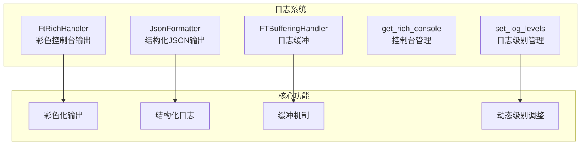
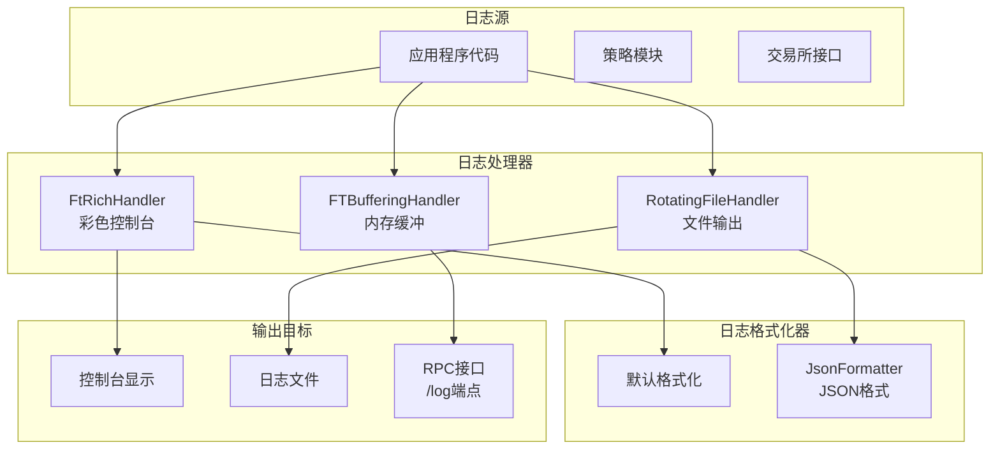
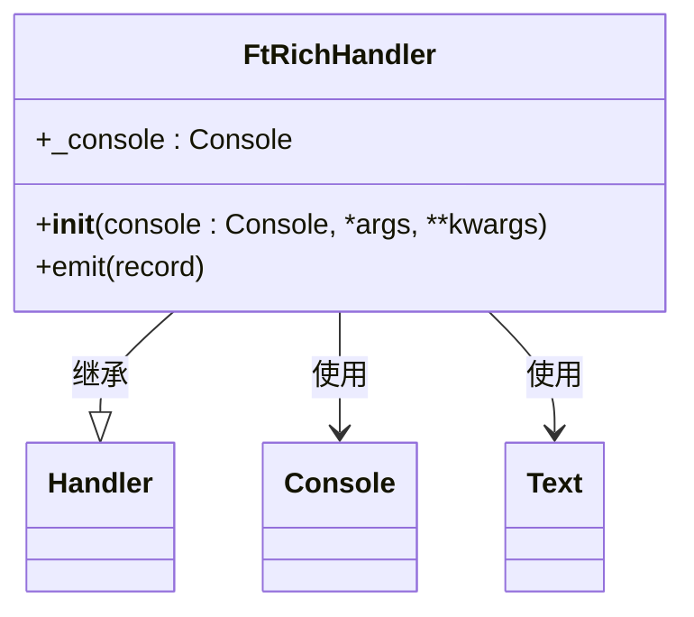
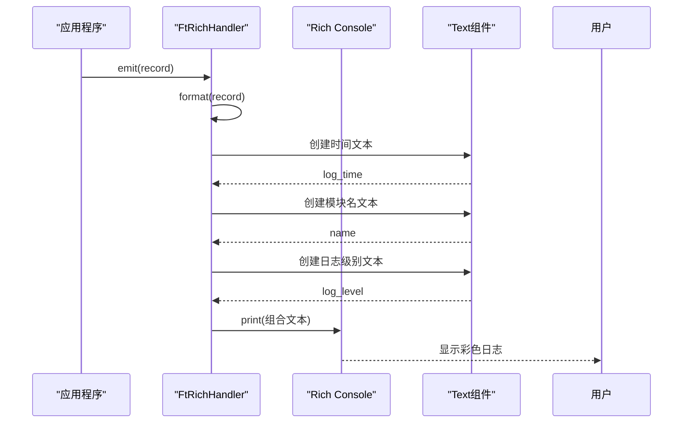
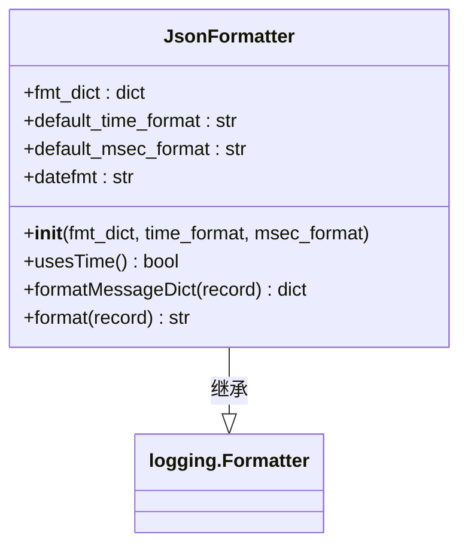
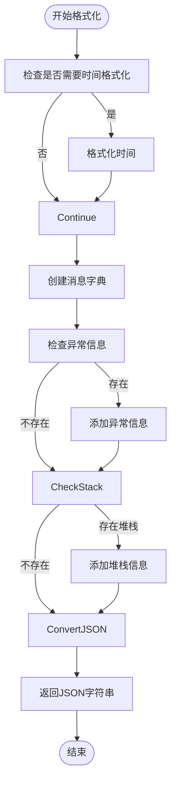
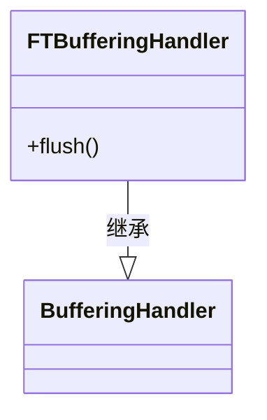
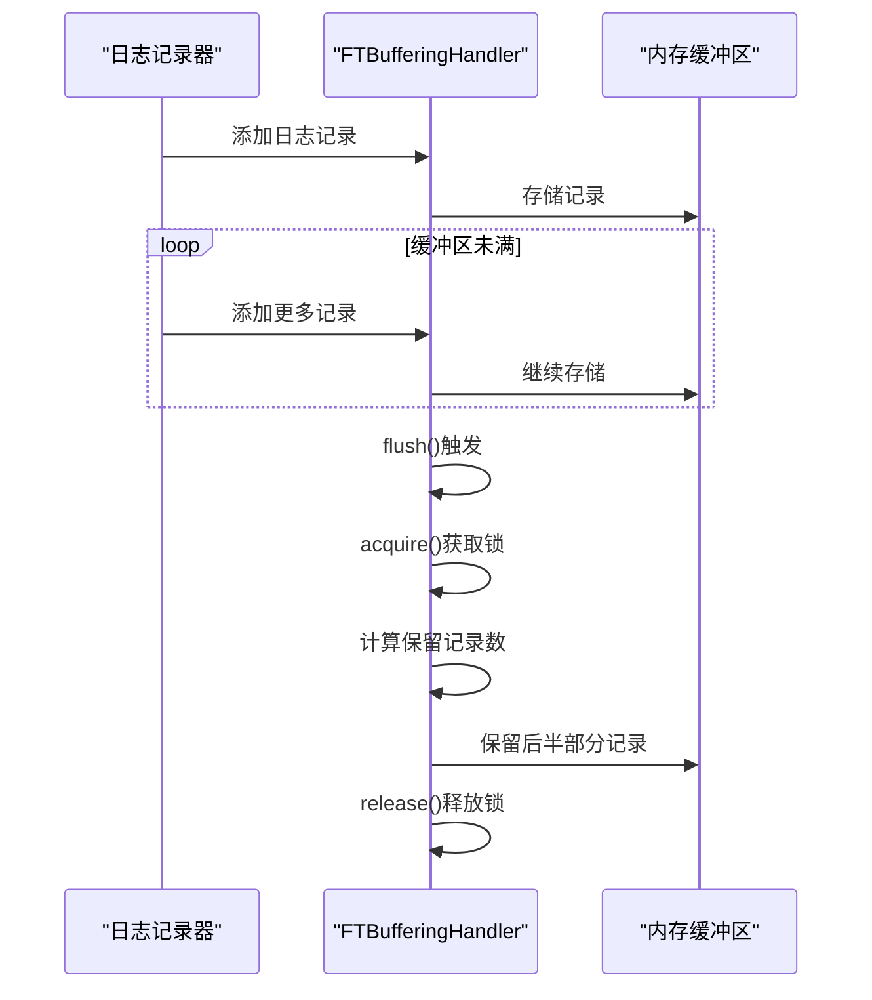
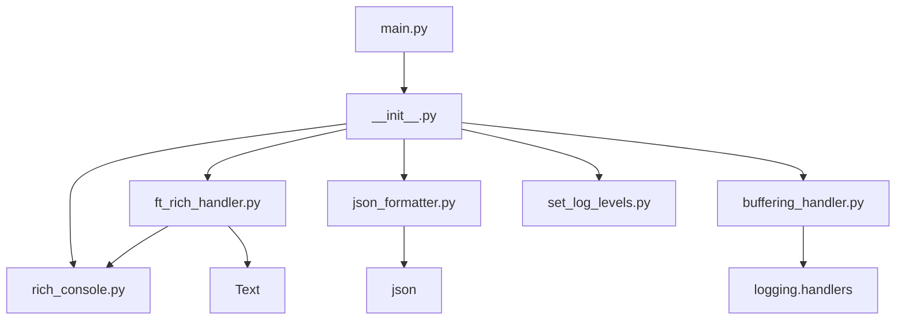

# 日志管理

<cite>
**本文档引用的文件**
- [ft_rich_handler.py](file://freqtrade/loggers/ft_rich_handler.py)
- [json_formatter.py](file://freqtrade/loggers/json_formatter.py)
- [buffering_handler.py](file://freqtrade/loggers/buffering_handler.py)
- [rich_console.py](file://freqtrade/loggers/rich_console.py)
- [set_log_levels.py](file://freqtrade/loggers/set_log_levels.py)
- [__init__.py](file://freqtrade/loggers/__init__.py)
- [main.py](file://freqtrade/main.py)
</cite>

## 目录
1. [简介](#简介)
2. [项目结构](#项目结构)
3. [核心组件](#核心组件)
4. [架构概述](#架构概述)
5. [详细组件分析](#详细组件分析)
6. [依赖分析](#依赖分析)
7. [性能考虑](#性能考虑)
8. [故障排除指南](#故障排除指南)
9. [结论](#结论)

## 简介
本文档详细说明了Freqtrade日志管理系统的实现机制，重点分析了彩色日志输出、结构化日志格式化、日志缓冲机制以及日志级别动态调整等功能。文档涵盖了FtRichHandler如何利用Rich库实现美观的日志显示，json_formatter.py在结构化日志输出中的作用，以及buffering_handler.py在高并发场景下的性能优势。同时提供了自定义日志处理器的开发指南和日志系统与RPC通知的协同工作机制。

## 项目结构
Freqtrade的日志管理系统位于`freqtrade/loggers`目录下，包含多个专门的日志处理模块。该系统设计为模块化架构，支持多种日志输出方式和格式化选项。

**图源**
- [ft_rich_handler.py](file://freqtrade/loggers/ft_rich_handler.py)
- [json_formatter.py](file://freqtrade/loggers/json_formatter.py)
- [buffering_handler.py](file://freqtrade/loggers/buffering_handler.py)
- [rich_console.py](file://freqtrade/loggers/rich_console.py)
- [set_log_levels.py](file://freqtrade/loggers/set_log_levels.py)

**节源**
- [__init__.py](file://freqtrade/loggers/__init__.py)

## 核心组件
Freqtrade日志系统由多个核心组件构成，包括FtRichHandler用于彩色控制台输出，JsonFormatter用于结构化JSON日志，FTBufferingHandler用于日志缓冲，以及相关的配置和管理工具。这些组件协同工作，提供了一个灵活、高效且功能丰富的日志解决方案。

**节源**
- [ft_rich_handler.py](file://freqtrade/loggers/ft_rich_handler.py)
- [json_formatter.py](file://freqtrade/loggers/json_formatter.py)
- [buffering_handler.py](file://freqtrade/loggers/buffering_handler.py)

## 架构概述
Freqtrade日志系统采用分层架构设计，将日志处理的不同方面分离到独立的组件中。系统在启动时通过`setup_logging_pre`进行早期日志配置，然后根据用户配置进行完整初始化。日志消息可以同时输出到控制台、文件和内部缓冲区，支持多种格式化选项。

**图源**
- [__init__.py](file://freqtrade/loggers/__init__.py)
- [ft_rich_handler.py](file://freqtrade/loggers/ft_rich_handler.py)
- [json_formatter.py](file://freqtrade/loggers/json_formatter.py)
- [buffering_handler.py](file://freqtrade/loggers/buffering_handler.py)

## 详细组件分析

### FtRichHandler分析
FtRichHandler是Freqtrade日志系统的核心组件之一，负责实现彩色化的控制台日志输出。它基于Rich库构建，提供了美观的日志显示效果，包括时间戳、日志级别和模块名称的格式化渲染。

#### 类图

**图源**
- [ft_rich_handler.py](file://freqtrade/loggers/ft_rich_handler.py)

#### 序列图

**图源**
- [ft_rich_handler.py](file://freqtrade/loggers/ft_rich_handler.py)

**节源**
- [ft_rich_handler.py](file://freqtrade/loggers/ft_rich_handler.py)

### JsonFormatter分析
JsonFormatter组件负责将日志记录转换为结构化的JSON格式，便于日志的机器解析和集中管理。它提供了灵活的字段映射配置，支持自定义时间格式。

#### 类图

**图源**
- [json_formatter.py](file://freqtrade/loggers/json_formatter.py)

#### 流程图

**图源**
- [json_formatter.py](file://freqtrade/loggers/json_formatter.py)

**节源**
- [json_formatter.py](file://freqtrade/loggers/json_formatter.py)

### FTBufferingHandler分析
FTBufferingHandler实现了特殊的日志缓冲机制，在flush操作时保留一半的缓冲记录，避免了日志输出的"空档期"，在高并发场景下提供了更好的性能表现。

#### 类图

#### 序程图

**图源**
- [buffering_handler.py](file://freqtrade/loggers/buffering_handler.py)

**节源**
- [buffering_handler.py](file://freqtrade/loggers/buffering_handler.py)

## 依赖分析
Freqtrade日志系统各组件之间存在明确的依赖关系，形成了一个协调工作的整体。系统通过`__init__.py`文件中的初始化函数协调各个组件的配置和启动。

**图源**
- [__init__.py](file://freqtrade/loggers/__init__.py)
- [main.py](file://freqtrade/main.py)

**节源**
- [__init__.py](file://freqtrade/loggers/__init__.py)
- [main.py](file://freqtrade/main.py)

## 性能考虑
Freqtrade日志系统在设计时充分考虑了性能因素。FTBufferingHandler通过保留一半缓冲记录避免了日志输出的间歇性中断，提高了高并发场景下的响应一致性。系统支持日志级别动态调整，可以在运行时根据需要增加或减少日志输出量，平衡调试信息和性能开销。异步日志处理机制确保日志记录不会阻塞主交易循环，保证了交易系统的实时性。

## 故障排除指南
当遇到日志系统问题时，可以按照以下步骤进行排查：
1. 检查`config.json`中的日志配置是否正确
2. 验证日志文件路径是否有写入权限
3. 确认Rich库是否正确安装
4. 检查日志级别设置是否合适
5. 验证缓冲区大小配置是否合理

**节源**
- [__init__.py](file://freqtrade/loggers/__init__.py)
- [set_log_levels.py](file://freqtrade/loggers/set_log_levels.py)

## 结论
Freqtrade的日志管理系统是一个功能丰富、性能优良的解决方案，通过FtRichHandler实现了美观的彩色控制台输出，通过JsonFormatter支持结构化日志记录，通过FTBufferingHandler优化了高并发场景下的日志性能。系统设计灵活，支持多种输出目标和格式化选项，同时提供了动态日志级别调整功能，满足了从开发调试到生产监控的各种需求。该系统与RPC通知机制协同工作，为用户提供全面的系统状态信息。