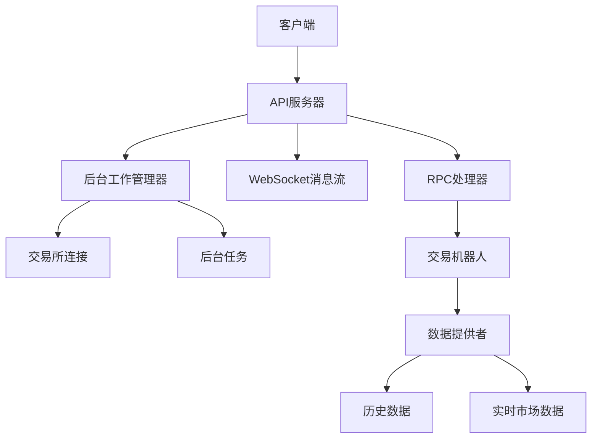
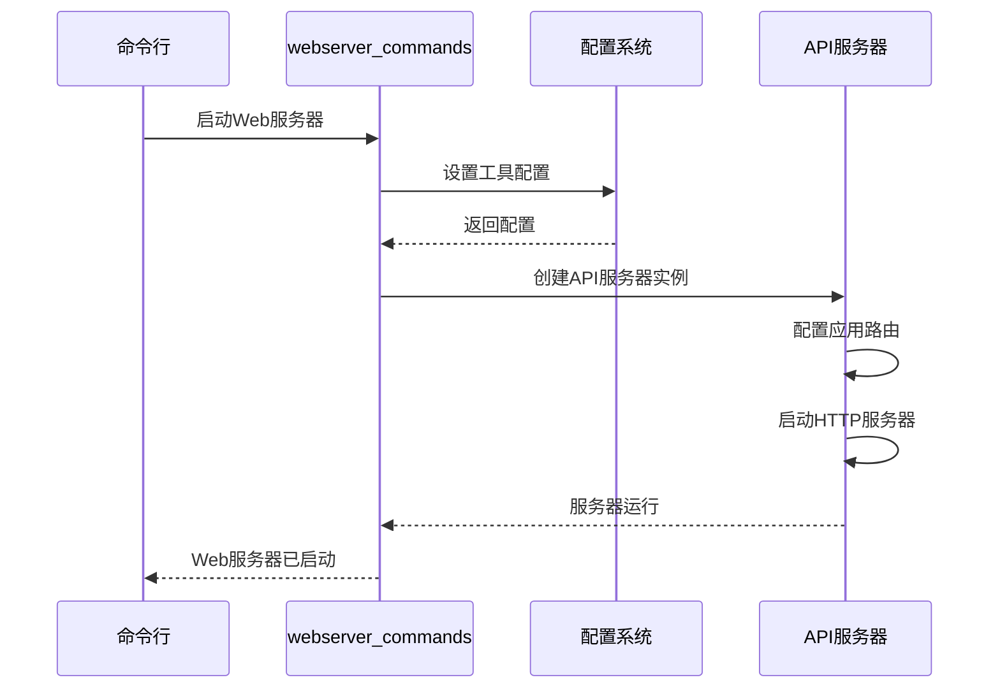

# 监控与运维

<cite>
**本文档引用的文件**  
- [webserver_commands.py](file://freqtrade/commands/webserver_commands.py)
- [webserver.py](file://freqtrade/rpc/api_server/webserver.py)
- [web_ui.py](file://freqtrade/rpc/api_server/web_ui.py)
- [config_schema.py](file://freqtrade/config_schema/config_schema.py)
- [json_formatter.py](file://freqtrade/loggers/json_formatter.py)
- [set_log_levels.py](file://freqtrade/loggers/set_log_levels.py)
</cite>

## 目录
1. [日志管理](#日志管理)
2. [性能监控与Web UI](#性能监控与web-ui)
3. [系统健康检查](#系统健康检查)
4. [监控服务启动与配置](#监控服务启动与配置)
5. [关键性能指标（KPI）监控](#关键性能指标kpi监控)
6. [自动化运维脚本](#自动化运维脚本)

## 日志管理

Freqtrade系统提供了完整的日志管理功能，支持日志级别设置、日志文件轮转和结构化日志输出。日志系统通过`freqtrade/loggers`模块实现，其中`json_formatter.py`文件定义了JSON格式的日志输出，确保日志信息可以被监控系统轻松解析和处理。

日志级别可以通过配置文件中的`verbosity`参数进行设置，支持`error`和`info`级别。对于需要减少日志输出的特定场景（如偏差测试），系统提供了`reduce_verbosity_for_bias_tester`函数来临时降低特定模块的日志级别，测试完成后可通过`restore_verbosity_for_bias_tester`函数恢复原始日志级别。

结构化日志输出通过`JsonFormatter`类实现，该类将日志记录转换为JSON格式，包含时间戳、日志级别、记录器名称和消息内容等标准字段。这种格式化的日志输出便于集中式日志管理系统（如ELK Stack）进行收集、索引和分析。

**日志管理部分来源**
- [json_formatter.py](file://freqtrade/loggers/json_formatter.py#L1-L75)
- [set_log_levels.py](file://freqtrade/loggers/set_log_levels.py#L1-L32)

## 性能监控与Web UI

Freqtrade提供了基于Web的用户界面（Web UI），用于实时监控交易机器人的性能。Web UI通过API服务器提供服务，用户可以通过浏览器访问监控界面，查看交易状态、性能指标和系统信息。

API服务器的配置在`config_schema.py`中定义，包含`api_server`配置项，可设置监听IP地址、端口、用户名、密码等参数。Web UI的路由和静态文件服务在`web_ui.py`中实现，通过FastAPI的路由机制提供HTML页面和静态资源。

实时监控功能包括交易列表、性能统计、市场数据可视化等。用户可以通过Web界面查看当前打开的交易、已完成交易的利润分析、以及各种技术指标的图表展示。API服务器还支持WebSocket连接，实现数据的实时推送，确保监控界面的及时更新。

**性能监控与Web UI部分来源**
- [web_ui.py](file://freqtrade/rpc/api_server/web_ui.py#L1-L56)
- [config_schema.py](file://freqtrade/config_schema/config_schema.py#L1-L1423)

## 系统健康检查

系统健康检查通过API服务器的健康检查端点实现。API服务器在启动时会配置多个路由，包括公共API端点和需要身份验证的私有端点。健康检查端点通常作为公共端点暴露，允许监控系统定期检查服务的可用性。

在`webserver.py`中，API服务器的初始化过程包括配置FastAPI应用、设置CORS策略、添加异常处理器等。服务器启动时会监听指定的IP地址和端口，并在日志中记录启动信息。如果配置了JWT密钥或密码，系统会发出安全警告，提醒用户修改默认值以增强安全性。

健康检查不仅包括服务的可达性检查，还包括内部组件的状态检查。API服务器通过`MessageStream`类管理WebSocket消息流，确保实时通信的稳定性。后台工作管理器（ApiBG）负责管理交易所连接和后台任务，确保系统各组件正常运行。

**图表来源**
- [webserver.py](file://freqtrade/rpc/api_server/webserver.py#L1-L245)

**系统健康检查部分来源**
- [webserver.py](file://freqtrade/rpc/api_server/webserver.py#L1-L245)

## 监控服务启动与配置

监控服务通过`webserver_commands.py`文件中的`start_webserver`函数启动。该函数是Web服务器模式的主入口点，负责初始化配置并启动API服务器。

启动过程首先调用`setup_utils_configuration`函数设置工具配置，然后创建`ApiServer`实例。`ApiServer`构造函数接收配置对象和`standalone`标志，决定API服务器是独立运行还是作为其他服务的一部分运行。

监控告警的配置在系统配置文件中完成，主要通过`telegram`、`webhook`和`discord`等通知模块实现。用户可以在配置文件中设置通知的启用状态、认证信息和消息格式。例如，Telegram通知需要配置`enabled`、`token`和`chat_id`参数，而Webhook通知则需要配置`url`和消息格式。

**图表来源**
- [webserver_commands.py](file://freqtrade/commands/webserver_commands.py#L1-L17)
- [webserver.py](file://freqtrade/rpc/api_server/webserver.py#L1-L245)

**监控服务启动与配置部分来源**
- [webserver_commands.py](file://freqtrade/commands/webserver_commands.py#L1-L17)

## 关键性能指标（KPI）监控

关键性能指标监控涵盖了交易延迟、内存使用和CPU负载等多个方面。这些指标通过API服务器的各个端点暴露，可供外部监控系统采集和分析。

交易延迟指标通过`api_backtest.py`和`api_pair_history.py`等模块提供，记录从信号生成到订单执行的时间。内存使用和CPU负载等系统级指标虽然没有直接的API端点，但可以通过操作系统的监控工具或Docker容器的资源限制功能进行监控。

在配置文件中，`internals`部分可以设置`process_throttle_secs`参数，控制主循环的最小执行间隔，间接影响CPU使用率。`api_server`配置中的`verbosity`参数控制日志输出的详细程度，影响磁盘I/O和存储使用。

对于交易性能的监控，系统提供了详细的回测和超参数优化结果，包括总利润、胜率、最大回撤、夏普比率等指标。这些指标可以通过API的`/api/v1/backtest`端点获取，用于评估和优化交易策略。

**关键性能指标KPI监控部分来源**
- [config_schema.py](file://freqtrade/config_schema/config_schema.py#L1-L1423)
- [webserver.py](file://freqtrade/rpc/api_server/webserver.py#L1-L245)

## 自动化运维脚本

自动化运维脚本的编写基于Freqtrade提供的命令行接口（CLI）。系统通过`arguments.py`文件定义了所有可用的命令行选项，包括交易、回测、超参数优化、数据下载等操作。

编写自动化脚本时，可以使用Python的`subprocess`模块调用Freqtrade命令，或直接导入和调用Freqtrade的内部函数。最佳实践包括：

1. 使用配置文件管理所有参数，避免在脚本中硬编码敏感信息
2. 实现错误处理和重试机制，确保脚本的健壮性
3. 记录详细的执行日志，便于故障排查
4. 使用环境变量管理动态配置，如API密钥和密码
5. 定期备份配置文件和交易数据，防止数据丢失

对于监控告警，可以编写脚本定期调用API的健康检查端点，并根据响应结果发送通知。例如，使用cron作业每分钟检查API服务器状态，如果连续多次检查失败，则通过Telegram或Webhook发送告警。

**自动化运维脚本部分来源**
- [arguments.py](file://freqtrade/commands/arguments.py#L1-L708)
- [config_schema.py](file://freqtrade/config_schema/config_schema.py#L1-L1423)