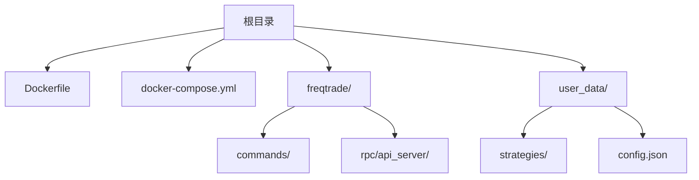
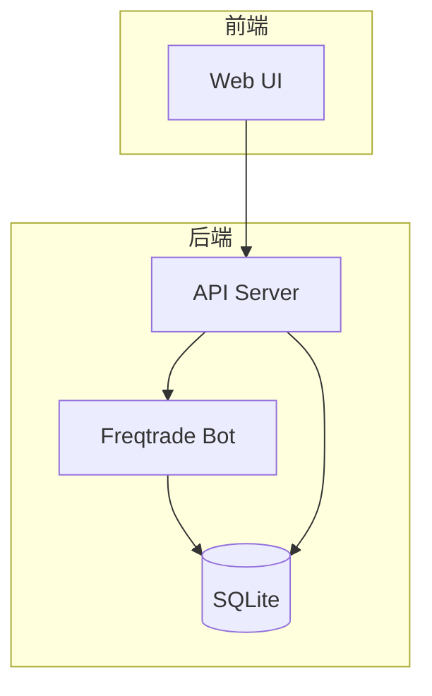
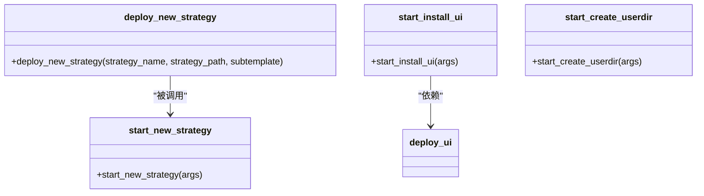
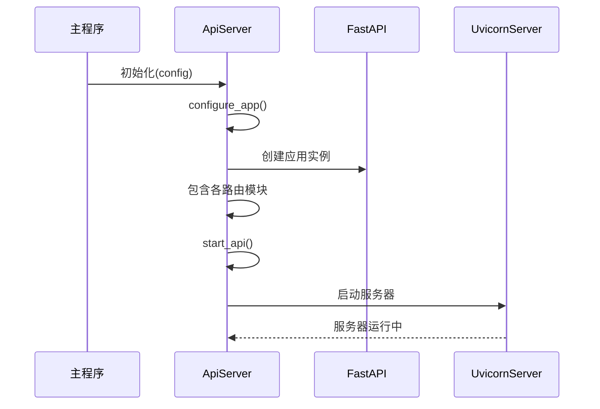
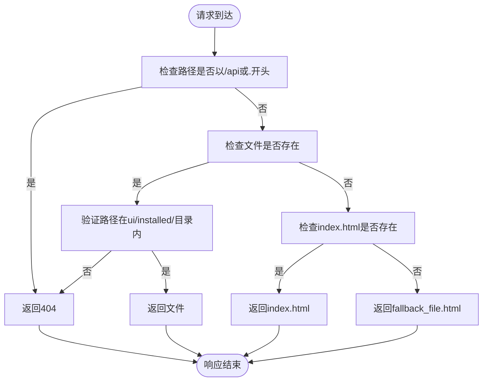
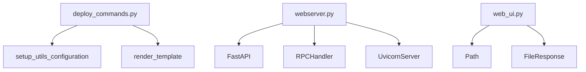

# 部署与运维

<cite>
**本文档引用的文件**  
- [Dockerfile](file://Dockerfile)
- [docker-compose.yml](file://docker-compose.yml)
- [deploy_commands.py](file://freqtrade/commands/deploy_commands.py)
- [webserver.py](file://freqtrade/rpc/api_server/webserver.py)
- [web_ui.py](file://freqtrade/rpc/api_server/web_ui.py)
- [config.json](file://user_data/config.json)
</cite>

## 目录
1. [简介](#简介)
2. [项目结构](#项目结构)
3. [核心组件](#核心组件)
4. [架构概览](#架构概览)
5. [详细组件分析](#详细组件分析)
6. [依赖分析](#依赖分析)
7. [性能考量](#性能考量)
8. [故障排查指南](#故障排查指南)
9. [结论](#结论)

## 简介
本文档旨在为Freqtrade系统提供全面的生产环境部署与运维指南。涵盖从单机部署到容器化集群的完整方案，详细说明Docker多阶段构建、服务编排、自动化部署工具链、Web UI配置、系统监控、日志分析、故障恢复及性能调优等关键运维主题。

## 项目结构
Freqtrade项目采用模块化设计，主要包含核心交易引擎、命令行工具、API服务器、用户数据目录和容器化部署文件。核心代码位于`freqtrade/`目录下，`user_data/`用于存放策略、配置和回测结果，`Dockerfile`和`docker-compose.yml`支持容器化部署。

**Diagram sources**  
- [Dockerfile](file://Dockerfile)
- [docker-compose.yml](file://docker-compose.yml)
- [user_data](file://user_data)

**Section sources**
- [Dockerfile](file://Dockerfile)
- [docker-compose.yml](file://docker-compose.yml)
- [user_data](file://user_data)

## 核心组件
核心组件包括交易机器人主程序、API服务器、Web UI前端和自动化部署工具。`deploy_commands.py`提供创建用户目录、生成新策略和安装UI的命令行工具。`webserver.py`实现基于FastAPI的REST API和WebSocket服务，`web_ui.py`处理前端静态资源路由。

**Section sources**
- [deploy_commands.py](file://freqtrade/commands/deploy_commands.py#L1-L133)
- [webserver.py](file://freqtrade/rpc/api_server/webserver.py#L1-L244)
- [web_ui.py](file://freqtrade/rpc/api_server/web_ui.py#L1-L55)

## 架构概览
系统采用前后端分离架构，交易机器人作为后端服务运行，通过REST API和WebSocket与前端UI交互。容器化部署使用Docker Compose编排，支持数据库、Web UI和交易机器人的协同运行。

**Diagram sources**  
- [docker-compose.yml](file://docker-compose.yml#L1-L36)
- [webserver.py](file://freqtrade/rpc/api_server/webserver.py#L1-L244)

## 详细组件分析

### 部署自动化分析
`deploy_commands.py`模块提供关键的自动化部署功能，包括创建用户数据目录、生成新交易策略和安装Web UI。

#### 部署命令类图

**Diagram sources**  
- [deploy_commands.py](file://freqtrade/commands/deploy_commands.py#L33-L79)
- [deploy_commands.py](file://freqtrade/commands/deploy_commands.py#L82-L105)
- [deploy_commands.py](file://freqtrade/commands/deploy_commands.py#L108-L132)

### API服务器分析
`webserver.py`实现API服务器核心功能，采用单例模式确保全局唯一实例，集成FastAPI框架提供REST接口和WebSocket通信。

#### API服务器启动序列图

**Diagram sources**  
- [webserver.py](file://freqtrade/rpc/api_server/webserver.py#L34-L243)

### Web UI分析
`web_ui.py`负责Web UI的静态资源路由，实现前端路由的fallback机制，确保单页应用(SPA)的正常运行。

#### Web UI路由流程图

**Diagram sources**  
- [web_ui.py](file://freqtrade/rpc/api_server/web_ui.py#L1-L55)

## 依赖分析
系统依赖关系清晰，`deploy_commands.py`依赖配置模块和模板渲染工具，API服务器依赖FastAPI框架和RPC系统，Web UI依赖静态资源文件。

**Diagram sources**  
- [deploy_commands.py](file://freqtrade/commands/deploy_commands.py)
- [webserver.py](file://freqtrade/rpc/api_server/webserver.py)
- [web_ui.py](file://freqtrade/rpc/api_server/web_ui.py)

## 性能考量
- **API服务器**：配置了orjson进行快速JSON序列化，优化响应性能
- **日志**：支持不同级别的日志输出，生产环境建议设置为"error"级别
- **安全**：默认监听本地回环地址(127.0.0.1)，避免外部直接访问
- **数据库**：使用SQLite作为默认数据库，适合单机部署场景

## 故障排查指南
常见问题及解决方案：

| 问题现象 | 可能原因 | 解决方案 |
|---------|---------|---------|
| Web UI无法访问 | API服务器未启动 | 检查`api_server.enabled`配置项 |
| 登录失败 | JWT密钥为默认值 | 修改`api_server.jwt_secret_key`配置 |
| 外部无法访问 | 监听地址为127.0.0.1 | 修改`api_server.listen_ip_address`配置 |
| UI显示异常 | 前端资源未安装 | 运行`freqtrade install-ui`命令 |

**Section sources**
- [webserver.py](file://freqtrade/rpc/api_server/webserver.py#L200-L230)
- [config.json](file://user_data/config.json#L70-L85)

## 结论
Freqtrade提供了完整的生产环境部署解决方案，通过Docker容器化、自动化部署工具和完善的API接口，实现了从单机到集群的灵活部署。建议生产环境使用容器化部署，配置HTTPS反向代理，并定期监控系统性能指标。