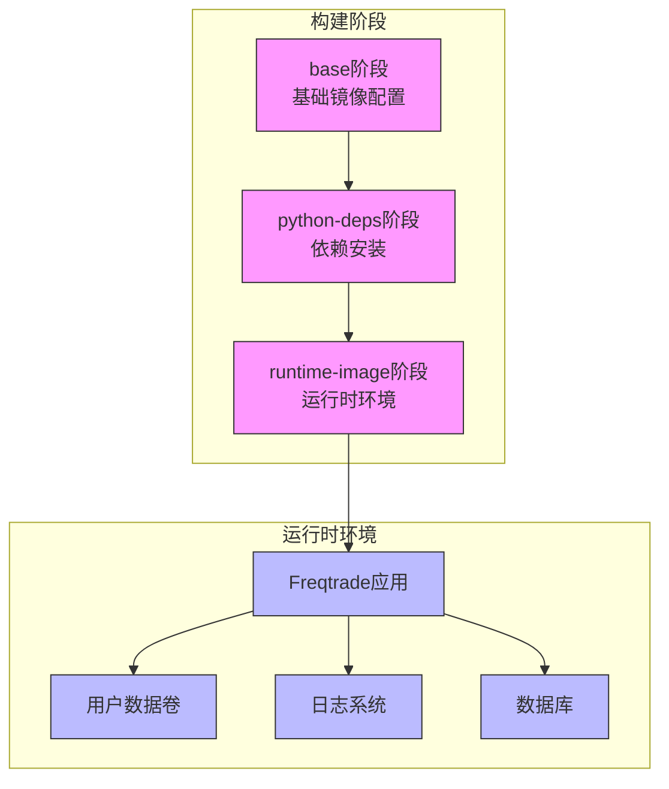
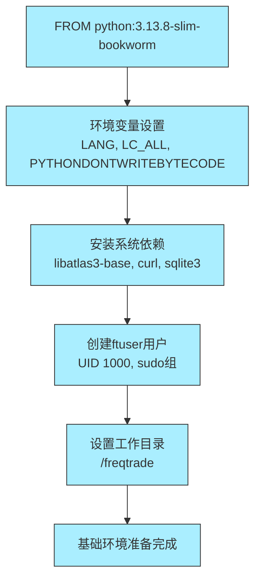
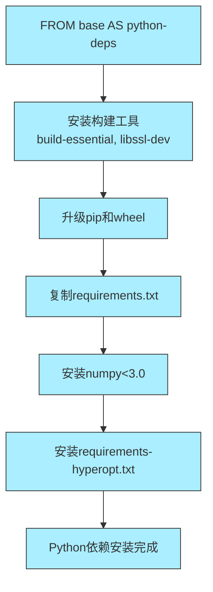
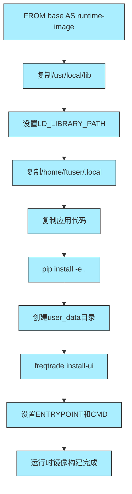
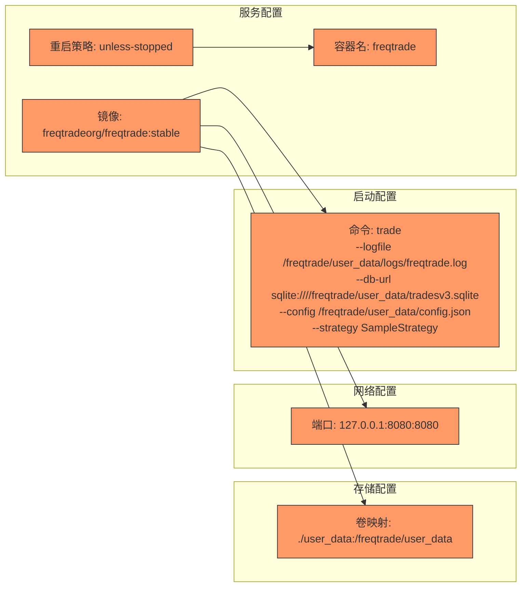
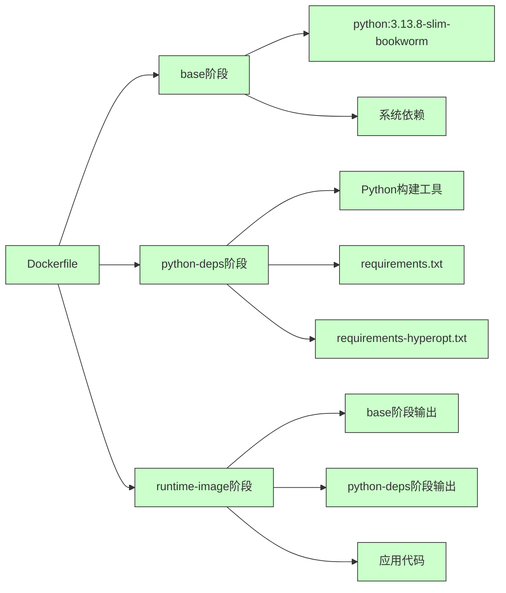
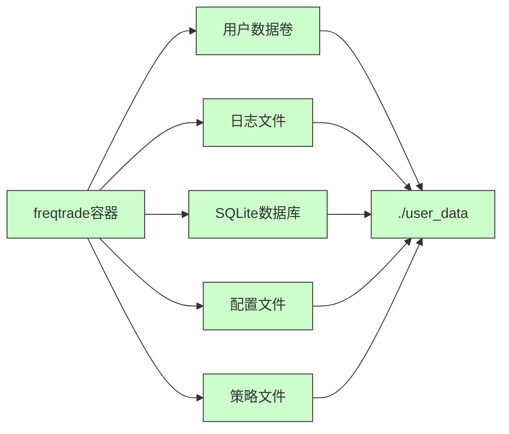

# Docker部署

<cite>
**Referenced Files in This Document**   
- [Dockerfile](file://Dockerfile)
- [docker-compose.yml](file://docker-compose.yml)
- [requirements.txt](file://requirements.txt)
- [requirements-hyperopt.txt](file://requirements-hyperopt.txt)
- [freqtrade/configuration/detect_environment.py](file://freqtrade/configuration/detect_environment.py)
</cite>

## 目录
1. [简介](#简介)
2. [项目结构](#项目结构)
3. [核心组件](#核心组件)
4. [架构概述](#架构概述)
5. [详细组件分析](#详细组件分析)
6. [依赖分析](#依赖分析)
7. [性能考虑](#性能考虑)
8. [故障排除指南](#故障排除指南)
9. [结论](#结论)

## 简介
本文档详细解析Freqtrade的Docker多阶段构建过程，涵盖基础镜像选择、依赖安装、用户权限配置以及生产环境优化设置。深入分析Dockerfile中的各个构建阶段，解释环境变量配置、库路径设置和容器安全实践。说明docker-compose.yml中的服务编排机制，涵盖镜像版本管理、卷映射、端口暴露和启动命令配置。提供GPU加速环境的部署方法和自定义Dockerfile构建流程。

## 项目结构
Freqtrade项目采用模块化设计，主要包含核心交易引擎、配置管理、数据处理、交易所接口、优化模块和插件系统。Docker相关文件位于项目根目录，包括Dockerfile和docker-compose.yml，用于容器化部署。

**Section sources**
- [Dockerfile](file://Dockerfile)
- [docker-compose.yml](file://docker-compose.yml)

## 核心组件

### 多阶段构建流程
Freqtrade的Dockerfile采用多阶段构建策略，分为base、python-deps和runtime-image三个阶段。基础阶段基于python:3.13.8-slim-bookworm镜像，安装系统级依赖并创建ftuser用户。依赖阶段安装Python构建工具和超优化依赖，最终阶段将依赖复制到运行时镜像中，实现镜像体积最小化。

**Section sources**
- [Dockerfile](file://Dockerfile#L1-L53)

### 用户权限与安全配置
构建过程中创建专用ftuser用户（UID 1000），通过sudo权限配置允许特定操作。环境变量设置包括LANG、LC_ALL、PYTHONDONTWRITEBYTECODE等，确保容器内Python运行环境的一致性和安全性。

**Section sources**
- [Dockerfile](file://Dockerfile#L3-L15)

## 架构概述

**Diagram sources**
- [Dockerfile](file://Dockerfile#L1-L53)
- [docker-compose.yml](file://docker-compose.yml#L1-L36)

## 详细组件分析

### 构建阶段分析

#### 基础阶段 (base)

**Diagram sources**
- [Dockerfile](file://Dockerfile#L1-L15)

#### 依赖安装阶段 (python-deps)

**Diagram sources**
- [Dockerfile](file://Dockerfile#L17-L28)
- [requirements.txt](file://requirements.txt)
- [requirements-hyperopt.txt](file://requirements-hyperopt.txt)

#### 运行时阶段 (runtime-image)

**Diagram sources**
- [Dockerfile](file://Dockerfile#L30-L53)

### docker-compose服务编排

**Diagram sources**
- [docker-compose.yml](file://docker-compose.yml#L1-L36)

## 依赖分析

### 构建依赖关系

**Diagram sources**
- [Dockerfile](file://Dockerfile#L1-L53)
- [requirements.txt](file://requirements.txt)
- [requirements-hyperopt.txt](file://requirements-hyperopt.txt)

### 运行时依赖关系

**Diagram sources**
- [docker-compose.yml](file://docker-compose.yml#L1-L36)
- [freqtrade/configuration/detect_environment.py](file://freqtrade/configuration/detect_environment.py#L3-L7)

## 性能考虑
多阶段构建显著减小了最终镜像体积，仅包含运行时必需的依赖。通过将构建工具和开发依赖隔离在中间阶段，提高了生产环境的安全性和启动速度。卷映射确保用户数据持久化，避免容器重建时数据丢失。

## 故障排除指南

### 常见构建错误
- **依赖冲突**: 确保requirements.txt和requirements-hyperopt.txt中的版本兼容
- **权限拒绝**: 检查ftuser用户的权限配置和文件所有权
- **网络问题**: 配置适当的Docker网络和代理设置
- **构建缓存问题**: 使用--no-cache选项重新构建

### 环境检测机制
系统通过检测FT_APP_ENV环境变量判断是否运行在Docker容器中，此机制用于调整文件权限和日志行为。

**Section sources**
- [freqtrade/configuration/detect_environment.py](file://freqtrade/configuration/detect_environment.py#L3-L7)

## 结论
Freqtrade的Docker部署方案采用多阶段构建优化镜像大小，通过合理的用户权限配置和环境变量设置确保安全性。docker-compose.yml提供了灵活的服务编排，支持生产环境部署和开发测试。GPU加速支持通过NVIDIA设备映射实现，满足freqAI等计算密集型功能的需求。