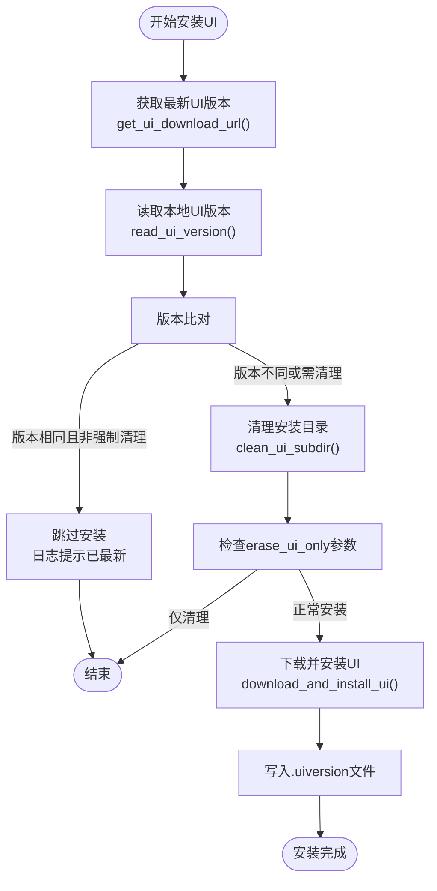
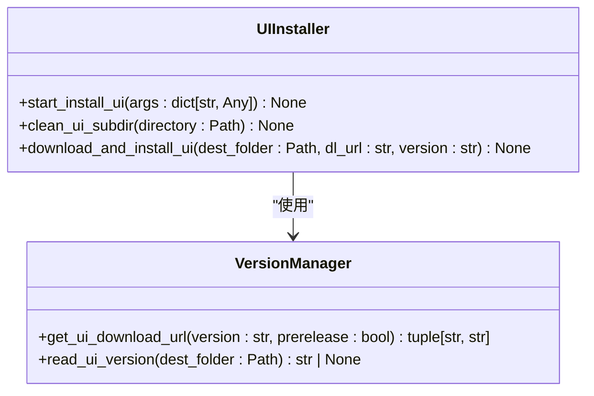
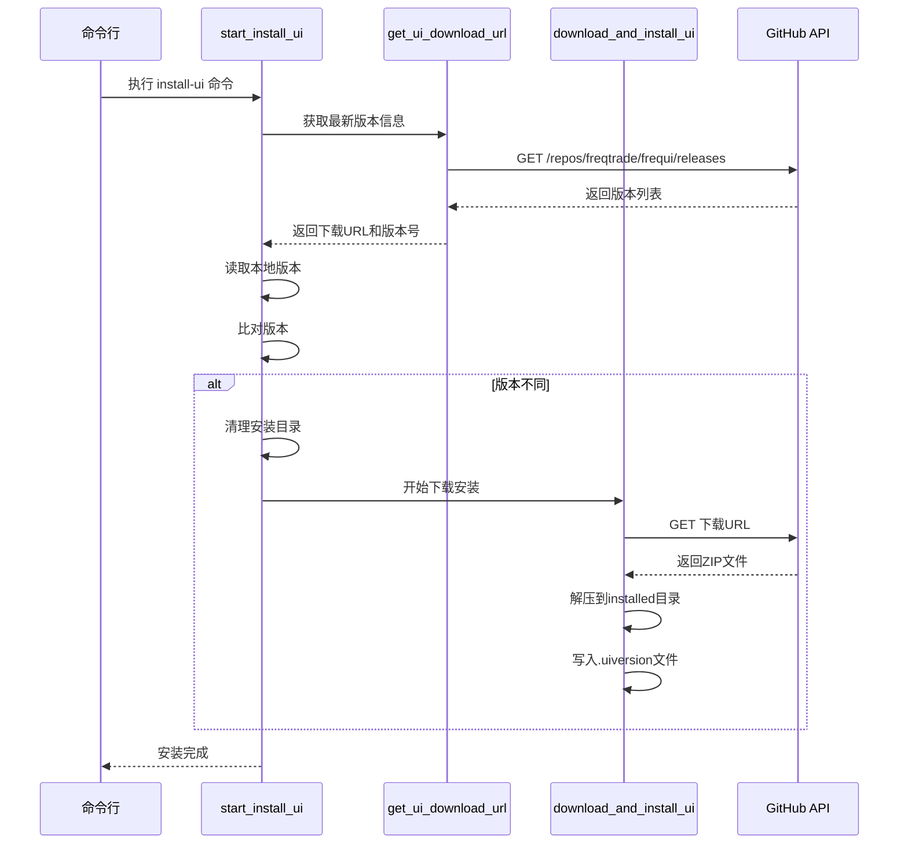

# Web UI安装

<cite>
**本文档中引用的文件**
- [deploy_commands.py](file://freqtrade/commands/deploy_commands.py)
- [deploy_ui.py](file://freqtrade/commands/deploy_ui.py)
- [web_ui.py](file://freqtrade/rpc/api_server/web_ui.py)
- [webserver.py](file://freqtrade/rpc/api_server/webserver.py)
- [ui/installed/.uiversion](file://freqtrade/rpc/api_server/ui/installed/.uiversion)
</cite>

## 目录
1. [简介](#简介)
2. [核心组件](#核心组件)
3. [UI安装流程架构](#ui安装流程架构)
4. [UI版本管理机制](#ui版本管理机制)
5. [UI文件下载与安装过程](#ui文件下载与安装过程)
6. [清理功能与离线部署策略](#清理功能与离线部署策略)
7. [常见安装问题分析与解决方案](#常见安装问题分析与解决方案)
8. [手动UI管理与自定义配置](#手动ui管理与自定义配置)

## 简介
本文档深入解析Freqtrade项目中Web UI的自动化安装机制，重点分析`start_install_ui`函数的实现逻辑。文档详细说明了通过`deploy_ui`模块完成FreqUI前端自动化部署的完整流程，包括版本检测、下载、解压和安装等核心环节。同时，文档还涵盖了UI版本管理、清理策略、故障排查以及手动管理方法，为用户提供全面的UI部署指导。

## 核心组件

`start_install_ui`函数是Freqtrade系统中负责Web UI自动化安装的核心函数，位于`freqtrade/commands/deploy_commands.py`文件中。该函数通过调用`deploy_ui`模块中的多个辅助函数，实现了完整的UI部署流程。主要涉及的组件包括：`get_ui_download_url`用于获取最新UI版本的下载链接，`read_ui_version`用于读取本地已安装的UI版本，`clean_ui_subdir`用于清理目标目录，以及`download_and_install_ui`用于执行实际的下载和安装操作。

**Section sources**
- [deploy_commands.py](file://freqtrade/commands/deploy_commands.py#L108-L132)

## UI安装流程架构

**Diagram sources**
- [deploy_commands.py](file://freqtrade/commands/deploy_commands.py#L108-L132)
- [deploy_ui.py](file://freqtrade/commands/deploy_ui.py#L12-L50)

**Section sources**
- [deploy_commands.py](file://freqtrade/commands/deploy_commands.py#L108-L132)
- [deploy_ui.py](file://freqtrade/commands/deploy_ui.py#L12-L50)

## UI版本管理机制

FreqUI的版本管理机制采用本地版本文件与远程版本查询相结合的方式。系统通过`.uiversion`文件记录当前安装的UI版本，该文件位于`rpc/api_server/ui/installed/`目录下。

**Diagram sources**
- [deploy_ui.py](file://freqtrade/commands/deploy_ui.py#L25-L86)

### 最新版本检测

`get_ui_download_url`函数负责从GitHub API获取最新的FreqUI发布版本信息。函数首先访问`https://api.github.com/repos/freqtrade/frequi/releases`端点获取所有发布版本。如果指定了特定版本，则筛选出匹配的版本；否则，根据`prerelease`参数决定是否包含预发布版本。获取到版本列表后，函数会按创建时间降序排序，确保返回最新的稳定版本。最终，函数返回下载URL和版本号。

### 本地版本读取

`read_ui_version`函数负责读取本地安装的UI版本。函数检查目标目录下的`.uiversion`文件是否存在，如果存在则读取文件内容并返回版本字符串；如果文件不存在，则返回`None`，表示UI尚未安装。

### 版本比对机制

在`start_install_ui`函数中，系统会将从GitHub获取的最新版本号与通过`read_ui_version`读取的本地版本号进行比对。如果两者相同且未设置`erase_ui_only`参数，系统将输出日志提示"UI already up-to-date"并直接返回，避免不必要的下载和安装操作。这种机制有效减少了网络流量和系统资源消耗。

**Section sources**
- [deploy_ui.py](file://freqtrade/commands/deploy_ui.py#L25-L86)
- [deploy_commands.py](file://freqtrade/commands/deploy_commands.py#L108-L132)

## UI文件下载与安装过程

UI文件的下载和安装由`download_and_install_ui`函数完成。该函数首先通过HTTP GET请求从指定的`dl_url`下载UI压缩包，请求超时时间为30秒。下载完成后，函数使用`zipfile`模块解压二进制内容。

**Diagram sources**
- [deploy_ui.py](file://freqtrade/commands/deploy_ui.py#L34-L50)
- [deploy_commands.py](file://freqtrade/commands/deploy_commands.py#L108-L132)

解压过程中，函数遍历ZIP文件中的每个条目，根据条目类型创建相应的目录或文件。对于目录条目，使用`mkdir(exist_ok=True)`创建目录；对于文件条目，使用`write_bytes()`将内容写入目标文件。安装完成后，函数会在目标目录下创建`.uiversion`文件，记录本次安装的版本号，为后续的版本比对提供依据。

**Section sources**
- [deploy_ui.py](file://freqtrade/commands/deploy_ui.py#L34-L50)

## 清理功能与离线部署策略

`erase_ui_only`参数提供了专门的清理功能。当此参数被设置时，`start_install_ui`函数在清理完`rpc/api_server/ui/installed/`目录内容后会直接退出，不再执行下载和安装操作。这一功能对于需要完全重新安装或解决文件损坏问题的场景非常有用。

对于离线部署场景，系统本身不提供直接的离线安装方法，但可以通过手动方式实现。用户可以在有网络的环境中使用`install-ui`命令下载并安装UI，然后将整个`rpc/api_server/ui/installed/`目录复制到离线环境的相同位置。只要确保`.uiversion`文件一同复制，系统就会认为UI已正确安装。

**Section sources**
- [deploy_commands.py](file://freqtrade/commands/deploy_commands.py#L108-L132)
- [deploy_ui.py](file://freqtrade/commands/deploy_ui.py#L12-L22)

## 常见安装问题分析与解决方案

### 网络超时
由于下载请求设置了30秒的超时时间，网络状况不佳时可能导致超时错误。解决方案包括：
- 检查网络连接是否稳定
- 尝试在网络状况较好的时段重新安装
- 考虑使用网络代理

### 权限不足
安装过程需要对`rpc/api_server/ui/installed/`目录进行读写操作。如果运行命令的用户没有足够权限，会导致文件创建或删除失败。解决方案是确保以具有足够权限的用户身份运行安装命令，或手动调整目标目录的权限设置。

### 目录锁定
在Windows系统上，如果目标目录中的文件被其他进程占用（如文件资源管理器打开了该目录），可能导致清理或写入失败。解决方案是关闭所有可能占用该目录的程序，然后重试安装。

### UI版本未找到
`get_ui_download_url`函数在无法找到指定版本时会抛出`ValueError("UI-Version not found.")`异常。这通常发生在指定的版本号不存在或GitHub API暂时不可用时。解决方案是检查版本号是否正确，或不指定版本号让系统自动选择最新版本。

**Section sources**
- [deploy_ui.py](file://freqtrade/commands/deploy_ui.py#L73)
- [deploy_ui.py](file://freqtrade/commands/deploy_ui.py#L9)

## 手动UI管理与自定义配置

用户可以直接管理`rpc/api_server/ui/installed/`目录下的UI文件。可以手动替换、修改或删除其中的任何文件以实现自定义配置。例如，可以修改CSS文件来改变界面样式，或替换JavaScript文件来添加自定义功能。

要验证当前安装的UI版本，可以通过访问`/ui_version`API端点（如`http://localhost:8080/ui_version`）来获取版本信息。该端点由`web_ui.py`中的`ui_version`函数处理，它会调用`read_ui_version`读取`.uiversion`文件的内容并返回JSON格式的响应。

**Section sources**
- [web_ui.py](file://freqtrade/rpc/api_server/web_ui.py#L32-L54)
- [ui/installed/.uiversion](file://freqtrade/rpc/api_server/ui/installed/.uiversion)