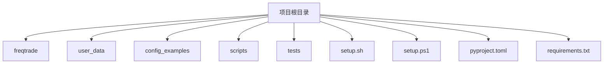
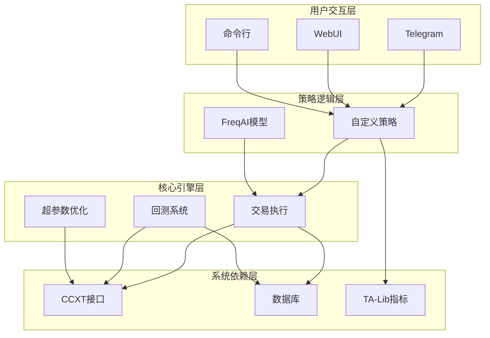
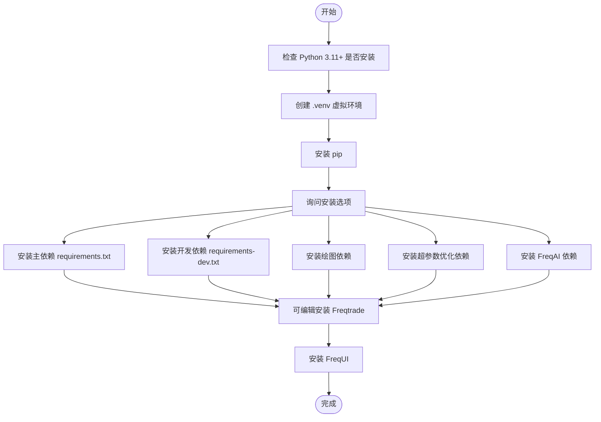
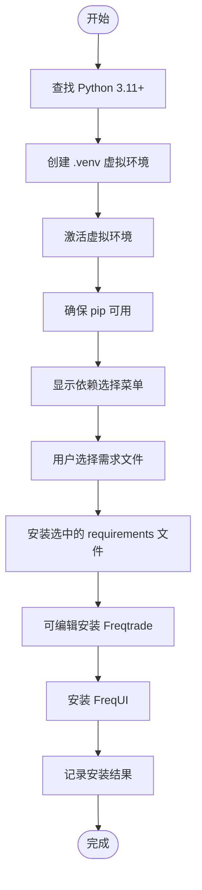
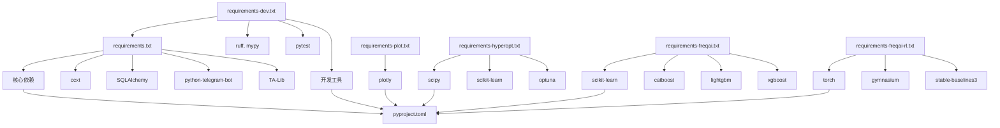

# 直接部署

<cite>
**本文档中引用的文件**  
- [setup.sh](file://setup.sh)
- [setup.ps1](file://setup.ps1)
- [pyproject.toml](file://pyproject.toml)
- [requirements.txt](file://requirements.txt)
- [requirements-dev.txt](file://requirements-dev.txt)
- [requirements-freqai.txt](file://requirements-freqai.txt)
- [requirements-hyperopt.txt](file://requirements-hyperopt.txt)
- [requirements-plot.txt](file://requirements-plot.txt)
- [requirements-freqai-rl.txt](file://requirements-freqai-rl.txt)
</cite>

## 目录
1. [简介](#简介)
2. [项目结构](#项目结构)
3. [核心组件](#核心组件)
4. [架构概述](#架构概述)
5. [详细组件分析](#详细组件分析)
6. [依赖分析](#依赖分析)
7. [性能考虑](#性能考虑)
8. [故障排除指南](#故障排除指南)
9. [结论](#结论)

## 简介
Freqtrade 是一个免费开源的加密货币交易机器人，使用 Python 编写，支持通过 Telegram 或 WebUI 进行控制。本指南全面介绍在原生 Python 环境中部署 Freqtrade 的流程，涵盖 Linux 和 Windows 系统的自动化安装脚本使用方法、依赖管理机制、虚拟环境配置及常见问题排查方案。

## 项目结构
Freqtrade 项目采用模块化设计，主要目录包括 `freqtrade`（核心代码）、`user_data`（用户配置和策略）、`config_examples`（配置示例）等。根目录下包含多个 `requirements-*.txt` 文件用于管理不同功能模块的依赖。

**Diagram sources**
- [setup.sh](file://setup.sh#L1-L291)
- [setup.ps1](file://setup.ps1#L1-L273)

**Section sources**
- [setup.sh](file://setup.sh#L1-L291)
- [setup.ps1](file://setup.ps1#L1-L273)

## 核心组件
Freqtrade 的核心组件包括命令行接口（CLI）、交易引擎、数据处理模块、回测系统、超参数优化（Hyperopt）和机器学习预测模型（FreqAI）。这些组件通过清晰的模块划分实现高内聚低耦合的设计。

**Section sources**
- [freqtrade/main.py](file://freqtrade/main.py)
- [freqtrade/freqtradebot.py](file://freqtrade/freqtradebot.py)

## 架构概述
Freqtrade 采用分层架构设计，自底向上分别为：系统依赖层、核心引擎层、策略逻辑层和用户交互层。系统支持插件化扩展，可通过配置灵活启用或禁用特定功能模块。

**Diagram sources**
- [pyproject.toml](file://pyproject.toml#L1-L346)
- [requirements.txt](file://requirements.txt#L1-L64)

## 详细组件分析

### 自动化安装脚本分析
Freqtrade 提供了跨平台的自动化安装脚本，分别适用于 Linux 和 Windows 系统。

#### Linux 安装脚本 (setup.sh)
该脚本自动检测 Python 版本（3.11-3.13），创建虚拟环境，安装主依赖和可选功能模块，并完成 Freqtrade 的可编辑安装。

**Diagram sources**
- [setup.sh](file://setup.sh#L1-L291)

**Section sources**
- [setup.sh](file://setup.sh#L1-L291)

#### Windows 安装脚本 (setup.ps1)
PowerShell 脚本为 Windows 用户提供图形化交互式安装体验，支持选择安装不同功能模块的依赖包。

**Diagram sources**
- [setup.ps1](file://setup.ps1#L1-L273)

**Section sources**
- [setup.ps1](file://setup.ps1#L1-L273)

## 依赖分析
Freqtrade 采用精细化的依赖管理机制，通过多个 requirements 文件实现功能模块的按需加载。

**Diagram sources**
- [pyproject.toml](file://pyproject.toml#L1-L346)
- [requirements.txt](file://requirements.txt#L1-L64)
- [requirements-dev.txt](file://requirements-dev.txt#L1-L33)
- [requirements-freqai.txt](file://requirements-freqai.txt#L1-L13)

**Section sources**
- [pyproject.toml](file://pyproject.toml#L1-L346)
- [requirements.txt](file://requirements.txt#L1-L64)

## 性能考虑
Freqtrade 在设计上注重性能优化，特别是在数据处理和计算密集型任务方面。建议使用 Python 3.11 或更高版本以获得最佳性能。对于 ARM 架构设备（如树莓派），需特别注意依赖包的兼容性问题。

## 故障排除指南
常见问题及解决方案：

- **依赖冲突**：使用虚拟环境隔离项目依赖，避免全局包冲突
- **编译错误**：确保已安装系统级依赖（如 libatlas3-base、libgomp1）
- **TA-Lib 安装失败**：先安装系统包再通过 pip 安装 Python 包
- **FreqAI 模型训练慢**：考虑使用 requirements-freqai-rl.txt 中的 PyTorch 版本进行 GPU 加速

**Section sources**
- [setup.sh](file://setup.sh#L1-L291)
- [setup.ps1](file://setup.ps1#L1-L273)

## 结论
Freqtrade 提供了一套完整的自动化部署解决方案，通过精心设计的安装脚本和模块化的依赖管理，使用户能够在不同操作系统上快速搭建交易环境。建议新用户从基础安装开始，根据实际需求逐步添加功能模块。