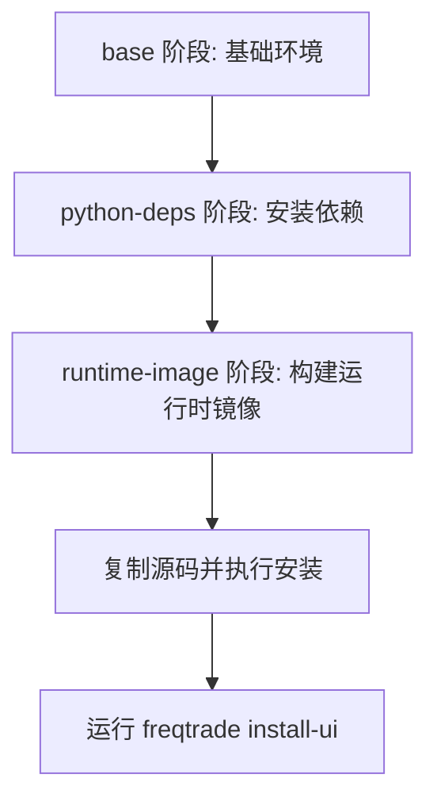
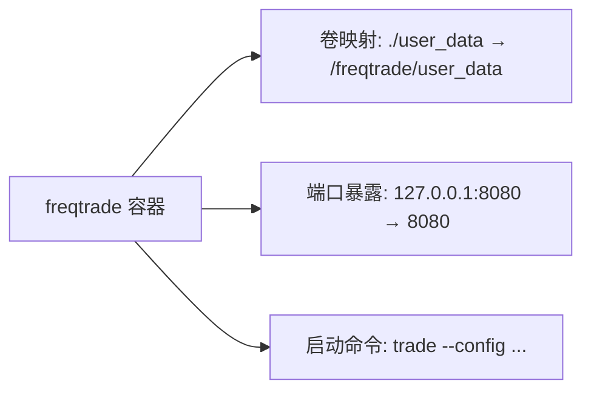
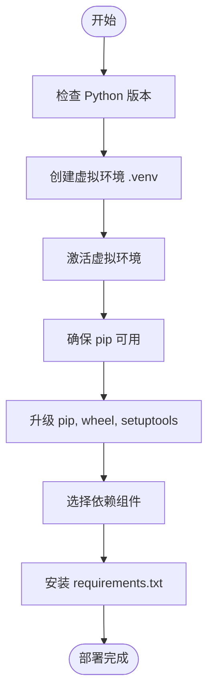
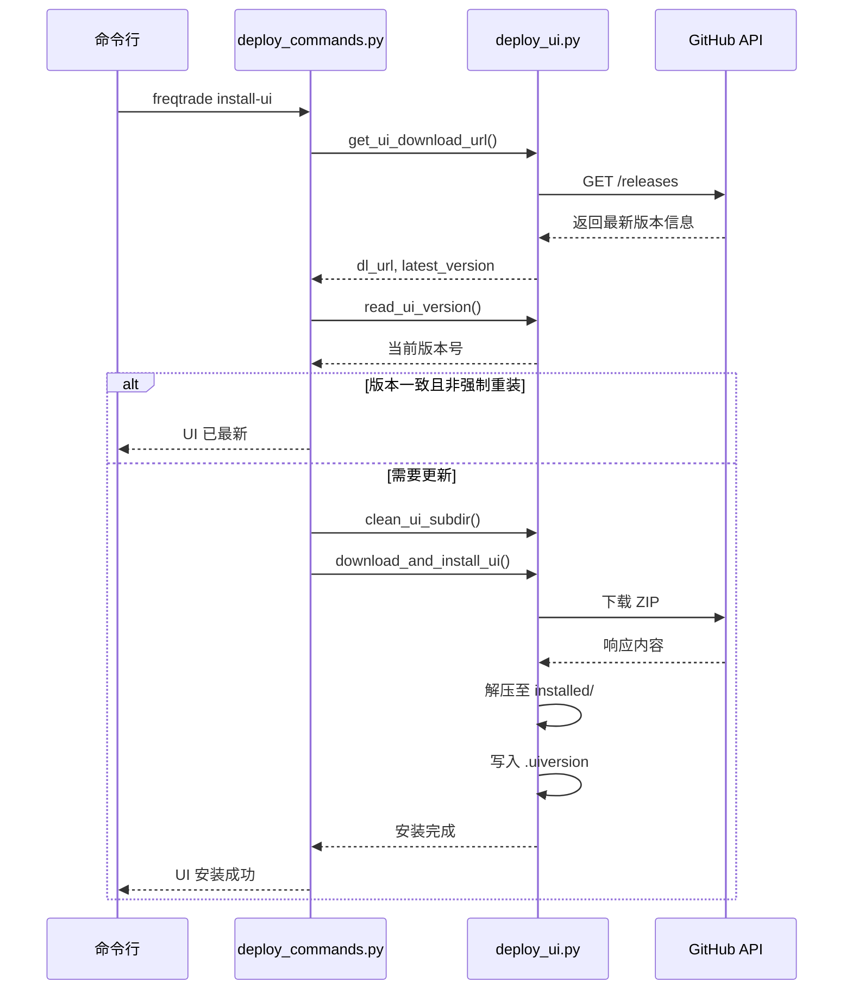

# 部署方式

<cite>
**本文档中引用的文件**  
- [Dockerfile](file://Dockerfile)
- [docker-compose.yml](file://docker-compose.yml)
- [deploy_commands.py](file://freqtrade/commands/deploy_commands.py)
- [deploy_ui.py](file://freqtrade/commands/deploy_ui.py)
- [web_ui.py](file://freqtrade/rpc/api_server/web_ui.py)
- [detect_environment.py](file://freqtrade/configuration/detect_environment.py)
- [setup.sh](file://setup.sh)
- [setup.ps1](file://setup.ps1)
</cite>

## 目录
1. [引言](#引言)
2. [项目结构](#项目结构)
3. [核心部署方式](#核心部署方式)
4. [Docker容器化部署详解](#docker容器化部署详解)
5. [直接Python环境部署](#直接python环境部署)
6. [Web UI前端自动化安装机制](#web-ui前端自动化安装机制)
7. [不同部署场景的配置建议](#不同部署场景的配置建议)
8. [常见问题排查与性能优化](#常见问题排查与性能优化)
9. [结论](#结论)

## 引言
Freqtrade 是一个开源的加密货币交易机器人，支持多种部署方式以适应不同的使用场景。本文档详细说明了 Freqtrade 的主要部署方式，包括 Docker 容器化部署和直接 Python 环境部署。深入解析了多阶段构建过程、服务编排配置以及 Web UI 的自动化安装机制，并提供针对开发、生产及 GPU 加速环境的配置建议。

## 项目结构
Freqtrade 项目的目录结构清晰，主要包含源码目录 `freqtrade/`、配置示例 `config_examples/`、用户数据目录 `user_data/`、测试脚本 `tests/` 以及部署相关文件如 `Dockerfile` 和 `docker-compose.yml`。此外，还提供了跨平台的安装脚本 `setup.sh` 和 `setup.ps1`，便于在不同操作系统上进行环境初始化。

**Section sources**
- [Dockerfile](file://Dockerfile#L1-L52)
- [docker-compose.yml](file://docker-compose.yml#L1-L35)

## 核心部署方式
Freqtrade 支持两种主流部署方式：基于 Docker 的容器化部署和基于本地 Python 环境的直接部署。容器化部署通过 `Dockerfile` 和 `docker-compose.yml` 实现，确保环境一致性；而直接部署则依赖于系统级 Python 解释器和虚拟环境管理工具，灵活性更高但需手动处理依赖关系。

**Section sources**
- [Dockerfile](file://Dockerfile#L1-L52)
- [setup.sh](file://setup.sh#L1-L226)
- [setup.ps1](file://setup.ps1#L1-L230)

## Docker容器化部署详解

### 多阶段构建过程分析
Freqtrade 的 `Dockerfile` 采用多阶段构建策略，分为三个阶段：`base`、`python-deps` 和 `runtime-image`。第一阶段 `base` 设置基础环境变量，安装系统级依赖并创建非特权用户 `ftuser`；第二阶段 `python-deps` 安装 Python 构建工具和依赖包；第三阶段 `runtime-image` 将前一阶段的依赖复制到运行时镜像中，最终完成应用安装。

**Diagram sources**
- [Dockerfile](file://Dockerfile#L1-L52)

### 基础镜像选择与用户权限配置
基础镜像选用 `python:3.13.8-slim-bookworm`，保证轻量化的同时提供完整的 Python 运行环境。通过 `useradd` 创建 UID 为 1000 的 `ftuser` 用户，并将其加入 `sudo` 组以允许有限的权限提升操作（仅限 `/bin/chown`），增强容器安全性。

**Section sources**
- [Dockerfile](file://Dockerfile#L8-L18)

### docker-compose.yml服务编排
`docker-compose.yml` 文件定义了 `freqtrade` 服务，使用官方镜像 `freqtradeorg/freqtrade:stable`，并配置了持久化卷映射 `./user_data:/freqtrade/user_data`，确保配置、策略和日志在容器重启后不丢失。同时，通过 `ports` 暴露 API 接口至主机的 `127.0.0.1:8080`，限制外部访问以提高安全性。

**Diagram sources**
- [docker-compose.yml](file://docker-compose.yml#L1-L35)

## 直接Python环境部署
直接部署方式适用于希望精细控制运行环境或无法使用 Docker 的场景。通过 `setup.sh`（Linux/macOS）或 `setup.ps1`（Windows）脚本自动检测 Python 版本、创建虚拟环境、安装依赖并拉取最新代码。用户可根据需求选择安装完整开发依赖、绘图模块、超参数优化（Hyperopt）或 FreqAI 模块。

**Section sources**
- [setup.sh](file://setup.sh#L1-L226)
- [setup.ps1](file://setup.ps1#L1-L230)

## Web UI前端自动化安装机制
`deploy_commands.py` 中的 `start_install_ui` 函数负责自动化安装 Web UI 前端。该函数调用 `get_ui_download_url` 获取 FreqUI 的最新发布版本，随后通过 `download_and_install_ui` 下载 ZIP 包并解压至 `rpc/api_server/ui/installed/` 目录。安装前会清理旧文件，并记录当前 UI 版本于 `.uiversion` 文件中，避免重复下载。

**Diagram sources**
- [deploy_commands.py](file://freqtrade/commands/deploy_commands.py#L108-L132)
- [deploy_ui.py](file://freqtrade/commands/deploy_ui.py#L1-L87)

## 不同部署场景的配置建议

### 开发环境
建议使用 `docker-compose.yml` 中注释的 `develop` 镜像或本地直接部署，便于调试和代码修改。启用日志输出至控制台，关闭生产级重启策略（`restart: "no"`），并挂载源码目录以便热重载。

### 生产环境
推荐使用稳定版镜像 `freqtradeorg/freqtrade:stable`，配置 `restart: unless-stopped` 保证服务高可用。数据库使用外部 PostgreSQL 或 MySQL 替代 SQLite，提升并发性能。关闭不必要的 UI 和 API 接口暴露，仅限内网访问。

### GPU加速环境（FreqAI）
对于使用 FreqAI 的用户，应启用 `docker-compose.yml` 中的 `deploy` 段落，配置 NVIDIA GPU 资源。使用 `freqtradeorg/freqtrade:develop` 或专用 GPU 镜像，确保安装 PyTorch GPU 版本依赖（`requirements-freqai-rl.txt`）。

**Section sources**
- [docker-compose.yml](file://docker-compose.yml#L4-L20)
- [setup.sh](file://setup.sh#L58-L92)

## 常见问题排查与性能优化

### 常见问题
- **容器无法启动**：检查 `user_data` 目录权限是否为 UID 1000，确认卷映射路径正确。
- **UI 无法访问**：验证 `installed/` 目录是否存在且包含 `index.html`，检查 `FT_APP_ENV=docker` 是否设置。
- **依赖安装失败**：在 ARM 架构设备上需单独安装 `cython`，避免 `hyperopt` 编译错误。

### 性能优化建议
- 使用 SSD 存储历史 K 线数据，减少 I/O 延迟。
- 在 `config.json` 中合理设置 `ticker_interval` 和 `max_open_trades`，避免交易所限流。
- 启用 `buffering_handler` 日志缓冲机制，降低频繁写日志对性能的影响。

**Section sources**
- [detect_environment.py](file://freqtrade/configuration/detect_environment.py#L3-L7)
- [web_ui.py](file://freqtrade/rpc/api_server/web_ui.py#L1-L55)

## 结论
Freqtrade 提供了灵活且可靠的部署方案，无论是通过 Docker 容器化部署还是直接 Python 环境部署，均能有效支持从开发到生产的全生命周期管理。其多阶段构建、服务编排和自动化 UI 安装机制显著降低了部署复杂度。结合不同场景的配置建议和问题排查指南，用户可快速搭建高效稳定的交易机器人系统。