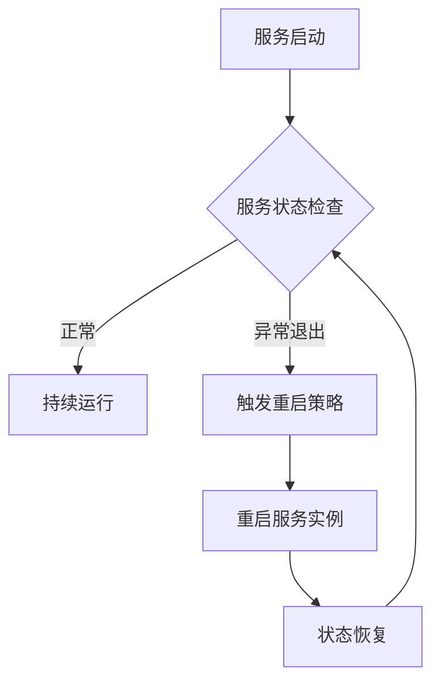
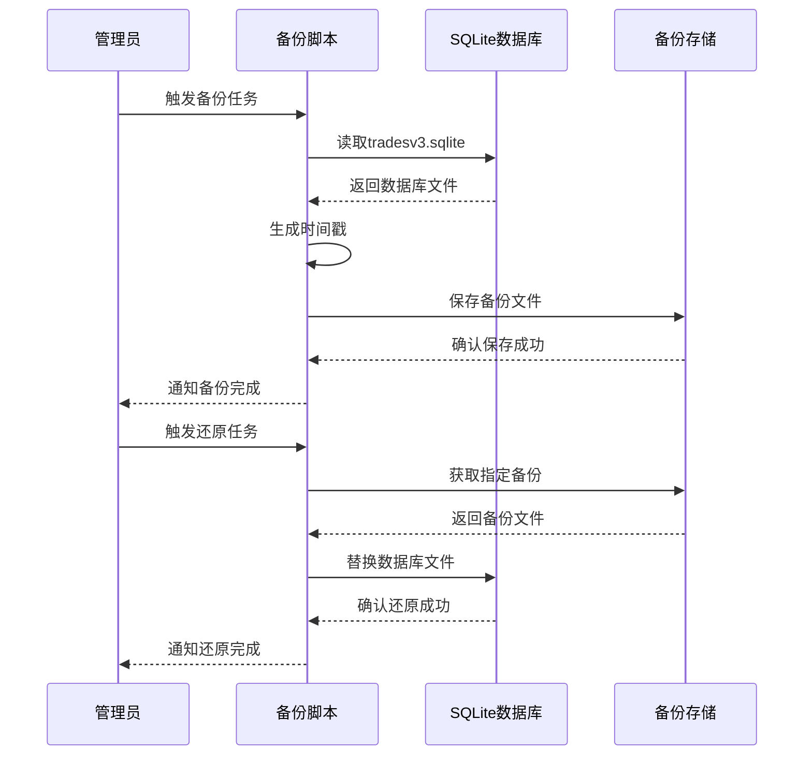
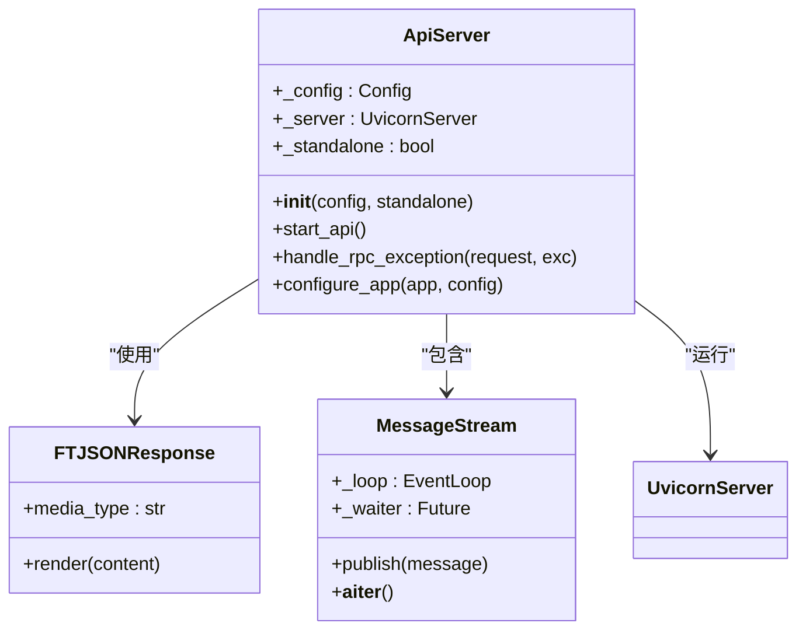
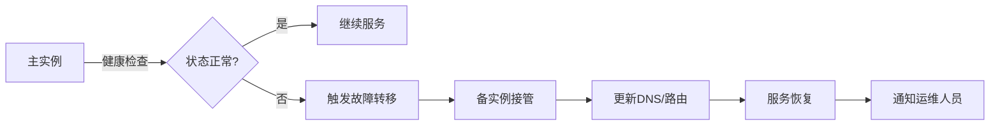
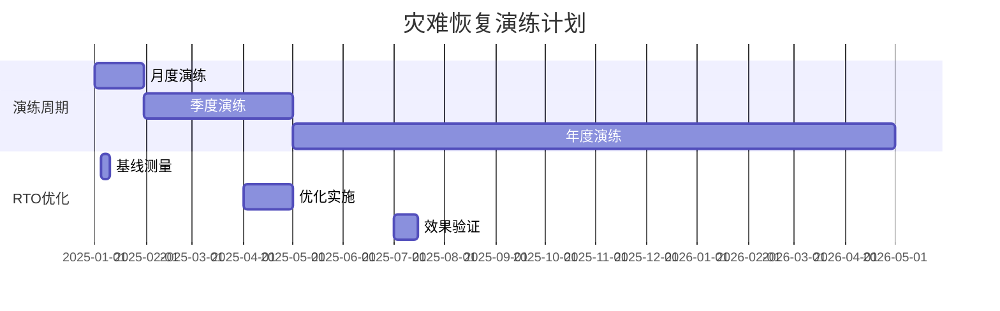

# 容灾恢复与故障转移

<cite>
**本文档引用的文件**   
- [docker-compose.yml](file://docker-compose.yml)
- [webserver.py](file://freqtrade/rpc/api_server/webserver.py)
- [deploy_commands.py](file://freqtrade/commands/deploy_commands.py)
</cite>

## 目录
1. [引言](#引言)
2. [基于Docker的服务自动重启机制](#基于docker的服务自动重启机制)
3. [数据持久化与快速恢复方案](#数据持久化与快速恢复方案)
4. [数据库备份与还原流程设计](#数据库备份与还原流程设计)
5. [故障检测与告警系统构建](#故障检测与告警系统构建)
6. [一键式故障转移操作实现](#一键式故障转移操作实现)
7. [定期演练方案与RTO优化](#定期演练方案与rto优化)
8. [结论](#结论)

## 引言
本文档旨在为Freqtrade系统制定全面的灾难恢复计划，基于docker-compose.yml的restart策略配置实现服务自动重启。通过分析系统架构，设计数据持久化、备份还原、故障检测与转移等关键机制，确保系统在发生故障时能够快速恢复并保持业务连续性。

## 基于Docker的服务自动重启机制



**Diagram sources**
- [docker-compose.yml](file://docker-compose.yml#L1-L37)

**Section sources**
- [docker-compose.yml](file://docker-compose.yml#L1-L37)

## 数据持久化与快速恢复方案

```mermaid
graph TB
subgraph "宿主机"
A[卷挂载目录]
A --> B[./user_data]
end
subgraph "容器内"
C[容器文件系统]
C --> D[/freqtrade/user_data]
end
B < --> |卷挂载| D
D --> E[策略文件]
D --> F[配置文件]
D --> G[日志文件]
D --> H[数据库文件]
```

**Diagram sources**
- [docker-compose.yml](file://docker-compose.yml#L1-L37)

**Section sources**
- [docker-compose.yml](file://docker-compose.yml#L1-L37)

## 数据库备份与还原流程设计



**Section sources**
- [docker-compose.yml](file://docker-compose.yml#L1-L37)

## 故障检测与告警系统构建



**Diagram sources**
- [webserver.py](file://freqtrade/rpc/api_server/webserver.py#L34-L243)

**Section sources**
- [webserver.py](file://freqtrade/rpc/api_server/webserver.py#L34-L243)

## 一键式故障转移操作实现



**Diagram sources**
- [deploy_commands.py](file://freqtrade/commands/deploy_commands.py#L17-L132)

**Section sources**
- [deploy_commands.py](file://freqtrade/commands/deploy_commands.py#L17-L132)

## 定期演练方案与RTO优化



**Section sources**
- [docker-compose.yml](file://docker-compose.yml#L1-L37)
- [webserver.py](file://freqtrade/rpc/api_server/webserver.py#L34-L243)
- [deploy_commands.py](file://freqtrade/commands/deploy_commands.py#L17-L132)

## 结论
本灾难恢复计划通过Docker的restart策略实现了服务的自动重启，利用卷挂载机制确保了数据的持久化和快速恢复。基于webserver.py的异常处理机制构建了完善的故障检测与告警系统，通过deploy_commands.py实现了一键式故障转移操作。建议定期进行灾难恢复演练，并持续优化恢复时间目标(RTO)，以确保系统在各种故障场景下都能快速恢复正常运行。