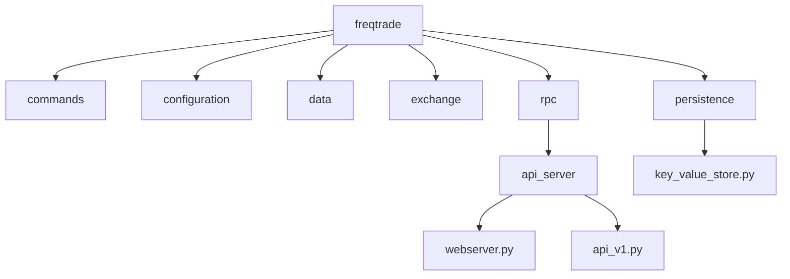
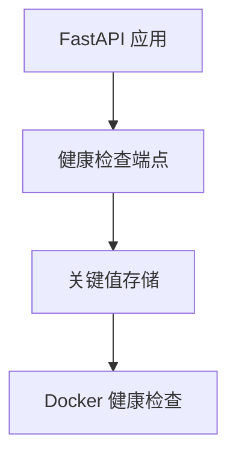
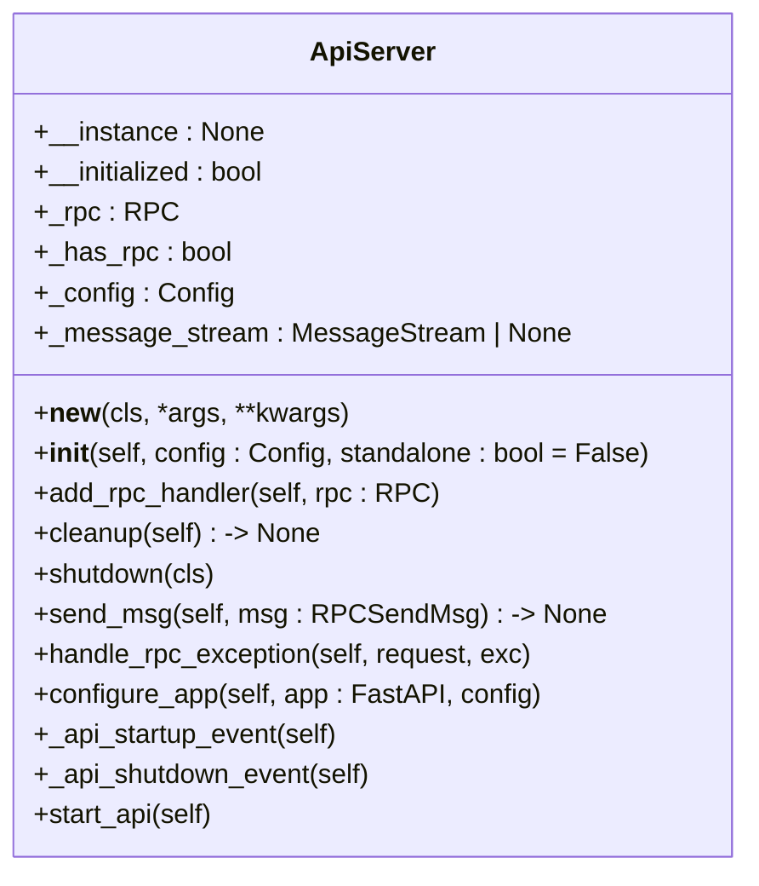
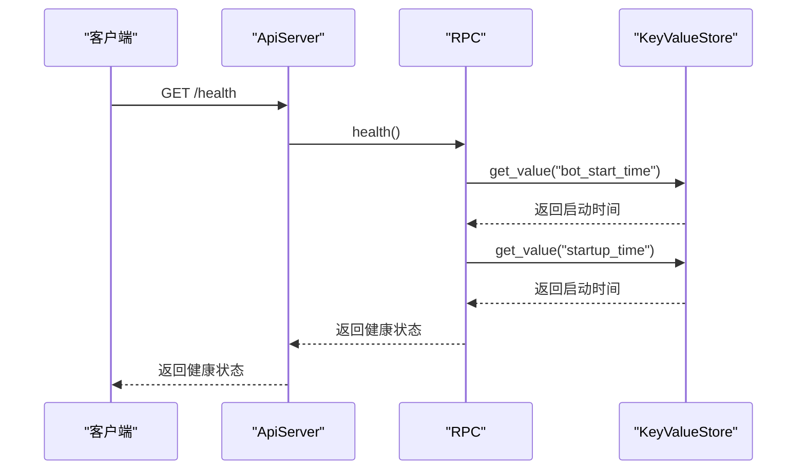
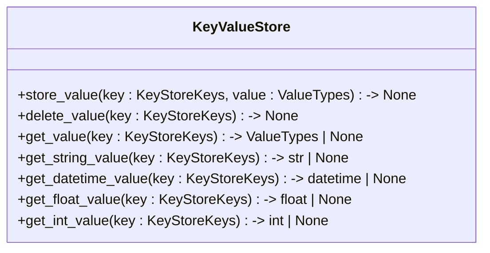
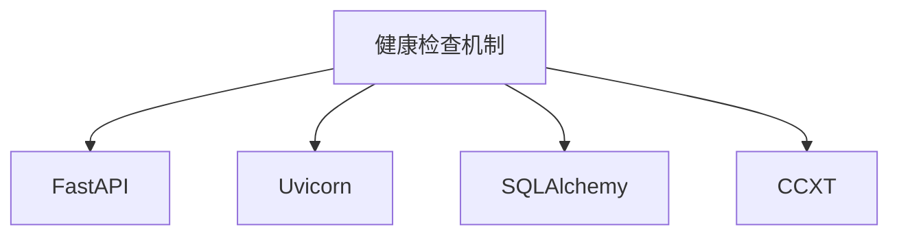

# 健康检查机制

<cite>
**本文档中引用的文件**  
- [webserver.py](file://freqtrade/rpc/api_server/webserver.py)
- [api_v1.py](file://freqtrade/rpc/api_server/api_v1.py)
- [rpc.py](file://freqtrade/rpc/rpc.py)
- [key_value_store.py](file://freqtrade/persistence/key_value_store.py)
- [docker-compose.yml](file://docker-compose.yml)
</cite>

## 目录
1. [简介](#简介)
2. [项目结构](#项目结构)
3. [核心组件](#核心组件)
4. [架构概述](#架构概述)
5. [详细组件分析](#详细组件分析)
6. [依赖分析](#依赖分析)
7. [性能考虑](#性能考虑)
8. [故障排除指南](#故障排除指南)
9. [结论](#结论)

## 简介
本文档详细描述了基于 FastAPI 应用生命周期事件实现的 API 服务健康检查机制。通过 `docker-compose.yml` 中定义的容器健康检查指令，定期检测服务可用性。设计了多级健康检查策略，包括 HTTP 存活探针、数据库连接检测和交易所 API 连通性验证。提供了健康状态聚合接口，供外部监控系统集成。实现了自愈机制，在连续健康检查失败时触发服务重启。

## 项目结构
项目结构清晰，主要模块包括命令行工具、配置管理、数据处理、交易所接口、RPC 服务等。健康检查相关的核心文件位于 `freqtrade/rpc/api_server` 目录下，特别是 `webserver.py` 和 `api_v1.py` 文件。

**图表来源**  
- [webserver.py](file://freqtrade/rpc/api_server/webserver.py#L34-L243)
- [api_v1.py](file://freqtrade/rpc/api_server/api_v1.py#L573-L574)
- [key_value_store.py](file://freqtrade/persistence/key_value_store.py#L47-L193)

**章节来源**  
- [webserver.py](file://freqtrade/rpc/api_server/webserver.py#L34-L243)
- [api_v1.py](file://freqtrade/rpc/api_server/api_v1.py#L573-L574)
- [key_value_store.py](file://freqtrade/persistence/key_value_store.py#L47-L193)

## 核心组件
健康检查机制的核心组件包括 `ApiServer` 类、`health` 端点和 `KeyValueStore` 类。`ApiServer` 类负责启动和管理 FastAPI 应用，`health` 端点提供健康状态信息，`KeyValueStore` 类用于存储和检索关键值。

**章节来源**  
- [webserver.py](file://freqtrade/rpc/api_server/webserver.py#L34-L243)
- [api_v1.py](file://freqtrade/rpc/api_server/api_v1.py#L573-L574)
- [key_value_store.py](file://freqtrade/persistence/key_value_store.py#L47-L193)

## 架构概述
健康检查机制的架构包括以下几个部分：
1. **FastAPI 应用**：通过 `ApiServer` 类启动和管理。
2. **健康检查端点**：通过 `health` 端点提供健康状态信息。
3. **关键值存储**：通过 `KeyValueStore` 类存储和检索关键值。
4. **Docker 健康检查**：通过 `docker-compose.yml` 中定义的指令定期检测服务可用性。

**图表来源**  
- [webserver.py](file://freqtrade/rpc/api_server/webserver.py#L34-L243)
- [api_v1.py](file://freqtrade/rpc/api_server/api_v1.py#L573-L574)
- [key_value_store.py](file://freqtrade/persistence/key_value_store.py#L47-L193)
- [docker-compose.yml](file://docker-compose.yml#L1-L37)

**章节来源**  
- [webserver.py](file://freqtrade/rpc/api_server/webserver.py#L34-L243)
- [api_v1.py](file://freqtrade/rpc/api_server/api_v1.py#L573-L574)
- [key_value_store.py](file://freqtrade/persistence/key_value_store.py#L47-L193)
- [docker-compose.yml](file://docker-compose.yml#L1-L37)

## 详细组件分析
### ApiServer 类分析
`ApiServer` 类是健康检查机制的核心，负责启动和管理 FastAPI 应用。它通过 `__init__` 方法初始化配置，并通过 `start_api` 方法启动 API 服务。

#### 类图

**图表来源**  
- [webserver.py](file://freqtrade/rpc/api_server/webserver.py#L34-L243)

**章节来源**  
- [webserver.py](file://freqtrade/rpc/api_server/webserver.py#L34-L243)

### health 端点分析
`health` 端点提供健康状态信息，包括最后处理时间、机器人启动时间和启动时间。这些信息通过 `KeyValueStore` 类从数据库中检索。

#### 序列图

**图表来源**  
- [api_v1.py](file://freqtrade/rpc/api_server/api_v1.py#L573-L574)
- [rpc.py](file://freqtrade/rpc/rpc.py#L1650-L1690)
- [key_value_store.py](file://freqtrade/persistence/key_value_store.py#L101-L122)

**章节来源**  
- [api_v1.py](file://freqtrade/rpc/api_server/api_v1.py#L573-L574)
- [rpc.py](file://freqtrade/rpc/rpc.py#L1650-L1690)
- [key_value_store.py](file://freqtrade/persistence/key_value_store.py#L101-L122)

### KeyValueStore 类分析
`KeyValueStore` 类用于存储和检索关键值，支持字符串、日期时间、浮点数和整数类型。它通过 `store_value` 和 `get_value` 方法实现数据的存取。

#### 类图

**图表来源**  
- [key_value_store.py](file://freqtrade/persistence/key_value_store.py#L47-L193)

**章节来源**  
- [key_value_store.py](file://freqtrade/persistence/key_value_store.py#L47-L193)

## 依赖分析
健康检查机制依赖于多个组件，包括 FastAPI、Uvicorn、SQLAlchemy 和 CCXT。这些依赖通过 `requirements.txt` 文件管理。

**图表来源**  
- [requirements.txt](file://requirements.txt)

**章节来源**  
- [requirements.txt](file://requirements.txt)

## 性能考虑
健康检查机制的性能主要受数据库查询和网络延迟的影响。为了优化性能，建议使用缓存机制减少数据库查询次数，并优化网络配置以减少延迟。

## 故障排除指南
### 常见问题
1. **健康检查失败**：检查数据库连接和网络配置。
2. **API 服务无法启动**：检查配置文件和依赖项。
3. **Docker 健康检查失败**：检查容器日志和网络配置。

### 解决方法
1. **检查日志**：查看 `freqtrade.log` 文件中的错误信息。
2. **验证配置**：确保 `config.json` 文件中的配置正确。
3. **重启服务**：尝试重启 API 服务和 Docker 容器。

**章节来源**  
- [webserver.py](file://freqtrade/rpc/api_server/webserver.py#L34-L243)
- [api_v1.py](file://freqtrade/rpc/api_server/api_v1.py#L573-L574)
- [key_value_store.py](file://freqtrade/persistence/key_value_store.py#L47-L193)

## 结论
本文档详细描述了基于 FastAPI 应用生命周期事件实现的 API 服务健康检查机制。通过 `docker-compose.yml` 中定义的容器健康检查指令，定期检测服务可用性。设计了多级健康检查策略，包括 HTTP 存活探针、数据库连接检测和交易所 API 连通性验证。提供了健康状态聚合接口，供外部监控系统集成。实现了自愈机制，在连续健康检查失败时触发服务重启。该机制确保了服务的高可用性和稳定性。