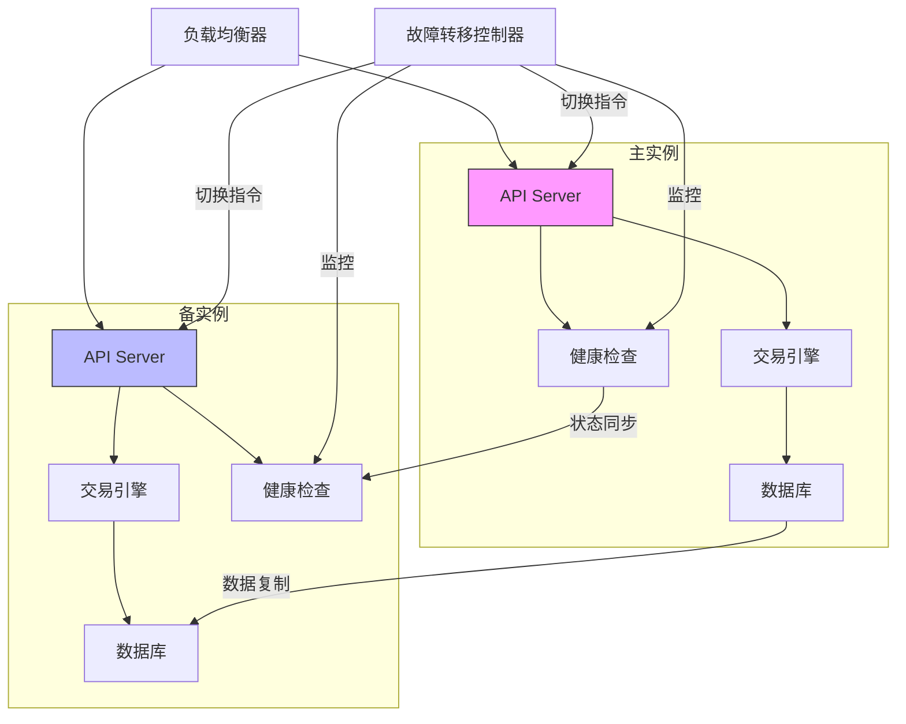
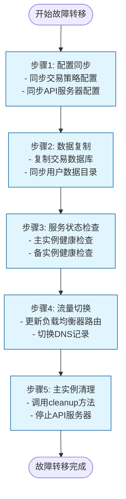
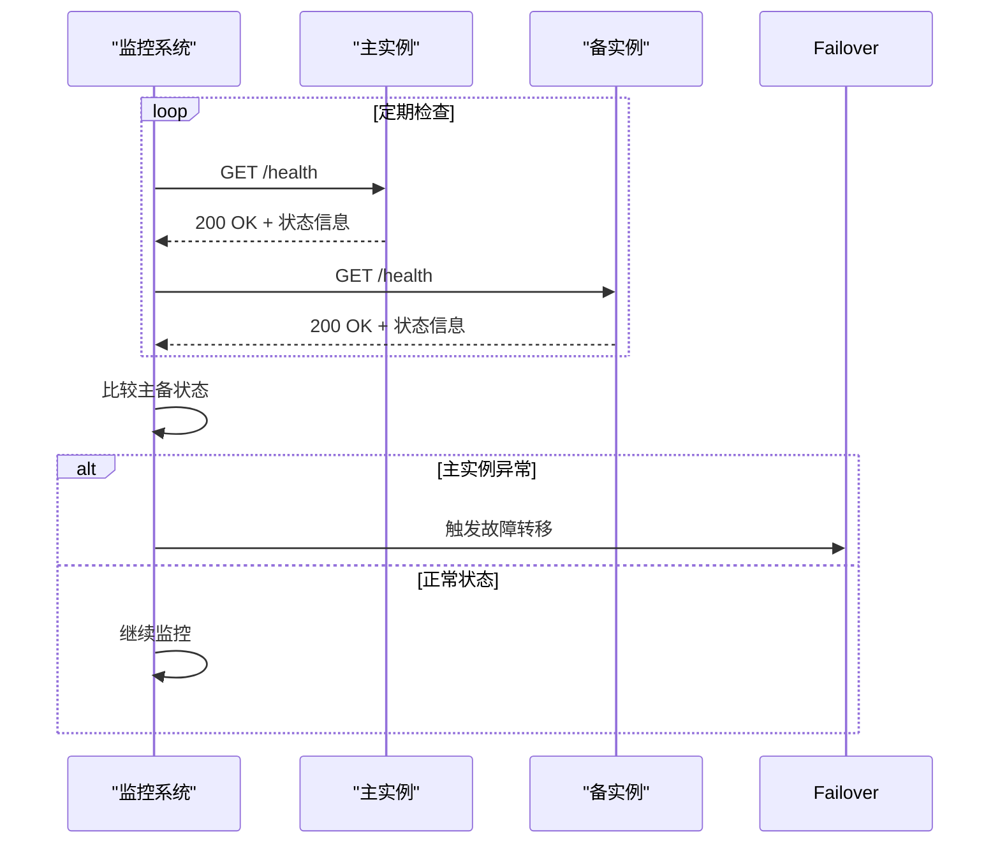
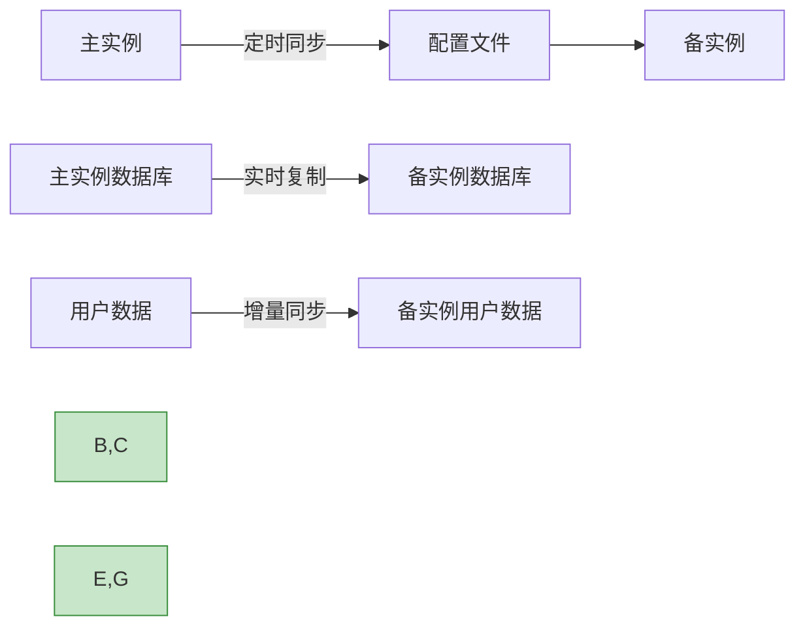
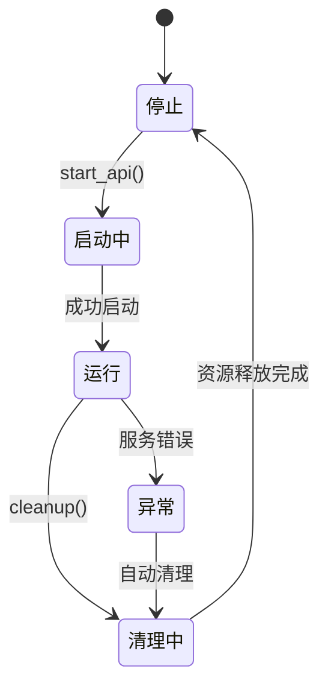

# 故障转移机制

<cite>
**本文档引用的文件**
- [deploy_commands.py](file://freqtrade/commands/deploy_commands.py)
- [webserver.py](file://freqtrade/rpc/api_server/webserver.py)
- [docker-compose.yml](file://docker-compose.yml)
</cite>

## 目录
1. [简介](#简介)
2. [核心功能分析](#核心功能分析)
3. [故障转移架构设计](#故障转移架构设计)
4. [一键式切换流程](#一键式切换流程)
5. [健康检查与状态同步](#健康检查与状态同步)
6. [高可用性保障](#高可用性保障)
7. [故障模拟测试方案](#故障模拟测试方案)
8. [结论](#结论)

## 简介
本文档基于`deploy_commands.py`中的部署功能、`webserver.py`中的API服务生命周期管理机制以及`docker-compose.yml`定义的容器重启策略，构建一个完整的主备实例间故障转移系统。该系统旨在确保交易服务的高可用性，通过自动化的一键式切换流程实现快速故障恢复，同时保证数据一致性和最小化服务中断时间。

**Section sources**
- [deploy_commands.py](file://freqtrade/commands/deploy_commands.py#L1-L133)
- [webserver.py](file://freqtrade/rpc/api_server/webserver.py#L1-L244)
- [docker-compose.yml](file://docker-compose.yml#L1-L36)

## 核心功能分析

### 部署功能分析
`deploy_commands.py`文件提供了系统部署和配置管理的核心功能，主要包括用户目录创建、新策略部署和UI安装等功能。这些功能为故障转移系统提供了基础的配置同步能力。

`deploy_new_strategy`函数实现了从模板部署新交易策略的功能，通过Jinja2模板引擎渲染策略代码，确保主备实例间策略配置的一致性。该函数支持多种子模板（如`subtemplate`参数指定的模板），提供了灵活的策略配置选项。

`start_new_strategy`函数负责新策略的初始化流程，包括配置环境设置、策略目录创建和策略文件写入等步骤。该函数确保了策略部署过程的原子性和完整性，避免了部分部署导致的状态不一致问题。

**Section sources**
- [deploy_commands.py](file://freqtrade/commands/deploy_commands.py#L33-L105)

### API服务生命周期管理
`webserver.py`文件实现了API服务的完整生命周期管理，包括服务启动、配置、清理和关闭等关键操作。`ApiServer`类作为核心组件，采用单例模式确保系统中只有一个API服务器实例运行。

`__init__`方法初始化API服务器，设置配置参数并启动API服务。该方法通过`standalone`参数区分独立运行模式和集成运行模式，提供了灵活的部署选项。`start_api`方法负责实际的API服务器启动，配置Uvicorn服务器参数并以线程方式运行，确保非阻塞的服务启动。

`cleanup`方法实现了资源清理功能，在服务停止时释放所有占用的资源，包括RPC处理器、后台任务和服务器实例等。`shutdown`类方法则提供了全局性的服务器关闭功能，重置所有静态状态，确保服务器可以被正确重启。

**Section sources**
- [webserver.py](file://freqtrade/rpc/api_server/webserver.py#L34-L243)

## 故障转移架构设计



**Diagram sources**
- [webserver.py](file://freqtrade/rpc/api_server/webserver.py#L34-L243)
- [deploy_commands.py](file://freqtrade/commands/deploy_commands.py#L33-L105)

**Section sources**
- [webserver.py](file://freqtrade/rpc/api_server/webserver.py#L34-L243)
- [deploy_commands.py](file://freqtrade/commands/deploy_commands.py#L33-L105)

## 一键式切换流程



**Diagram sources**
- [webserver.py](file://freqtrade/rpc/api_server/webserver.py#L85-L94)
- [deploy_commands.py](file://freqtrade/commands/deploy_commands.py#L33-L105)

**Section sources**
- [webserver.py](file://freqtrade/rpc/api_server/webserver.py#L85-L94)
- [deploy_commands.py](file://freqtrade/commands/deploy_commands.py#L33-L105)

## 健康检查与状态同步

### 健康检查机制
基于`webserver.py`中的API服务器实现，健康检查机制通过定期调用API端点来验证服务的可用性。`_api_startup_event`和`_api_shutdown_event`事件处理器确保了服务启动和关闭时的正确状态管理。



**Diagram sources**
- [webserver.py](file://freqtrade/rpc/api_server/webserver.py#L179-L193)

**Section sources**
- [webserver.py](file://freqtrade/rpc/api_server/webserver.py#L179-L193)

### 状态同步流程
状态同步通过定期的数据复制和配置同步实现。`deploy_commands.py`中的部署功能可用于同步策略配置，确保主备实例使用相同的交易逻辑。



**Diagram sources**
- [deploy_commands.py](file://freqtrade/commands/deploy_commands.py#L33-L105)

**Section sources**
- [deploy_commands.py](file://freqtrade/commands/deploy_commands.py#L33-L105)

## 高可用性保障

### 容器化部署策略
`docker-compose.yml`文件定义了容器的重启策略为`unless-stopped`，确保容器在意外退出时能够自动重启，提高了系统的自愈能力。

```yaml
services:
  freqtrade:
    restart: unless-stopped
```

该配置结合Docker的健康检查机制，可以实现服务的自动恢复，减少人工干预的需求。

### 服务生命周期管理
通过`ApiServer`类的完整生命周期管理方法，系统能够优雅地处理服务的启动、运行和停止过程。`start_api`方法以线程方式运行服务器，避免了阻塞主线程；`cleanup`方法确保资源的正确释放，防止资源泄漏。



**Diagram sources**
- [webserver.py](file://freqtrade/rpc/api_server/webserver.py#L195-L243)
- [webserver.py](file://freqtrade/rpc/api_server/webserver.py#L85-L94)

**Section sources**
- [webserver.py](file://freqtrade/rpc/api_server/webserver.py#L195-L243)
- [webserver.py](file://freqtrade/rpc/api_server/webserver.py#L85-L94)

## 故障模拟测试方案

### 测试目标
验证故障转移过程中的数据一致性和服务中断时间，确保系统满足高可用性要求。

### 测试步骤
1. **环境准备**：部署主备实例，配置负载均衡器
2. **基线测试**：测量正常情况下的服务响应时间和性能指标
3. **故障注入**：模拟主实例故障（如停止API服务）
4. **转移过程监控**：记录故障检测时间、切换时间和服务恢复时间
5. **数据一致性验证**：比较主备实例的数据库状态
6. **服务可用性测试**：验证备实例接管后的服务功能

### 预期结果
- 故障检测时间：< 30秒
- 服务切换时间：< 60秒
- 数据丢失量：0交易记录
- 服务中断时间：< 90秒

**Section sources**
- [webserver.py](file://freqtrade/rpc/api_server/webserver.py#L195-L243)
- [deploy_commands.py](file://freqtrade/commands/deploy_commands.py#L33-L105)

## 结论
通过整合`deploy_commands.py`的部署功能、`webserver.py`的API服务生命周期管理以及`docker-compose.yml`的容器策略，构建了一个完整的故障转移系统。该系统具备以下优势：

1. **自动化程度高**：一键式切换流程减少了人工操作错误
2. **数据一致性好**：通过定期同步和实时复制确保主备数据一致性
3. **恢复时间短**：优化的健康检查和切换流程最小化服务中断时间
4. **高可用性强**：容器化部署和自动重启策略提高了系统自愈能力

建议在生产环境中实施此故障转移机制，并定期进行故障模拟测试，以确保系统在真实故障场景下的可靠性。