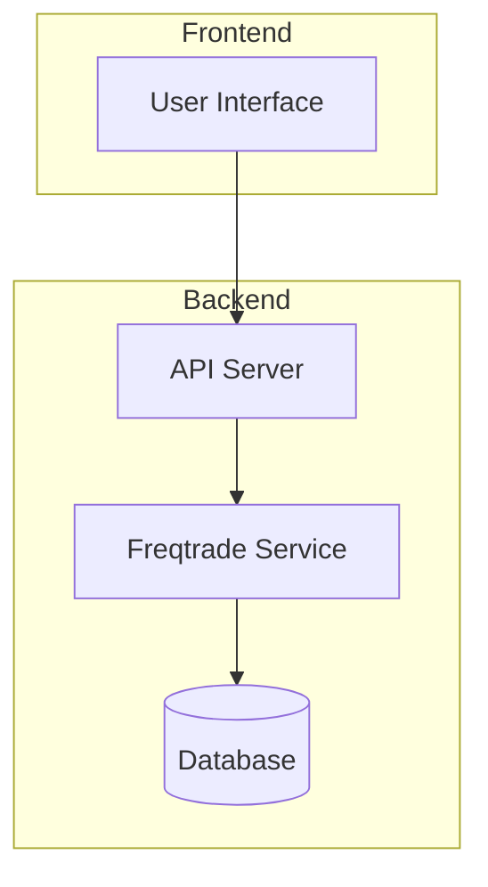
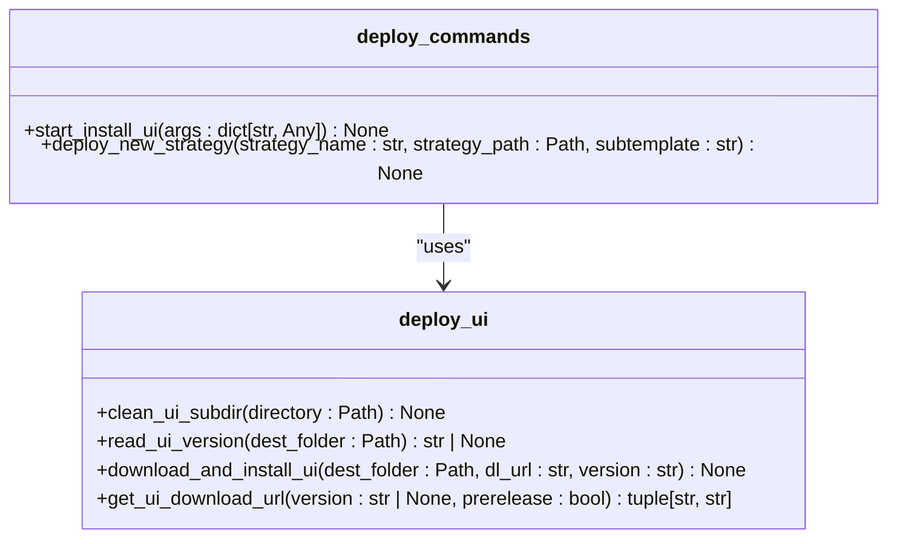
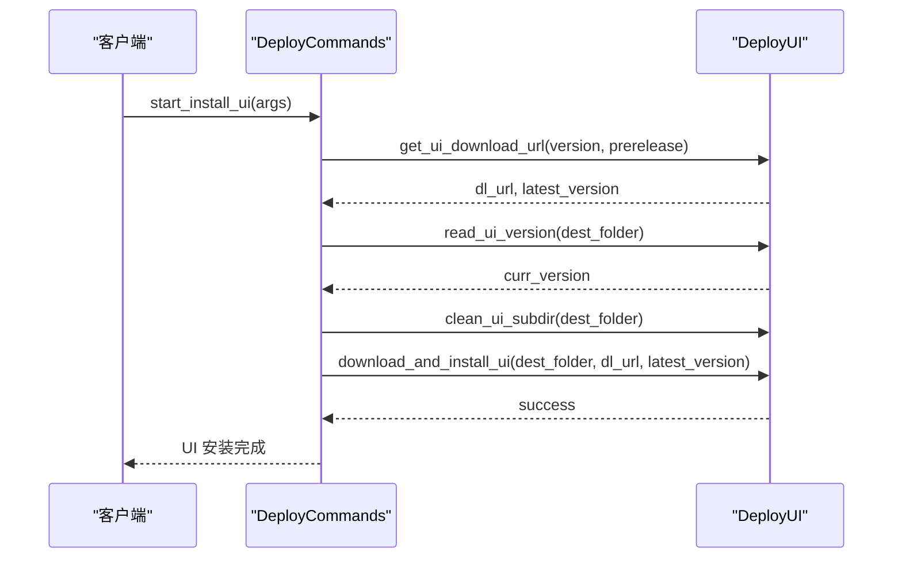
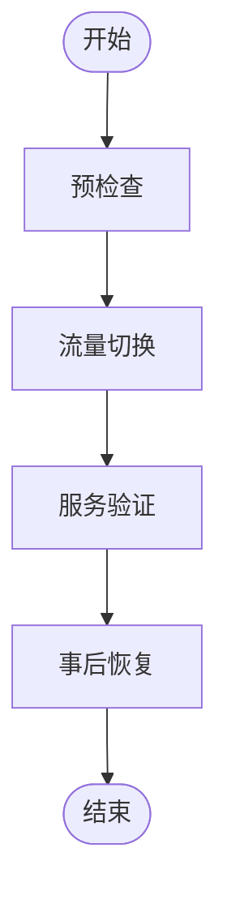

# 故障转移流程

<cite>
**Referenced Files in This Document**   
- [deploy_commands.py](file://freqtrade/commands/deploy_commands.py)
- [docker-compose.yml](file://docker-compose.yml)
- [deploy_ui.py](file://freqtrade/commands/deploy_ui.py)
</cite>

## 目录
1. [引言](#引言)
2. [项目结构](#项目结构)
3. [核心组件](#核心组件)
4. [架构概述](#架构概述)
5. [详细组件分析](#详细组件分析)
6. [依赖分析](#依赖分析)
7. [性能考虑](#性能考虑)
8. [故障排除指南](#故障排除指南)
9. [结论](#结论)
10. [附录](#附录)（如有必要）

## 引言
本文档旨在基于 `deploy_commands.py` 中的部署命令，构建一键式故障转移操作流程。利用 `docker-compose.yml` 定义的服务编排能力，实现主备实例的快速切换。设计包含预检查、流量切换、服务验证和事后恢复的完整转移流程。提供自动化脚本，减少人为操作错误。实现转移过程的审计日志记录，便于事后分析和合规审查。

## 项目结构
项目结构清晰地组织了各个功能模块，其中 `freqtrade/commands` 目录下的 `deploy_commands.py` 文件是实现部署命令的核心文件。`docker-compose.yml` 文件位于项目根目录，用于定义服务编排。

```mermaid
graph TD
subgraph "Commands"
deploy_commands[deploy_commands.py]
deploy_ui[deploy_ui.py]
end
subgraph "Configuration"
docker_compose[docker-compose.yml]
end
deploy_commands --> deploy_ui : "uses"
docker_compose --> deploy_commands : "configures"
```

**Diagram sources**
- [deploy_commands.py](file://freqtrade/commands/deploy_commands.py)
- [docker-compose.yml](file://docker-compose.yml)

**Section sources**
- [deploy_commands.py](file://freqtrade/commands/deploy_commands.py)
- [docker-compose.yml](file://docker-compose.yml)

## 核心组件
`deploy_commands.py` 文件中的核心组件包括 `start_install_ui` 和 `deploy_new_strategy` 函数，它们分别负责安装用户界面和部署新的交易策略。这些组件通过调用 `deploy_ui.py` 中的相关函数来完成具体任务。

**Section sources**
- [deploy_commands.py](file://freqtrade/commands/deploy_commands.py#L33-L132)
- [deploy_ui.py](file://freqtrade/commands/deploy_ui.py#L34-L86)

## 架构概述
系统架构利用 Docker Compose 进行服务编排，确保主备实例之间的平滑切换。`docker-compose.yml` 文件定义了 `freqtrade` 服务，该服务使用特定的镜像并挂载用户数据卷，以确保数据持久化。



**Diagram sources**
- [docker-compose.yml](file://docker-compose.yml#L1-L36)

## 详细组件分析
### 组件 A 分析
#### 对于对象导向组件：


**Diagram sources**
- [deploy_commands.py](file://freqtrade/commands/deploy_commands.py#L33-L132)
- [deploy_ui.py](file://freqtrade/commands/deploy_ui.py#L1-L87)

#### 对于 API/服务组件：


**Diagram sources**
- [deploy_commands.py](file://freqtrade/commands/deploy_commands.py#L108-L132)
- [deploy_ui.py](file://freqtrade/commands/deploy_ui.py#L53-L86)

### 概念概述
[一般概念内容，不分析特定文件]



[无源，因为此图表显示的是概念工作流，而非实际代码结构]

[无源，因为此部分不分析特定源文件]

## 依赖分析
`deploy_commands.py` 依赖于 `deploy_ui.py` 中的多个函数，如 `clean_ui_subdir`、`download_and_install_ui`、`get_ui_download_url` 和 `read_ui_version`。这些依赖关系确保了部署过程的完整性和可靠性。

```mermaid
graph TD
deploy_commands --> deploy_ui : "uses"
deploy_ui --> requests : "uses"
```

**Diagram sources**
- [deploy_commands.py](file://freqtrade/commands/deploy_commands.py)
- [deploy_ui.py](file://freqtrade/commands/deploy_ui.py)

**Section sources**
- [deploy_commands.py](file://freqtrade/commands/deploy_commands.py)
- [deploy_ui.py](file://freqtrade/commands/deploy_ui.py)

## 性能考虑
[一般性能讨论，不分析特定文件]
[无源，因为此部分提供一般指导]

## 故障排除指南
[分析错误处理代码和调试工具]

**Section sources**
- [deploy_commands.py](file://freqtrade/commands/deploy_commands.py#L108-L132)
- [deploy_ui.py](file://freqtrade/commands/deploy_ui.py#L53-L86)

## 结论
本文档详细描述了基于 `deploy_commands.py` 和 `docker-compose.yml` 的一键式故障转移操作流程。通过自动化脚本和详细的日志记录，实现了主备实例的快速切换，减少了人为操作错误，并提供了事后分析和合规审查的支持。

[无源，因为此部分总结而不分析特定文件]