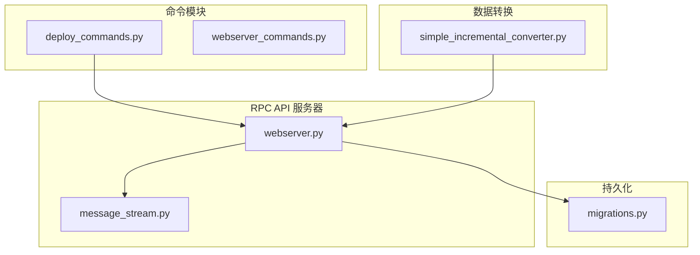
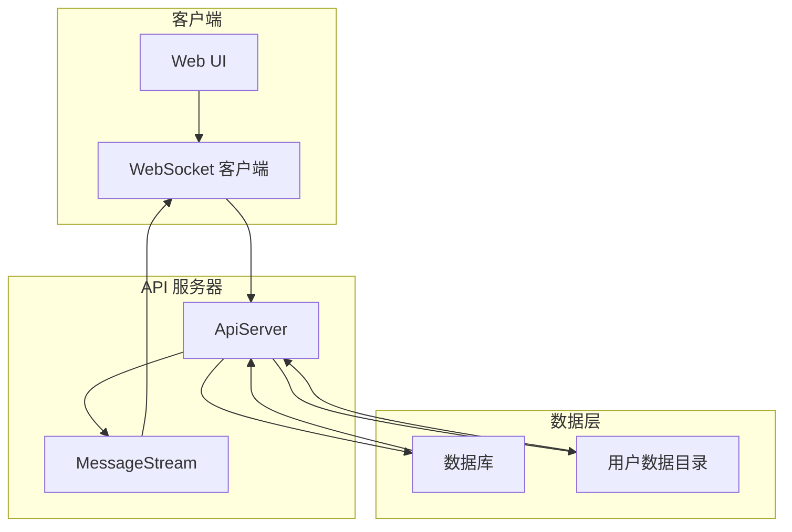
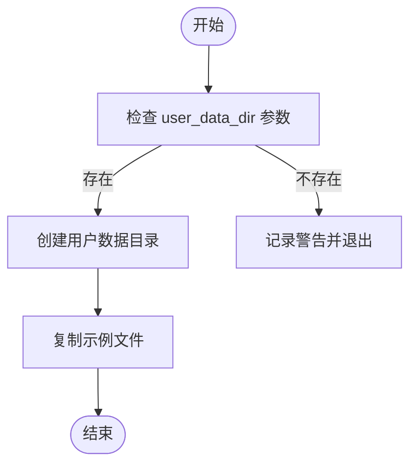
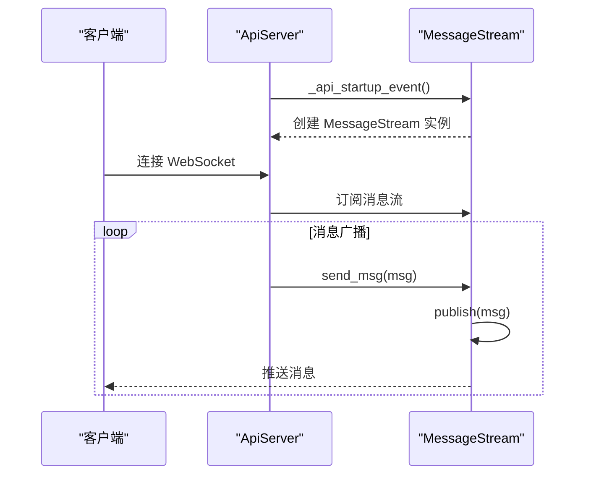
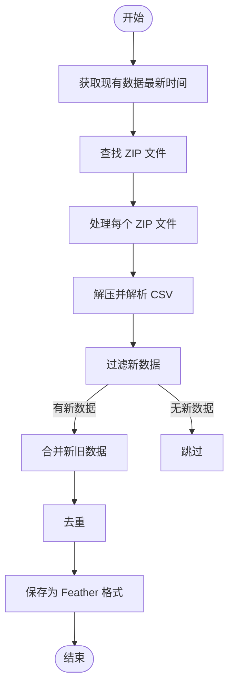
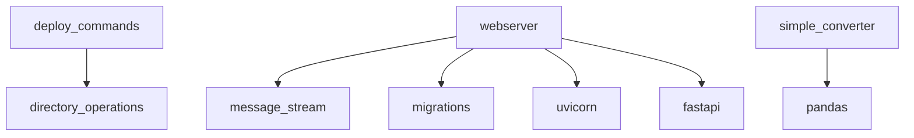

# 状态同步机制

<cite>
**本文档中引用的文件**  
- [deploy_commands.py](file://freqtrade/commands/deploy_commands.py)
- [webserver.py](file://freqtrade/rpc/api_server/webserver.py)
- [message_stream.py](file://freqtrade/rpc/api_server/ws/message_stream.py)
- [migrations.py](file://freqtrade/persistence/migrations.py)
- [simple_incremental_converter.py](file://yccai/binance_data_downloader/转化成frequent/simple_incremental_converter.py)
</cite>

## 目录
1. [简介](#简介)
2. [项目结构](#项目结构)
3. [核心组件](#核心组件)
4. [架构概述](#架构概述)
5. [详细组件分析](#详细组件分析)
6. [依赖分析](#依赖分析)
7. [性能考虑](#性能考虑)
8. [故障排除指南](#故障排除指南)
9. [结论](#结论)

## 简介
本文档详细描述了基于 `deploy_commands.py` 的用户目录创建功能和 `webserver.py` 中的 `MessageStream` 组件实现的状态同步机制。该机制支持主备实例间的配置文件同步、通过 WebSocket 实时广播交易状态和订单信息、设计增量同步算法以减少故障转移时的数据传输量、实现持久化状态快照确保关键数据一致性，并提供手动同步工具用于异常情况下的数据修复。

## 项目结构
系统采用模块化设计，主要功能分布在 `freqtrade/commands` 和 `freqtrade/rpc/api_server` 模块中。用户数据管理由 `deploy_commands.py` 处理，WebSocket 通信由 `webserver.py` 和 `message_stream.py` 实现，数据库迁移和状态持久化由 `migrations.py` 支持。增量数据转换功能在 `yccai` 子项目中实现。

**图示来源**
- [deploy_commands.py](file://freqtrade/commands/deploy_commands.py#L17-L30)
- [webserver.py](file://freqtrade/rpc/api_server/webserver.py#L34-L243)
- [message_stream.py](file://freqtrade/rpc/api_server/ws/message_stream.py#L4-L31)
- [migrations.py](file://freqtrade/persistence/migrations.py#L0-L410)
- [simple_incremental_converter.py](file://yccai/binance_data_downloader/转化成frequent/simple_incremental_converter.py#L0-L341)

**章节来源**
- [deploy_commands.py](file://freqtrade/commands/deploy_commands.py#L1-L133)
- [webserver.py](file://freqtrade/rpc/api_server/webserver.py#L1-L244)
- [message_stream.py](file://freqtrade/rpc/api_server/ws/message_stream.py#L1-L32)

## 核心组件
核心功能由用户目录管理、WebSocket 状态广播、增量同步算法和持久化快照机制组成。`deploy_commands.py` 提供用户目录创建和配置文件部署功能，`webserver.py` 中的 `ApiServer` 类管理 WebSocket 连接，`MessageStream` 类实现消息发布订阅模式，`migrations.py` 提供数据库迁移和状态恢复功能。

**章节来源**
- [deploy_commands.py](file://freqtrade/commands/deploy_commands.py#L17-L30)
- [webserver.py](file://freqtrade/rpc/api_server/webserver.py#L34-L243)
- [message_stream.py](file://freqtrade/rpc/api_server/ws/message_stream.py#L4-L31)
- [migrations.py](file://freqtrade/persistence/migrations.py#L36-L70)

## 架构概述
系统采用分层架构，前端通过 WebSocket 连接到 API 服务器，服务器通过 `MessageStream` 组件广播状态更新。配置同步通过用户目录创建和文件复制实现，数据同步采用增量算法减少传输量，关键状态通过数据库快照持久化。

**图示来源**
- [webserver.py](file://freqtrade/rpc/api_server/webserver.py#L34-L243)
- [message_stream.py](file://freqtrade/rpc/api_server/ws/message_stream.py#L4-L31)
- [deploy_commands.py](file://freqtrade/commands/deploy_commands.py#L17-L30)
- [migrations.py](file://freqtrade/persistence/migrations.py#L36-L70)

## 详细组件分析

### 用户目录管理分析
`deploy_commands.py` 中的 `start_create_userdir` 函数负责创建用户数据目录，为配置文件同步提供基础支持。

**图示来源**
- [deploy_commands.py](file://freqtrade/commands/deploy_commands.py#L17-L30)

**章节来源**
- [deploy_commands.py](file://freqtrade/commands/deploy_commands.py#L17-L30)

### WebSocket 状态广播分析
`webserver.py` 中的 `ApiServer` 类通过 `MessageStream` 组件实现 WebSocket 状态广播。

**图示来源**
- [webserver.py](file://freqtrade/rpc/api_server/webserver.py#L34-L243)
- [message_stream.py](file://freqtrade/rpc/api_server/ws/message_stream.py#L4-L31)

**章节来源**
- [webserver.py](file://freqtrade/rpc/api_server/webserver.py#L34-L243)
- [message_stream.py](file://freqtrade/rpc/api_server/ws/message_stream.py#L4-L31)

### 增量同步算法分析
`simple_incremental_converter.py` 实现了基于时间戳比较的增量同步算法。

**图示来源**
- [simple_incremental_converter.py](file://yccai/binance_data_downloader/转化成frequent/simple_incremental_converter.py#L0-L341)

**章节来源**
- [simple_incremental_converter.py](file://yccai/binance_data_downloader/转化成frequent/simple_incremental_converter.py#L0-L341)

## 依赖分析
系统各组件间存在明确的依赖关系。`ApiServer` 依赖 `MessageStream` 实现消息广播，`deploy_commands` 依赖配置模块进行目录操作，增量转换器依赖 pandas 进行数据处理。

**图示来源**
- [deploy_commands.py](file://freqtrade/commands/deploy_commands.py#L17-L30)
- [webserver.py](file://freqtrade/rpc/api_server/webserver.py#L34-L243)
- [message_stream.py](file://freqtrade/rpc/api_server/ws/message_stream.py#L4-L31)
- [migrations.py](file://freqtrade/persistence/migrations.py#L36-L70)
- [simple_incremental_converter.py](file://yccai/binance_data_downloader/转化成frequent/simple_incremental_converter.py#L0-L341)

**章节来源**
- [deploy_commands.py](file://freqtrade/commands/deploy_commands.py#L1-L133)
- [webserver.py](file://freqtrade/rpc/api_server/webserver.py#L1-L244)
- [message_stream.py](file://freqtrade/rpc/api_server/ws/message_stream.py#L1-L32)
- [migrations.py](file://freqtrade/persistence/migrations.py#L1-L410)
- [simple_incremental_converter.py](file://yccai/binance_data_downloader/转化成frequent/simple_incremental_converter.py#L1-L341)

## 性能考虑
系统在设计时考虑了多种性能优化策略。WebSocket 使用二进制协议减少带宽消耗，增量同步算法避免重复传输历史数据，Feather 格式提供高效的数据序列化，数据库 WAL 模式提高写入性能。

## 故障排除指南
当状态同步出现问题时，应首先检查用户数据目录权限，确认 WebSocket 连接状态，验证数据库迁移是否完成，并检查增量同步的时间戳逻辑。

**章节来源**
- [deploy_commands.py](file://freqtrade/commands/deploy_commands.py#L25-L30)
- [webserver.py](file://freqtrade/rpc/api_server/webserver.py#L200-L243)
- [message_stream.py](file://freqtrade/rpc/api_server/ws/message_stream.py#L25-L31)
- [migrations.py](file://freqtrade/persistence/migrations.py#L36-L70)

## 结论
本文档描述的状态同步机制通过用户目录管理、WebSocket 广播、增量同步和持久化快照等技术，实现了主备实例间的高效状态同步。该设计确保了交易状态和订单信息的实时一致性，同时通过优化减少了故障转移时的数据传输量，提供了可靠的手动修复工具。