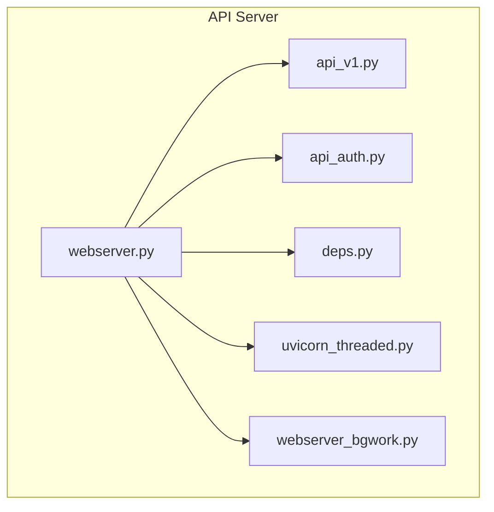
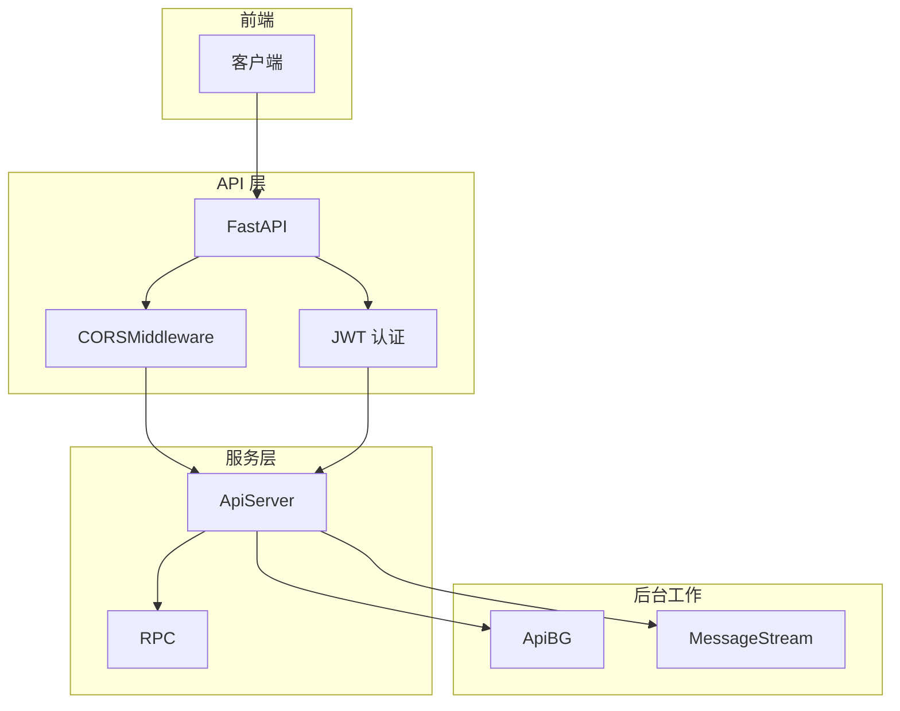
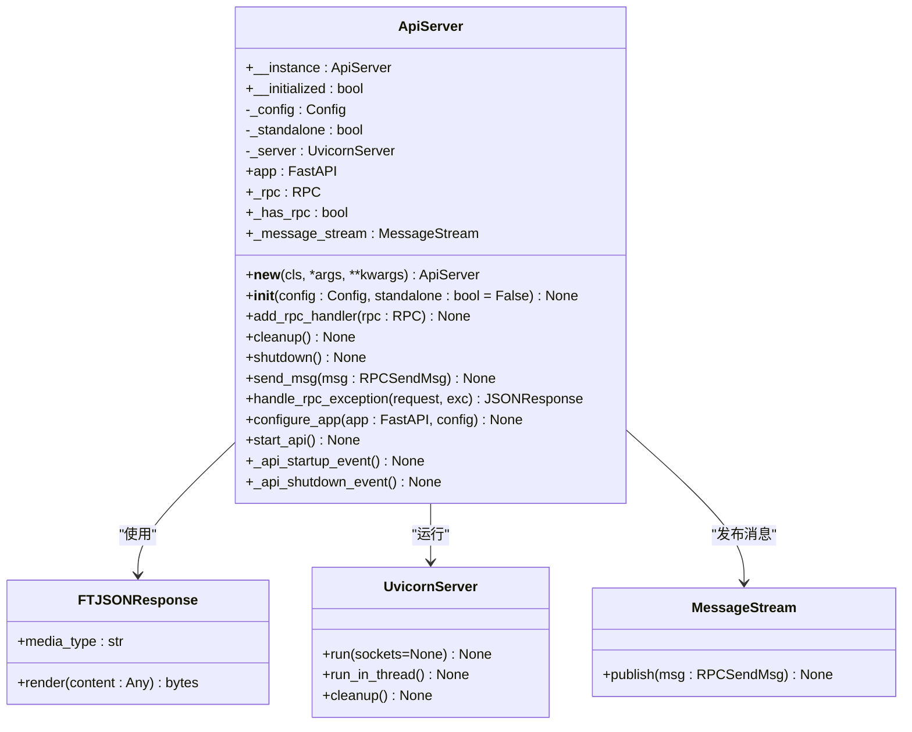
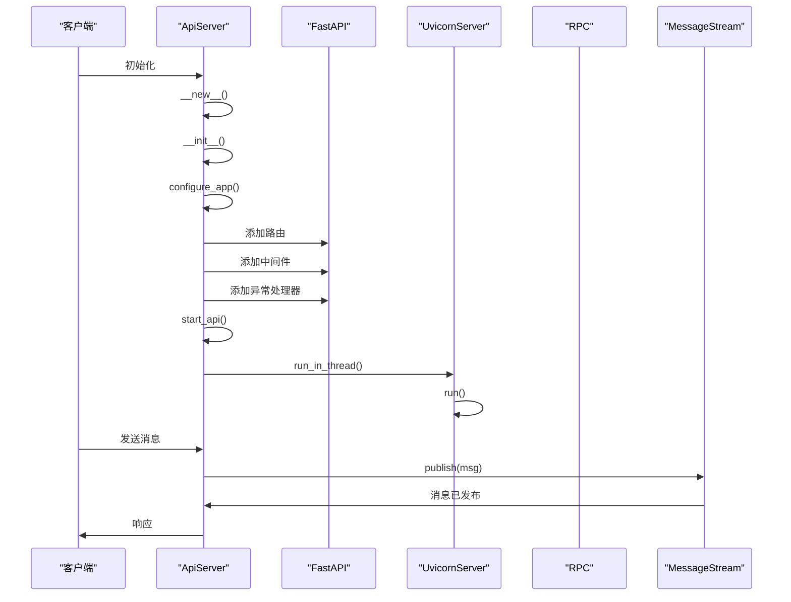
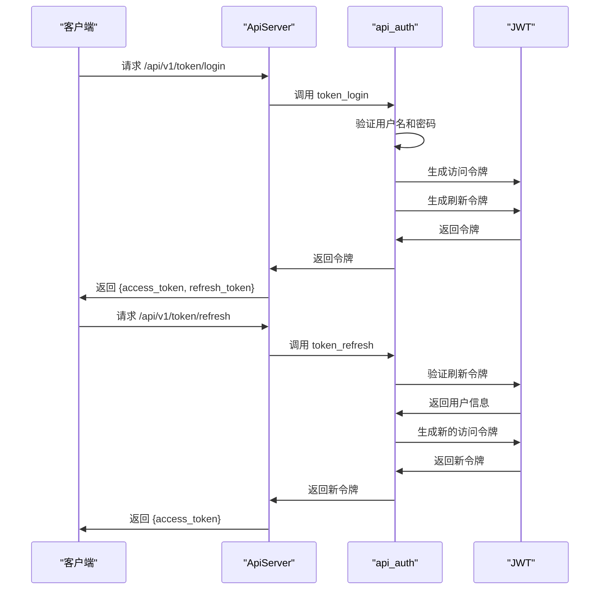
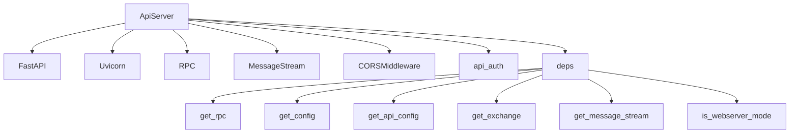

# 备份监控与验证

<cite>
**本文档中引用的文件**  
- [webserver.py](file://freqtrade/rpc/api_server/webserver.py)
- [api_v1.py](file://freqtrade/rpc/api_server/api_v1.py)
- [api_auth.py](file://freqtrade/rpc/api_server/api_auth.py)
- [deps.py](file://freqtrade/rpc/api_server/deps.py)
- [api_schemas.py](file://freqtrade/rpc/api_server/api_schemas.py)
- [uvicorn_threaded.py](file://freqtrade/rpc/api_server/uvicorn_threaded.py)
- [webserver_bgwork.py](file://freqtrade/rpc/api_server/webserver_bgwork.py)
</cite>

## 目录
1. [简介](#简介)
2. [项目结构](#项目结构)
3. [核心组件](#核心组件)
4. [架构概述](#架构概述)
5. [详细组件分析](#详细组件分析)
6. [依赖分析](#依赖分析)
7. [性能考虑](#性能考虑)
8. [故障排除指南](#故障排除指南)
9. [结论](#结论)

## 简介
本文档详细说明如何利用 `webserver.py` 中定义的日志记录机制和异常处理框架，实现备份操作的监控与告警。重点介绍如何集成 `FTJSONResponse` 和 `UvicornServer` 组件来构建备份状态 API 接口，实现备份任务的远程查询与实时通知。同时，设计基于 FastAPI 的健康检查路由以验证备份服务的可用性，并结合 `CORSMiddleware` 和 JWT 认证机制确保接口安全访问。此外，提供日志审计方案，记录每次备份操作的时间、大小、校验码和执行结果，并支持自动告警触发。

## 项目结构
Freqtrade 项目的结构清晰地组织了各个功能模块，其中与备份监控和验证相关的组件主要集中在 `freqtrade/rpc/api_server` 目录下。该目录包含了 Web 服务器、API 路由、认证机制、依赖注入以及后台工作管理等关键文件。

**图示来源**
- [webserver.py](file://freqtrade/rpc/api_server/webserver.py#L1-L245)
- [api_v1.py](file://freqtrade/rpc/api_server/api_v1.py#L1-L576)
- [api_auth.py](file://freqtrade/rpc/api_server/api_auth.py#L1-L162)
- [deps.py](file://freqtrade/rpc/api_server/deps.py#L1-L72)
- [uvicorn_threaded.py](file://freqtrade/rpc/api_server/uvicorn_threaded.py#L1-L63)
- [webserver_bgwork.py](file://freqtrade/rpc/api_server/webserver_bgwork.py#L1-L49)

**本节来源**
- [webserver.py](file://freqtrade/rpc/api_server/webserver.py#L1-L245)
- [api_v1.py](file://freqtrade/rpc/api_server/api_v1.py#L1-L576)

## 核心组件
`webserver.py` 是整个 API 服务的核心，它通过 `ApiServer` 类实现了单例模式，确保在整个应用生命周期中只有一个实例存在。该类负责初始化 FastAPI 应用、配置中间件、注册路由、启动 Uvicorn 服务器，并处理 RPC 消息的发送与异常捕获。`FTJSONResponse` 类继承自 `JSONResponse`，使用 `orjson` 进行响应序列化，提高了 JSON 处理性能。`UvicornServer` 类则封装了 Uvicorn 服务器的运行逻辑，支持多线程模式，确保服务器可以在独立线程中运行。

**本节来源**
- [webserver.py](file://freqtrade/rpc/api_server/webserver.py#L1-L245)
- [uvicorn_threaded.py](file://freqtrade/rpc/api_server/uvicorn_threaded.py#L1-L63)

## 架构概述
Freqtrade 的 API 服务架构采用分层设计，前端通过 FastAPI 提供 RESTful 接口，后端通过 RPC 机制与交易引擎通信。`ApiServer` 类作为顶层协调者，负责初始化和配置整个 API 服务。`CORSMiddleware` 用于处理跨域请求，`http_basic_or_jwt_token` 函数实现了基于 HTTP Basic 和 JWT 的双重认证机制。`MessageStream` 类用于在不同组件之间发布和订阅消息，实现异步通信。`ApiBG` 类管理后台任务，如数据下载和回测。

**图示来源**
- [webserver.py](file://freqtrade/rpc/api_server/webserver.py#L1-L245)
- [api_auth.py](file://freqtrade/rpc/api_server/api_auth.py#L1-L162)
- [deps.py](file://freqtrade/rpc/api_server/deps.py#L1-L72)
- [webserver_bgwork.py](file://freqtrade/rpc/api_server/webserver_bgwork.py#L1-L49)

## 详细组件分析

### ApiServer 分析
`ApiServer` 类是整个 API 服务的核心，它通过 `__new__` 方法实现了单例模式，确保在整个应用中只有一个实例。`__init__` 方法负责初始化 FastAPI 应用、配置中间件、注册路由并启动服务器。`configure_app` 方法用于配置 FastAPI 应用，包括添加路由、中间件和异常处理器。`start_api` 方法负责启动 Uvicorn 服务器，支持独立运行和线程模式。

#### 类图

**图示来源**
- [webserver.py](file://freqtrade/rpc/api_server/webserver.py#L1-L245)
- [uvicorn_threaded.py](file://freqtrade/rpc/api_server/uvicorn_threaded.py#L1-L63)
- [webserver_bgwork.py](file://freqtrade/rpc/api_server/webserver_bgwork.py#L1-L49)

#### 序列图

**图示来源**
- [webserver.py](file://freqtrade/rpc/api_server/webserver.py#L1-L245)
- [uvicorn_threaded.py](file://freqtrade/rpc/api_server/uvicorn_threaded.py#L1-L63)
- [webserver_bgwork.py](file://freqtrade/rpc/api_server/webserver_bgwork.py#L1-L49)

**本节来源**
- [webserver.py](file://freqtrade/rpc/api_server/webserver.py#L1-L245)
- [uvicorn_threaded.py](file://freqtrade/rpc/api_server/uvicorn_threaded.py#L1-L63)
- [webserver_bgwork.py](file://freqtrade/rpc/api_server/webserver_bgwork.py#L1-L49)

### 认证机制分析
`api_auth.py` 文件实现了基于 HTTP Basic 和 JWT 的双重认证机制。`http_basic_or_jwt_token` 函数首先尝试从请求头中获取 JWT 令牌，如果失败则尝试使用 HTTP Basic 认证。`token_login` 函数用于生成访问令牌和刷新令牌，`token_refresh` 函数用于刷新访问令牌。`validate_ws_token` 函数用于验证 WebSocket 连接的令牌。

#### 序列图

**图示来源**
- [api_auth.py](file://freqtrade/rpc/api_server/api_auth.py#L1-L162)

**本节来源**
- [api_auth.py](file://freqtrade/rpc/api_server/api_auth.py#L1-L162)

## 依赖分析
`ApiServer` 类依赖于多个外部组件，包括 `FastAPI`、`Uvicorn`、`RPC`、`MessageStream` 和 `CORSMiddleware`。这些依赖关系通过构造函数和方法参数显式声明，确保了代码的可测试性和可维护性。`deps.py` 文件中的依赖注入函数（如 `get_rpc`、`get_config`）进一步增强了模块间的解耦。

**图示来源**
- [webserver.py](file://freqtrade/rpc/api_server/webserver.py#L1-L245)
- [deps.py](file://freqtrade/rpc/api_server/deps.py#L1-L72)

**本节来源**
- [webserver.py](file://freqtrade/rpc/api_server/webserver.py#L1-L245)
- [deps.py](file://freqtrade/rpc/api_server/deps.py#L1-L72)

## 性能考虑
`FTJSONResponse` 类使用 `orjson` 进行 JSON 序列化，相比标准库的 `json` 模块，性能显著提升。`UvicornServer` 类支持多线程模式，可以在独立线程中运行服务器，避免阻塞主线程。`ApiBG` 类通过 `JobsContainer` 管理后台任务，支持进度跟踪和错误处理，提高了系统的响应性和稳定性。

## 故障排除指南
- **服务器无法启动**：检查 `listen_ip_address` 和 `listen_port` 配置是否正确，确保端口未被占用。
- **认证失败**：检查 `username` 和 `password` 是否正确，确保 `jwt_secret_key` 不是默认值。
- **跨域问题**：检查 `CORS_origins` 配置，确保允许的源列表包含客户端域名。
- **后台任务失败**：查看日志文件，检查 `ApiBG` 中的任务状态和错误信息。

**本节来源**
- [webserver.py](file://freqtrade/rpc/api_server/webserver.py#L1-L245)
- [api_auth.py](file://freqtrade/rpc/api_server/api_auth.py#L1-L162)
- [deps.py](file://freqtrade/rpc/api_server/deps.py#L1-L72)

## 结论
通过深入分析 `webserver.py` 及其相关组件，我们全面了解了 Freqtrade API 服务的架构和实现细节。`ApiServer` 类作为核心协调者，集成了 `FTJSONResponse` 和 `UvicornServer`，实现了高性能的 RESTful API 服务。结合 `CORSMiddleware` 和 JWT 认证机制，确保了接口的安全性。`ApiBG` 类和 `MessageStream` 类提供了强大的后台任务管理和异步通信能力。这些组件共同构成了一个健壮、可扩展的备份监控与验证系统。