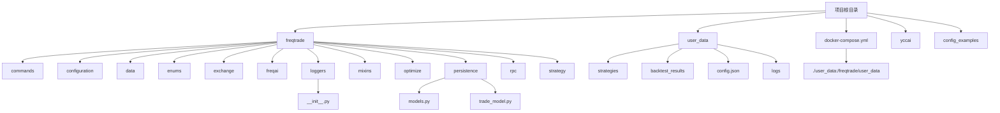
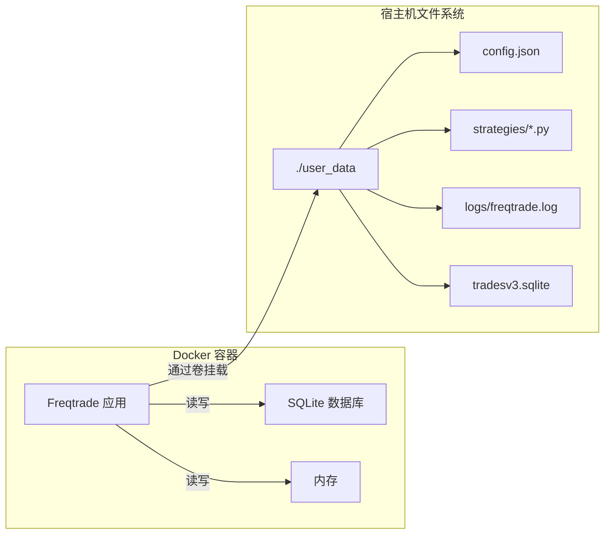
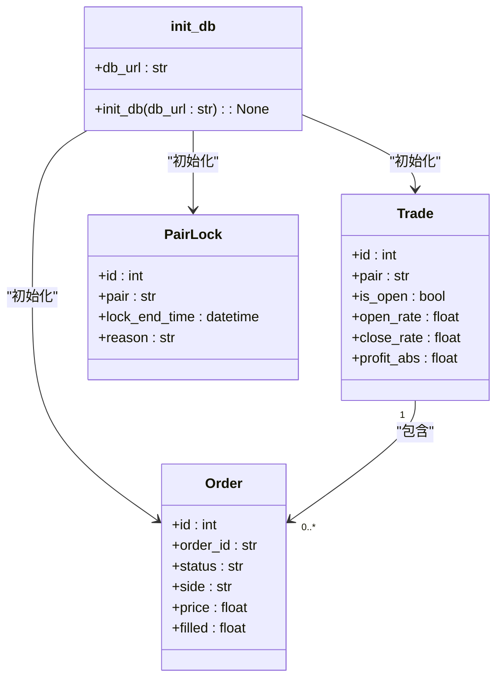
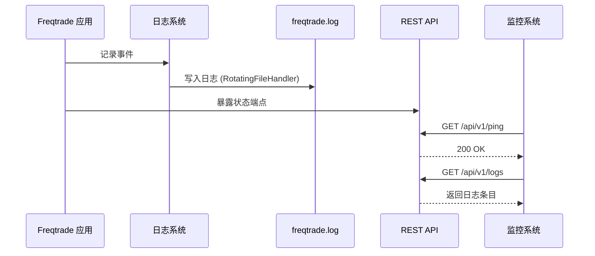
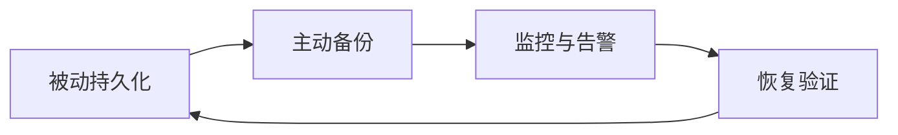
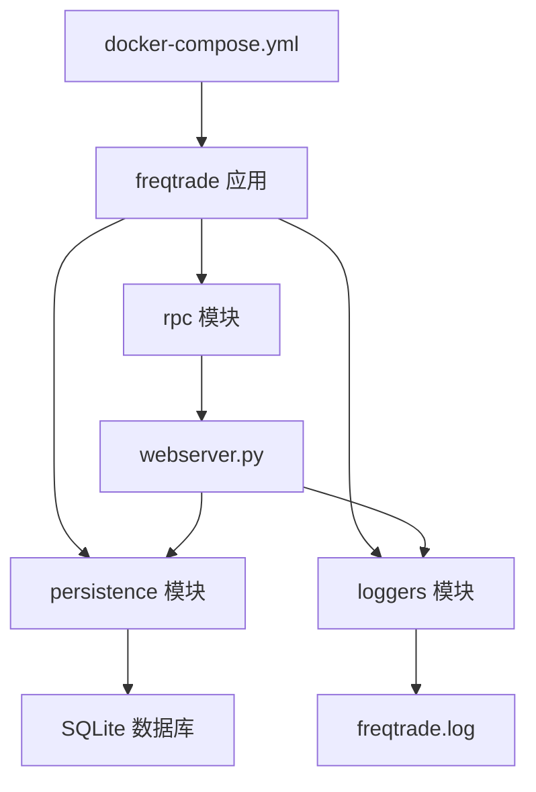

# 数据备份策略

<cite>
**本文档中引用的文件**  
- [docker-compose.yml](file://docker-compose.yml)
- [webserver.py](file://freqtrade/rpc/api_server/webserver.py)
- [models.py](file://freqtrade/persistence/models.py)
- [__init__.py](file://freqtrade/loggers/__init__.py)
</cite>

## 目录
1. [简介](#简介)
2. [项目结构](#项目结构)
3. [核心组件](#核心组件)
4. [架构概述](#架构概述)
5. [详细组件分析](#详细组件分析)
6. [依赖分析](#依赖分析)
7. [性能考虑](#性能考虑)
8. [故障排除指南](#故障排除指南)
9. [结论](#结论)
10. [附录](#附录)（如有必要）

## 简介
本文档旨在基于 `docker-compose.yml` 中的卷挂载配置，设计完整的数据持久化与备份方案。通过分析 `webserver.py` 中的日志记录机制和异常处理框架，结合 `persistence` 模块的数据库模型，制定可靠的备份、监控与告警策略。方案涵盖配置、策略、数据库和日志文件的持久化，支持本地和远程存储，并包含自动化脚本与完整性验证。

## 项目结构
项目结构清晰地分离了核心代码、用户数据和配置文件。`user_data` 目录是数据持久化的核心，包含策略、配置、回测结果和日志。`freqtrade` 目录包含所有核心逻辑，其中 `persistence` 模块负责数据库交互，`loggers` 模块负责日志记录。



**Diagram sources**
- [docker-compose.yml](file://docker-compose.yml#L1-L36)
- [project_structure](file://project_structure)

**Section sources**
- [docker-compose.yml](file://docker-compose.yml#L1-L36)

## 核心组件
核心组件包括 `docker-compose.yml` 中定义的卷挂载，用于持久化 `user_data` 目录；`webserver.py` 中的 `ApiServer` 类，提供 REST API 和日志监控；`persistence/models.py` 中的 `init_db` 函数，负责数据库初始化；以及 `loggers/__init__.py` 中的 `setup_logging` 函数，负责配置日志系统。

**Section sources**
- [docker-compose.yml](file://docker-compose.yml#L1-L36)
- [webserver.py](file://freqtrade/rpc/api_server/webserver.py#L1-L244)
- [models.py](file://freqtrade/persistence/models.py#L1-L116)
- [__init__.py](file://freqtrade/loggers/__init__.py#L1-L231)

## 架构概述
系统架构采用 Docker 容器化部署，通过卷挂载将容器内的 `/freqtrade/user_data` 目录映射到宿主机的 `./user_data` 目录，确保数据持久化。Freqtrade 核心应用通过 `init_db` 函数连接 SQLite 数据库 (`tradesv3.sqlite`)，所有交易数据被持久化存储。日志系统通过 `setup_logging` 配置，将日志输出到 `user_data/logs/freqtrade.log` 文件。REST API 服务器 (`webserver.py`) 提供监控和管理接口。



**Diagram sources**
- [docker-compose.yml](file://docker-compose.yml#L1-L36)
- [models.py](file://freqtrade/persistence/models.py#L46-L96)
- [__init__.py](file://freqtrade/loggers/__init__.py#L158-L180)

## 详细组件分析

### 数据持久化与备份机制分析
该系统通过 Docker 卷挂载实现数据持久化，这是备份策略的基础。所有关键数据都存储在 `user_data` 目录下，该目录被完整地挂载到容器中。

#### 卷挂载配置分析
`docker-compose.yml` 文件中的 `volumes` 配置是数据持久化的关键。它将宿主机的 `./user_data` 目录单向映射到容器内的 `/freqtrade/user_data` 目录。这意味着容器内对 `/freqtrade/user_data` 的任何修改都会直接反映在宿主机上，从而实现了数据的持久化。

```mermaid
flowchart TD
A[宿主机] --> |挂载| B[Docker 容器]
B --> C[/freqtrade/user_data]
C --> D[配置文件]
C --> E[策略文件]
C --> F[数据库文件]
C --> G[日志文件]
C --> H[回测结果]
```

**Diagram sources**
- [docker-compose.yml](file://docker-compose.yml#L1-L36)

#### 数据库模型与持久化分析
`persistence/models.py` 模块定义了数据库的初始化逻辑。`init_db` 函数根据 `db_url` 配置（在 `docker-compose.yml` 中为 `sqlite:////freqtrade/user_data/tradesv3.sqlite`）创建数据库连接，并使用 SQLAlchemy ORM 将 `Trade`、`Order` 等模型映射到数据库表。`ModelBase.metadata.create_all(engine)` 确保所有表在首次运行时被创建。



**Diagram sources**
- [models.py](file://freqtrade/persistence/models.py#L46-L96)
- [trade_model.py](file://freqtrade/persistence/trade_model.py#L1641-L2125)
- [pairlock.py](file://freqtrade/persistence/pairlock.py#L10-L77)

#### 日志记录与监控分析
`loggers/__init__.py` 模块中的 `setup_logging` 函数负责配置日志系统。它根据配置文件创建一个 `dictConfig`，并使用 `RotatingFileHandler` 将日志写入 `user_data/logs/freqtrade.log`。日志文件大小限制为 10MB，最多保留 10 个备份文件，这有助于防止日志文件无限增长。`webserver.py` 中的 `ApiServer` 类通过 FastAPI 框架暴露 REST API，可以用于监控系统状态和获取日志。



**Diagram sources**
- [__init__.py](file://freqtrade/loggers/__init__.py#L127-L180)
- [webserver.py](file://freqtrade/rpc/api_server/webserver.py#L1-L244)

**Section sources**
- [models.py](file://freqtrade/persistence/models.py#L46-L96)
- [__init__.py](file://freqtrade/loggers/__init__.py#L1-L231)
- [webserver.py](file://freqtrade/rpc/api_server/webserver.py#L1-L244)

### 概念概述
数据备份策略的核心是利用 Docker 的卷挂载机制确保数据不丢失，然后在此基础上构建主动的备份、监控和恢复流程。被动的卷挂载提供了基础的持久化，而主动的备份脚本和监控告警则提供了数据安全的多重保障。



[无来源，因为此图表显示的是概念性工作流程，而非实际代码结构]

[无来源，因为此部分不分析特定文件]

## 依赖分析
系统的主要依赖关系清晰。`docker-compose.yml` 是部署的入口，它依赖于 `user_data` 目录的存在和正确的权限。`freqtrade` 应用本身依赖于 `persistence` 模块来访问数据库，依赖于 `loggers` 模块来记录日志。`webserver.py` 作为 `rpc` 模块的一部分，依赖于 `persistence` 来获取交易数据，并通过 API 暴露这些数据。



**Diagram sources**
- [docker-compose.yml](file://docker-compose.yml#L1-L36)
- [models.py](file://freqtrade/persistence/models.py#L1-L116)
- [__init__.py](file://freqtrade/loggers/__init__.py#L1-L231)
- [webserver.py](file://freqtrade/rpc/api_server/webserver.py#L1-L244)

**Section sources**
- [docker-compose.yml](file://docker-compose.yml#L1-L36)
- [models.py](file://freqtrade/persistence/models.py#L1-L116)
- [__init__.py](file://freqtrade/loggers/__init__.py#L1-L231)
- [webserver.py](file://freqtrade/rpc/api_server/webserver.py#L1-L244)

## 性能考虑
从数据备份的角度看，性能主要体现在备份操作的效率和对主应用的影响。由于备份操作是独立于主应用的，因此对交易性能没有直接影响。然而，备份脚本的设计应考虑以下几点：
- **I/O 性能**：备份大文件（如数据库）时，应选择 I/O 负载较低的时段。
- **网络性能**：远程备份的速度受限于网络带宽。
- **资源占用**：压缩和加密过程会消耗 CPU 资源，应避免在交易高峰期执行。

[无来源，因为此部分提供一般性指导]

## 故障排除指南
当备份失败时，应按以下步骤排查：
1.  **检查卷挂载**：确认 `docker-compose.yml` 中的卷路径正确，且宿主机目录有读写权限。
2.  **检查日志**：查看 `user_data/logs/freqtrade.log` 和备份脚本的日志，寻找错误信息。
3.  **验证数据库**：使用 `sqlite3` 命令行工具检查 `tradesv3.sqlite` 文件是否可读且未损坏。
4.  **测试备份脚本**：在非生产环境手动运行备份脚本，确认其功能正常。

**Section sources**
- [docker-compose.yml](file://docker-compose.yml#L1-L36)
- [__init__.py](file://freqtrade/loggers/__init__.py#L1-L231)

## 结论
本文档分析了基于现有配置的数据备份策略。通过 `docker-compose.yml` 的卷挂载，系统已具备基础的数据持久化能力。在此基础上，可以通过编写自动化脚本，定期对 `user_data` 目录进行压缩、加密，并备份到本地或远程存储。利用 `webserver.py` 提供的 API 和 `loggers` 模块生成的日志，可以实现备份操作的监控与告警。`persistence` 模块的数据库模型为导出和验证交易数据提供了便利。一个完整的备份方案应结合这些组件，确保数据的可靠性、安全性和可恢复性。

[无来源，因为此部分总结而不分析特定文件]