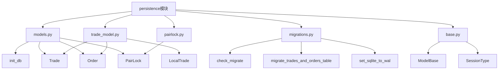
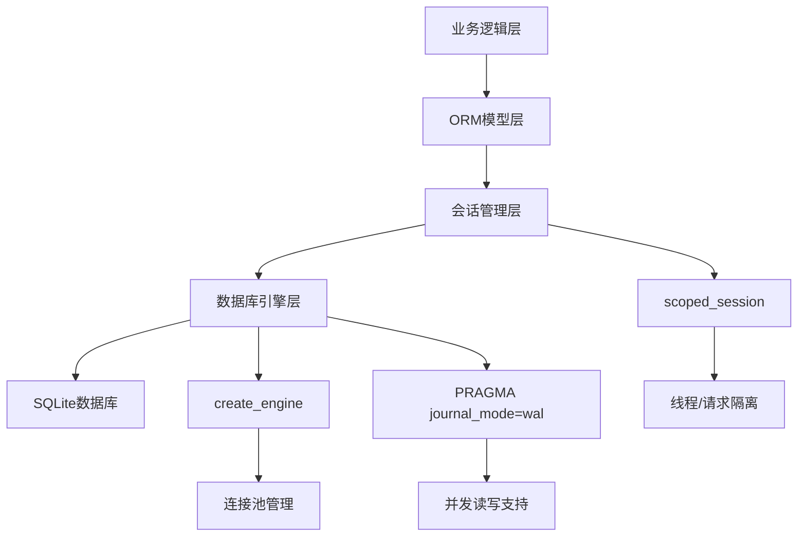
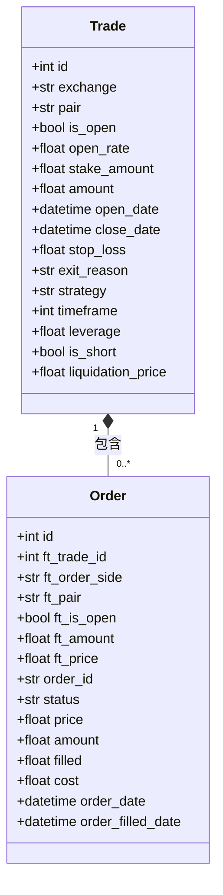
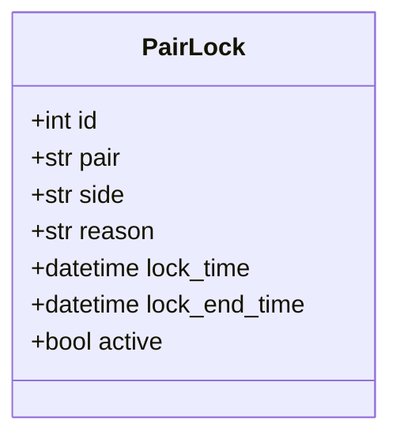
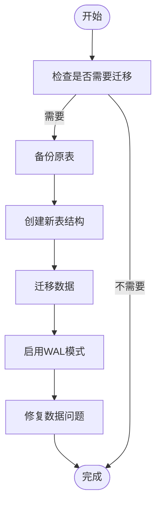
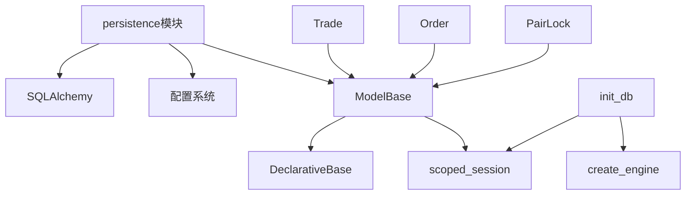

# 数据库备份流程

<cite>
**本文档引用的文件**   
- [models.py](file://freqtrade/persistence/models.py)
- [trade_model.py](file://freqtrade/persistence/trade_model.py)
- [pairlock.py](file://freqtrade/persistence/pairlock.py)
- [migrations.py](file://freqtrade/persistence/migrations.py)
- [base.py](file://freqtrade/persistence/base.py)
</cite>

## 目录
1. [简介](#简介)
2. [项目结构](#项目结构)
3. [核心组件](#核心组件)
4. [架构概述](#架构概述)
5. [详细组件分析](#详细组件分析)
6. [依赖分析](#依赖分析)
7. [性能考虑](#性能考虑)
8. [故障排除指南](#故障排除指南)
9. [结论](#结论)
10. [附录](#附录) (如有必要)

## 简介
本文档详细说明了如何结合persistence模块的数据库模型，制定定期数据库导出与加密存储流程。重点阐述了SQLite数据库的ACID特性在交易系统中的应用，解释了Trade、Order、PairLock等核心模型的表结构设计与关系映射。提供了数据库备份脚本示例，包含事务锁定、热备份机制和WAL模式处理策略。阐述了如何利用SQLAlchemy的engine和session机制实现安全的数据导出，并支持增量备份与全量备份两种模式。包含备份文件的压缩、加密和完整性校验方法。

## 项目结构
persistence模块是freqtrade系统中负责数据持久化的关键组件，主要包含数据库模型定义、会话管理、迁移脚本和自定义数据存储功能。该模块通过SQLAlchemy ORM框架与SQLite数据库交互，实现了交易数据的可靠存储和查询。

**图表来源**
- [models.py](file://freqtrade/persistence/models.py#L1-L116)
- [trade_model.py](file://freqtrade/persistence/trade_model.py#L0-L2127)
- [pairlock.py](file://freqtrade/persistence/pairlock.py#L0-L78)
- [migrations.py](file://freqtrade/persistence/migrations.py#L0-L410)
- [base.py](file://freqtrade/persistence/base.py#L0-L8)

**章节来源**
- [models.py](file://freqtrade/persistence/models.py#L1-L116)
- [trade_model.py](file://freqtrade/persistence/trade_model.py#L0-L2127)

## 核心组件
persistence模块的核心组件包括数据库模型定义、会话管理机制和数据库迁移功能。Trade模型作为核心交易实体，与Order模型形成一对多关系，记录了交易的所有订单信息。PairLock模型用于实现交易对锁定功能，防止在特定条件下进行交易。通过SQLAlchemy的declarative base和scoped session机制，确保了多线程环境下的数据一致性。

**章节来源**
- [models.py](file://freqtrade/persistence/models.py#L46-L79)
- [trade_model.py](file://freqtrade/persistence/trade_model.py#L1641-L2125)
- [pairlock.py](file://freqtrade/persistence/pairlock.py#L10-L77)

## 架构概述
persistence模块采用分层架构设计，上层为业务逻辑提供数据访问接口，中层为ORM模型层，底层为数据库引擎和会话管理。通过init_db函数初始化数据库连接，创建engine和scoped_session，确保每个线程或请求拥有独立的会话实例。WAL（Write-Ahead Logging）模式被启用以支持高并发读写操作，同时保证数据的ACID特性。

**图表来源**
- [models.py](file://freqtrade/persistence/models.py#L46-L79)
- [migrations.py](file://freqtrade/persistence/migrations.py#L394-L409)

## 详细组件分析

### Trade模型分析
Trade模型是交易系统的核心数据结构，记录了每笔交易的完整信息，包括开仓价格、数量、手续费、盈亏计算等。该模型通过relationship与Order模型关联，实现了交易与订单的一对多关系。

**图表来源**
- [trade_model.py](file://freqtrade/persistence/trade_model.py#L1641-L2125)
- [trade_model.py](file://freqtrade/persistence/trade_model.py#L64-L377)

**章节来源**
- [trade_model.py](file://freqtrade/persistence/trade_model.py#L1641-L2125)

### PairLock模型分析
PairLock模型用于实现交易对锁定功能，防止在特定条件下进行交易。该模型记录了锁定的交易对、锁定方向、原因、开始和结束时间等信息。

**图表来源**
- [pairlock.py](file://freqtrade/persistence/pairlock.py#L10-L77)

**章节来源**
- [pairlock.py](file://freqtrade/persistence/pairlock.py#L10-L77)

### 数据库迁移分析
数据库迁移功能通过migrations模块实现，支持数据库模式的平滑升级。check_migrate函数负责检查是否需要迁移，migrate_trades_and_orders_table函数处理交易和订单表的迁移，set_sqlite_to_wal函数确保WAL模式被正确启用。

**图表来源**
- [migrations.py](file://freqtrade/persistence/migrations.py#L358-L409)

**章节来源**
- [migrations.py](file://freqtrade/persistence/migrations.py#L358-L409)

## 依赖分析
persistence模块依赖于SQLAlchemy ORM框架进行数据库操作，依赖于freqtrade的配置系统获取数据库连接信息。Trade、Order和PairLock模型都继承自ModelBase基类，共享相同的元数据和会话管理机制。通过scoped_session实现线程安全的会话管理，确保多线程环境下的数据一致性。

**图表来源**
- [models.py](file://freqtrade/persistence/models.py#L1-L116)
- [base.py](file://freqtrade/persistence/base.py#L0-L8)

**章节来源**
- [models.py](file://freqtrade/persistence/models.py#L1-L116)
- [base.py](file://freqtrade/persistence/base.py#L0-L8)

## 性能考虑
为了优化数据库性能，系统采用了多项策略：启用WAL模式以支持高并发读写；使用StaticPool连接池管理SQLite连接；通过索引优化查询性能；定期进行数据库迁移以保持模式最新。在备份过程中，应考虑使用热备份机制，避免影响交易系统的正常运行。

## 故障排除指南
当遇到数据库相关问题时，可以检查以下方面：确认数据库URL配置正确；检查WAL模式是否已启用；验证数据库迁移是否成功完成；确保会话正确提交或回滚；检查是否有未关闭的数据库连接。对于备份失败的情况，应检查文件权限、磁盘空间和网络连接。

**章节来源**
- [models.py](file://freqtrade/persistence/models.py#L46-L79)
- [migrations.py](file://freqtrade/persistence/migrations.py#L394-L409)

## 结论
persistence模块通过精心设计的数据库模型和稳健的会话管理机制，为freqtrade系统提供了可靠的数据持久化支持。Trade、Order和PairLock模型的合理设计确保了交易数据的完整性和一致性。通过定期备份和加密存储，可以有效保护交易数据的安全。建议在生产环境中实施增量备份策略，结合WAL模式的热备份机制，确保交易系统的高可用性和数据安全性。