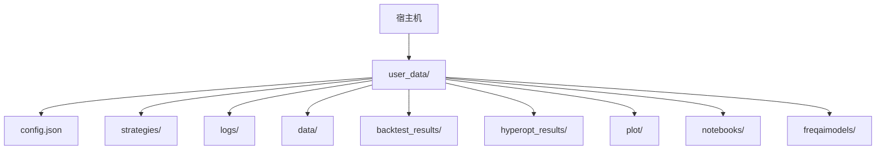
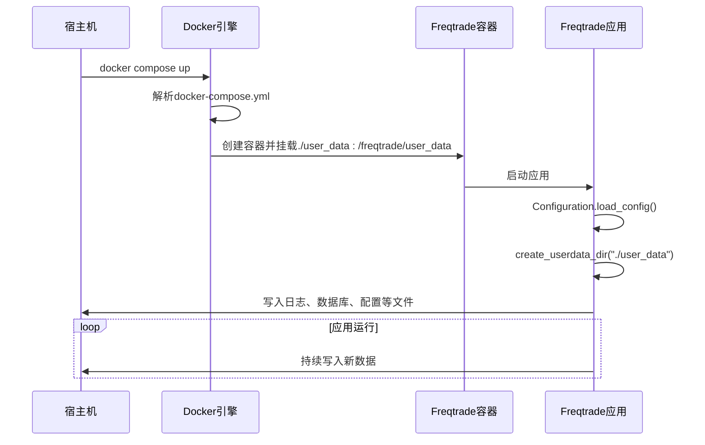
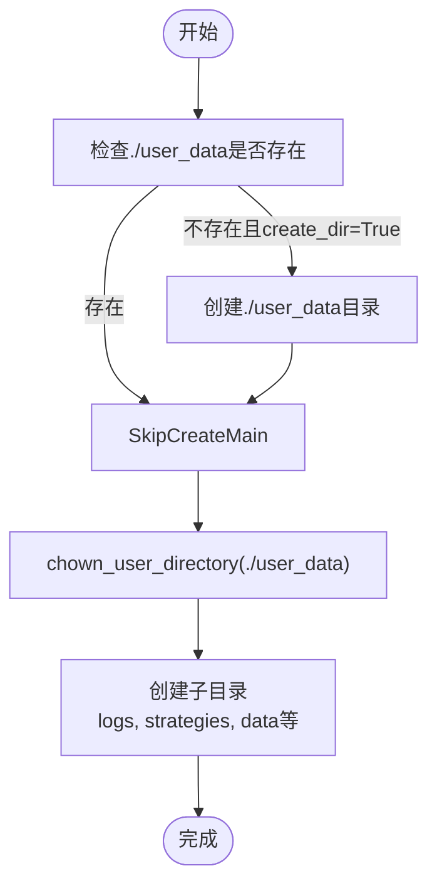
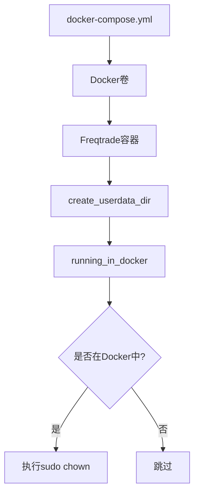

# 数据持久化方案

<cite>
**本文档中引用的文件**  
- [docker-compose.yml](file://docker-compose.yml)
- [directory_operations.py](file://freqtrade/configuration/directory_operations.py)
- [configuration.py](file://freqtrade/configuration/configuration.py)
- [detect_environment.py](file://freqtrade/configuration/detect_environment.py)
</cite>

## 目录
1. [简介](#简介)
2. [项目结构](#项目结构)
3. [核心组件](#核心组件)
4. [架构概述](#架构概述)
5. [详细组件分析](#详细组件分析)
6. [依赖分析](#依赖分析)
7. [性能考虑](#性能考虑)
8. [故障排除指南](#故障排除指南)
9. [结论](#结论)

## 简介
本文档基于 `docker-compose.yml` 文件中的卷挂载配置，设计了一套完整的数据持久化方案。目标是确保 `user_data` 目录下的配置、策略、数据库和日志文件能够被可靠地备份和持久化存储。文档详细说明了容器化部署中宿主机与容器之间的目录映射机制，解释了如何通过 `volumes` 配置实现关键数据的持久存储。同时，提供了生产环境下的最佳实践建议，包括权限设置、文件系统选择和挂载选项优化。结合实际部署场景，还演示了多节点环境中的数据同步策略，并说明了如何避免数据丢失风险。

## 项目结构
Freqtrade 项目的 `user_data` 目录是用户自定义数据的核心存储位置，包含了策略、配置、日志、回测结果等关键信息。通过 `docker-compose.yml` 中的卷挂载，该目录被映射到容器内部，实现了数据的持久化。



**Diagram sources**
- [docker-compose.yml](file://docker-compose.yml#L1-L36)
- [directory_operations.py](file://freqtrade/configuration/directory_operations.py#L46-L89)

**Section sources**
- [docker-compose.yml](file://docker-compose.yml#L1-L36)
- [directory_operations.py](file://freqtrade/configuration/directory_operations.py#L46-L89)

## 核心组件
数据持久化方案的核心在于 `docker-compose.yml` 文件中的 `volumes` 配置和 `directory_operations.py` 中的目录创建逻辑。`volumes` 指令将宿主机的 `./user_data` 目录挂载到容器内的 `/freqtrade/user_data`，确保了数据的持久性。`create_userdata_dir` 函数则负责在启动时创建 `user_data` 目录及其所有必需的子目录。

**Section sources**
- [docker-compose.yml](file://docker-compose.yml#L1-L36)
- [directory_operations.py](file://freqtrade/configuration/directory_operations.py#L46-L89)

## 架构概述
整个数据持久化流程如下：当使用 `docker compose up` 启动服务时，Docker 会根据 `docker-compose.yml` 的配置，将宿主机的 `user_data` 目录挂载到容器中。随后，Freqtrade 应用启动，通过 `Configuration` 类加载配置，并调用 `create_userdata_dir` 确保所有子目录（如 `logs`, `strategies` 等）都已创建。应用运行时产生的所有数据（日志、交易数据库、回测结果等）都会直接写入这个挂载的目录，从而实现数据的持久化。



**Diagram sources**
- [docker-compose.yml](file://docker-compose.yml#L1-L36)
- [configuration.py](file://freqtrade/configuration/configuration.py#L33-L546)
- [directory_operations.py](file://freqtrade/configuration/directory_operations.py#L46-L89)

## 详细组件分析

### 卷挂载机制分析
`docker-compose.yml` 中的 `volumes` 配置是实现数据持久化的基础。它建立了一个从宿主机到容器的双向数据通道。

```mermaid
graph LR
subgraph 宿主机
A[./user_data]
end
subgraph 容器
B[/freqtrade/user_data]
end
A < --> |双向同步| B
```

**Diagram sources**
- [docker-compose.yml](file://docker-compose.yml#L1-L36)

### 目录创建与权限管理
`create_userdata_dir` 函数不仅创建目录，还处理了在 Docker 环境下的权限问题。



**Diagram sources**
- [directory_operations.py](file://freqtrade/configuration/directory_operations.py#L46-L89)
- [detect_environment.py](file://freqtrade/configuration/detect_environment.py#L3-L7)

**Section sources**
- [directory_operations.py](file://freqtrade/configuration/directory_operations.py#L46-L89)

## 依赖分析
数据持久化方案依赖于 Docker 的卷管理功能和 Freqtrade 应用自身的目录管理逻辑。`running_in_docker()` 函数用于检测运行环境，以决定是否执行 `chown` 命令。



**Diagram sources**
- [docker-compose.yml](file://docker-compose.yml#L1-L36)
- [directory_operations.py](file://freqtrade/configuration/directory_operations.py#L32-L43)
- [detect_environment.py](file://freqtrade/configuration/detect_environment.py#L3-L7)

**Section sources**
- [directory_operations.py](file://freqtrade/configuration/directory_operations.py#L32-L43)
- [detect_environment.py](file://freqtrade/configuration/detect_environment.py#L3-L7)

## 性能考虑
使用本地卷挂载（bind mount）通常性能良好，因为它直接访问宿主机的文件系统。对于 I/O 密集型操作（如高频回测），建议将 `user_data` 目录放置在 SSD 上以获得最佳性能。避免使用网络文件系统（如 NFS）作为卷的宿主，因为这会引入显著的延迟。

## 故障排除指南
- **问题：容器启动失败，提示权限错误。**
  **解决方案：** 确保宿主机上的 `user_data` 目录及其内容对运行 Docker 的用户可读写。可以使用 `chmod -R 755 user_data` 和 `chown -R $USER:$USER user_data` 修复权限。

- **问题：数据未持久化，容器重启后丢失。**
  **解决方案：** 检查 `docker-compose.yml` 中的 `volumes` 配置是否正确，确保路径映射无误。确认 `./user_data` 目录确实存在于宿主机上。

- **问题：`chown` 命令失败。**
  **解决方案：** 这通常是因为容器内没有 `sudo` 权限或 `ftuser` 用户不存在。此操作是可选的，失败时会记录警告但不会中断程序。如果需要，可以在构建自定义镜像时确保 `ftuser` 存在。

**Section sources**
- [directory_operations.py](file://freqtrade/configuration/directory_operations.py#L32-L43)
- [detect_environment.py](file://freqtrade/configuration/detect_environment.py#L3-L7)

## 结论
本文档详细阐述了基于 `docker-compose.yml` 的 Freqtrade 数据持久化方案。通过将 `user_data` 目录挂载为 Docker 卷，可以有效保护配置、策略、数据库和日志等关键数据。结合 `create_userdata_dir` 的自动目录创建和 `chown_user_directory` 的权限管理，该方案在生产环境中是可靠且健壮的。遵循最佳实践，如使用 SSD 存储和正确设置权限，可以进一步确保系统的稳定性和数据的安全性。