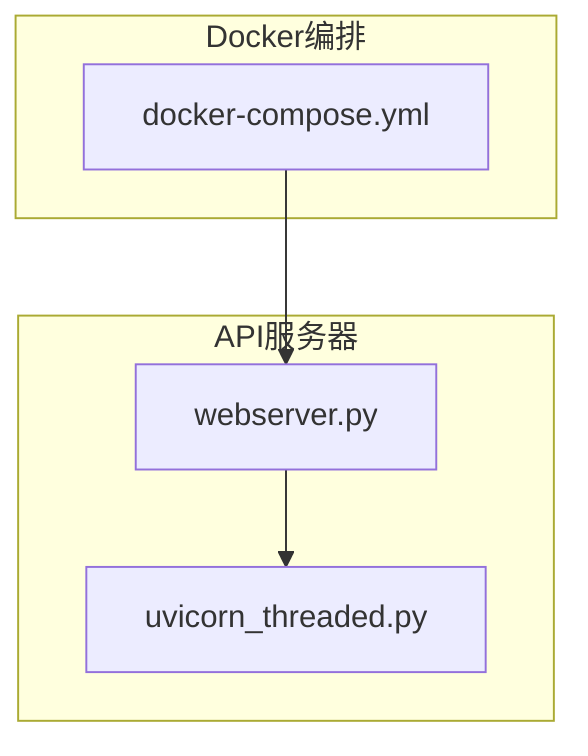
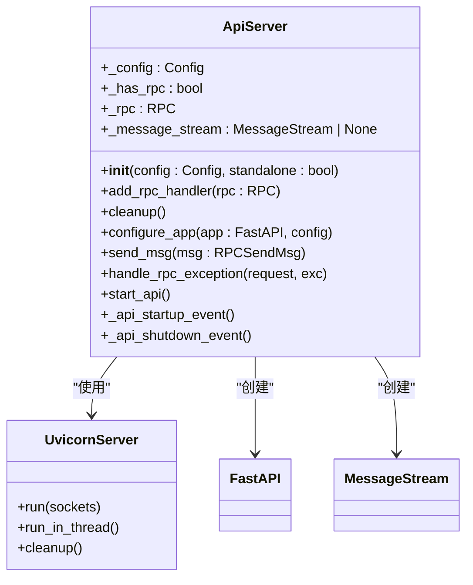
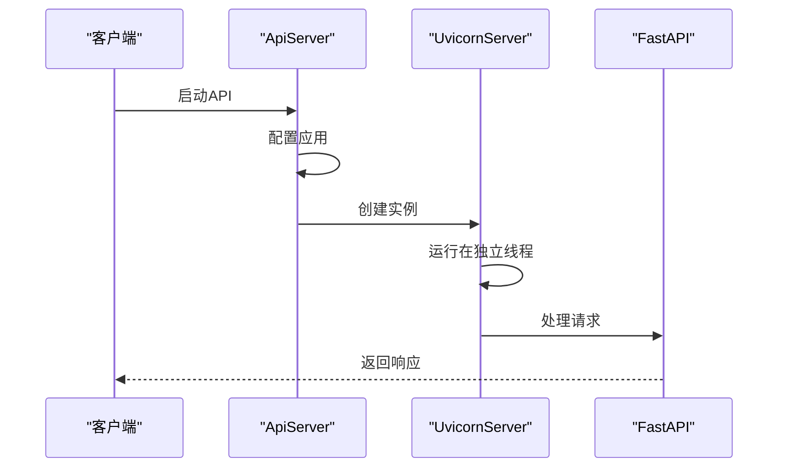
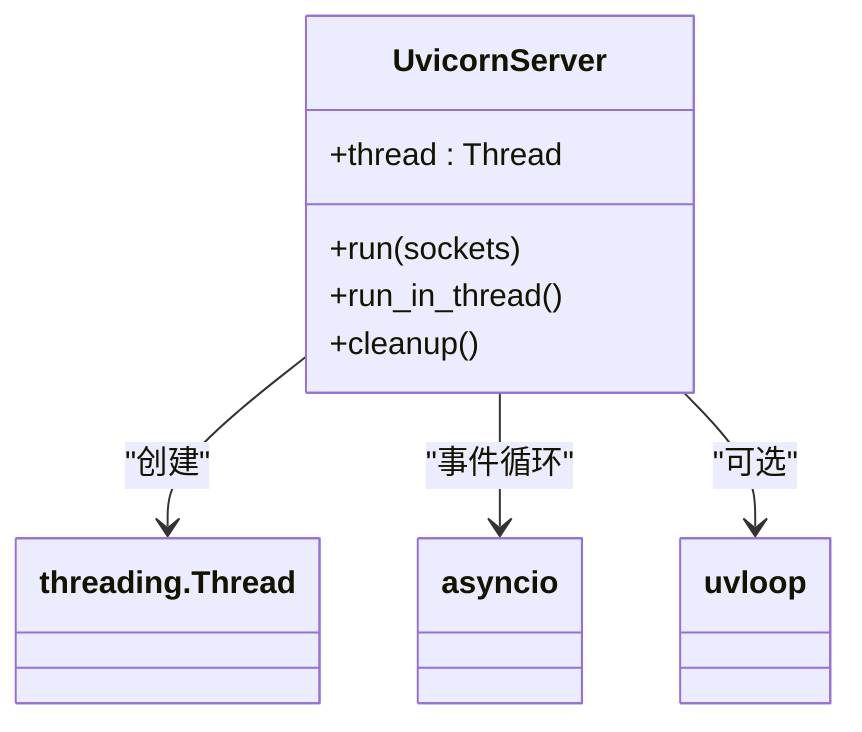
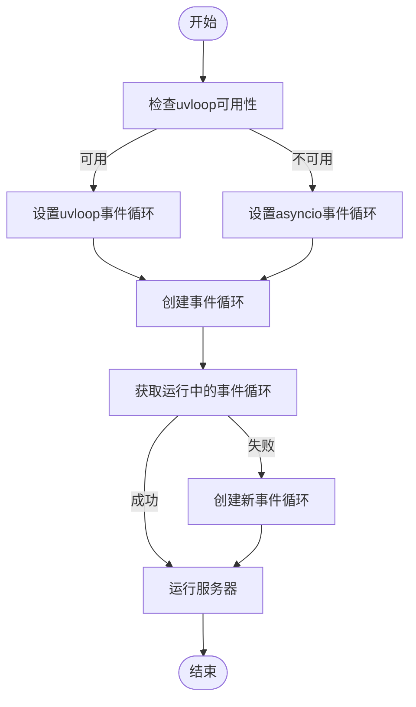
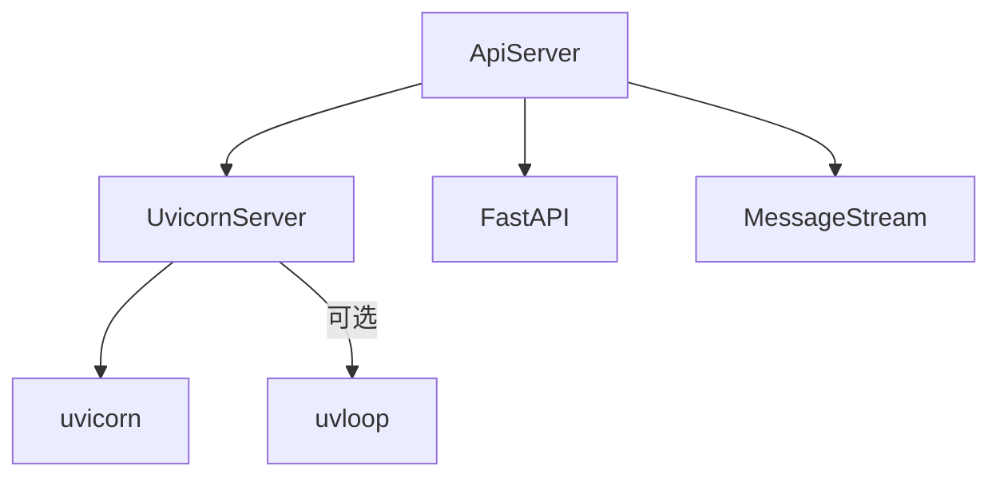

# API负载均衡配置

<cite>
**本文档引用的文件**   
- [docker-compose.yml](file://docker-compose.yml)
- [webserver.py](file://freqtrade/rpc/api_server/webserver.py)
- [uvicorn_threaded.py](file://freqtrade/rpc/api_server/uvicorn_threaded.py)
</cite>

## 目录
1. [项目结构](#项目结构)
2. [核心组件](#核心组件)
3. [架构概述](#架构概述)
4. [详细组件分析](#详细组件分析)
5. [依赖分析](#依赖分析)
6. [性能考虑](#性能考虑)
7. [故障排除指南](#故障排除指南)
8. [结论](#结论)

## 项目结构

项目结构展示了基于Docker的服务编排和API服务器的实现。`docker-compose.yml`文件定义了Freqtrade服务的容器化部署，而`webserver.py`和`uvicorn_threaded.py`则实现了RESTful API的核心功能。



**图示来源**
- [docker-compose.yml](file://docker-compose.yml#L1-L36)
- [webserver.py](file://freqtrade/rpc/api_server/webserver.py#L1-L244)
- [uvicorn_threaded.py](file://freqtrade/rpc/api_server/uvicorn_threaded.py#L1-L64)

**本节来源**
- [docker-compose.yml](file://docker-compose.yml#L1-L36)
- [webserver.py](file://freqtrade/rpc/api_server/webserver.py#L1-L244)

## 核心组件

核心组件包括API服务器的实现和多线程Uvicorn服务器。`webserver.py`文件中的`ApiServer`类负责配置和启动FastAPI应用，而`uvicorn_threaded.py`中的`UvicornServer`类提供了多线程支持。

**本节来源**
- [webserver.py](file://freqtrade/rpc/api_server/webserver.py#L1-L244)
- [uvicorn_threaded.py](file://freqtrade/rpc/api_server/uvicorn_threaded.py#L1-L64)

## 架构概述

架构概述展示了API服务器的整体设计。`ApiServer`类作为单例模式实现，确保在整个应用中只有一个实例。它通过`UvicornServer`类启动HTTP服务器，并配置了FastAPI应用的路由和中间件。



**图示来源**
- [webserver.py](file://freqtrade/rpc/api_server/webserver.py#L1-L244)
- [uvicorn_threaded.py](file://freqtrade/rpc/api_server/uvicorn_threaded.py#L1-L64)

## 详细组件分析

### API服务器分析

API服务器组件分析了`ApiServer`类的实现细节。该类通过`__new__`方法实现单例模式，确保在整个应用中只有一个实例。`__init__`方法初始化配置并启动API服务器。

#### 对象导向组件
```mermaid
classDiagram
class ApiServer {
+__instance : ApiServer
+__initialized : bool
+_standalone : bool
+_server : UvicornServer
+app : FastAPI
}
ApiServer : +__new__(cls, *args, **kwargs)
ApiServer : +__init__(config : Config, standalone : bool)
ApiServer : +start_api()
ApiServer : +configure_app(app : FastAPI, config)
```

**图示来源**
- [webserver.py](file://freqtrade/rpc/api_server/webserver.py#L1-L244)

#### API/服务组件


**图示来源**
- [webserver.py](file://freqtrade/rpc/api_server/webserver.py#L195-L243)
- [uvicorn_threaded.py](file://freqtrade/rpc/api_server/uvicorn_threaded.py#L45-L63)

**本节来源**
- [webserver.py](file://freqtrade/rpc/api_server/webserver.py#L1-L244)

### Uvicorn服务器分析

Uvicorn服务器组件分析了`UvicornServer`类的实现细节。该类继承自`uvicorn.Server`，并重写了`run`方法以支持多线程运行。

#### 对象导向组件


**图示来源**
- [uvicorn_threaded.py](file://freqtrade/rpc/api_server/uvicorn_threaded.py#L1-L64)

#### 复杂逻辑组件


**图示来源**
- [uvicorn_threaded.py](file://freqtrade/rpc/api_server/uvicorn_threaded.py#L38-L63)

**本节来源**
- [uvicorn_threaded.py](file://freqtrade/rpc/api_server/uvicorn_threaded.py#L1-L64)

## 依赖分析

依赖分析展示了API服务器组件之间的依赖关系。`ApiServer`依赖于`UvicornServer`来启动HTTP服务器，而`UvicornServer`依赖于`uvicorn`库和可选的`uvloop`库。



**图示来源**
- [webserver.py](file://freqtrade/rpc/api_server/webserver.py#L1-L244)
- [uvicorn_threaded.py](file://freqtrade/rpc/api_server/uvicorn_threaded.py#L1-L64)

**本节来源**
- [webserver.py](file://freqtrade/rpc/api_server/webserver.py#L1-L244)
- [uvicorn_threaded.py](file://freqtrade/rpc/api_server/uvicorn_threaded.py#L1-L64)

## 性能考虑

性能考虑部分讨论了通过Uvicorn服务器的多进程和多线程模式提升FastAPI应用的并发处理能力。`UvicornServer`类的`run_in_thread`方法允许API服务器在独立线程中运行，从而提高并发性能。

## 故障排除指南

故障排除指南提供了常见问题的解决方案。例如，如果API服务器无法启动，可以检查日志中的错误信息，并确保配置文件中的`listen_ip_address`和`listen_port`设置正确。

**本节来源**
- [webserver.py](file://freqtrade/rpc/api_server/webserver.py#L195-L243)

## 结论

本文档详细说明了如何通过Uvicorn服务器的多进程和多线程模式提升FastAPI应用的并发处理能力。`webserver.py`中的HTTP请求处理流程与`uvicorn_threaded.py`中的线程池管理机制协同工作，实现了高效的API服务器。通过Nginx反向代理配置，可以进一步优化请求分发、连接复用和静态资源缓存。