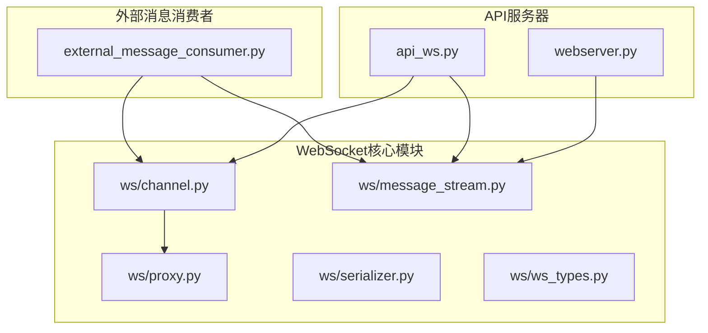
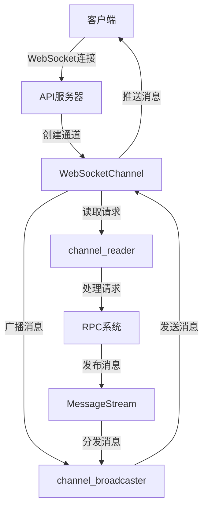
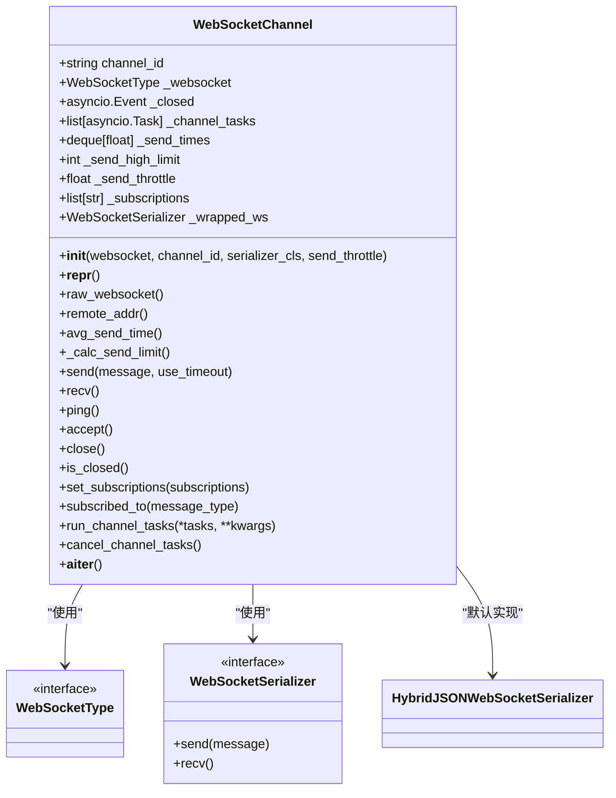
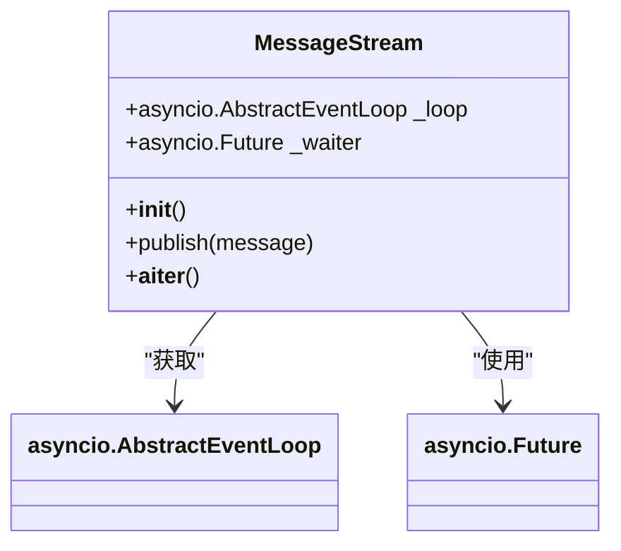
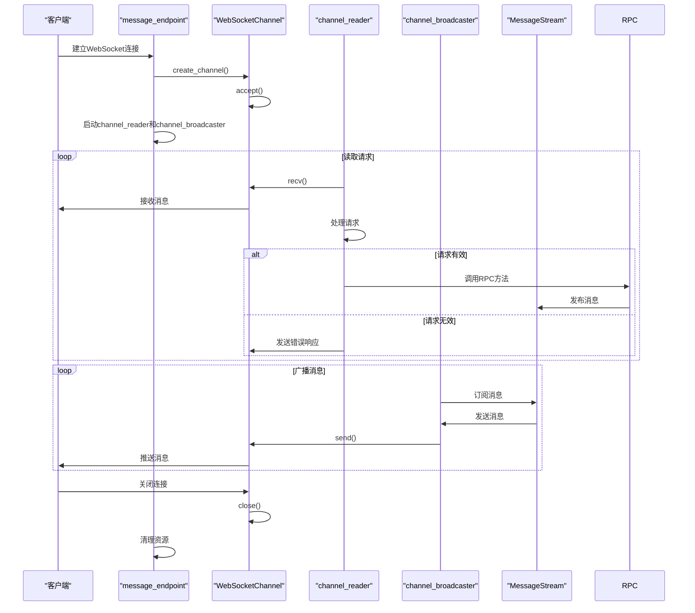
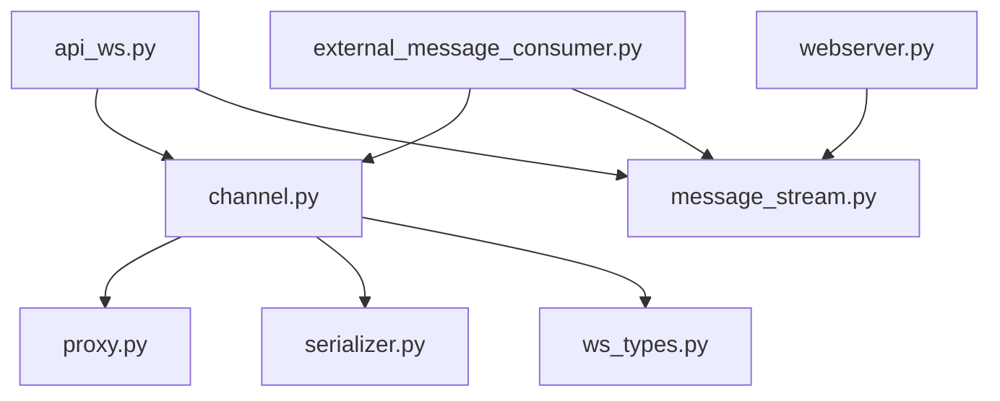

# WebSocket连接负载均衡

<cite>
**本文档中引用的文件**   
- [api_ws.py](file://freqtrade/rpc/api_server/api_ws.py)
- [channel.py](file://freqtrade/rpc/api_server/ws/channel.py)
- [message_stream.py](file://freqtrade/rpc/api_server/ws/message_stream.py)
- [webserver.py](file://freqtrade/rpc/api_server/webserver.py)
- [external_message_consumer.py](file://freqtrade/rpc/external_message_consumer.py)
</cite>

## 目录
1. [引言](#引言)
2. [项目结构](#项目结构)
3. [核心组件](#核心组件)
4. [架构概述](#架构概述)
5. [详细组件分析](#详细组件分析)
6. [依赖分析](#依赖分析)
7. [性能考虑](#性能考虑)
8. [故障排除指南](#故障排除指南)
9. [结论](#结论)

## 引言
本文档深入分析了在分布式环境下WebSocket连接的负载均衡挑战，重点研究了`api_ws.py`和`ws/channel.py`如何实现消息通道的统一管理。文档详细说明了`message_stream.py`如何维护客户端会话状态，确保实时交易信号、订单更新等关键消息的可靠推送。同时，设计了基于Redis或消息队列的共享会话存储方案，支持多实例间的消息广播与连接粘滞（sticky session）策略，并提供了连接保活、断线重连和错误恢复的最佳实践。

## 项目结构
项目结构清晰地展示了WebSocket相关组件的组织方式。核心WebSocket功能位于`freqtrade/rpc/api_server/ws/`目录下，包括`channel.py`、`message_stream.py`、`proxy.py`等文件。`api_ws.py`作为WebSocket的入口点，负责处理WebSocket连接的建立和管理。`webserver.py`负责启动API服务器并初始化`MessageStream`实例。

**图示来源**
- [channel.py](file://freqtrade/rpc/api_server/ws/channel.py)
- [message_stream.py](file://freqtrade/rpc/api_server/ws/message_stream.py)
- [api_ws.py](file://freqtrade/rpc/api_server/api_ws.py)
- [webserver.py](file://freqtrade/rpc/api_server/webserver.py)
- [external_message_consumer.py](file://freqtrade/rpc/external_message_consumer.py)

**章节来源**
- [api_ws.py](file://freqtrade/rpc/api_server/api_ws.py)
- [channel.py](file://freqtrade/rpc/api_server/ws/channel.py)
- [message_stream.py](file://freqtrade/rpc/api_server/ws/message_stream.py)
- [webserver.py](file://freqtrade/rpc/api_server/webserver.py)

## 核心组件
核心组件包括`WebSocketChannel`、`MessageStream`和`api_ws.py`中的WebSocket端点。`WebSocketChannel`类封装了WebSocket连接的管理，提供了发送、接收、ping等操作。`MessageStream`类实现了消息的发布-订阅模式，允许多个消费者订阅同一消息流。`api_ws.py`中的`message_endpoint`函数是WebSocket连接的入口点，负责创建`WebSocketChannel`并启动读取和广播任务。

**章节来源**
- [api_ws.py](file://freqtrade/rpc/api_server/api_ws.py#L124)
- [channel.py](file://freqtrade/rpc/api_server/ws/channel.py#L241)
- [message_stream.py](file://freqtrade/rpc/api_server/ws/message_stream.py#L33)

## 架构概述
系统架构采用发布-订阅模式，通过`MessageStream`实现消息的统一管理和分发。当有新的WebSocket连接建立时，`api_ws.py`中的`message_endpoint`函数会创建一个`WebSocketChannel`实例，并启动两个并发任务：`channel_reader`用于处理客户端发送的请求，`channel_broadcaster`用于向客户端广播消息。`MessageStream`作为消息中枢，接收来自系统各处的消息并分发给所有订阅的客户端。

**图示来源**
- [api_ws.py](file://freqtrade/rpc/api_server/api_ws.py#L124)
- [channel.py](file://freqtrade/rpc/api_server/ws/channel.py#L241)
- [message_stream.py](file://freqtrade/rpc/api_server/ws/message_stream.py#L33)

## 详细组件分析

### WebSocket通道分析
`WebSocketChannel`类是WebSocket连接的核心管理器。它封装了底层WebSocket连接，提供了高级API用于发送和接收消息。通道支持订阅特定类型的消息，只有订阅了相应类型消息的客户端才会收到该类型的消息。通道还实现了发送节流和超时控制，防止客户端过快发送消息导致服务器过载。

**图示来源**
- [channel.py](file://freqtrade/rpc/api_server/ws/channel.py#L241)

**章节来源**
- [channel.py](file://freqtrade/rpc/api_server/ws/channel.py#L241)

### 消息流分析
`MessageStream`类实现了简单的发布-订阅模式。生产者通过`publish`方法发布消息，消费者通过异步迭代器`__aiter__`订阅消息。消息流使用`asyncio.Future`实现消息的等待和通知机制，确保消息能够及时分发给所有订阅者。消息流还记录了每条消息的发布时间，用于检测客户端是否落后于消息流。

**图示来源**
- [message_stream.py](file://freqtrade/rpc/api_server/ws/message_stream.py#L33)

**章节来源**
- [message_stream.py](file://freqtrade/rpc/api_server/ws/message_stream.py#L33)

### WebSocket端点分析
`api_ws.py`中的`message_endpoint`函数是WebSocket连接的入口点。它使用`create_channel`上下文管理器安全地创建和关闭`WebSocketChannel`。一旦通道建立，它会启动两个并发任务：`channel_reader`用于处理客户端发送的请求，`channel_broadcaster`用于向客户端广播消息。这种设计确保了读取和写入操作的完全解耦，提高了系统的可扩展性和可靠性。

**图示来源**
- [api_ws.py](file://freqtrade/rpc/api_server/api_ws.py#L124)

**章节来源**
- [api_ws.py](file://freqtrade/rpc/api_server/api_ws.py#L124)

## 依赖分析
系统各组件之间的依赖关系清晰明确。`api_ws.py`依赖于`channel.py`和`message_stream.py`，`webserver.py`依赖于`message_stream.py`。`external_message_consumer.py`也依赖于`channel.py`和`message_stream.py`，表明外部消息消费者也使用相同的WebSocket通道和消息流机制。这种设计确保了系统内部和外部消息处理的一致性。

**图示来源**
- [api_ws.py](file://freqtrade/rpc/api_server/api_ws.py#L124)
- [channel.py](file://freqtrade/rpc/api_server/ws/channel.py#L241)
- [message_stream.py](file://freqtrade/rpc/api_server/ws/message_stream.py#L33)
- [webserver.py](file://freqtrade/rpc/api_server/webserver.py#L245)
- [external_message_consumer.py](file://freqtrade/rpc/external_message_consumer.py#L390)

## 性能考虑
系统在设计时充分考虑了性能因素。`WebSocketChannel`实现了发送节流和超时控制，防止客户端过快发送消息导致服务器过载。`MessageStream`使用`asyncio.Future`实现高效的消息等待和通知机制，避免了轮询带来的性能开销。系统还通过日志警告机制检测客户端是否落后于消息流，帮助开发者及时发现潜在的性能问题。

## 故障排除指南
当WebSocket连接出现问题时，可以按照以下步骤进行排查：
1. 检查客户端是否正确建立了WebSocket连接。
2. 检查`channel_reader`是否正常处理客户端发送的请求。
3. 检查`channel_broadcaster`是否正常向客户端广播消息。
4. 检查`MessageStream`是否正常接收和分发消息。
5. 检查日志中是否有"Channel is behind MessageStream"的警告，这可能表明客户端处理消息过慢。

**章节来源**
- [api_ws.py](file://freqtrade/rpc/api_server/api_ws.py#L124)
- [channel.py](file://freqtrade/rpc/api_server/ws/channel.py#L241)
- [message_stream.py](file://freqtrade/rpc/api_server/ws/message_stream.py#L33)

## 结论
本文档深入分析了Freqtrade系统中WebSocket连接的负载均衡挑战和解决方案。通过`WebSocketChannel`、`MessageStream`和`api_ws.py`的协同工作，系统实现了高效、可靠的消息通道管理。`MessageStream`的发布-订阅模式确保了关键消息的可靠推送，而`WebSocketChannel`的高级API简化了WebSocket连接的管理。未来可以考虑引入Redis或消息队列作为共享会话存储，进一步支持多实例间的消息广播与连接粘滞策略。