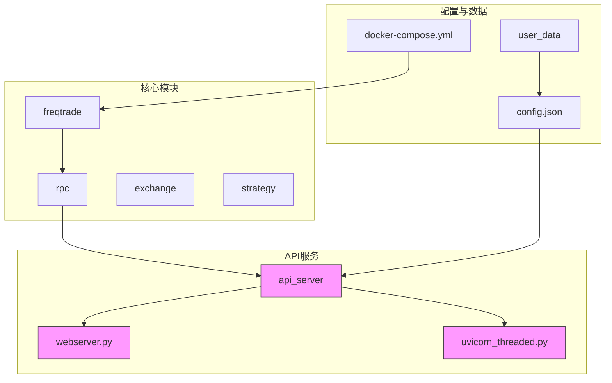
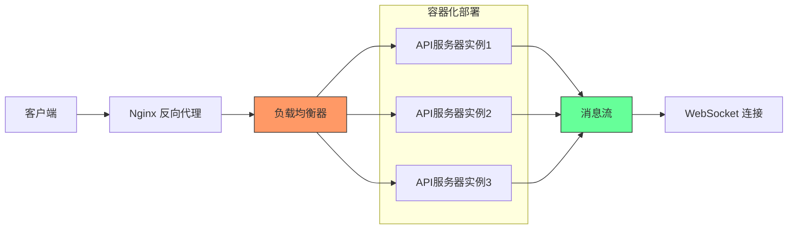
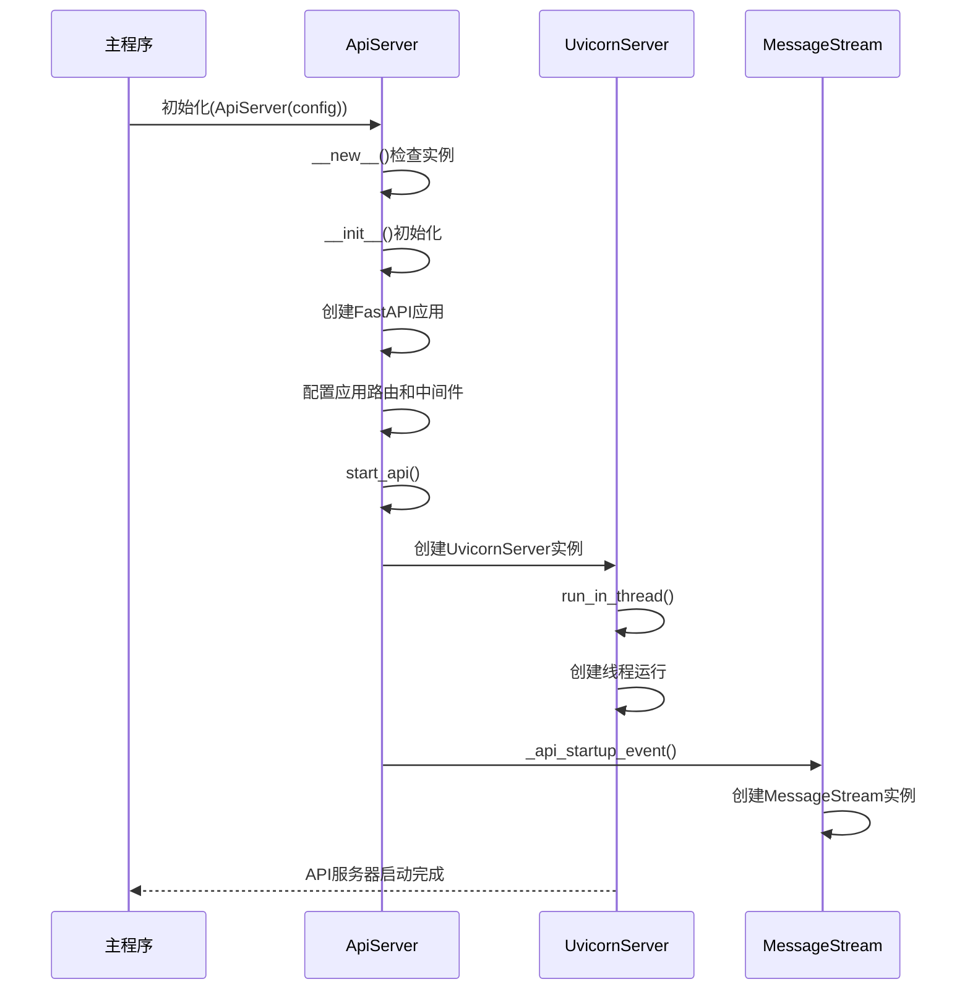
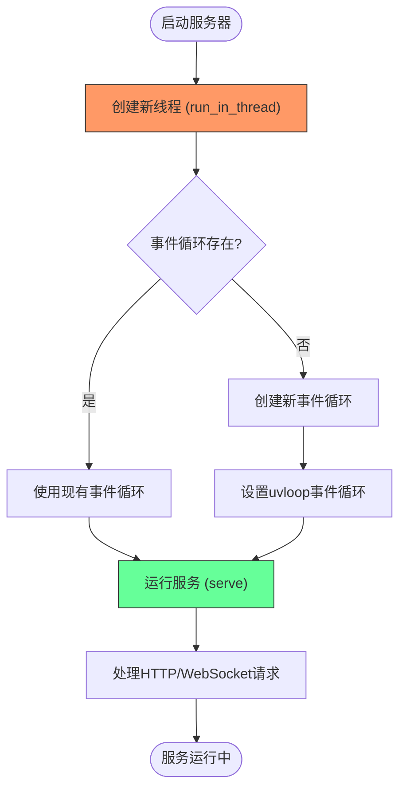
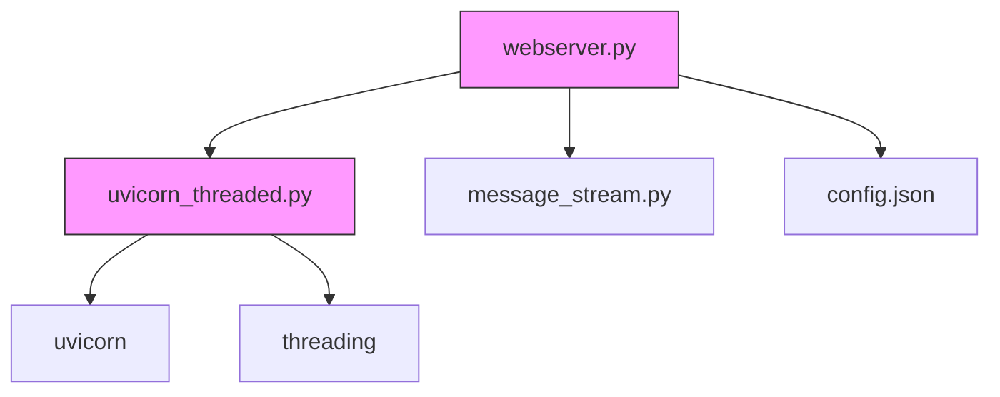

# 负载均衡与流量分发

<cite>
**Referenced Files in This Document**   
- [docker-compose.yml](file://docker-compose.yml)
- [webserver.py](file://freqtrade/rpc/api_server/webserver.py)
- [uvicorn_threaded.py](file://freqtrade/rpc/api_server/uvicorn_threaded.py)
- [config.json](file://user_data/config.json)
</cite>

## Table of Contents
1. [项目结构](#项目结构)
2. [核心组件](#核心组件)
3. [架构概述](#架构概述)
4. [详细组件分析](#详细组件分析)
5. [依赖分析](#依赖分析)
6. [性能考量](#性能考量)
7. [故障排除指南](#故障排除指南)
8. [结论](#结论)

## 项目结构

项目结构展示了Freqtrade系统的整体布局，包括核心模块、配置文件和用户数据目录。系统采用模块化设计，将交易逻辑、API服务、配置管理和用户策略分离。



**Diagram sources**
- [docker-compose.yml](file://docker-compose.yml#L1-L36)
- [webserver.py](file://freqtrade/rpc/api_server/webserver.py#L1-L245)

**Section sources**
- [docker-compose.yml](file://docker-compose.yml#L1-L36)
- [webserver.py](file://freqtrade/rpc/api_server/webserver.py#L1-L245)

## 核心组件

核心组件包括API服务器、Uvicorn多线程服务器和Docker容器编排配置。API服务器基于FastAPI框架构建，通过Uvicorn作为ASGI服务器运行，支持异步处理和高并发。Docker Compose配置文件定义了容器化部署的网络和服务配置，为负载均衡提供了基础架构支持。

**Section sources**
- [webserver.py](file://freqtrade/rpc/api_server/webserver.py#L1-L245)
- [uvicorn_threaded.py](file://freqtrade/rpc/api_server/uvicorn_threaded.py#L1-L65)

## 架构概述

系统采用分层架构，前端通过反向代理与后端API服务器通信，API服务器处理请求并分发到相应的业务逻辑模块。WebSocket连接通过消息流机制实现实时通信，确保低延迟的消息推送。



**Diagram sources**
- [docker-compose.yml](file://docker-compose.yml#L1-L36)
- [webserver.py](file://freqtrade/rpc/api_server/webserver.py#L1-L245)

## 详细组件分析

### API服务器分析

API服务器作为系统的核心服务组件，负责处理所有HTTP请求和WebSocket连接。它采用单例模式确保全局唯一实例，通过FastAPI框架提供RESTful API接口。

#### 类图
```mermaid
classDiagram
class ApiServer {
+__instance : ApiServer
+__initialized : bool
-_rpc : RPC
-_has_rpc : bool
-_config : Config
-_message_stream : MessageStream
-_standalone : bool
-_server : UvicornServer
+__init__(config : Config, standalone : bool)
+add_rpc_handler(rpc : RPC)
+cleanup()
+shutdown()
+send_msg(msg : RPCSendMsg)
+handle_rpc_exception(request, exc)
+configure_app(app : FastAPI, config)
+_api_startup_event()
+_api_shutdown_event()
+start_api()
}
class UvicornServer {
+thread : Thread
+run(sockets)
+run_in_thread()
+cleanup()
}
class FTJSONResponse {
+render(content : Any) : bytes
}
ApiServer --> UvicornServer : "使用"
ApiServer --> FTJSONResponse : "继承"
ApiServer --> MessageStream : "包含"
note right of ApiServer
单例模式确保全局唯一实例
通过UvicornServer处理HTTP请求
使用MessageStream管理WebSocket消息
end
```

**Diagram sources**
- [webserver.py](file://freqtrade/rpc/api_server/webserver.py#L34-L243)
- [uvicorn_threaded.py](file://freqtrade/rpc/api_server/uvicorn_threaded.py#L22-L63)

#### 启动流程序列图


**Diagram sources**
- [webserver.py](file://freqtrade/rpc/api_server/webserver.py#L54-L243)
- [uvicorn_threaded.py](file://freqtrade/rpc/api_server/uvicorn_threaded.py#L55-L59)

### Uvicorn多线程服务器分析

Uvicorn多线程服务器扩展了标准Uvicorn服务器功能，支持在独立线程中运行，为WebSocket连接和后台任务提供支持。

#### 多线程处理流程


**Diagram sources**
- [uvicorn_threaded.py](file://freqtrade/rpc/api_server/uvicorn_threaded.py#L35-L53)

## 依赖分析

系统组件之间的依赖关系清晰，API服务器依赖于Uvicorn服务器进行HTTP处理，同时依赖于消息流组件管理WebSocket连接。配置文件为所有组件提供运行时参数。



**Diagram sources**
- [webserver.py](file://freqtrade/rpc/api_server/webserver.py#L1-L245)
- [uvicorn_threaded.py](file://freqtrade/rpc/api_server/uvicorn_threaded.py#L1-L65)

**Section sources**
- [webserver.py](file://freqtrade/rpc/api_server/webserver.py#L1-L245)
- [uvicorn_threaded.py](file://freqtrade/rpc/api_server/uvicorn_threaded.py#L1-L65)

## 性能考量

### 并发处理能力

FastAPI应用通过Uvicorn服务器配置实现了高效的并发处理能力。系统采用多工作进程和线程模型，充分利用多核CPU资源。Uvicorn的ASGI服务器特性支持异步I/O操作，能够处理大量并发连接而不会阻塞。

在`webserver.py`中，`ApiServer`类通过`UvicornServer`实例启动API服务，该服务器被设计为可在独立线程中运行（`run_in_thread`方法），这使得主程序可以继续执行其他任务，同时API服务器在后台处理请求。

### 反向代理集成

虽然当前配置中未直接包含Nginx配置，但系统设计支持反向代理集成。通过Docker Compose的网络配置，可以轻松集成Nginx作为反向代理，实现API请求的均衡分发和静态资源缓存。建议的Nginx配置应包括：

- 负载均衡策略（如轮询、IP哈希）
- SSL终止
- 静态资源缓存
- 请求速率限制
- WebSocket连接升级支持

### WebSocket负载均衡策略

系统通过`MessageStream`组件实现WebSocket连接的统一管理。所有API服务器实例共享同一个消息流，确保实时消息推送的一致性和可靠性。负载均衡器应配置会话保持（session persistence）或使用共享消息队列，以确保WebSocket连接的稳定性和低延迟。

## 故障排除指南

### 常见问题

1. **API服务器无法启动**
   - 检查端口是否被占用
   - 验证配置文件中的监听地址和端口
   - 确认Docker容器网络配置

2. **WebSocket连接中断**
   - 检查消息流组件状态
   - 验证Uvicorn服务器的ping间隔设置
   - 确认网络防火墙未阻断WebSocket连接

3. **负载均衡不均**
   - 检查反向代理配置
   - 验证各API实例的健康状态
   - 监控各实例的资源使用情况

**Section sources**
- [webserver.py](file://freqtrade/rpc/api_server/webserver.py#L1-L245)
- [uvicorn_threaded.py](file://freqtrade/rpc/api_server/uvicorn_threaded.py#L1-L65)

## 结论

Freqtrade系统通过容器化部署和多线程服务器架构，实现了高效的负载均衡和流量分发能力。基于Docker Compose的网络配置为水平扩展提供了基础，FastAPI与Uvicorn的组合确保了高并发处理性能。通过集成反向代理和优化WebSocket连接管理，系统能够满足实时交易场景下的低延迟和高可靠性要求。建议进一步完善Nginx反向代理配置，实现更精细的流量控制和安全防护。