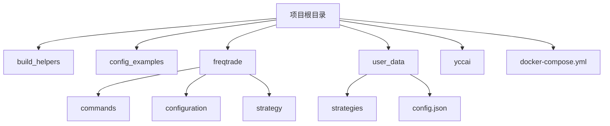
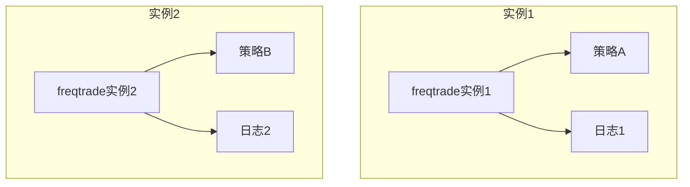
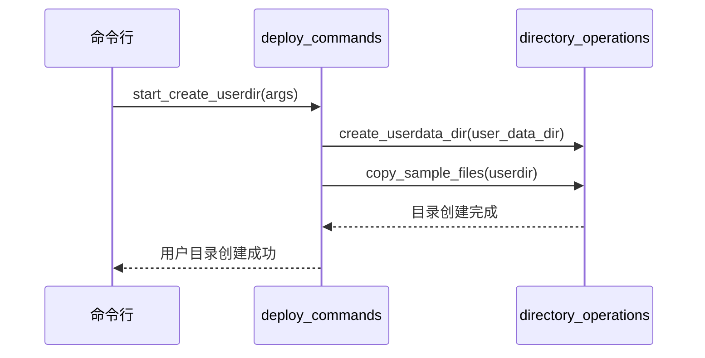
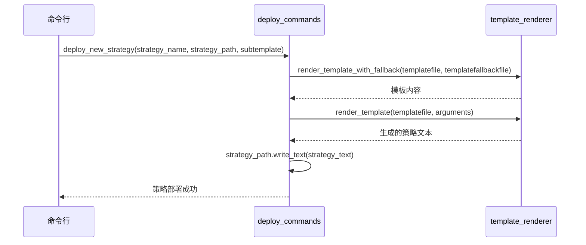
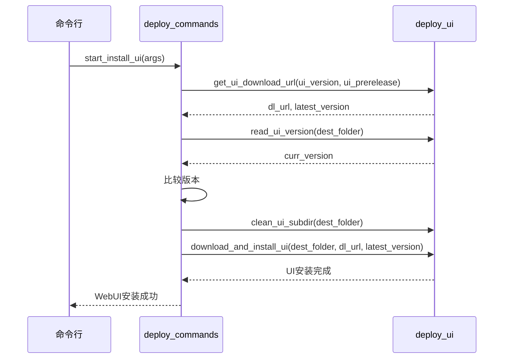
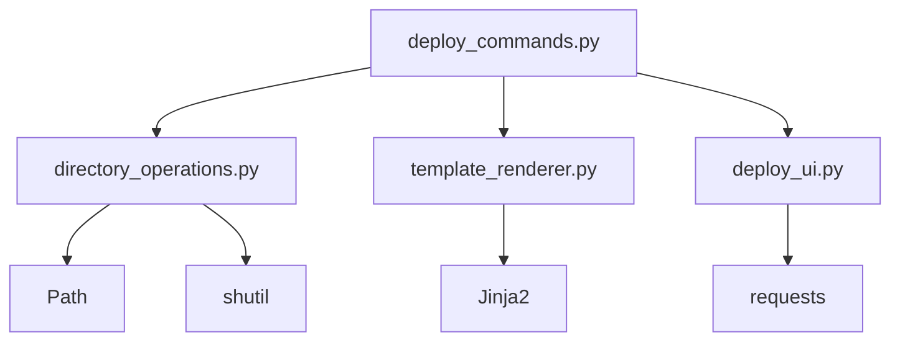

# 多实例管理

<cite>
**Referenced Files in This Document**   
- [deploy_commands.py](file://freqtrade/commands/deploy_commands.py)
- [docker-compose.yml](file://docker-compose.yml)
- [directory_operations.py](file://freqtrade/configuration/directory_operations.py)
- [template_renderer.py](file://freqtrade/util/template_renderer.py)
- [deploy_ui.py](file://freqtrade/commands/deploy_ui.py)
</cite>

## 目录
1. [简介](#简介)
2. [项目结构](#项目结构)
3. [核心组件](#核心组件)
4. [架构概述](#架构概述)
5. [详细组件分析](#详细组件分析)
6. [依赖分析](#依赖分析)
7. [性能考虑](#性能考虑)
8. [故障排除指南](#故障排除指南)
9. [结论](#结论)

## 简介
本文档详细说明了如何使用 `deploy_commands.py` 中的部署辅助函数来自动化创建用户目录、部署新策略和安装 WebUI。结合 `docker-compose.yml` 文件，展示了如何配置多个 freqtrade 实例以实现策略隔离或负载分担。文档深入分析了 `start_create_userdir`、`deploy_new_strategy` 等函数的内部逻辑和调用关系，并提供了在多实例环境下配置文件管理和日志分离的最佳实践。

## 项目结构
freqtrade 项目的结构设计合理，主要分为构建助手、配置示例、核心代码、测试和用户数据等部分。核心代码位于 `freqtrade` 目录下，包含命令、配置、数据处理、交易所接口、策略等模块。用户数据和策略文件存储在 `user_data` 目录中，便于管理和隔离。

**Diagram sources**
- [docker-compose.yml](file://docker-compose.yml#L1-L37)

**Section sources**
- [docker-compose.yml](file://docker-compose.yml#L1-L37)

## 核心组件
核心组件包括 `deploy_commands.py` 中的 `start_create_userdir`、`deploy_new_strategy` 和 `start_install_ui` 函数。这些函数分别用于创建用户目录、部署新策略和安装 WebUI。`start_create_userdir` 函数通过调用 `create_userdata_dir` 和 `copy_sample_files` 来创建用户数据目录并复制示例文件。`deploy_new_strategy` 函数使用 Jinja2 模板引擎生成新的策略文件。`start_install_ui` 函数负责下载和安装 WebUI。

**Section sources**
- [deploy_commands.py](file://freqtrade/commands/deploy_commands.py#L17-L132)

## 架构概述
freqtrade 的架构设计支持多实例部署，通过 `docker-compose.yml` 文件可以轻松配置多个实例。每个实例可以独立运行不同的策略，实现策略隔离。同时，通过负载均衡可以实现负载分担，提高系统的稳定性和性能。

**Diagram sources**
- [docker-compose.yml](file://docker-compose.yml#L1-L37)

## 详细组件分析

### 创建用户目录分析
`start_create_userdir` 函数是创建用户目录的核心。它首先检查用户是否提供了用户数据目录，如果提供了，则调用 `create_userdata_dir` 创建目录结构，并调用 `copy_sample_files` 复制示例文件。

**Diagram sources**
- [deploy_commands.py](file://freqtrade/commands/deploy_commands.py#L17-L30)
- [directory_operations.py](file://freqtrade/configuration/directory_operations.py#L46-L89)

**Section sources**
- [deploy_commands.py](file://freqtrade/commands/deploy_commands.py#L17-L30)
- [directory_operations.py](file://freqtrade/configuration/directory_operations.py#L46-L89)

### 部署新策略分析
`deploy_new_strategy` 函数使用 Jinja2 模板引擎生成新的策略文件。它首先从模板文件中读取策略的各个部分（如属性、指标、买卖趋势等），然后将这些部分组合成完整的策略文件，并写入指定路径。

**Diagram sources**
- [deploy_commands.py](file://freqtrade/commands/deploy_commands.py#L33-L79)
- [template_renderer.py](file://freqtrade/util/template_renderer.py#L5-L29)

**Section sources**
- [deploy_commands.py](file://freqtrade/commands/deploy_commands.py#L33-L79)
- [template_renderer.py](file://freqtrade/util/template_renderer.py#L5-L29)

### 安装WebUI分析
`start_install_ui` 函数负责下载和安装 WebUI。它首先获取最新的 UI 下载 URL，然后清除现有的 UI 目录内容，最后下载并解压新的 UI 文件。

**Diagram sources**
- [deploy_commands.py](file://freqtrade/commands/deploy_commands.py#L108-L132)
- [deploy_ui.py](file://freqtrade/commands/deploy_ui.py#L5-L87)

**Section sources**
- [deploy_commands.py](file://freqtrade/commands/deploy_commands.py#L108-L132)
- [deploy_ui.py](file://freqtrade/commands/deploy_ui.py#L5-L87)

## 依赖分析
`deploy_commands.py` 依赖于 `directory_operations.py` 和 `template_renderer.py` 模块。`directory_operations.py` 提供了创建目录和复制文件的功能，`template_renderer.py` 提供了模板渲染功能。`deploy_ui.py` 模块提供了下载和安装 WebUI 的功能。

**Diagram sources**
- [deploy_commands.py](file://freqtrade/commands/deploy_commands.py#L1-L133)
- [directory_operations.py](file://freqtrade/configuration/directory_operations.py#L1-L112)
- [template_renderer.py](file://freqtrade/util/template_renderer.py#L1-L30)
- [deploy_ui.py](file://freqtrade/commands/deploy_ui.py#L1-L87)

**Section sources**
- [deploy_commands.py](file://freqtrade/commands/deploy_commands.py#L1-L133)
- [directory_operations.py](file://freqtrade/configuration/directory_operations.py#L1-L112)
- [template_renderer.py](file://freqtrade/util/template_renderer.py#L1-L30)
- [deploy_ui.py](file://freqtrade/commands/deploy_ui.py#L1-L87)

## 性能考虑
在多实例环境下，性能考虑主要包括配置文件管理和日志分离。每个实例应使用独立的配置文件和日志文件，以避免冲突和提高可维护性。通过 `docker-compose.yml` 文件可以轻松配置每个实例的卷映射，实现配置文件和日志的隔离。

## 故障排除指南
常见问题包括用户目录创建失败、策略部署失败和 WebUI 安装失败。用户目录创建失败通常是由于权限问题或目录已存在。策略部署失败可能是由于模板文件缺失或路径错误。WebUI 安装失败可能是由于网络问题或版本不匹配。

**Section sources**
- [deploy_commands.py](file://freqtrade/commands/deploy_commands.py#L17-L132)
- [directory_operations.py](file://freqtrade/configuration/directory_operations.py#L46-L89)
- [deploy_ui.py](file://freqtrade/commands/deploy_ui.py#L5-L87)

## 结论
通过 `deploy_commands.py` 中的部署辅助函数，可以轻松实现用户目录创建、新策略部署和 WebUI 安装。结合 `docker-compose.yml` 文件，可以配置多个 freqtrade 实例，实现策略隔离和负载分担。在多实例环境下，合理的配置文件管理和日志分离是确保系统稳定性和可维护性的关键。