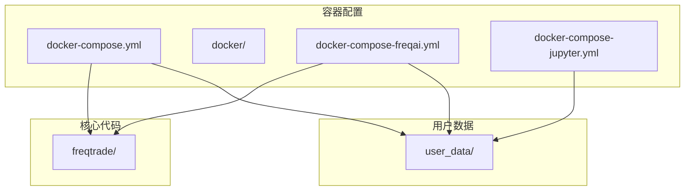
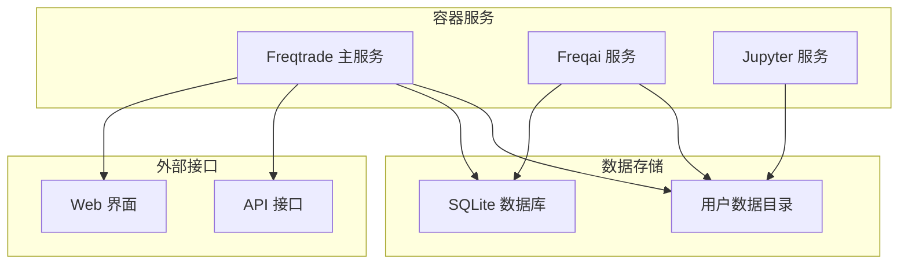
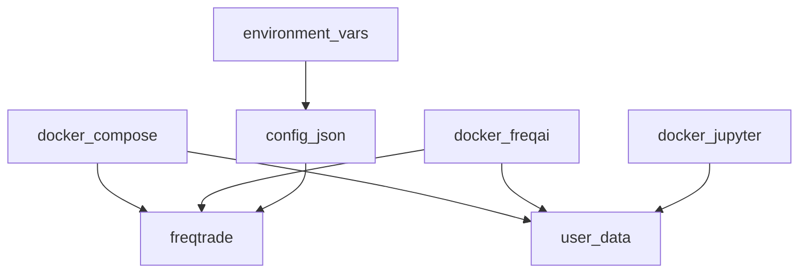
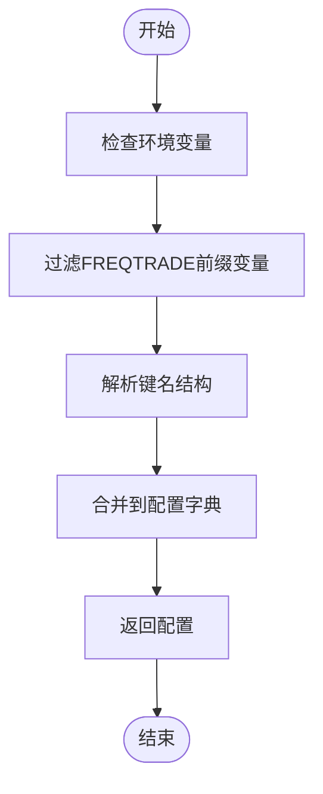

# 容器编排配置

<cite>
**Referenced Files in This Document**   
- [docker-compose.yml](file://docker-compose.yml)
- [docker-compose-freqai.yml](file://docker/docker-compose-freqai.yml)
- [docker-compose-jupyter.yml](file://docker/docker-compose-jupyter.yml)
- [config.json](file://user_data/config.json)
- [config_freqai.example.json](file://config_examples/config_freqai.example.json)
- [environment_vars.py](file://freqtrade/configuration/environment_vars.py)
</cite>

## 目录
1. [简介](#简介)
2. [项目结构](#项目结构)
3. [核心组件](#核心组件)
4. [架构概述](#架构概述)
5. [详细组件分析](#详细组件分析)
6. [依赖分析](#依赖分析)
7. [性能考虑](#性能考虑)
8. [故障排除指南](#故障排除指南)
9. [结论](#结论)
10. [附录](#附录)

## 简介
本文档详细解析Freqtrade项目的Docker容器编排配置，重点分析主服务的镜像选择、卷挂载策略、端口映射规则以及容器重启策略。通过对比不同场景下的Compose文件差异，包括freqai专用配置和jupyter集成配置，全面阐述容器化部署的参数化配置方法，确保配置的一致性与安全性。

## 项目结构
Freqtrade项目采用模块化设计，核心代码位于`freqtrade/`目录下，用户数据和配置文件集中存放在`user_data/`目录中。容器化相关文件主要分布在根目录和`docker/`子目录下，包括主Compose文件和针对特定功能的专用Compose文件。



**Diagram sources**
- [docker-compose.yml](file://docker-compose.yml#L1-L36)
- [docker-compose-freqai.yml](file://docker/docker-compose-freqai.yml#L1-L35)
- [docker-compose-jupyter.yml](file://docker/docker-compose-jupyter.yml#L1-L15)

**Section sources**
- [docker-compose.yml](file://docker-compose.yml#L1-L36)
- [docker-compose-freqai.yml](file://docker/docker-compose-freqai.yml#L1-L35)
- [docker-compose-jupyter.yml](file://docker/docker-compose-jupyter.yml#L1-L15)

## 核心组件
本文档的核心组件包括主服务容器编排、freqai专用配置、jupyter集成配置以及环境变量处理机制。这些组件共同构成了Freqtrade的容器化部署方案，确保了系统的灵活性、可扩展性和安全性。

**Section sources**
- [docker-compose.yml](file://docker-compose.yml#L1-L36)
- [docker-compose-freqai.yml](file://docker/docker-compose-freqai.yml#L1-L35)
- [docker-compose-jupyter.yml](file://docker/docker-compose-jupyter.yml#L1-L15)
- [environment_vars.py](file://freqtrade/configuration/environment_vars.py#L75-L81)

## 架构概述
Freqtrade的容器化架构采用微服务设计理念，通过Docker Compose管理多个服务实例。主服务负责交易执行和策略运行，freqai服务提供机器学习支持，jupyter服务则用于数据分析和策略开发。



**Diagram sources**
- [docker-compose.yml](file://docker-compose.yml#L1-L36)
- [docker-compose-freqai.yml](file://docker/docker-compose-freqai.yml#L1-L35)
- [docker-compose-jupyter.yml](file://docker/docker-compose-jupyter.yml#L1-L15)

## 详细组件分析

### 主服务编排分析
Freqtrade主服务的Docker Compose配置定义了容器的核心运行参数，包括镜像选择、卷挂载、端口映射和重启策略。

#### 服务配置
```mermaid
classDiagram
class FreqtradeService {
+image : string
+restart : string
+container_name : string
+volumes : array
+ports : array
+command : string
}
FreqtradeService : "image" --> "freqtradeorg/freqtrade : stable"
FreqtradeService : "volumes" --> "./user_data : /freqtrade/user_data"
FreqtradeService : "ports" --> "127.0.0.1 : 8080 : 8080"
FreqtradeService : "command" --> "trade --config ..."
```

**Diagram sources**
- [docker-compose.yml](file://docker-compose.yml#L1-L36)

#### 镜像选择
主服务使用`freqtradeorg/freqtrade:stable`作为基础镜像，确保了生产环境的稳定性。该镜像包含了Freqtrade运行所需的所有依赖和工具。

**Section sources**
- [docker-compose.yml](file://docker-compose.yml#L3-L5)

#### 卷挂载策略
通过`./user_data:/freqtrade/user_data`的卷挂载配置，实现了宿主机与容器之间的数据持久化。这种策略确保了用户配置、策略文件和交易数据在容器重启后不会丢失。

**Section sources**
- [docker-compose.yml](file://docker-compose.yml#L15-L17)

#### 端口映射规则
服务通过`127.0.0.1:8080:8080`的端口映射规则，将容器内的8080端口暴露给宿主机的本地回环地址。这种配置既保证了API服务的可访问性，又限制了外部网络的直接访问，提高了安全性。

**Section sources**
- [docker-compose.yml](file://docker-compose.yml#L19-L21)

#### 重启策略
`restart: unless-stopped`策略确保了容器在系统重启或意外终止后能够自动恢复运行，同时允许用户通过`docker stop`命令主动停止服务。

**Section sources**
- [docker-compose.yml](file://docker-compose.yml#L10-L11)

### freqai专用配置分析
freqai专用的Compose文件针对机器学习场景进行了优化，使用了包含PyTorch等AI框架的专用镜像。

#### 专用镜像配置
```mermaid
classDiagram
class FreqtradeFreqaiService {
+image : string
+freqaimodel : string
+strategy : string
}
FreqtradeFreqaiService : "image" --> "freqtradeorg/freqtrade : stable_freqaitorch"
FreqtradeFreqaiService : "command" --> "--freqaimodel XGBoostRegressor"
FreqtradeFreqaiService : "command" --> "--strategy FreqaiExampleStrategy"
```

**Diagram sources**
- [docker-compose-freqai.yml](file://docker/docker-compose-freqai.yml#L1-L35)

#### 配置差异对比
与主服务相比，freqai配置的主要差异体现在：
1. 使用`stable_freqaitorch`专用镜像
2. 启用`XGBoostRegressor`机器学习模型
3. 采用`FreqaiExampleStrategy`示例策略

**Section sources**
- [docker-compose-freqai.yml](file://docker/docker-compose-freqai.yml#L1-L35)
- [config_freqai.example.json](file://config_examples/config_freqai.example.json#L1-L91)

### jupyter集成配置分析
jupyter集成配置提供了数据分析和策略开发的交互式环境。

#### Jupyter服务配置
```mermaid
classDiagram
class JupyterService {
+build : object
+ports : array
+volumes : array
+command : string
}
JupyterService : "ports" --> "127.0.0.1 : 8888 : 8888"
JupyterService : "volumes" --> "../user_data : /freqtrade/user_data"
JupyterService : "command" --> "jupyter lab --port=8888"
```

**Diagram sources**
- [docker-compose-jupyter.yml](file://docker/docker-compose-jupyter.yml#L1-L15)

#### 集成功能
jupyter服务通过8888端口提供Web界面访问，允许用户在浏览器中进行数据分析、策略测试和代码调试。

**Section sources**
- [docker-compose-jupyter.yml](file://docker/docker-compose-jupyter.yml#L1-L15)

## 依赖分析
容器化部署的各个组件之间存在明确的依赖关系，这些关系通过Compose文件的配置得以体现。



**Diagram sources**
- [docker-compose.yml](file://docker-compose.yml#L1-L36)
- [docker-compose-freqai.yml](file://docker/docker-compose-freqai.yml#L1-L35)
- [docker-compose-jupyter.yml](file://docker/docker-compose-jupyter.yml#L1-L15)
- [config.json](file://user_data/config.json#L1-L93)
- [environment_vars.py](file://freqtrade/configuration/environment_vars.py#L75-L81)

**Section sources**
- [docker-compose.yml](file://docker-compose.yml#L1-L36)
- [docker-compose-freqai.yml](file://docker/docker-compose-freqai.yml#L1-L35)
- [docker-compose-jupyter.yml](file://docker/docker-compose-jupyter.yml#L1-L15)
- [config.json](file://user_data/config.json#L1-L93)
- [environment_vars.py](file://freqtrade/configuration/environment_vars.py#L75-L81)

## 性能考虑
容器化部署的性能主要受以下几个因素影响：
1. 卷挂载的I/O性能
2. 容器间网络通信延迟
3. 镜像大小和启动时间
4. 资源限制和分配

通过合理的配置和优化，可以确保系统在高负载下的稳定运行。

## 故障排除指南
当遇到容器化部署问题时，可以按照以下步骤进行排查：
1. 检查Compose文件语法是否正确
2. 验证卷挂载路径是否存在且可访问
3. 确认端口映射没有冲突
4. 检查日志文件以获取错误信息
5. 验证环境变量配置是否正确

**Section sources**
- [docker-compose.yml](file://docker-compose.yml#L1-L36)
- [config.json](file://user_data/config.json#L1-L93)
- [environment_vars.py](file://freqtrade/configuration/environment_vars.py#L75-L81)

## 结论
Freqtrade的容器化部署方案通过Docker Compose实现了服务的灵活编排和管理。通过合理的镜像选择、卷挂载策略、端口映射和重启策略，确保了系统的稳定性、安全性和可维护性。不同场景下的专用配置文件进一步增强了系统的适应性和扩展性。

## 附录

### 环境变量处理
Freqtrade通过`environment_vars_to_dict`函数处理环境变量，将符合`FREQTRADE__{section}__{key}`模式的环境变量转换为嵌套字典结构，实现配置的参数化。



**Diagram sources**
- [environment_vars.py](file://freqtrade/configuration/environment_vars.py#L75-L81)

**Section sources**
- [environment_vars.py](file://freqtrade/configuration/environment_vars.py#L75-L81)