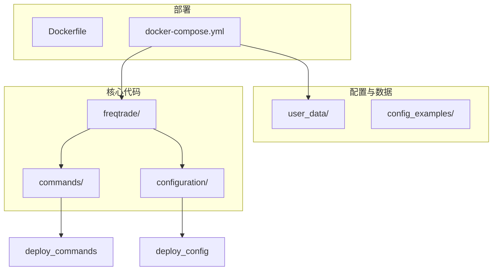
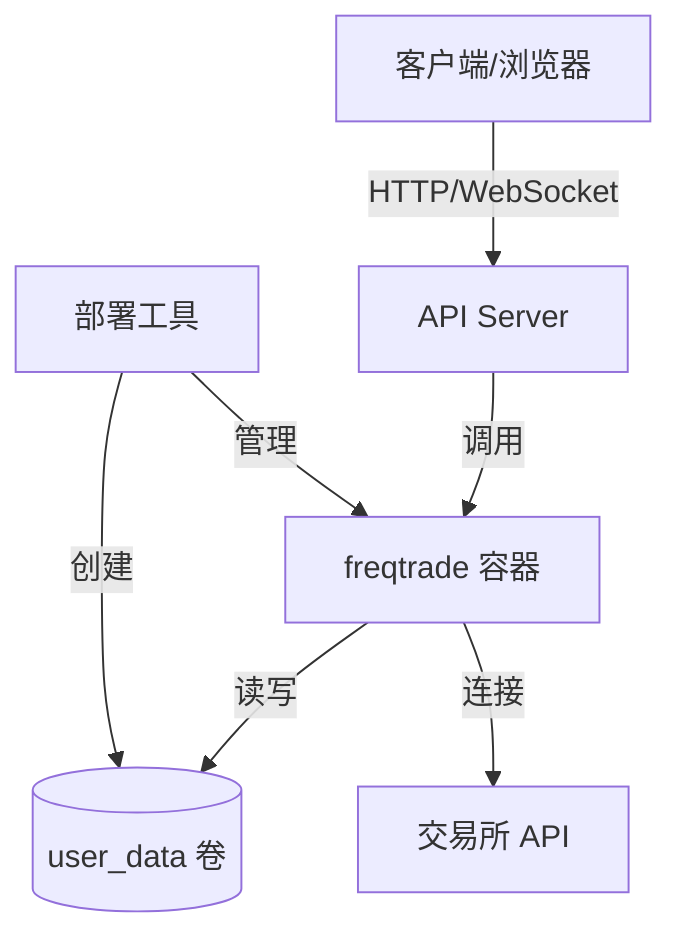
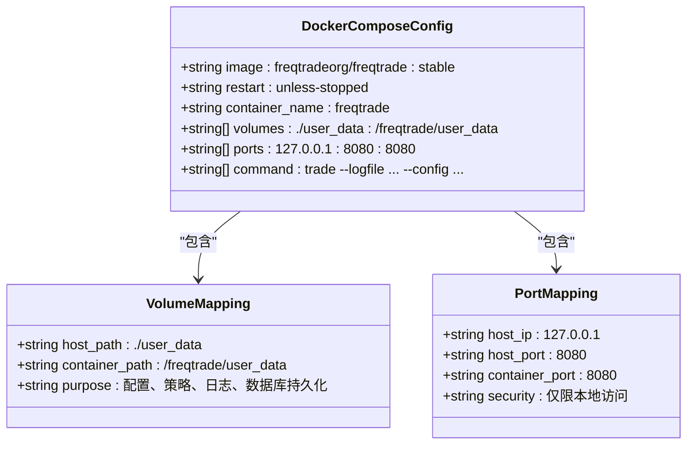
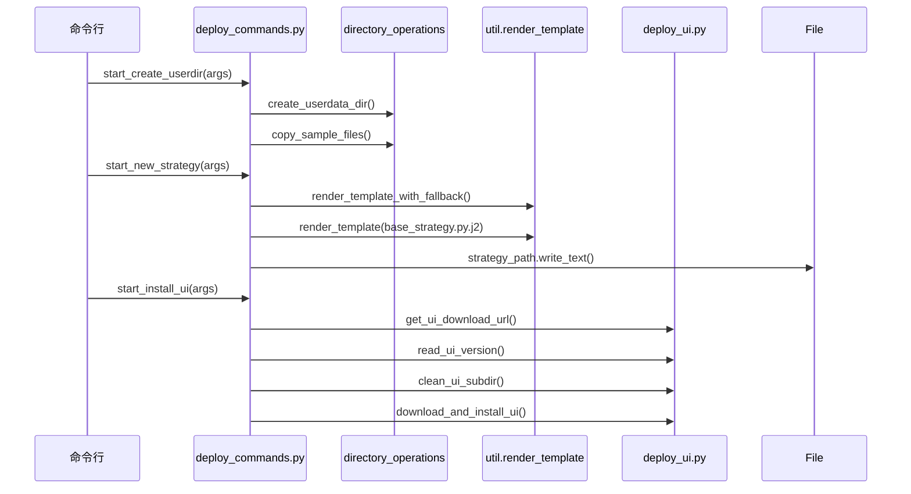
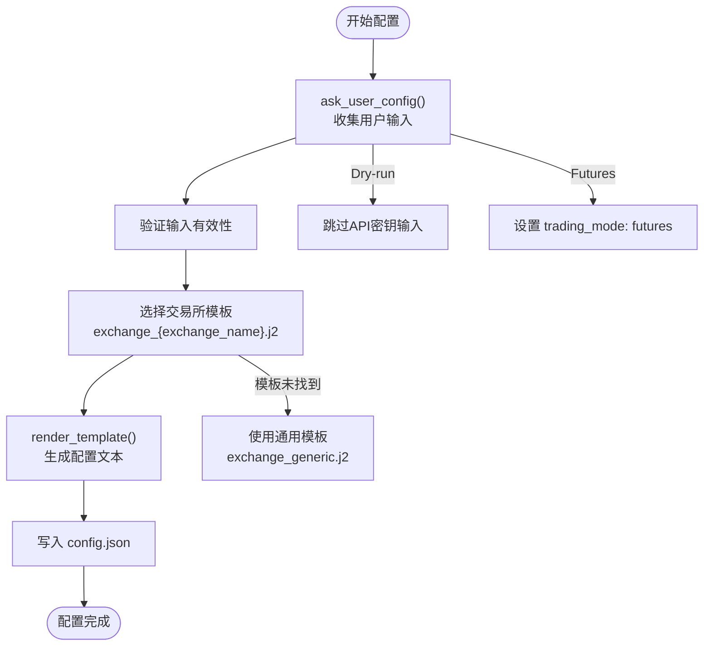
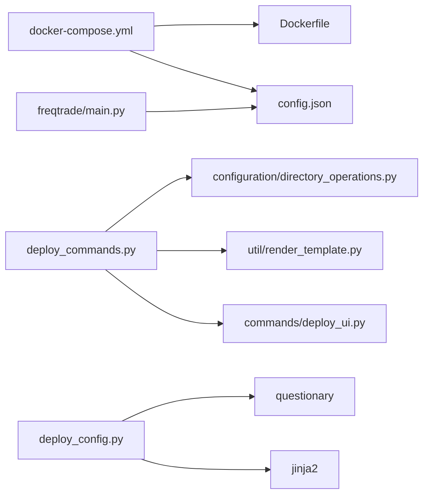

# 集群部署与服务编排

<cite>
**本文档中引用的文件**  
- [docker-compose.yml](file://docker-compose.yml)
- [deploy_commands.py](file://freqtrade/commands/deploy_commands.py)
- [config.json](file://user_data/config.json)
- [deploy_config.py](file://freqtrade/configuration/deploy_config.py)
- [Dockerfile](file://Dockerfile)
</cite>

## 目录
1. [简介](#简介)
2. [项目结构](#项目结构)
3. [核心组件](#核心组件)
4. [架构概述](#架构概述)
5. [详细组件分析](#详细组件分析)
6. [依赖分析](#依赖分析)
7. [性能考虑](#性能考虑)
8. [故障排除指南](#故障排除指南)
9. [结论](#结论)

## 简介
本文档详细说明了基于 `docker-compose.yml` 文件的多容器集群部署方案，重点介绍如何配置多个 freqtrade 实例实现负载分担。文档涵盖服务定义中的镜像选择、卷挂载和端口映射策略，解析 `deploy_commands.py` 中提供的部署辅助命令，并提供容器间通信、数据库共享、日志集中管理、资源限制和健康检查的最佳实践。

**Section sources**
- [docker-compose.yml](file://docker-compose.yml#L1-L36)

## 项目结构
项目采用模块化设计，主要目录包括：
- `freqtrade/`：核心交易逻辑与命令实现
- `user_data/`：用户配置、策略和日志数据
- `config_examples/`：配置文件示例
- `yccai/`：特定用户策略与配置
- 根目录包含 `docker-compose.yml` 和 `Dockerfile` 用于容器化部署



**Diagram sources**
- [docker-compose.yml](file://docker-compose.yml#L1-L36)
- [Dockerfile](file://Dockerfile#L1-L53)

## 核心组件
核心组件包括 `freqtrade` 服务容器、用户数据目录挂载、REST API 端口暴露以及通过 `deploy_commands.py` 提供的自动化部署工具。系统通过 `config.json` 进行运行时配置，支持多种交易所和交易模式。

**Section sources**
- [docker-compose.yml](file://docker-compose.yml#L1-L36)
- [config.json](file://user_data/config.json#L1-L93)
- [deploy_commands.py](file://freqtrade/commands/deploy_commands.py#L1-L133)

## 架构概述
系统采用基于 Docker 的微服务架构，主服务容器运行 freqtrade 交易机器人，通过卷挂载共享用户数据，通过端口映射暴露 REST API 接口。部署工具提供创建用户目录、生成新策略和安装 Web UI 的功能。



**Diagram sources**
- [docker-compose.yml](file://docker-compose.yml#L1-L36)
- [deploy_commands.py](file://freqtrade/commands/deploy_commands.py#L1-L133)

## 详细组件分析

### docker-compose 服务配置分析
`docker-compose.yml` 文件定义了 `freqtrade` 服务，使用官方稳定镜像 `freqtradeorg/freqtrade:stable`。服务配置了重启策略 `unless-stopped`，确保容器在非手动停止情况下自动重启。

卷挂载将宿主机的 `./user_data` 目录映射到容器内的 `/freqtrade/user_data`，实现配置、策略、日志和数据库的持久化存储。端口映射将容器的 8080 端口暴露到宿主机的 127.0.0.1:8080，限制外部访问以增强安全性。

启动命令指定了日志文件路径、SQLite 数据库路径、主配置文件和默认策略，实现了配置的外部化和可管理性。



**Diagram sources**
- [docker-compose.yml](file://docker-compose.yml#L1-L36)

**Section sources**
- [docker-compose.yml](file://docker-compose.yml#L1-L36)

### 部署命令工具分析
`deploy_commands.py` 文件提供了三个核心部署辅助命令：

1. **`start_create_userdir`**: 创建用户数据目录，通过 `create_userdata_dir` 和 `copy_sample_files` 函数初始化 `user_data` 目录结构并复制示例文件。
2. **`start_new_strategy`**: 基于模板生成新策略文件，使用 Jinja2 模板引擎从 `strategy_subtemplates` 目录加载模板片段（如指标、买卖趋势），并组合成完整的策略文件。
3. **`start_install_ui`**: 管理 FreqUI 前端界面的安装与更新，通过 `download_and_install_ui` 函数下载最新版本的 UI 资产到指定目录。

这些命令通过命令行接口（CLI）集成，实现了部署流程的自动化。



**Diagram sources**
- [deploy_commands.py](file://freqtrade/commands/deploy_commands.py#L1-L133)

**Section sources**
- [deploy_commands.py](file://freqtrade/commands/deploy_commands.py#L1-L133)
- [arguments.py](file://freqtrade/commands/arguments.py#L1-L707)
- [cli_options.py](file://freqtrade/commands/cli_options.py#L1-L832)

### 配置部署机制分析
`deploy_config.py` 文件中的 `ask_user_config` 和 `deploy_new_config` 函数实现了交互式配置生成功能。`ask_user_config` 使用 `questionary` 库向用户提问，收集交易所、API密钥、交易模式等配置信息。`deploy_new_config` 则使用 Jinja2 模板引擎，根据用户选择动态生成最终的 `config.json` 文件。

该机制支持多种交易所的模板化配置，通过 `MAP_EXCHANGE_CHILDCLASS` 映射选择特定交易所的模板，确保生成的配置符合各交易所的特殊要求。



**Diagram sources**
- [deploy_config.py](file://freqtrade/configuration/deploy_config.py#L1-L250)

**Section sources**
- [deploy_config.py](file://freqtrade/configuration/deploy_config.py#L1-L250)
- [config.json](file://user_data/config.json#L1-L93)

## 依赖分析
系统依赖关系清晰，`docker-compose.yml` 依赖于 `Dockerfile` 定义的基础镜像和构建步骤。`deploy_commands.py` 依赖于 `freqtrade` 核心模块中的配置和工具函数。`config.json` 作为运行时配置，被 `freqtrade` 主程序和部署工具共同依赖。



**Diagram sources**
- [docker-compose.yml](file://docker-compose.yml#L1-L36)
- [Dockerfile](file://Dockerfile#L1-L53)
- [deploy_commands.py](file://freqtrade/commands/deploy_commands.py#L1-L133)
- [deploy_config.py](file://freqtrade/configuration/deploy_config.py#L1-L250)

**Section sources**
- [docker-compose.yml](file://docker-compose.yml#L1-L36)
- [Dockerfile](file://Dockerfile#L1-L53)
- [deploy_commands.py](file://freqtrade/commands/deploy_commands.py#L1-L133)
- [deploy_config.py](file://freqtrade/configuration/deploy_config.py#L1-L250)

## 性能考虑
为确保集群稳定性，建议在 `docker-compose.yml` 中添加资源限制和健康检查配置。资源限制可防止单个容器耗尽宿主机资源，健康检查可确保服务的可用性。

```yaml
services:
  freqtrade:
    # ... 其他配置
    deploy:
      resources:
        limits:
          cpus: '0.50'
          memory: 512M
        reservations:
          cpus: '0.25'
          memory: 256M
    healthcheck:
      test: ["CMD", "freqtrade", "status"]
      interval: 30s
      timeout: 10s
      retries: 3
      start_period: 40s
```

此外，对于多实例部署，应考虑使用外部数据库（如 PostgreSQL）替代 SQLite，以支持并发访问和提高数据一致性。

**Section sources**
- [docker-compose.yml](file://docker-compose.yml#L1-L36)

## 故障排除指南
- **容器无法启动**: 检查 `user_data` 目录权限，确保容器用户（ftuser）有读写权限。
- **API 无法访问**: 确认 `docker-compose.yml` 中的端口映射正确，且防火墙未阻止 8080 端口。
- **策略加载失败**: 检查 `user_data/strategies/` 目录下策略文件的命名和语法。
- **数据库连接错误**: 确认 `config.json` 中的 `db-url` 路径正确，且数据库文件可被容器访问。
- **UI 无法显示**: 运行 `freqtrade install-ui` 命令或检查 `rpc/api_server/ui/installed/` 目录是否存在 UI 文件。

**Section sources**
- [docker-compose.yml](file://docker-compose.yml#L1-L36)
- [config.json](file://user_data/config.json#L1-L93)
- [deploy_commands.py](file://freqtrade/commands/deploy_commands.py#L1-L133)

## 结论
本文档详细阐述了 freqtrade 的多容器集群部署方案。通过 `docker-compose.yml` 实现了服务的容器化编排，利用卷挂载和端口映射确保了数据持久化和服务可访问性。`deploy_commands.py` 提供的自动化工具极大简化了用户目录创建、策略生成和 UI 安装等部署任务。结合 `deploy_config.py` 的交互式配置功能，形成了一套完整的、易于使用的部署体系。为保障生产环境的稳定性，建议实施资源限制、健康检查和外部数据库等最佳实践。