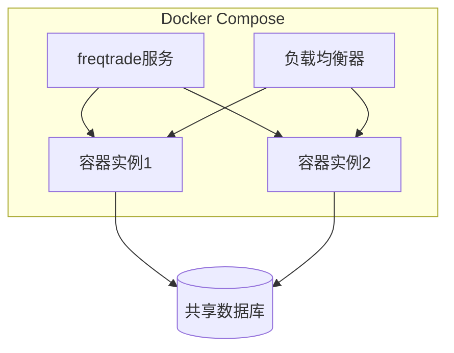
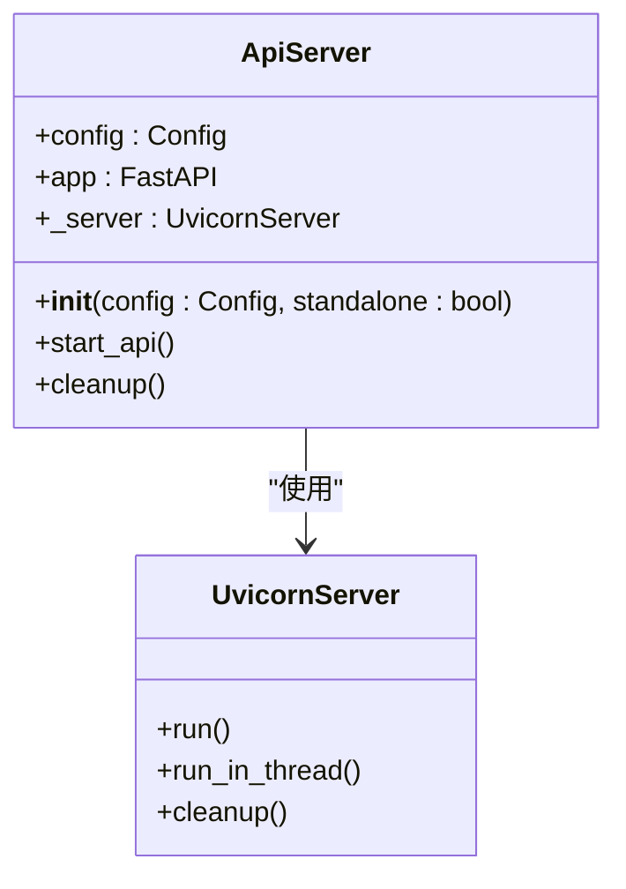

# 高可用性与扩展

<cite>
**本文档中引用的文件**   
- [docker-compose.yml](file://docker-compose.yml)
- [webserver.py](file://freqtrade/rpc/api_server/webserver.py)
- [uvicorn_threaded.py](file://freqtrade/rpc/api_server/uvicorn_threaded.py)
- [webserver_bgwork.py](file://freqtrade/rpc/api_server/webserver_bgwork.py)
- [configuration.py](file://freqtrade/configuration/configuration.py)
- [api_v1.py](file://freqtrade/rpc/api_server/api_v1.py)
</cite>

## 目录
1. [引言](#引言)
2. [高可用性部署架构](#高可用性部署架构)
3. [水平扩展方案](#水平扩展方案)
4. [数据库共享与状态同步](#数据库共享与状态同步)
5. [Web服务器并发处理](#web服务器并发处理)
6. [灾难恢复与故障转移](#灾难恢复与故障转移)
7. [性能瓶颈分析](#性能瓶颈分析)
8. [系统容量规划](#系统容量规划)

## 引言
本文档旨在为Freqtrade交易系统设计高可用性部署架构和水平扩展方案，确保系统的稳定性和可扩展性。通过分析docker-compose.yml配置和webserver.py中的Web服务器实现，我们将详细说明如何通过容器编排实现服务冗余和负载均衡，以及多实例部署时的数据库共享和状态同步机制。同时，本文档将提供灾难恢复计划和故障转移策略，包括数据备份和快速恢复方案，并包含性能瓶颈分析和系统容量规划指南。

## 高可用性部署架构
Freqtrade系统通过Docker容器化部署，利用docker-compose.yml配置实现服务的高可用性。在docker-compose.yml文件中，定义了一个名为freqtrade的服务，该服务使用freqtradeorg/freqtrade:stable镜像，并通过volumes将本地的user_data目录挂载到容器内的/freqtrade/user_data目录，确保数据的持久化。

**Diagram sources**
- [docker-compose.yml](file://docker-compose.yml#L1-L36)

**Section sources**
- [docker-compose.yml](file://docker-compose.yml#L1-L36)

## 水平扩展方案
通过Docker Compose配置，可以轻松实现Freqtrade服务的水平扩展。每个容器实例都独立运行，通过负载均衡器分发请求，从而提高系统的处理能力和可用性。在多实例部署时，所有实例共享同一个数据库，确保数据的一致性。

## 数据库共享与状态同步
在多实例部署中，所有Freqtrade实例共享同一个SQLite数据库，通过db-url参数指定数据库路径。这种设计确保了所有实例都能访问相同的数据，避免了数据不一致的问题。同时，通过配置CORS_origins，可以控制哪些来源的请求可以访问API，增强了系统的安全性。

**Section sources**
- [docker-compose.yml](file://docker-compose.yml#L1-L36)
- [configuration.py](file://freqtrade/configuration/configuration.py#L1-L547)

## Web服务器并发处理
Web服务器的并发处理能力由Uvicorn服务器提供，通过FastAPI框架实现。在webserver.py中，ApiServer类负责启动和管理API服务器，通过UvicornServer类的run_in_thread方法在独立线程中运行，确保了Web服务器的高并发处理能力。

**Diagram sources**
- [webserver.py](file://freqtrade/rpc/api_server/webserver.py#L54-L72)
- [uvicorn_threaded.py](file://freqtrade/rpc/api_server/uvicorn_threaded.py#L22-L63)

**Section sources**
- [webserver.py](file://freqtrade/rpc/api_server/webserver.py#L54-L72)
- [uvicorn_threaded.py](file://freqtrade/rpc/api_server/uvicorn_threaded.py#L22-L63)

## 灾难恢复与故障转移
为了确保系统的高可用性，需要制定详细的灾难恢复计划和故障转移策略。通过定期备份数据库和配置文件，可以在发生故障时快速恢复系统。同时，通过监控系统的健康状态，可以及时发现并处理潜在问题，避免故障的发生。

**Section sources**
- [webserver.py](file://freqtrade/rpc/api_server/webserver.py#L85-L94)
- [webserver_bgwork.py](file://freqtrade/rpc/api_server/webserver_bgwork.py#L24-L47)

## 性能瓶颈分析
性能瓶颈可能出现在数据库访问、网络通信和计算密集型任务等方面。通过优化数据库查询、使用缓存技术和异步处理，可以有效缓解这些瓶颈。同时，通过监控系统的资源使用情况，可以及时发现并解决性能问题。

**Section sources**
- [api_v1.py](file://freqtrade/rpc/api_server/api_v1.py#L1-L575)
- [webserver.py](file://freqtrade/rpc/api_server/webserver.py#L195-L243)

## 系统容量规划
系统容量规划需要考虑预期的交易量、用户数量和数据存储需求。通过压力测试和性能评估，可以确定系统的最大承载能力，并据此规划硬件资源和网络带宽。同时，通过弹性伸缩机制，可以根据实际负载动态调整资源，确保系统的稳定运行。

**Section sources**
- [configuration.py](file://freqtrade/configuration/configuration.py#L1-L547)
- [webserver.py](file://freqtrade/rpc/api_server/webserver.py#L195-L243)