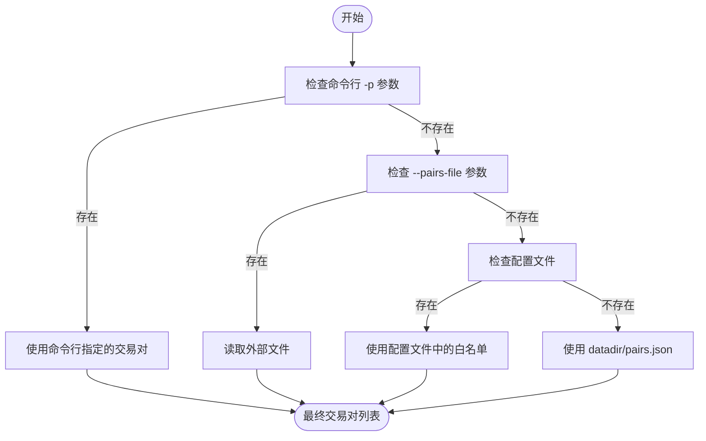

# 交易对管理

<cite>
**本文档中引用的文件**   
- [config_binance.example.json](file://config_examples/config_binance.example.json)
- [configuration.py](file://freqtrade/configuration/configuration.py)
- [pairlistmanager.py](file://freqtrade/plugins/pairlistmanager.py)
- [StaticPairList.py](file://freqtrade/plugins/pairlist/StaticPairList.py)
- [IPairList.py](file://freqtrade/plugins/pairlist/IPairList.py)
</cite>

## 目录
1. [简介](#简介)
2. [交易对白名单与黑名单配置](#交易对白名单与黑名单配置)
3. [交易对列表解析机制](#交易对列表解析机制)
4. [数据新鲜度与过期偏移量](#数据新鲜度与过期偏移量)
5. [动态与静态交易对列表对比](#动态与静态交易对列表对比)
6. [交易模式下的特殊注意事项](#交易模式下的特殊注意事项)
7. [结论](#结论)

## 简介
本文档全面阐述了Freqtrade中交易对白名单（`pair_whitelist`）和黑名单（`pair_blacklist`）的管理机制。基于Binance交易所的配置示例，详细解释了交易对正则表达式匹配规则及其优先级。深入分析了核心配置类如何解析来自命令行、配置文件和外部文件的交易对列表。同时，探讨了`outdated_offset`参数在判断数据新鲜度和筛选交易对中的作用。最后，对比了动态生成与静态配置的交易对列表，并指出了在不同交易模式下管理交易对的特殊注意事项。

## 交易对白名单与黑名单配置

Freqtrade通过`pair_whitelist`和`pair_blacklist`两个配置项来精确控制可交易的资产对。这些配置位于配置文件的`exchange`部分，是交易策略执行的基础。

在`config_binance.example.json`示例中，`pair_whitelist`被定义为一个明确的交易对列表，如`"ALGO/USDT"`、`"ATOM/USDT"`等。这代表了一个静态的、手动维护的可交易资产池。而`pair_blacklist`则使用了正则表达式`"BNB/.*"`，这表示所有以`BNB/`开头的交易对都将被排除在交易范围之外，即使它们出现在白名单中。

这种黑白名单机制遵循严格的优先级：黑名单的优先级高于白名单。这意味着，一个交易对即使被加入白名单，只要它匹配黑名单中的任何正则表达式，就会被系统自动过滤掉。这种设计提供了极大的灵活性，允许用户先定义一个广泛的白名单，再通过黑名单精确地排除不希望交易的特定资产（如高风险或低流动性的代币）。

**Section sources**
- [config_binance.example.json](file://config_examples/config_binance.example.json#L50-L70)

## 交易对列表解析机制

交易对列表的最终确定是通过`configuration.py`中的`_resolve_pairs_list`方法完成的。该方法定义了一个清晰的优先级链，用于确定最终的交易对列表。

该方法的执行逻辑如下：
1.  **命令行参数 `pairs` 优先**：如果在启动命令中通过`-p`或`--pairs`指定了交易对，这些交易对将直接成为最终的白名单，覆盖所有其他配置。
2.  **外部文件次之**：如果未指定命令行参数，但通过`--pairs-file`指定了一个文件路径，系统会读取该文件（通常为JSON格式）的内容作为交易对列表。
3.  **配置文件最后**：如果以上两种方式均未提供，系统将回退到配置文件中`exchange.pair_whitelist`的定义。如果连配置文件都未指定，系统会尝试从数据目录下的`pairs.json`文件中读取。

这一机制使得交易对的管理非常灵活，支持从最具体的命令行覆盖到最基础的配置文件默认值。

**Diagram sources**
- [configuration.py](file://freqtrade/configuration/configuration.py#L511-L546)

**Section sources**
- [configuration.py](file://freqtrade/configuration/configuration.py#L511-L546)

## 数据新鲜度与过期偏移量

为了确保交易决策基于最新的市场数据，Freqtrade在`strategy/interface.py`中实现了一套数据新鲜度检查机制。该机制通过`outdated_offset`参数来控制。

当策略分析一个交易对的K线数据时，系统会获取最新的K线时间戳。然后，它会计算这个时间戳与当前时间的差值。判断数据是否过期的公式为：
`latest_date < (dt_now() - timedelta(minutes=timeframe_minutes * 2 + offset))`

其中：
- `timeframe_minutes` 是K线周期（如5分钟）。
- `offset` 的值来自`config["exchange"]["outdated_offset"]`，在配置中未指定时默认为5分钟。

这个公式意味着，如果最新K线的时间比“当前时间减去（2倍K线周期 + 偏移量）”还要早，那么该数据就被认为是过时的。例如，对于5分钟K线，系统会检查最新K线是否早于“当前时间减去15分钟（5*2 + 5）”。如果过时，该交易对将被跳过，不参与本次交易信号的生成。这有效防止了因交易所数据推送延迟而导致的基于陈旧数据的错误交易。

**Section sources**
- [interface.py](file://freqtrade/strategy/interface.py#L1291-L1310)

## 动态与静态交易对列表对比

Freqtrade支持两种主要的交易对列表管理模式：静态配置和动态生成。

**静态配置**（StaticPairList）是最简单直接的方式。它完全依赖于`pair_whitelist`中硬编码的列表。这种方式的优点是简单、可预测，适用于交易对数量固定且变化不频繁的策略。其核心实现是`StaticPairList`类，它直接返回配置中的列表。

**动态生成**则更为灵活和智能。它通过一系列“PairList Handler”插件来动态地生成和过滤交易对列表。例如：
- `VolumePairList`：根据交易量动态选择最活跃的交易对。
- `PerformanceFilter`：根据历史交易表现对交易对进行排序和筛选。
- `OffsetFilter`：对交易对列表进行切片，只取其中的一部分。

这些插件可以按顺序组合使用，形成一个处理链。`PairListManager`负责管理这个链，它首先由一个“生成器”（如`StaticPairList`或`VolumePairList`）产生初始列表，然后由后续的“过滤器”（如`PrecisionFilter`、`PriceFilter`）进行层层筛选，最终得到一个优化后的交易对列表。这种方式能适应市场变化，自动聚焦于表现最好或流动性最高的资产。

**Diagram sources**
- [pairlistmanager.py](file://freqtrade/plugins/pairlistmanager.py#L100-L120)
- [StaticPairList.py](file://freqtrade/plugins/pairlist/StaticPairList.py#L50-L70)
- [IPairList.py](file://freqtrade/plugins/pairlist/IPairList.py#L100-L120)

**Section sources**
- [pairlistmanager.py](file://freqtrade/plugins/pairlistmanager.py#L21-L215)
- [StaticPairList.py](file://freqtrade/plugins/pairlist/StaticPairList.py#L0-L98)

## 交易模式下的特殊注意事项

在不同的交易模式下，交易对列表的管理存在一些特殊考量。

在**回测（Backtest）和超参数优化（Hyperopt）**模式下，动态交易对列表可能会引入“前瞻性偏差”（lookahead bias）。例如，`PerformanceFilter`依赖于历史交易数据，但在回测过程中，这些数据是“未来”的信息。因此，某些动态插件（如`PerformanceFilter`）在回测模式下会被禁用或发出警告，以确保回测结果的公正性。

在**实盘（Live）和模拟盘（Dry Run）**模式下，动态列表的优势得以充分发挥。系统可以实时获取最新的市场数据（如交易量、价格），并据此动态调整交易对列表，确保交易始终集中在最活跃和最有潜力的资产上。此外，`PairListManager`会定期（由`refresh_period`参数控制）刷新交易对列表，以适应市场的快速变化。

**Section sources**
- [pairlistmanager.py](file://freqtrade/plugins/pairlistmanager.py#L60-L80)

## 结论
Freqtrade的交易对管理机制是一个强大且灵活的系统。它通过黑白名单提供基础的访问控制，通过`_resolve_pairs_list`方法实现多层级的配置优先级，通过`outdated_offset`确保数据的新鲜度，并通过动态的PairList Handler插件链实现智能化的交易对筛选。理解这些机制对于构建稳健、高效的交易策略至关重要。用户应根据自己的策略需求，在静态配置的稳定性和动态生成的灵活性之间做出权衡，并特别注意在回测模式下避免使用可能引入偏差的动态插件。