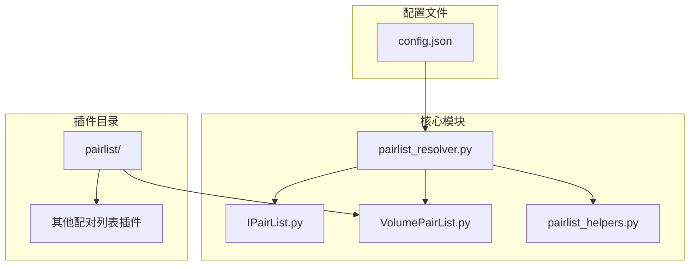
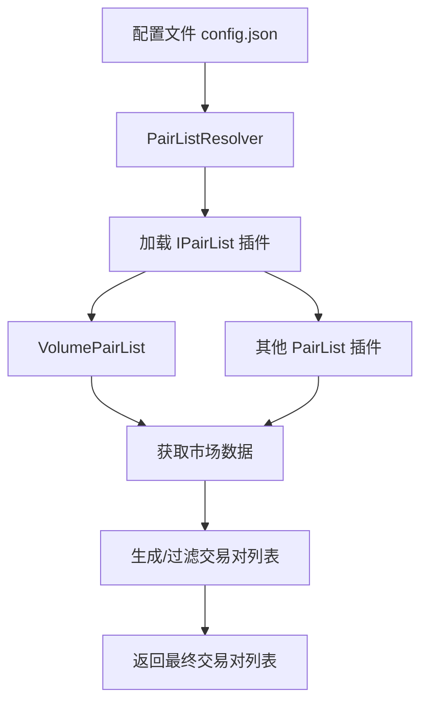
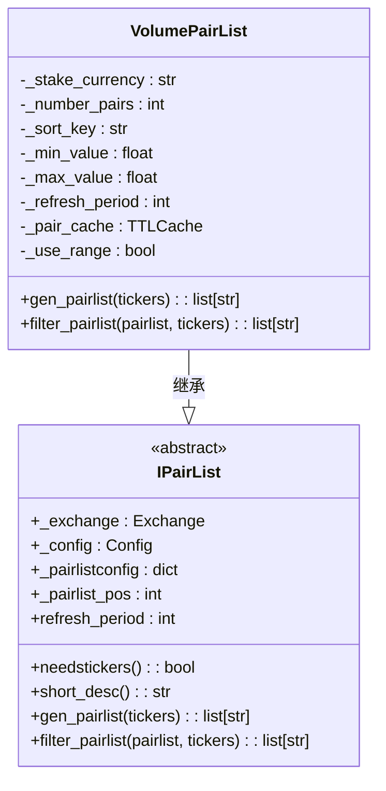
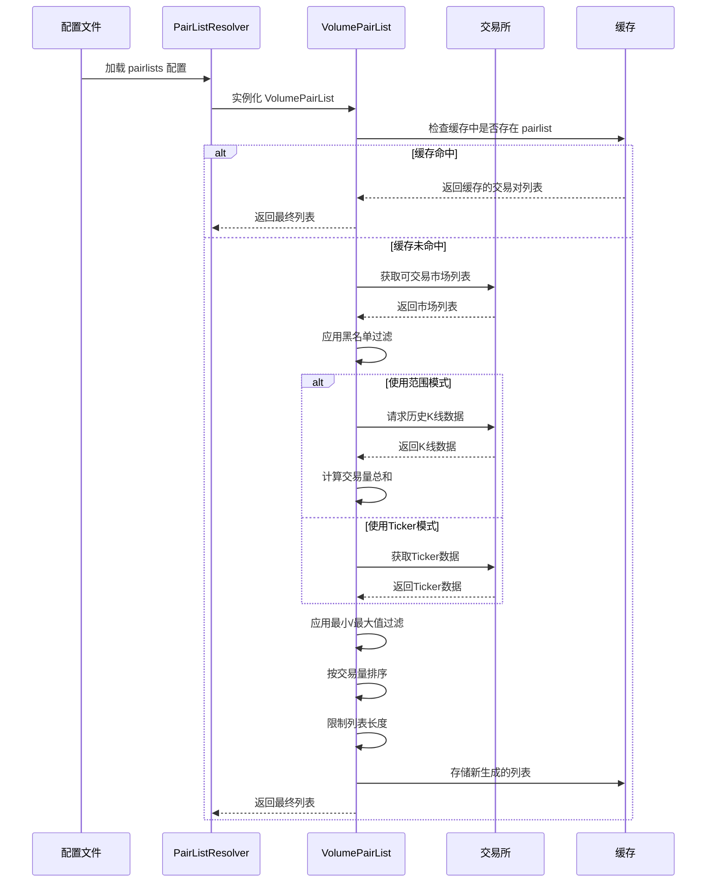
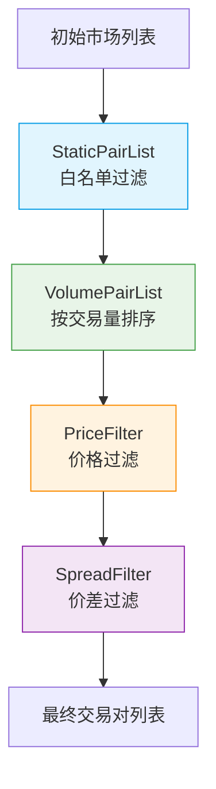
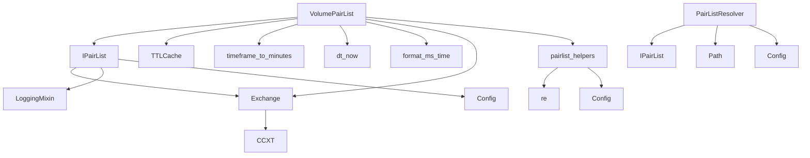

# 动态交易对列表

<cite>
**本文档引用的文件**
- [VolumePairList.py](file://freqtrade/plugins/pairlist/VolumePairList.py)
- [IPairList.py](file://freqtrade/plugins/pairlist/IPairList.py)
- [pairlist_resolver.py](file://freqtrade/resolvers/pairlist_resolver.py)
- [config.json](file://user_data/config.json)
- [pairlist_helpers.py](file://freqtrade/plugins/pairlist/pairlist_helpers.py)
</cite>

## 目录
1. [简介](#简介)
2. [项目结构](#项目结构)
3. [核心组件](#核心组件)
4. [架构概述](#架构概述)
5. [详细组件分析](#详细组件分析)
6. [依赖分析](#依赖分析)
7. [性能考虑](#性能考虑)
8. [故障排除指南](#故障排除指南)
9. [结论](#结论)

## 简介
本文档深入探讨了Freqtrade框架中的动态交易对列表生成机制。重点分析了以VolumePairList为代表的插件系统如何根据交易量、波动率等市场数据动态生成交易对列表。文档详细解释了pairlist_resolver.py中的插件加载逻辑，以及配置文件中pairlists数组如何定义多个配对列表生成器的执行顺序。同时，说明了动态列表与静态白名单的协同工作机制，以及enable_dynamic_pairlist参数对回测和实盘交易的影响，并提供了缓存策略和API调用频率控制等性能优化建议。

## 项目结构
Freqtrade的动态交易对列表功能主要分布在`freqtrade/plugins/pairlist`目录下，核心解析逻辑位于`freqtrade/resolvers/pairlist_resolver.py`。用户配置文件（如`user_data/config.json`）通过`pairlists`数组定义使用的配对列表生成器及其执行顺序。

**Diagram sources**
- [pairlist_resolver.py](file://freqtrade/resolvers/pairlist_resolver.py)
- [IPairList.py](file://freqtrade/plugins/pairlist/IPairList.py)
- [VolumePairList.py](file://freqtrade/plugins/pairlist/VolumePairList.py)
- [config.json](file://user_data/config.json)

**Section sources**
- [pairlist_resolver.py](file://freqtrade/resolvers/pairlist_resolver.py)
- [config.json](file://user_data/config.json)

## 核心组件
动态交易对列表的核心组件包括`IPairList`抽象基类、`VolumePairList`具体实现、`PairListResolver`解析器以及辅助函数模块`pairlist_helpers.py`。这些组件共同协作，实现了从市场数据获取到最终交易对列表生成的完整流程。

**Section sources**
- [IPairList.py](file://freqtrade/plugins/pairlist/IPairList.py)
- [VolumePairList.py](file://freqtrade/plugins/pairlist/VolumePairList.py)
- [pairlist_resolver.py](file://freqtrade/resolvers/pairlist_resolver.py)
- [pairlist_helpers.py](file://freqtrade/plugins/pairlist/pairlist_helpers.py)

## 架构概述
Freqtrade的动态交易对列表生成遵循一个清晰的插件化架构。`PairListResolver`负责根据配置加载指定的配对列表插件。`IPairList`作为所有配对列表插件的基类，定义了统一的接口。`VolumePairList`等具体插件实现该接口，根据交易量等市场数据生成动态列表。整个流程通过`pairlists`数组中的执行顺序进行串联。

**Diagram sources**
- [pairlist_resolver.py](file://freqtrade/resolvers/pairlist_resolver.py)
- [IPairList.py](file://freqtrade/plugins/pairlist/IPairList.py)
- [VolumePairList.py](file://freqtrade/plugins/pairlist/VolumePairList.py)

## 详细组件分析

### VolumePairList 分析
`VolumePairList`是基于交易量生成动态交易对列表的核心插件。它通过`gen_pairlist`和`filter_pairlist`方法实现列表生成与过滤。

#### 类图

**Diagram sources**
- [IPairList.py](file://freqtrade/plugins/pairlist/IPairList.py#L71-L287)
- [VolumePairList.py](file://freqtrade/plugins/pairlist/VolumePairList.py#L26-L314)

#### 交易对列表生成流程
`VolumePairList`的列表生成流程是一个典型的动态决策过程，涉及市场数据获取、缓存检查和条件过滤。

**Diagram sources**
- [VolumePairList.py](file://freqtrade/plugins/pairlist/VolumePairList.py#L200-L314)
- [pairlist_resolver.py](file://freqtrade/resolvers/pairlist_resolver.py#L30-L57)

### 配置与执行顺序分析
`pairlists`数组定义了配对列表生成器的执行顺序，形成一个处理链。每个生成器的输出作为下一个生成器的输入。

**Diagram sources**
- [config.json](file://user_data/config.json#L70-L72)

**Section sources**
- [config.json](file://user_data/config.json#L70-L72)

## 依赖分析
动态交易对列表功能依赖于多个核心模块，形成了一个复杂的依赖网络。

**Diagram sources**
- [VolumePairList.py](file://freqtrade/plugins/pairlist/VolumePairList.py)
- [IPairList.py](file://freqtrade/plugins/pairlist/IPairList.py)
- [pairlist_resolver.py](file://freqtrade/resolvers/pairlist_resolver.py)
- [pairlist_helpers.py](file://freqtrade/plugins/pairlist/pairlist_helpers.py)

**Section sources**
- [VolumePairList.py](file://freqtrade/plugins/pairlist/VolumePairList.py)
- [IPairList.py](file://freqtrade/plugins/pairlist/IPairList.py)
- [pairlist_resolver.py](file://freqtrade/resolvers/pairlist_resolver.py)

## 性能考虑
动态交易对列表的性能主要受API调用频率和缓存策略影响。`VolumePairList`通过`TTLCache`实现结果缓存，`refresh_period`参数（默认1800秒）控制缓存刷新周期，有效减少了对交易所API的频繁调用。在使用历史K线模式时，需确保`refresh_period`大于`lookback_timeframe`的时长，避免因刷新过快导致数据不完整。

## 故障排除指南
常见问题包括配置错误和API限制。例如，若`lookback_days`和`lookback_period`同时设置，会引发配置冲突异常。当交易所不支持`fetchTickers`或`quoteVolume`时，`VolumePairList`将无法工作。此外，`lookback_period`不能超过交易所允许的最大K线请求数量。用户应检查`config.json`中的`pairlists`配置是否正确，并确保`pair_whitelist`在使用`StaticPairList`时已定义。

**Section sources**
- [VolumePairList.py](file://freqtrade/plugins/pairlist/VolumePairList.py#L50-L100)
- [config_validation.py](file://freqtrade/configuration/config_validation.py#L170-L188)

## 结论
Freqtrade的动态交易对列表机制通过插件化设计实现了高度的灵活性和可扩展性。`VolumePairList`作为核心插件，能够根据实时市场数据动态调整交易对，提升了交易策略的适应性。通过合理配置`pairlists`执行链和优化缓存策略，用户可以在保证性能的同时，构建出复杂而高效的交易对筛选逻辑。未来可进一步探索多维度指标融合和机器学习驱动的配对选择策略。