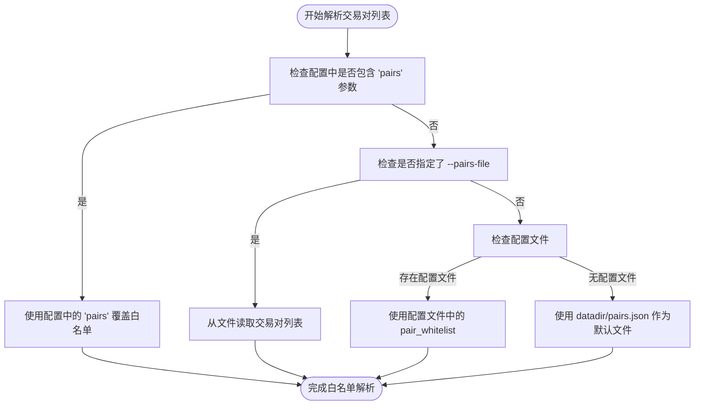
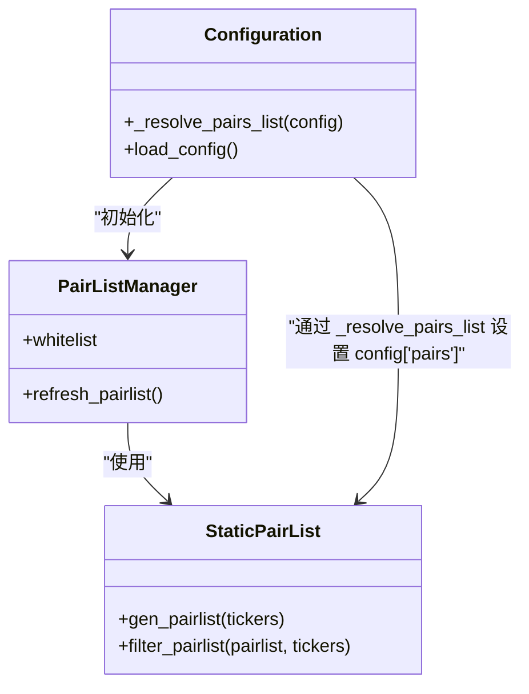
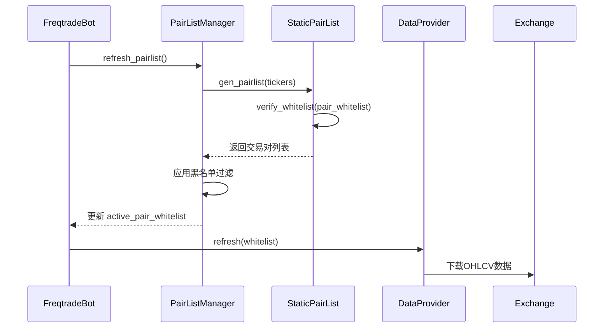

# 白名单管理

<cite>
**本文档中引用的文件**  
- [config_binance.example.json](file://config_examples/config_binance.example.json)
- [configuration.py](file://freqtrade/configuration/configuration.py)
- [StaticPairList.py](file://freqtrade/plugins/pairlist/StaticPairList.py)
- [pairlistmanager.py](file://freqtrade/plugins/pairlistmanager.py)
- [freqtradebot.py](file://freqtrade/freqtradebot.py)
</cite>

## 目录
1. [引言](#引言)
2. [配置文件中的白名单定义](#配置文件中的白名单定义)
3. [白名单加载与处理机制](#白名单加载与处理机制)
4. [命令行参数覆盖机制](#命令行参数覆盖机制)
5. [白名单在策略与数据下载中的应用](#白名单在策略与数据下载中的应用)
6. [空白名单的默认行为与风险](#空白名单的默认行为与风险)
7. [结论](#结论)

## 引言
本文档详细解释了Freqtrade中交易对白名单（pair_whitelist）的配置方式与运行机制。基于`config_binance.example.json`中的具体示例，说明如何在配置文件中静态定义白名单交易对列表，并分析其在现货、期货等不同交易模式下的适用性。深入解析`configuration.py`中`_load_config`方法如何加载和处理白名单数据，以及命令行参数（如`--pairs`）如何覆盖配置文件中的设置。提供实际代码片段展示白名单在策略初始化和数据下载阶段的应用场景，并说明当白名单为空时系统的默认行为及潜在风险。

## 配置文件中的白名单定义
在Freqtrade中，交易对白名单通过配置文件进行静态定义。以`config_binance.example.json`为例，白名单在`exchange`对象下的`pair_whitelist`字段中声明，以数组形式列出所有允许交易的交易对。

```json
"exchange": {
    "name": "binance",
    "pair_whitelist": [
        "ALGO/USDT",
        "ATOM/USDT",
        "BAT/USDT",
        "BCH/USDT",
        "BRD/USDT",
        "EOS/USDT",
        "ETH/USDT",
        "IOTA/USDT",
        "LINK/USDT",
        "LTC/USDT",
        "NEO/USDT",
        "NXS/USDT",
        "XMR/USDT",
        "XRP/USDT",
        "XTZ/USDT"
    ],
    "pair_blacklist": [
        "BNB/.*"
    ]
}
```

该配置定义了15个交易对组成的白名单，同时通过`pair_blacklist`排除了所有以`BNB/`开头的交易对。白名单的配置与交易模式（现货、期货）无关，但其有效性受`pairlists`配置影响。例如，配置中`"pairlists": [{"method": "StaticPairList"}]`明确指定了使用静态白名单，此时`pair_whitelist`是必需的。若使用动态白名单（如`VolumePairList`），则`pair_whitelist`可为空。

**Section sources**
- [config_binance.example.json](file://config_examples/config_binance.example.json#L37-L54)

## 白名单加载与处理机制
白名单的加载和处理由`configuration.py`中的`Configuration`类负责。核心方法`_resolve_pairs_list`在`load_config`过程中被调用，负责确定最终的交易对列表。



**Diagram sources**
- [configuration.py](file://freqtrade/configuration/configuration.py#L488-L547)

**Section sources**
- [configuration.py](file://freqtrade/configuration/configuration.py#L488-L547)

该方法遵循一个优先级顺序：首先检查命令行参数`--pairs`，其次检查`--pairs-file`，然后才是配置文件中的`pair_whitelist`。如果以上均未指定，则尝试从`datadir/pairs.json`加载。最终，解析出的交易对列表会被赋值给`config["pairs"]`，并在后续流程中被`PairListManager`使用。

## 命令行参数覆盖机制
命令行参数提供了覆盖配置文件设置的灵活性。`_resolve_pairs_list`方法明确处理了`--pairs`和`--pairs-file`参数。当用户在启动时指定`--pairs ALGO/USDT ETH/USDT`，该参数会直接覆盖配置文件中的`pair_whitelist`。



**Diagram sources**
- [configuration.py](file://freqtrade/configuration/configuration.py#L488-L547)
- [pairlistmanager.py](file://freqtrade/plugins/pairlistmanager.py#L100-L130)
- [StaticPairList.py](file://freqtrade/plugins/pairlist/StaticPairList.py#L46-L83)

`_args_to_config`方法在`_process_optimize_options`等流程中被调用，用于处理如`--timeframe`、`--max-open-trades`等其他参数，但`--pairs`的处理是直接在`_resolve_pairs_list`中完成的。这种设计确保了交易对列表可以在不修改配置文件的情况下被快速调整，非常适合回测和优化场景。

## 白名单在策略与数据下载中的应用
白名单在系统初始化和运行时被多个组件使用。`FreqtradeBot`在初始化时会创建`PairListManager`实例，并通过`_refresh_active_whitelist`方法获取当前有效的白名单。



**Diagram sources**
- [freqtradebot.py](file://freqtrade/freqtradebot.py#L187-L200)
- [pairlistmanager.py](file://freqtrade/plugins/pairlistmanager.py#L100-L130)
- [StaticPairList.py](file://freqtrade/plugins/pairlist/StaticPairList.py#L46-L83)

`PairListManager`会遍历所有配置的`pairlist`处理器（如`StaticPairList`），第一个处理器生成初始列表，后续处理器对其进行过滤。最终的白名单用于`DataProvider`下载指定交易对的K线数据，并作为策略分析的输入。在`enter_positions`方法中，系统会遍历`active_pair_whitelist`来检查每个交易对的入场信号。

## 空白名单的默认行为与风险
当`pair_whitelist`为空且未通过其他方式（如`--pairs`）指定交易对时，系统的行为取决于`pairlists`的配置。如果使用`StaticPairList`，则必须提供非空的`pair_whitelist`，否则会抛出`ConfigurationError`。

```python
def _validate_whitelist(conf: dict[str, Any]) -> None:
    if conf.get("runmode", RunMode.OTHER) in [RunMode.OTHER, RunMode.PLOT, RunMode.UTIL_NO_EXCHANGE, RunMode.UTIL_EXCHANGE]:
        return
    for pl in conf.get("pairlists", [{"method": "StaticPairList"}]):
        if isinstance(pl, dict) and pl.get("method") == "StaticPairList" and not conf.get("exchange", {}).get("pair_whitelist"):
            raise ConfigurationError("StaticPairList requires pair_whitelist to be set.")
```

如果使用动态`pairlist`（如`VolumePairList`），则`pair_whitelist`可以为空，系统会根据市场数据动态生成交易对列表。然而，如果所有方式都未指定交易对，`active_pair_whitelist`将为空，导致`enter_positions`无法创建新交易，系统将只处理已有的持仓。这可能导致策略无法执行，是一种潜在的风险。因此，确保白名单被正确配置是系统稳定运行的关键。

**Section sources**
- [config_validation.py](file://freqtrade/configuration/config_validation.py#L170-L188)
- [freqtradebot.py](file://freqtrade/freqtradebot.py#L78-L187)

## 结论
Freqtrade的白名单机制是一个灵活且分层的系统。它允许用户通过配置文件进行静态定义，通过命令行参数进行动态覆盖，并通过`pairlist`插件进行动态生成。理解`_resolve_pairs_list`的优先级逻辑、`PairListManager`的处理流程以及空白名单的风险，对于正确配置和运行交易机器人至关重要。合理的白名单配置不仅能提高策略的执行效率，还能有效控制风险。