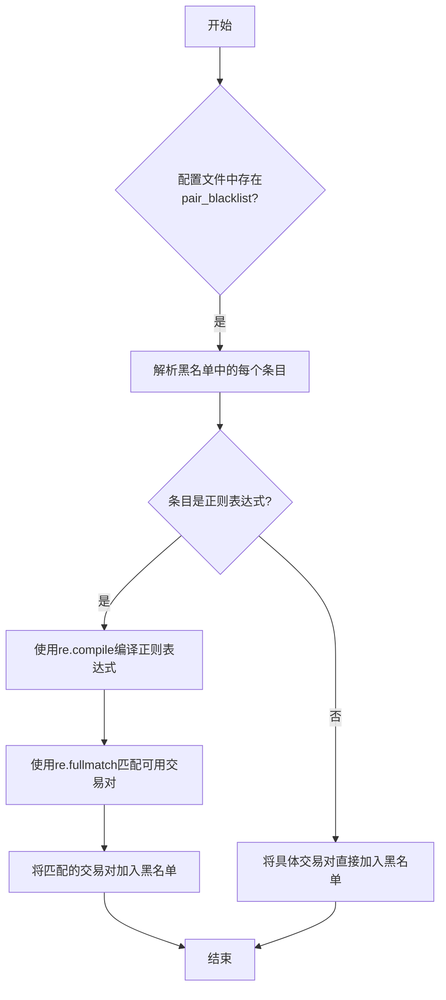
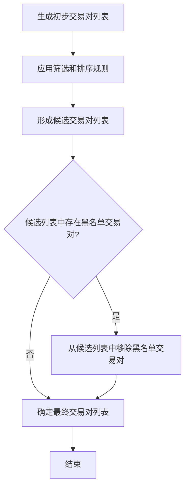

# 黑名单管理

<cite>
**本文档中引用的文件**  
- [config_binance.example.json](file://config_examples/config_binance.example.json)
- [configuration.py](file://freqtrade/configuration/configuration.py)
- [pairlistmanager.py](file://freqtrade/plugins/pairlistmanager.py)
- [pairlist_helpers.py](file://freqtrade/plugins/pairlist/pairlist_helpers.py)
</cite>

## 目录
1. [引言](#引言)
2. [黑名单配置与正则表达式匹配规则](#黑名单配置与正则表达式匹配规则)
3. [_resolve_pairs_list方法解析](#_resolve_pairs_list方法解析)
4. [黑名单在动态配对列表中的作用时机](#黑名单在动态配对列表中的作用时机)
5. [黑名单与白名单的优先级关系](#黑名单与白名单的优先级关系)
6. [黑名单配置案例](#黑名单配置案例)
7. [黑名单配置错误的安全隐患](#黑名单配置错误的安全隐患)
8. [结论](#结论)

## 引言
Freqtrade是一个开源的加密货币交易机器人，支持多种交易所和交易策略。其中，交易对黑名单（pair_blacklist）机制是其风险管理的重要组成部分。通过配置黑名单，用户可以排除不希望交易的特定交易对，从而避免潜在的风险。本文档将全面文档化Freqtrade的交易对黑名单机制，结合config_binance.example.json中'BNB/.*'的正则表达式示例，解释黑名单的模式匹配规则及其与白名单的优先级关系。同时，分析configuration.py中_resolve_pairs_list方法如何将黑名单应用于最终交易对列表的过滤过程，并说明黑名单在动态配对列表（如VolumePairList）中的作用时机。最后，提供多个正则表达式配置案例，演示如何屏蔽特定资产、交易对类型或杠杆代币，并强调黑名单配置错误可能导致的安全隐患。

## 黑名单配置与正则表达式匹配规则
在Freqtrade中，黑名单配置位于配置文件的exchange部分，以pair_blacklist键定义。该键接受一个字符串列表，每个字符串可以是具体的交易对或正则表达式。例如，在config_binance.example.json中，'BNB/.*'表示所有以BNB为交易基础货币的交易对都将被加入黑名单。

正则表达式匹配规则遵循Python的re模块标准。在黑名单中，正则表达式用于动态匹配多个交易对。例如，'BNB/.*'中的'.*'表示任意字符序列，因此所有以BNB开头的交易对都会被匹配。需要注意的是，正则表达式的使用必须谨慎，错误的表达式可能导致意外的交易对被加入黑名单，从而影响交易策略的执行。

**图示来源**
- [config_binance.example.json](file://config_examples/config_binance.example.json)
- [pairlist_helpers.py](file://freqtrade/plugins/pairlist/pairlist_helpers.py#L0-L30)

## _resolve_pairs_list方法解析
_resolve_pairs_list方法是Freqtrade中处理交易对列表的核心方法之一。该方法位于configuration.py文件中，负责解析和合并来自不同来源的交易对列表，包括命令行参数、配置文件和外部文件。在解析过程中，该方法会优先处理-p参数指定的交易对列表，然后是--pairs-file指定的文件，最后是配置文件中的白名单。

当配置文件中存在pairs键时，该方法会将其值赋给exchange.pair_whitelist，并直接返回。如果存在pairs_file参数，则读取指定文件中的交易对列表，并将其赋给pairs键。如果既没有pairs参数也没有pairs_file参数，则从配置文件中读取exchange.pair_whitelist作为交易对列表。在整个过程中，黑名单的处理是在最后一步进行的，确保所有来源的交易对列表都会受到黑名单的过滤。

**节来源**
- [configuration.py](file://freqtrade/configuration/configuration.py#L511-L546)

## 黑名单在动态配对列表中的作用时机
在Freqtrade中，动态配对列表（如VolumePairList）用于根据市场数据动态生成交易对列表。这些列表通常基于交易量、价格波动等指标进行排序和筛选。黑名单在动态配对列表中的作用时机是在所有配对列表生成和筛选完成后，但在最终交易对列表确定之前。

具体来说，当使用VolumePairList等动态配对列表时，首先会根据配置的参数生成一个初步的交易对列表。然后，该列表会经过一系列的筛选和排序操作，最终形成一个候选交易对列表。此时，黑名单机制会被触发，检查候选列表中的每个交易对是否在黑名单中。如果发现匹配项，则将其从候选列表中移除。这一过程确保了即使动态生成的交易对列表中包含黑名单中的交易对，也会被及时排除。

**图示来源**
- [pairlistmanager.py](file://freqtrade/plugins/pairlistmanager.py#L150-L179)
- [VolumePairList.py](file://freqtrade/plugins/pairlist/VolumePairList.py#L26-L314)

## 黑名单与白名单的优先级关系
在Freqtrade中，黑名单和白名单的优先级关系是黑名单优先于白名单。这意味着即使某个交易对出现在白名单中，只要它同时出现在黑名单中，该交易对就会被排除在最终的交易对列表之外。这种设计确保了用户可以灵活地管理交易对，既可以通过白名单指定希望交易的交易对，又可以通过黑名单排除不希望交易的交易对。

例如，假设白名单中包含"ETH/USDT"和"BNB/USDT"，而黑名单中包含"BNB/.*"。在这种情况下，尽管"BNB/USDT"在白名单中，但由于它匹配了黑名单中的正则表达式，因此不会出现在最终的交易对列表中。这种优先级关系使得黑名单成为一种强有力的工具，用于防止特定类型的交易对进入交易策略。

**节来源**
- [pairlistmanager.py](file://freqtrade/plugins/pairlistmanager.py#L150-L179)

## 黑名单配置案例
以下是一些常见的黑名单配置案例，演示如何使用正则表达式屏蔽特定资产、交易对类型或杠杆代币。

1. **屏蔽特定资产**：`"BNB/.*"` 屏蔽所有以BNB为交易基础货币的交易对。
2. **屏蔽特定交易对类型**：`".*UP/USDT"` 屏蔽所有以UP为后缀的杠杆代币交易对。
3. **屏蔽特定杠杆代币**：`"BTCUP/.*"` 屏蔽所有BTCUP相关的杠杆代币交易对。
4. **屏蔽特定交易对**：`"HOT/BTC"` 直接屏蔽HOT/BTC这个具体的交易对。

这些案例展示了黑名单配置的灵活性和强大功能。通过合理使用正则表达式，用户可以精确地控制哪些交易对可以参与交易，哪些交易对需要被排除。

**节来源**
- [config_binance.example.json](file://config_examples/config_binance.example.json)
- [pairlist_helpers.py](file://freqtrade/plugins/pairlist/pairlist_helpers.py#L0-L30)

## 黑名单配置错误的安全隐患
黑名单配置错误可能导致严重的安全隐患。例如，如果正则表达式编写不当，可能会意外地将大量合法的交易对加入黑名单，导致交易策略无法正常执行。此外，如果黑名单中包含无效的正则表达式，Freqtrade在启动时会抛出异常，导致程序无法运行。

为了避免这些问题，建议在配置黑名单时进行充分的测试。可以使用Python的re模块手动测试正则表达式，确保其能够正确匹配预期的交易对。同时，定期审查和更新黑名单配置，确保其符合当前的交易策略和市场环境。

**节来源**
- [pairlist_helpers.py](file://freqtrade/plugins/pairlist/pairlist_helpers.py#L0-L30)
- [pairlistmanager.py](file://freqtrade/plugins/pairlistmanager.py#L158-L179)

## 结论
Freqtrade的交易对黑名单机制是一个强大而灵活的工具，用于管理和控制交易对的选择。通过结合正则表达式，用户可以精确地排除不希望交易的交易对，从而降低风险。黑名单在动态配对列表中的作用时机确保了即使动态生成的交易对列表中包含黑名单中的交易对，也会被及时排除。黑名单优先于白名单的设计使得用户可以灵活地管理交易对，既可以通过白名单指定希望交易的交易对，又可以通过黑名单排除不希望交易的交易对。然而，黑名单配置错误可能导致严重的安全隐患，因此在配置黑名单时应进行充分的测试和审查。