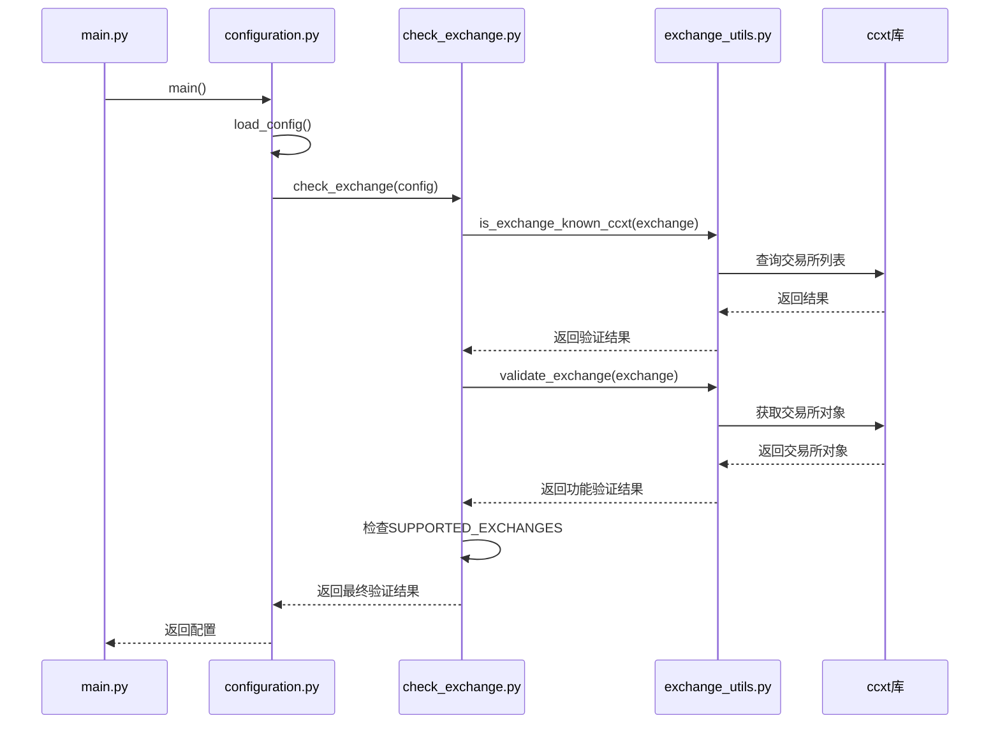
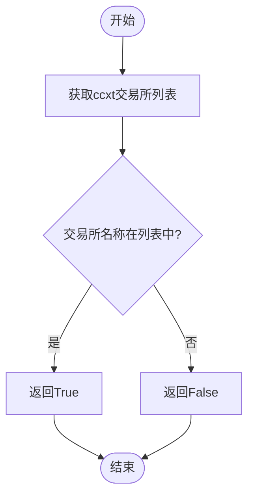
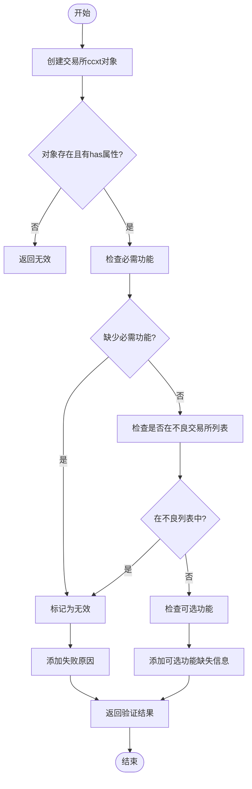
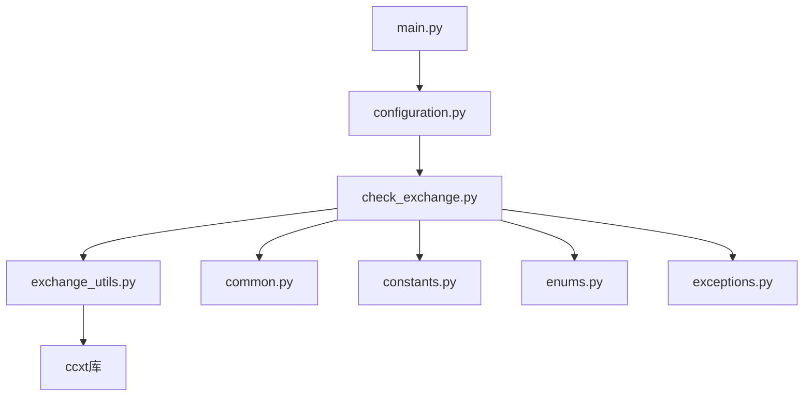

# 交易所兼容性检查

<cite>
**Referenced Files in This Document**   
- [check_exchange.py](file://freqtrade/exchange/check_exchange.py)
- [exchange_utils.py](file://freqtrade/exchange/exchange_utils.py)
- [common.py](file://freqtrade/exchange/common.py)
- [configuration.py](file://freqtrade/configuration/configuration.py)
- [main.py](file://freqtrade/main.py)
</cite>

## 目录
1. [简介](#简介)
2. [核心组件](#核心组件)
3. [架构概述](#架构概述)
4. [详细组件分析](#详细组件分析)
5. [依赖分析](#依赖分析)
6. [性能考虑](#性能考虑)
7. [故障排除指南](#故障排除指南)
8. [结论](#结论)

## 简介
本文档系统性地文档化了Freqtrade中`check_exchange.py`模块实现的交易所兼容性检查机制。该机制确保了交易机器人能够安全、可靠地与各种加密货币交易所进行交互。文档详细说明了如何通过`is_exchange_known_ccxt`验证交易所是否被ccxt库支持，以及通过`validate_exchange`进行功能完整性校验的过程。同时，解释了`SUPPORTED_EXCHANGES`列表的作用和`MAP_EXCHANGE_CHILDCLASS`映射机制，阐述了当使用非官方支持交易所时的警告机制和潜在风险。结合实际代码流程，展示了从配置解析到兼容性验证的完整调用链，并提供了扩展新交易所支持的开发指南。

## 核心组件
`check_exchange.py`模块是Freqtrade系统中负责验证交易所兼容性的核心组件。它通过一系列函数和数据结构，确保配置的交易所既被ccxt库支持，又满足Freqtrade的功能要求。主要组件包括`check_exchange`函数，该函数作为入口点，协调整个验证过程；`is_exchange_known_ccxt`函数，用于检查交易所是否被ccxt库识别；`validate_exchange`函数，用于验证交易所的功能完整性；以及`SUPPORTED_EXCHANGES`和`MAP_EXCHANGE_CHILDCLASS`两个关键数据结构，分别用于定义官方支持的交易所列表和处理交易所别名映射。

**Section sources**
- [check_exchange.py](file://freqtrade/exchange/check_exchange.py#L12-L71)

## 架构概述
交易所兼容性检查机制是Freqtrade配置初始化过程中的一个关键环节。当用户启动交易机器人时，系统首先解析配置文件，然后在`Configuration`类的`load_config`方法中调用`check_exchange`函数。该函数通过ccxt库查询交易所信息，验证其功能完整性，并根据预定义的列表判断其支持状态。整个过程确保了只有经过验证的、功能完整的交易所才能被使用，从而保障了交易的安全性和稳定性。

**Diagram sources**
- [main.py](file://freqtrade/main.py#L0-L79)
- [configuration.py](file://freqtrade/configuration/configuration.py#L33-L546)
- [check_exchange.py](file://freqtrade/exchange/check_exchange.py#L12-L71)
- [exchange_utils.py](file://freqtrade/exchange/exchange_utils.py#L36-L88)

## 详细组件分析

### check_exchange函数分析
`check_exchange`函数是整个兼容性检查流程的入口点。它接收配置对象作为参数，首先检查运行模式，对于不需要交易所的模式（如绘图模式）则直接返回。然后，它从配置中提取交易所名称，并进行一系列验证。如果交易所不被ccxt库支持，则抛出异常。接着，它调用`validate_exchange`函数检查交易所的功能完整性。最后，它根据`SUPPORTED_EXCHANGES`列表判断交易所是否为官方支持，并记录相应的日志信息。

**Section sources**
- [check_exchange.py](file://freqtrade/exchange/check_exchange.py#L12-L71)

### is_exchange_known_ccxt函数分析
`is_exchange_known_ccxt`函数负责验证指定的交易所名称是否存在于ccxt库的交易所列表中。该函数通过调用`ccxt_exchanges`函数获取所有已知的交易所名称列表，然后检查目标交易所是否在该列表中。这是兼容性检查的第一步，确保了交易所至少被ccxt库所识别，从而具备了基本的通信能力。

**Diagram sources**
- [exchange_utils.py](file://freqtrade/exchange/exchange_utils.py#L36-L37)

### validate_exchange函数分析
`validate_exchange`函数执行更深入的功能完整性校验。它首先尝试创建指定交易所的ccxt对象，然后检查该对象是否实现了Freqtrade所必需的功能。这些功能包括`fetchOrder`、`fetchL2OrderBook`、`cancelOrder`、`createOrder`和`fetchBalance`等。如果缺少任何必需功能，或者交易所被列入`BAD_EXCHANGES`黑名单，函数将返回验证失败的结果和相应的原因。

**Diagram sources**
- [exchange_utils.py](file://freqtrade/exchange/exchange_utils.py#L55-L88)

### SUPPORTED_EXCHANGES和MAP_EXCHANGE_CHILDCLASS分析
`SUPPORTED_EXCHANGES`是一个列表，包含了由Freqtrade开发团队官方支持的交易所名称。当配置的交易所在此列表中时，系统会记录一条信息日志，表明该交易所是官方支持的。`MAP_EXCHANGE_CHILDCLASS`是一个字典，用于处理交易所的别名或子类。例如，`binanceus`会被映射到`binance`，这意味着它们共享相同的底层实现。这种机制允许系统支持多个具有相似功能的交易所变体，而无需为每个变体编写独立的代码。

**Section sources**
- [common.py](file://freqtrade/exchange/common.py#L46-L66)

## 依赖分析
交易所兼容性检查模块依赖于多个其他模块和外部库。它直接依赖于`ccxt`库来获取交易所信息和创建交易所对象。在Freqtrade内部，它依赖于`constants`模块获取配置常量，依赖于`enums`模块获取运行模式枚举，依赖于`exceptions`模块抛出操作异常。`check_exchange.py`模块还导入了`available_exchanges`、`is_exchange_known_ccxt`和`validate_exchange`等函数，这些函数定义在`exchange_utils.py`中。`SUPPORTED_EXCHANGES`和`MAP_EXCHANGE_CHILDCLASS`则从`common.py`模块导入。整个机制通过`configuration.py`模块的`Configuration`类被调用，最终集成到`main.py`的主流程中。

**Diagram sources**
- [check_exchange.py](file://freqtrade/exchange/check_exchange.py#L0-L72)
- [exchange_utils.py](file://freqtrade/exchange/exchange_utils.py#L0-L349)
- [common.py](file://freqtrade/exchange/common.py#L0-L195)
- [configuration.py](file://freqtrade/configuration/configuration.py#L0-L547)
- [main.py](file://freqtrade/main.py#L0-L79)

## 性能考虑
交易所兼容性检查机制在系统启动时执行，其性能影响相对较小。主要的性能开销来自于与ccxt库的交互，特别是`validate_exchange`函数中创建交易所对象的过程。然而，由于这通常只在启动时执行一次，因此对整体性能的影响可以忽略不计。该机制的设计避免了在每次交易操作时重复进行兼容性检查，从而保证了运行时的高效性。此外，通过将验证逻辑集中在一个模块中，也便于未来的性能优化和功能扩展。

## 故障排除指南
当用户遇到交易所兼容性问题时，可以参考以下指南进行排查。首先，检查配置文件中的交易所名称是否拼写正确，并且是ccxt库支持的名称。其次，查看日志输出，`check_exchange`函数会提供详细的错误信息，说明验证失败的具体原因。如果交易所被标记为“不良”（bad），则表明该交易所存在已知的严重问题，不应使用。如果交易所功能不完整，可能缺少某些必需的API端点。对于非官方支持的交易所，系统会发出警告，用户应谨慎使用，并在发现问题时向社区报告。

**Section sources**
- [check_exchange.py](file://freqtrade/exchange/check_exchange.py#L12-L71)
- [exchange_utils.py](file://freqtrade/exchange/exchange_utils.py#L55-L88)

## 结论
`check_exchange.py`模块实现的交易所兼容性检查机制是Freqtrade系统稳健性和安全性的重要保障。通过分层验证（ccxt支持性、功能完整性、官方支持状态），该机制有效地过滤了不兼容或有问题的交易所，确保了交易机器人能够在可靠的环境中运行。`SUPPORTED_EXCHANGES`和`MAP_EXCHANGE_CHILDCLASS`的设计体现了良好的可维护性和扩展性，使得添加新交易所支持变得简单而规范。该文档为开发者和用户提供了深入的理解，有助于正确配置和使用交易所，同时也为未来的功能扩展提供了清晰的指导。