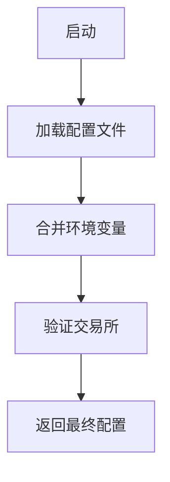
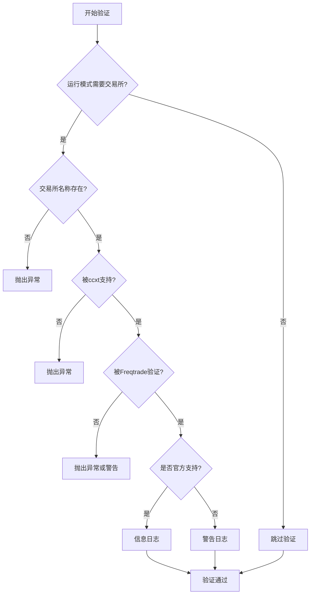

# 交易所认证配置

<cite>
**Referenced Files in This Document**  
- [config_binance.example.json](file://config_examples/config_binance.example.json)
- [configuration.py](file://freqtrade/configuration/configuration.py)
- [check_exchange.py](file://freqtrade/exchange/check_exchange.py)
- [config_secrets.py](file://freqtrade/configuration/config_secrets.py)
- [environment_vars.py](file://freqtrade/configuration/environment_vars.py)
- [constants.py](file://freqtrade/constants.py)
</cite>

## 目录
1. [Binance认证参数配置](#binance认证参数配置)
2. [API密钥安全存储最佳实践](#api密钥安全存储最佳实践)
3. [认证信息加载与合并机制](#认证信息加载与合并机制)
4. [交易所名称有效性验证](#交易所名称有效性验证)
5. [多交易所认证配置规则](#多交易所认证配置规则)
6. [不同运行模式下的认证行为](#不同运行模式下的认证行为)
7. [常见认证错误排查指南](#常见认证错误排查指南)

## Binance认证参数配置

根据`config_binance.example.json`文件中的配置，Binance交易所的认证参数主要包含三个核心字段：`name`、`key`和`secret`。这些参数位于配置文件的`exchange`对象下，用于建立与Binance交易所的API连接。

```json
"exchange": {
    "name": "binance",
    "key": "your_exchange_key",
    "secret": "your_exchange_secret"
}
```

- **name**: 此字段指定交易所的名称，必须设置为`"binance"`以正确初始化Binance交易所的API客户端。该值不区分大小写，但建议使用小写以符合代码库的惯例。
- **key**: 这是您的Binance API密钥（API Key），一个公开的字符串，用于标识您的账户。在示例文件中，它被占位符`"your_exchange_key"`表示，用户需要将其替换为实际的API密钥。
- **secret**: 这是您的Binance API密钥对应的密钥（Secret Key），一个私密的字符串，用于对API请求进行签名。它在示例文件中被占位符`"your_exchange_secret"`表示，必须被替换为真实的密钥，并且需要严格保密。

这些参数是进行真实交易（live trading）所必需的。在`dry_run`模式下，这些值可以保留为占位符，因为模拟交易不需要实际的API凭证。

**Section sources**
- [config_binance.example.json](file://config_examples/config_binance.example.json#L27-L30)

## API密钥安全存储最佳实践

为了确保API密钥的安全，Freqtrade提供了多种安全存储的最佳实践，避免将敏感信息硬编码在配置文件中。

### 环境变量注入

最推荐的方法是通过环境变量来注入API密钥。Freqtrade会自动读取以`FREQTRADE__`为前缀的环境变量，并将其转换为嵌套的配置字典。例如，可以设置以下环境变量：

```
FREQTRADE__EXCHANGE__KEY=your_actual_api_key
FREQTRADE__EXCHANGE__SECRET=your_actual_secret_key
```

在代码层面，`environment_vars.py`模块中的`environment_vars_to_dict()`函数负责处理这一过程。它会扫描所有以`ENV_VAR_PREFIX`（即`FREQTRADE__`）开头的环境变量，解析其层级结构，并将它们合并到主配置中。这种方法的优势在于，敏感信息不会出现在任何文件中，降低了因配置文件泄露而导致账户被盗的风险。

### 配置文件加密

另一种方法是使用独立的、受密码保护的加密配置文件来存储密钥。虽然核心代码库没有直接实现加密功能，但最佳实践建议将包含`key`和`secret`的配置文件（如`config.json`）存储在受操作系统级加密保护的目录中，或使用外部密钥管理服务（如Hashicorp Vault）。

此外，`config_secrets.py`模块中的`sanitize_config()`函数提供了一种数据脱敏机制。当`show_sensitive`参数为`False`时，该函数会将配置中所有预定义的敏感键（如`exchange.key`、`exchange.secret`）的值替换为`"REDACTED"`。这在日志输出或调试信息中非常有用，可以防止敏感信息意外泄露。

**Section sources**
- [environment_vars.py](file://freqtrade/configuration/environment_vars.py#L55-L82)
- [config_secrets.py](file://freqtrade/configuration/config_secrets.py#L1-L67)

## 认证信息加载与合并机制

认证信息的加载和合并是通过`configuration.py`模块中的`Configuration`类来处理的。其核心流程如下：

1.  **文件加载**: `load_config()`方法首先调用`load_from_files()`函数，该函数会递归地加载所有通过`--config`参数指定的配置文件。文件按顺序加载，后加载的文件中的参数会覆盖先前文件中的同名参数。
2.  **环境变量合并**: 在加载完所有配置文件后，系统会调用`environment_vars_to_dict()`获取所有相关的环境变量，并使用`deep_merge_dicts()`函数将这些环境变量的值深度合并到已加载的配置字典中。由于环境变量是在最后合并的，因此它们的优先级最高，可以覆盖配置文件中的任何设置。
3.  **最终配置**: 合并后的配置字典包含了来自文件和环境变量的所有信息，其中`exchange`部分的`key`和`secret`字段最终确定了用于API连接的凭证。

这个机制实现了灵活的配置管理，允许用户通过不同层级的配置源来管理他们的设置。



**Diagram sources**
- [configuration.py](file://freqtrade/configuration/configuration.py#L70-L120)
- [environment_vars.py](file://freqtrade/configuration/environment_vars.py#L55-L82)

**Section sources**
- [configuration.py](file://freqtrade/configuration/configuration.py#L70-L120)

## 交易所名称有效性验证

在配置加载完成后，系统会调用`check_exchange.py`模块中的`check_exchange()`函数来验证交易所名称的有效性。

该函数的验证逻辑如下：
1.  **运行模式检查**: 如果当前运行模式（`runmode`）是`PLOT`、`UTIL_NO_EXCHANGE`或`OTHER`，则跳过验证，因为这些模式不需要交易所连接。
2.  **名称检查**: 检查`config["exchange"]["name"]`是否为空。如果为空，则抛出异常，提示用户必须配置一个交易所。
3.  **CCXT支持检查**: 调用`is_exchange_known_ccxt(exchange)`检查该交易所名称是否被底层的`ccxt`库所支持。如果不支持，则抛出异常，因为Freqtrade依赖`ccxt`与交易所通信。
4.  **内部验证**: 调用`validate_exchange(exchange)`进行更深层次的验证。这会检查该交易所是否被Freqtrade官方支持或标记为“不良”（bad）。如果`check_for_bad`参数为`True`且交易所被标记为不良，函数会抛出异常，阻止用户使用可能存在严重问题的交易所。
5.  **支持性提示**: 最后，函数会根据`MAP_EXCHANGE_CHILDCLASS`和`SUPPORTED_EXCHANGES`判断该交易所是否被Freqtrade开发团队官方支持。如果是，则输出信息日志；如果不是，则输出警告日志，提示用户该交易所是社区支持的，可能存在未知问题。

这个验证过程确保了用户配置的交易所是可用且相对安全的。



**Diagram sources**
- [check_exchange.py](file://freqtrade/exchange/check_exchange.py#L1-L72)

**Section sources**
- [check_exchange.py](file://freqtrade/exchange/check_exchange.py#L1-L72)

## 多交易所认证配置规则

Freqtrade的配置系统支持通过多个配置文件来实现多交易所认证的继承与覆盖。

### 继承与覆盖规则

配置的继承与覆盖遵循“后定义优先”的原则：
1.  **基础配置**: 用户可以创建一个基础配置文件（如`config.base.json`），其中包含通用设置，如`max_open_trades`、`stake_currency`等。
2.  **交易所特定配置**: 为每个交易所创建一个特定的配置文件（如`config_binance.json`、`config_okx.json`），在这些文件中只定义该交易所特有的参数，最重要的是`exchange`对象下的`name`、`key`和`secret`。
3.  **启动命令**: 当启动Freqtrade时，通过`--config`参数按顺序指定配置文件，例如`freqtrade trade --config config.base.json --config config_binance.json`。系统会先加载`config.base.json`，然后加载`config_binance.json`。由于`config_binance.json`后加载，它会覆盖`config.base.json`中任何同名的`exchange`字段，从而实现对Binance的特定认证。

### 示例

假设`config.base.json`内容如下：
```json
{
  "max_open_trades": 5,
  "stake_currency": "USDT",
  "exchange": {
    "name": "placeholder"
  }
}
```

而`config_binance.json`内容如下：
```json
{
  "exchange": {
    "name": "binance",
    "key": "real_binance_key",
    "secret": "real_binance_secret"
  }
}
```

最终生效的配置将是两个文件的合并结果，其中`exchange`部分完全由`config_binance.json`提供。

**Section sources**
- [configuration.py](file://freqtrade/configuration/configuration.py#L55-L68)
- [load_config.py](file://freqtrade/configuration/load_config.py#L79-L119)

## 不同运行模式下的认证机制行为差异

认证机制的行为在`dry_run`（模拟运行）和`live`（实盘运行）模式下有显著差异。

### Dry Run 模式

当`"dry_run": true`时：
-   **凭证要求**: 系统不要求有效的`key`和`secret`。用户可以使用示例文件中的占位符（如`"your_exchange_key"`）或留空。
-   **数据库**: 系统会自动将数据库URL（`db_url`）设置为`DEFAULT_DB_DRYRUN_URL`（`sqlite:///tradesv3.dryrun.sqlite`），以确保模拟交易数据与实盘数据隔离。
-   **功能**: 所有交易操作都是模拟的，不会向交易所发送任何真实的API请求。因此，即使提供了真实的API密钥，也不会被用于实际交易。

### Live 模式

当`"dry_run": false`时：
-   **凭证要求**: 必须提供真实、有效且具有相应权限的`key`和`secret`。系统会使用这些凭证与交易所的API进行交互，执行真实的下单、撤单等操作。
-   **数据库**: 系统使用`DEFAULT_DB_PROD_URL`（`sqlite:///tradesv3.sqlite`）作为数据库，存储真实的交易记录。
-   **风险**: 任何交易决策都会导致真实的资金变动，因此必须确保API密钥的权限设置得当（例如，禁用提币权限），以最大限度地降低安全风险。

这种模式区分使得用户可以在无风险的环境中测试和优化策略，然后再切换到实盘模式进行真实交易。

**Section sources**
- [configuration.py](file://freqtrade/configuration/configuration.py#L144-L158)
- [constants.py](file://freqtrade/constants.py#L13-L14)

## 常见认证错误排查指南

在配置和使用交易所认证时，可能会遇到以下常见错误：

### 权限不足 (Insufficient Permissions)

**现象**: 交易机器人可以获取市场数据，但无法下单或撤单，日志中出现类似`"Permission denied"`或`"Invalid API-key, IP, or permissions for action"`的错误。

**解决方案**:
1.  登录您的交易所账户，检查API密钥的权限设置。
2.  确保为该API密钥启用了“交易”（Trade）权限。
3.  （可选）禁用“提币”（Withdraw）权限，以增加账户安全性。
4.  检查API密钥的IP白名单设置，确保Freqtrade运行的服务器IP地址在白名单中。

### 密钥失效 (Invalid or Expired Keys)

**现象**: 启动时立即报错，无法连接到交易所，日志显示`"Invalid API Key"`或`"Key not found"`。

**解决方案**:
1.  仔细检查`config.json`文件或环境变量中输入的`key`和`secret`，确保没有多余的空格或字符。
2.  登录交易所，确认该API密钥仍然处于“启用”状态，没有被禁用或删除。
3.  如果怀疑密钥已泄露或失效，应立即在交易所后台删除旧密钥，并生成一组新的API密钥，然后更新Freqtrade的配置。

### 交易所名称无效 (Invalid Exchange Name)

**现象**: 启动时报错，提示`"Exchange 'xxx' is not known to the ccxt library"`。

**解决方案**:
1.  检查`config.json`中`exchange.name`的拼写是否正确。例如，Binance应为`"binance"`，而不是`"Binance"`或`"binance.com"`。
2.  确认该交易所是否被`ccxt`库支持。可以查阅`ccxt`的官方文档或在Freqtrade的`SUPPORTED_EXCHANGES`列表中查找。

通过遵循上述指南，用户可以有效地配置、管理和排查Freqtrade的交易所认证问题。

**Section sources**
- [check_exchange.py](file://freqtrade/exchange/check_exchange.py#L1-L72)
- [configuration.py](file://freqtrade/configuration/configuration.py#L144-L158)