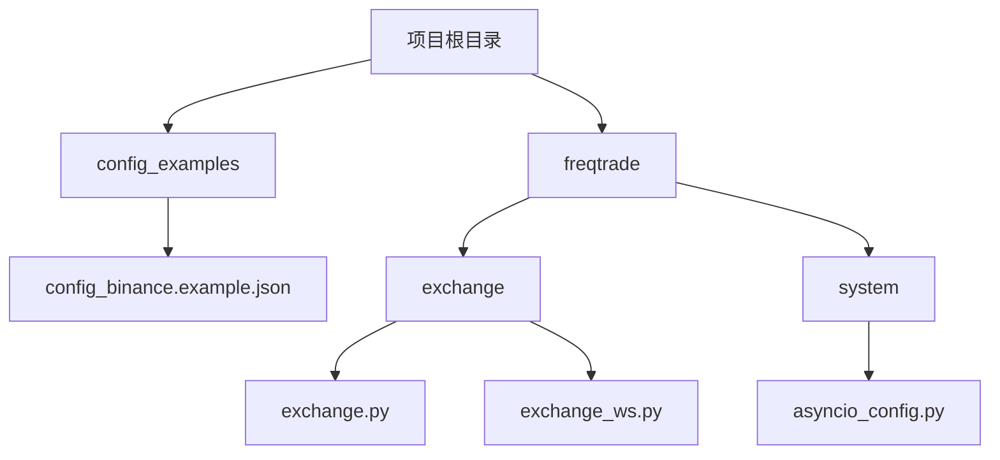
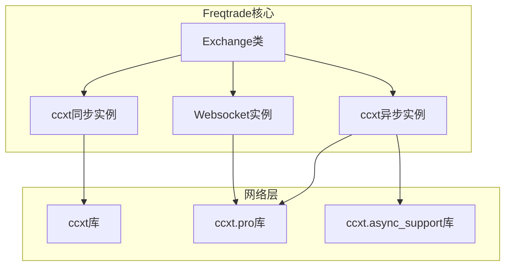
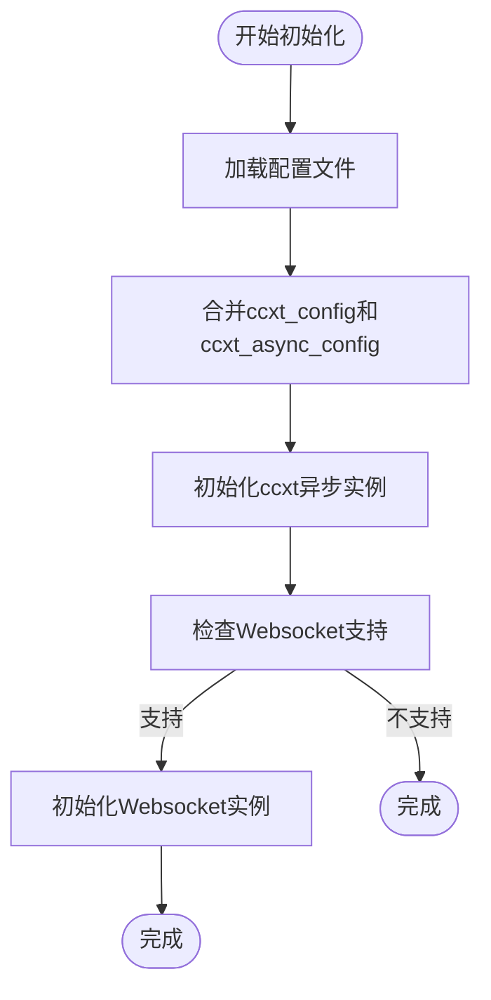
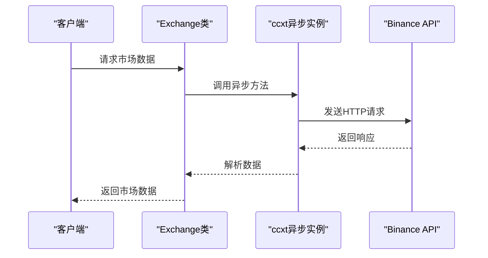
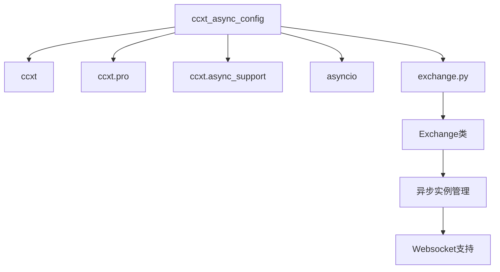

# ccxt_async_config异步配置

<cite>
**本文档中引用的文件**   
- [config_binance.example.json](file://config_examples/config_binance.example.json)
- [exchange.py](file://freqtrade/exchange/exchange.py)
- [asyncio_config.py](file://freqtrade/system/asyncio_config.py)
</cite>

## 目录
1. [简介](#简介)
2. [项目结构](#项目结构)
3. [核心组件](#核心组件)
4. [架构概述](#架构概述)
5. [详细组件分析](#详细组件分析)
6. [依赖分析](#依赖分析)
7. [性能考虑](#性能考虑)
8. [故障排除指南](#故障排除指南)
9. [结论](#结论)
10. [附录](#附录)（如有必要）

## 简介
本文档深入解析`ccxt_async_config`异步网络配置选项，重点说明其在高频交易场景下的重要性。以`config_binance.example.json`为参考，阐述如何配置异步请求的连接池大小、并发请求数限制和事件循环参数。结合`exchange.py`源码，分析`ccxt_async_config`如何影响异步API调用的性能和稳定性，特别是在处理大量市场数据订阅和订单操作时的表现。提供异步配置的调优建议，包括连接复用、请求节流和错误恢复策略。

## 项目结构
Freqtrade项目采用模块化设计，核心交易逻辑位于`freqtrade`目录下，其中`exchange`模块负责与加密货币交易所的交互。异步配置主要通过`exchange.py`中的`Exchange`类实现，该类利用`ccxt`库的异步功能进行网络通信。配置文件示例位于`config_examples`目录，为用户提供标准配置模板。

**图表来源**
- [config_binance.example.json](file://config_examples/config_binance.example.json)
- [exchange.py](file://freqtrade/exchange/exchange.py)
- [asyncio_config.py](file://freqtrade/system/asyncio_config.py)

**本节来源**
- [config_binance.example.json](file://config_examples/config_binance.example.json)
- [exchange.py](file://freqtrade/exchange/exchange.py)

## 核心组件
`ccxt_async_config`是Freqtrade中用于配置异步网络请求的核心机制，它直接影响与交易所API的通信效率和稳定性。该配置通过`exchange.py`中的`Exchange`类初始化，结合`ccxt`库的异步功能，实现高性能的市场数据获取和订单执行。在高频交易场景下，合理的异步配置能够显著提升系统响应速度，降低延迟，确保交易策略的及时执行。

**本节来源**
- [exchange.py](file://freqtrade/exchange/exchange.py)

## 架构概述
Freqtrade的异步架构基于`ccxt`库的异步支持，通过`exchange.py`中的`Exchange`类统一管理同步和异步API实例。系统在初始化时，根据配置创建`ccxt`和`ccxt.pro`的实例，分别用于同步和异步操作。`ccxt_async_config`参数被深度合并到异步实例的初始化配置中，影响连接池、事件循环等底层网络行为。对于支持Websocket的交易所，系统还会创建独立的Websocket实例，用于实时市场数据订阅。

**图表来源**
- [exchange.py](file://freqtrade/exchange/exchange.py)

## 详细组件分析

### ccxt_async_config配置分析
`ccxt_async_config`允许用户对异步网络请求进行精细化控制，对于高频交易至关重要。以`config_binance.example.json`为例，该配置为空对象，但用户可根据需要添加参数。在`exchange.py`中，`_init_ccxt`方法负责初始化异步实例，`ccxt_async_config`会与`ccxt_config`和`_ccxt_params`进行深度合并，最终应用于`ccxt_pro.Exchange`的构造函数。

#### 配置初始化流程

**图表来源**
- [config_binance.example.json](file://config_examples/config_binance.example.json)
- [exchange.py](file://freqtrade/exchange/exchange.py)

#### 高频交易场景下的重要性
在高频交易中，`ccxt_async_config`的配置直接影响系统的性能和稳定性。通过调整连接池大小和并发请求数，可以优化系统处理大量市场数据订阅和订单操作的能力。例如，增加连接池大小可以减少连接建立的开销，提高并发处理能力。同时，合理的事件循环配置可以确保系统在高负载下仍能保持低延迟。

**本节来源**
- [config_binance.example.json](file://config_examples/config_binance.example.json)
- [exchange.py](file://freqtrade/exchange/exchange.py)

### 性能与稳定性分析
`ccxt_async_config`通过影响异步API调用的底层行为，显著提升系统性能和稳定性。在`exchange.py`中，`reload_markets`方法展示了异步操作的典型用法：通过`_api_reload_markets`协程在事件循环中执行，避免阻塞主线程。对于大量市场数据订阅，系统利用`asyncio`的并发特性，同时发起多个请求，大幅缩短数据获取时间。

#### 异步API调用性能分析

**图表来源**
- [exchange.py](file://freqtrade/exchange/exchange.py)

#### 错误恢复与节流策略
`ccxt_async_config`还支持错误恢复和请求节流策略。通过配置适当的超时和重试机制，系统可以在网络波动时自动恢复。`exchange.py`中的`retrier_async`装饰器实现了重试逻辑，结合`ccxt_async_config`的网络参数，形成完整的错误恢复方案。对于请求节流，系统通过`_loop_lock`锁机制和`asyncio`的任务调度，有效控制并发请求数，避免触发交易所的DDoS保护。

**本节来源**
- [exchange.py](file://freqtrade/exchange/exchange.py)

## 依赖分析
`ccxt_async_config`的功能实现依赖于多个核心组件。`ccxt`库提供基础的交易所API封装，`ccxt.pro`和`ccxt.async_support`库提供异步支持。`asyncio`库是Python异步编程的基础，负责事件循环的管理。`exchange.py`作为核心协调者，整合这些依赖，提供统一的异步API接口。

**图表来源**
- [exchange.py](file://freqtrade/exchange/exchange.py)
- [asyncio_config.py](file://freqtrade/system/asyncio_config.py)

**本节来源**
- [exchange.py](file://freqtrade/exchange/exchange.py)
- [asyncio_config.py](file://freqtrade/system/asyncio_config.py)

## 性能考虑
在高频交易场景下，`ccxt_async_config`的配置对系统性能有决定性影响。建议根据交易所的API限制和网络环境，合理设置连接池大小和并发请求数。对于Binance等支持高并发的交易所，可以适当增加连接池大小以提高数据获取速度。同时，应监控系统资源使用情况，避免因过度并发导致CPU或内存瓶颈。

**本节来源**
- [exchange.py](file://freqtrade/exchange/exchange.py)

## 故障排除指南
当遇到异步网络问题时，首先检查`ccxt_async_config`的配置是否正确。常见的问题包括连接超时、请求被拒绝等。可以通过启用`log_responses`选项来调试网络请求。如果问题持续存在，建议检查网络环境和防火墙设置，确保与交易所API的连接畅通。

**本节来源**
- [exchange.py](file://freqtrade/exchange/exchange.py)

## 结论
`ccxt_async_config`是Freqtrade实现高性能异步交易的关键配置。通过合理配置，可以在高频交易场景下显著提升系统性能和稳定性。建议用户根据具体需求和交易所特性，精细调整异步参数，以达到最佳交易效果。