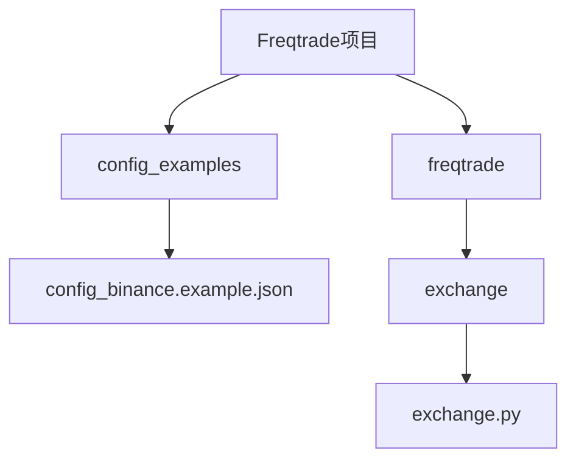
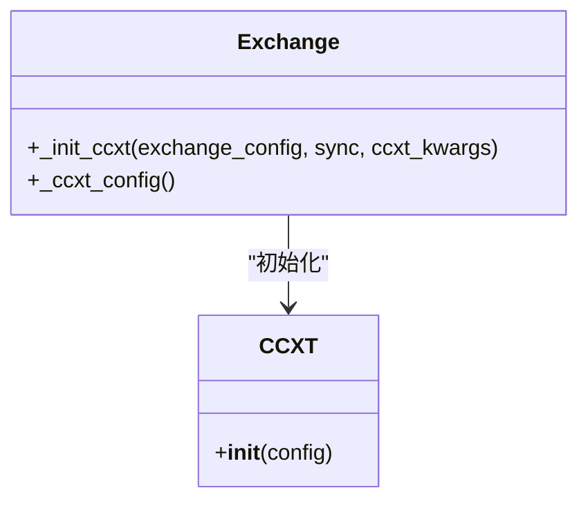
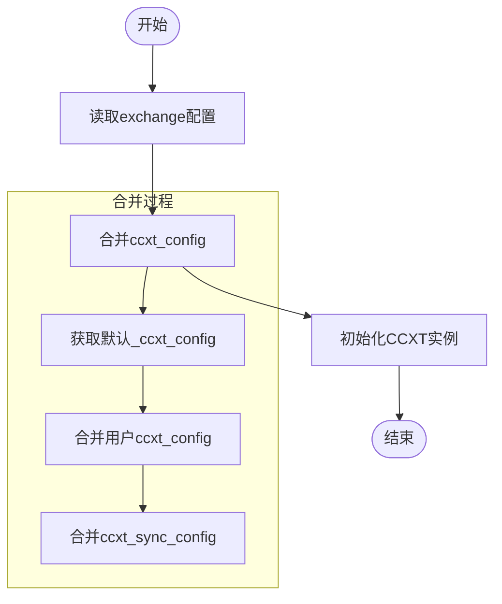
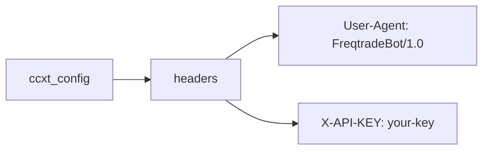
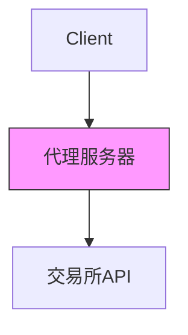
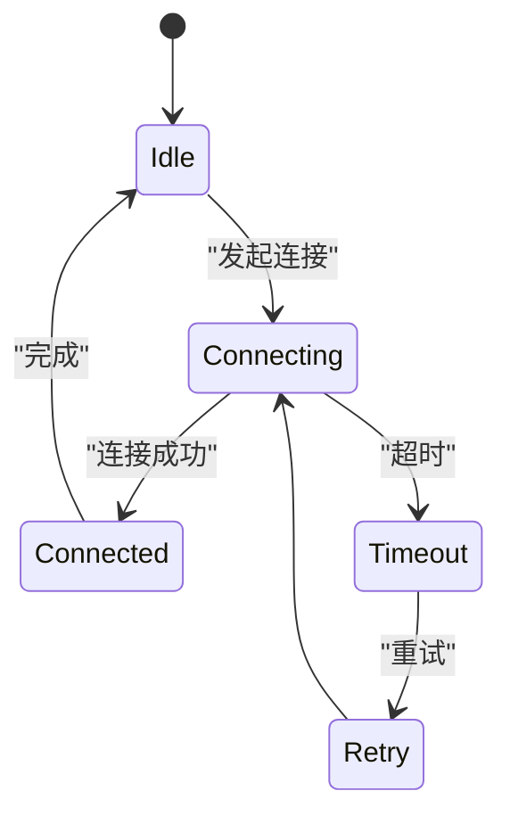
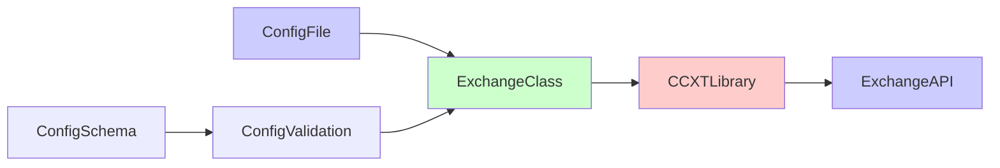

# ccxt_config同步配置

<cite>
**本文档中引用的文件**  
- [config_binance.example.json](file://config_examples/config_binance.example.json)
- [exchange.py](file://freqtrade/exchange/exchange.py)
- [config_schema.py](file://freqtrade/config_schema/config_schema.py)
</cite>

## 目录
1. [简介](#简介)
2. [项目结构](#项目结构)
3. [核心组件](#核心组件)
4. [架构概述](#架构概述)
5. [详细组件分析](#详细组件分析)
6. [依赖分析](#依赖分析)
7. [性能考虑](#性能考虑)
8. [故障排除指南](#故障排除指南)
9. [结论](#结论)
10. [附录](#附录)（如有必要）

## 简介
本文档详细解释了`ccxt_config`配置项在Freqtrade中的作用，以及如何通过该配置设置HTTP请求头、代理服务器、连接超时和读取超时等网络参数。结合`config_binance.example.json`中的实际示例，说明如何配置自定义User-Agent、API网关代理和超时重试策略。深入分析`exchange.py`中`_init_ccxt`方法如何将`ccxt_config`合并到ccxt实例初始化参数中，影响与交易所的通信行为。提供针对不同网络环境（如高延迟、限流严格）的配置最佳实践。

## 项目结构
Freqtrade项目结构清晰，主要包含配置示例、核心交易逻辑、交易所支持模块等。`ccxt_config`相关配置主要位于`config_examples`目录下的配置文件中，而核心实现逻辑位于`freqtrade/exchange/`目录下的`exchange.py`文件中。



**Diagram sources**
- [config_binance.example.json](file://config_examples/config_binance.example.json)
- [exchange.py](file://freqtrade/exchange/exchange.py)

**Section sources**
- [config_binance.example.json](file://config_examples/config_binance.example.json)
- [exchange.py](file://freqtrade/exchange/exchange.py)

## 核心组件
`ccxt_config`是Freqtrade中用于配置CCXT库行为的核心配置项，它允许用户自定义与交易所通信的各种网络参数。该配置项在`config_binance.example.json`等配置文件中定义，并在`exchange.py`中被读取和应用。

**Section sources**
- [config_binance.example.json](file://config_examples/config_binance.example.json)
- [exchange.py](file://freqtrade/exchange/exchange.py)

## 架构概述
Freqtrade通过`exchange.py`中的`Exchange`类管理与交易所的通信。该类在初始化时读取`ccxt_config`配置，并将其合并到CCXT实例的初始化参数中，从而影响所有后续的API调用。



**Diagram sources**
- [exchange.py](file://freqtrade/exchange/exchange.py)

## 详细组件分析

### ccxt_config配置分析
`ccxt_config`配置项允许用户在Freqtrade中自定义CCXT库的行为，主要影响与交易所的HTTP通信。

#### 配置示例分析
在`config_binance.example.json`中，`ccxt_config`被定义为空对象，但可以扩展以包含各种网络配置：

```json
"exchange": {
    "name": "binance",
    "ccxt_config": {
        "headers": {
            "User-Agent": "FreqtradeBot/1.0"
        },
        "proxies": {
            "http": "http://proxy.example.com:8080",
            "https": "https://proxy.example.com:8080"
        },
        "timeout": 30000,
        "enableRateLimit": true
    }
}
```

**Diagram sources**
- [config_binance.example.json](file://config_examples/config_binance.example.json)

#### 初始化流程分析
`_init_ccxt`方法负责将`ccxt_config`合并到CCXT实例的初始化参数中：



**Diagram sources**
- [exchange.py](file://freqtrade/exchange/exchange.py#L265-L269)

**Section sources**
- [exchange.py](file://freqtrade/exchange/exchange.py#L359-L408)
- [config_binance.example.json](file://config_examples/config_binance.example.json)

### 网络参数配置
`ccxt_config`支持多种网络参数配置，以适应不同的网络环境和需求。

#### HTTP请求头配置
通过`headers`字段可以设置自定义HTTP请求头，如User-Agent：



#### 代理服务器配置
通过`proxies`字段可以配置HTTP/HTTPS代理：



#### 超时和重试策略
配置连接超时、读取超时和速率限制：



**Section sources**
- [exchange.py](file://freqtrade/exchange/exchange.py)
- [config_schema.py](file://freqtrade/config_schema/config_schema.py)

## 依赖分析
`ccxt_config`功能依赖于多个组件的协同工作：



**Diagram sources**
- [config_binance.example.json](file://config_examples/config_binance.example.json)
- [exchange.py](file://freqtrade/exchange/exchange.py)
- [config_schema.py](file://freqtrade/config_schema/config_schema.py)

**Section sources**
- [config_schema.py](file://freqtrade/config_schema/config_schema.py#L920-L931)

## 性能考虑
合理配置`ccxt_config`对系统性能有重要影响：

- **超时设置**：过短的超时可能导致频繁的连接失败，过长的超时会阻塞交易执行
- **代理使用**：代理可能增加网络延迟，但可以绕过网络限制
- **速率限制**：启用`enableRateLimit`可以避免被交易所限流，但可能降低API调用频率

## 故障排除指南
常见`ccxt_config`相关问题及解决方案：

**Section sources**
- [exchange.py](file://freqtrade/exchange/exchange.py)
- [config_binance.example.json](file://config_examples/config_binance.example.json)

## 结论
`ccxt_config`是Freqtrade中一个强大而灵活的配置项，它允许用户精细控制与交易所的通信行为。通过合理配置HTTP请求头、代理服务器、超时和重试策略，可以适应各种网络环境和交易所要求，确保交易系统的稳定运行。

## 附录
### 配置模式最佳实践
| 网络环境 | 推荐配置 | 说明 |
|---------|---------|------|
| 高延迟网络 | 增加timeout值 | 避免因网络延迟导致的连接超时 |
| 严格限流 | 启用enableRateLimit | 避免被交易所限流 |
| 代理环境 | 配置proxies | 绕过网络限制 |
| 调试模式 | 添加自定义User-Agent | 便于识别请求来源 |