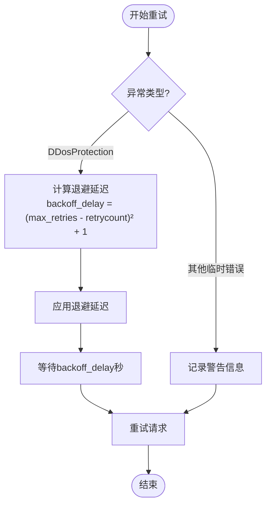
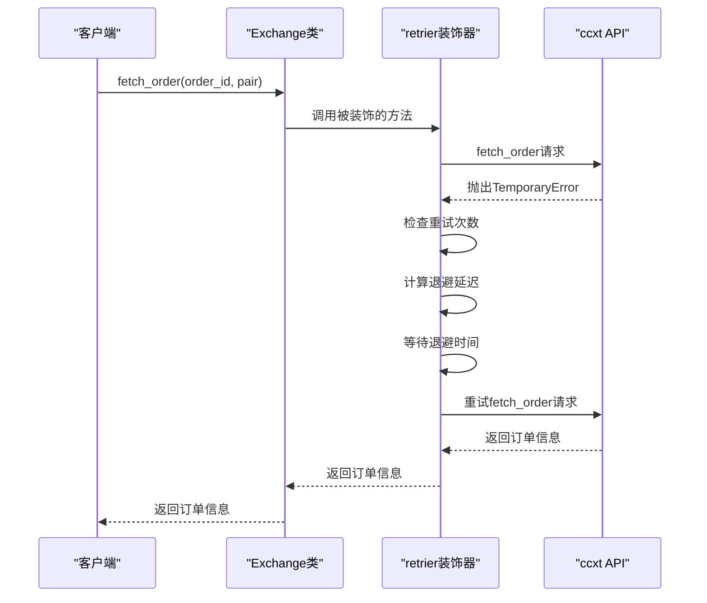

# 速率限制与重试机制

<cite>
**本文档中引用的文件**   
- [common.py](file://freqtrade/exchange/common.py)
- [exchange.py](file://freqtrade/exchange/exchange.py)
- [constants.py](file://freqtrade/constants.py)
</cite>

## 目录
1. [引言](#引言)
2. [核心重试机制](#核心重试机制)
3. [退避算法与DDoS保护](#退避算法与ddos保护)
4. [API重试常量配置](#api重试常量配置)
5. [实际调用分析](#实际调用分析)
6. [实践指南](#实践指南)
7. [结论](#结论)

## 引言
Freqtrade是一个开源的加密货币交易机器人，它通过ccxt库与多个交易所进行交互。在高频交易场景中，交易所的速率限制（Rate Limiting）是一个常见问题。为了应对这一挑战，Freqtrade实现了一套完善的重试机制，确保在遭遇临时性错误或DDoS保护时能够自动恢复。本文将深入解析Freqtrade中基于ccxt的速率限制处理机制，重点介绍`common.py`中的`retrier`和`retrier_async`装饰器如何实现请求重试逻辑，以及`exchange.py`中的实际调用情况。

## 核心重试机制

Freqtrade通过`common.py`文件中的`retrier`和`retrier_async`装饰器实现了同步和异步的重试逻辑。这两个装饰器能够捕获特定类型的异常，并在一定条件下自动重试请求。

`retrier`装饰器支持多种调用语法，包括`@retrier`和`@retrier(retries=2)`，提供了灵活的重试次数配置。当被装饰的函数抛出`TemporaryError`或`RetryableOrderError`异常时，装饰器会记录警告信息，并根据剩余重试次数决定是否继续重试。如果重试次数未耗尽，装饰器会计算退避延迟并暂停执行，然后递归调用自身进行重试。

`retrier_async`装饰器则专为异步函数设计，使用`asyncio.sleep`实现异步等待，避免阻塞事件循环。对于KuCoin交易所的特殊429错误，该装饰器还实现了临时修复，避免触发DDoS保护的退避延迟。

**Section sources**
- [common.py](file://freqtrade/exchange/common.py#L165-L194)
- [common.py](file://freqtrade/exchange/common.py#L112-L146)

## 退避算法与DDoS保护

Freqtrade采用了一种基于平方的退避算法来处理DDoS保护响应。`calculate_backoff`函数根据剩余重试次数和最大重试次数计算退避延迟，公式为`(max_retries - retrycount) ** 2 + 1`。这种算法确保了随着重试次数的增加，退避时间呈非线性增长，有效避免了对交易所API的过度请求。

当检测到`DDosProtection`异常时，无论是同步还是异步装饰器，都会应用此退避算法。对于KuCoin交易所的特殊情况，系统会识别429000错误码，并避免应用标准的退避延迟，而是通过`log_once`方法记录警告信息，防止日志被大量重复消息淹没。

**Diagram sources **
- [common.py](file://freqtrade/exchange/common.py#L105-L109)
- [common.py](file://freqtrade/exchange/common.py#L112-L146)

**Section sources**
- [common.py](file://freqtrade/exchange/common.py#L105-L109)

## API重试常量配置

Freqtrade定义了两个关键的重试常量：`API_RETRY_COUNT`和`API_FETCH_ORDER_RETRY_COUNT`，分别设置为4和5。这些常量作为默认的重试次数，可以在配置文件中进行自定义。

`API_RETRY_COUNT`用于大多数API请求的重试，而`API_FETCH_ORDER_RETRY_COUNT`则专门用于订单查询操作。这种区分允许系统对不同类型的API调用采用不同的重试策略，例如订单查询可能需要更多的重试机会，因为订单状态的更新可能存在延迟。

用户可以通过修改配置文件中的相应参数来调整这些重试策略，以适应不同交易所的具体要求和网络环境。

**Section sources**
- [common.py](file://freqtrade/exchange/common.py#L34-L35)

## 实际调用分析

在`exchange.py`文件中，`retrier`装饰器被广泛应用于各种API调用中。例如，`reload_markets`方法在加载市场数据时使用了`retrier`装饰器，确保在初始加载时能够重试3次，以提高成功率。

`fetch_order`方法是另一个重要的应用场景，它负责从交易所获取订单信息。该方法在捕获`OrderNotFound`异常时会抛出`RetryableOrderError`，从而触发重试机制。对于不支持`fetchOrder`端点的交易所，系统会通过`fetch_order_emulated`方法模拟订单查询，分别尝试`fetchOpenOrder`和`fetchClosedOrder`。

**Diagram sources **
- [exchange.py](file://freqtrade/exchange/exchange.py#L675-L711)
- [exchange.py](file://freqtrade/exchange/exchange.py#L1587-L1614)

**Section sources**
- [exchange.py](file://freqtrade/exchange/exchange.py#L675-L711)
- [exchange.py](file://freqtrade/exchange/exchange.py#L1587-L1614)

## 实践指南

为了有效应对交易所的限流，建议采取以下措施：

1. **合理设置请求间隔**：根据交易所的速率限制策略，配置适当的请求间隔，避免触发限流。
2. **监控API使用情况**：定期检查API调用日志，及时发现潜在的限流问题。
3. **实现自适应限流算法**：根据实际的API响应情况动态调整请求频率，例如在收到429响应后自动延长请求间隔。
4. **利用缓存机制**：对于不经常变化的数据，如市场信息，可以使用缓存减少API调用次数。
5. **配置合适的重试策略**：根据交易所的特性和网络环境，调整`API_RETRY_COUNT`和`API_FETCH_ORDER_RETRY_COUNT`的值。

通过综合运用这些策略，可以显著提高Freqtrade在高并发环境下的稳定性和可靠性。

## 结论

Freqtrade通过精心设计的重试机制和退避算法，有效地应对了交易所的速率限制和DDoS保护。`retrier`和`retrier_async`装饰器提供了灵活的重试逻辑，而`API_RETRY_COUNT`和`API_FETCH_ORDER_RETRY_COUNT`常量则允许用户根据具体需求进行定制。结合实际调用分析和实践指南，用户可以更好地理解和优化Freqtrade的API交互行为，确保交易策略的稳定执行。