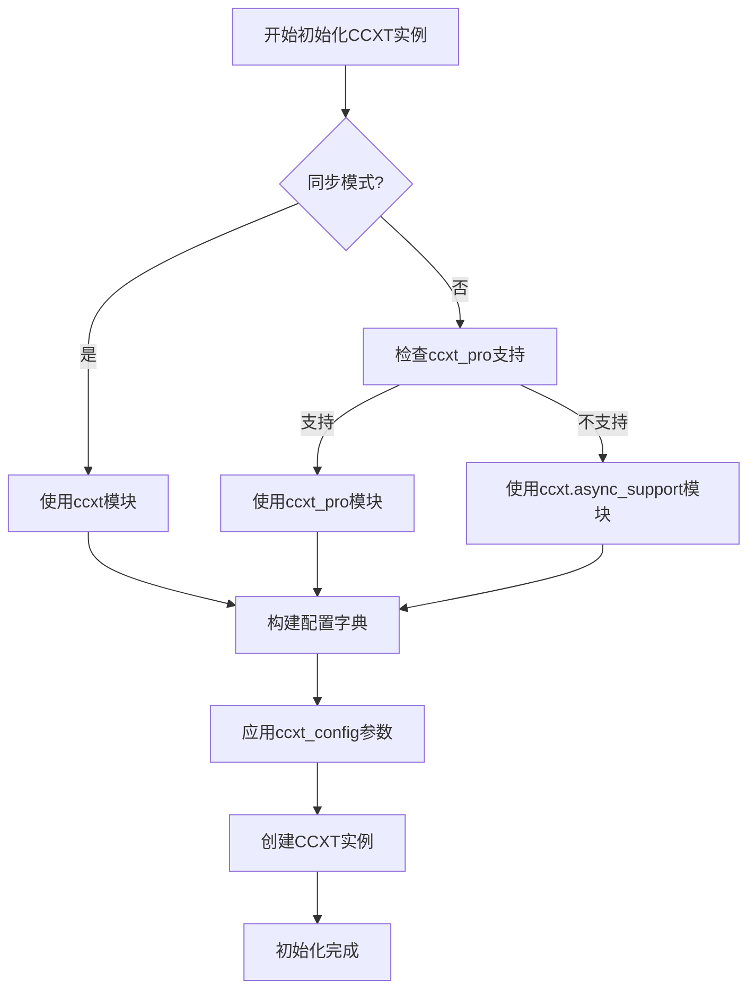
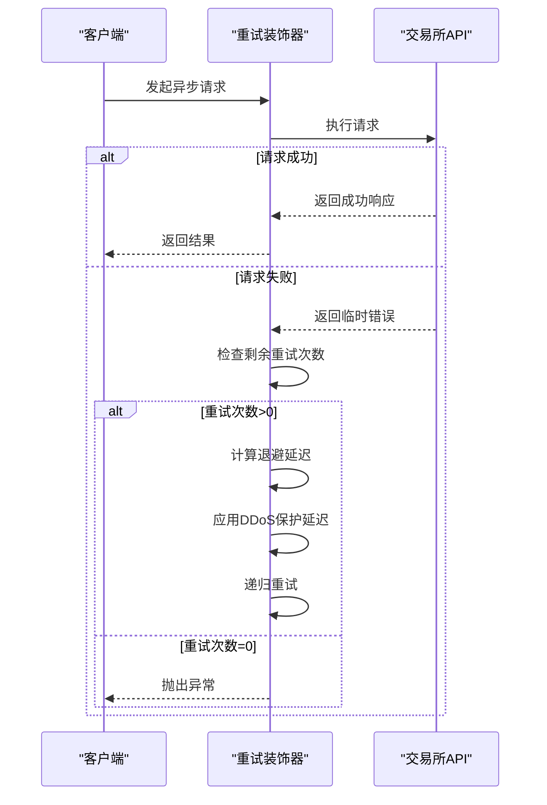

# 高级网络配置

<cite>
**本文档中引用的文件**   
- [config_binance.example.json](file://config_examples/config_binance.example.json)
- [exchange.py](file://freqtrade/exchange/exchange.py)
- [common.py](file://freqtrade/exchange/common.py)
</cite>

## 目录
1. [引言](#引言)
2. [ccxt_config配置详解](#ccxt_config配置详解)
3. [ccxt_async_config配置解析](#ccxt_async_config配置解析)
4. [源码级交互机制分析](#源码级交互机制分析)
5. [高频交易场景优化建议](#高频交易场景优化建议)
6. [自适应限流策略实现](#自适应限流策略实现)
7. [结论](#结论)

## 引言
Freqtrade作为专业的加密货币量化交易平台，其网络配置系统深度集成了CCXT库的强大功能。本文档聚焦于`ccxt_config`和`ccxt_async_config`两大核心配置模块，通过分析Binance交易所的配置范例和底层源码，揭示高级网络参数的配置方法及其对交易性能的影响机制。文档将详细阐述如何通过自定义请求头、代理服务器和连接超时等参数优化网络通信，并解析异步请求的速率限制、并发控制和重试机制，为高频交易场景提供专业的网络调优方案。

## ccxt_config配置详解

`ccxt_config`配置项允许用户对CCXT库的同步和异步实例进行精细化控制。在`config_binance.example.json`配置文件中，`ccxt_config`作为exchange配置的子对象存在，用于设置与交易所API交互的底层网络参数。

通过分析`exchange.py`中的`_init_ccxt`方法，可以发现`ccxt_config`的配置流程：首先获取默认的`_ccxt_config`，然后与用户配置的`ccxt_config`和`ccxt_sync_config`进行深度合并，最终应用于CCXT实例的初始化。这种配置合并机制确保了用户自定义参数能够正确覆盖默认设置。

**Section sources**
- [config_binance.example.json](file://config_examples/config_binance.example.json#L30-L34)
- [exchange.py](file://freqtrade/exchange/exchange.py#L265-L269)

## ccxt_async_config配置解析

`ccxt_async_config`专门用于配置异步CCXT实例的网络行为，对于高频交易场景至关重要。与`ccxt_config`类似，它通过`deep_merge_dicts`函数与基础配置合并，但仅应用于异步API实例。

在`exchange.py`的初始化过程中，`ccxt_async_config`被独立构建，首先合并`ccxt_config`的通用设置，再叠加`ccxt_async_config`的异步专用配置。这种分离式设计使得同步和异步操作可以拥有不同的网络策略，例如异步操作可以配置更激进的超时策略以提高响应速度。

**Section sources**
- [config_binance.example.json](file://config_examples/config_binance.example.json#L35-L37)
- [exchange.py](file://freqtrade/exchange/exchange.py#L271-L278)

## 源码级交互机制分析

### 网络初始化流程
Freqtrade的网络初始化通过`_init_ccxt`方法实现，该方法根据`sync`参数决定使用同步还是异步CCXT模块。对于异步操作，优先尝试使用`ccxt_pro`，若不支持则回退到`ccxt.async_support`。初始化时，所有配置参数通过`ex_config`字典传递给CCXT构造函数。

**Diagram sources **
- [exchange.py](file://freqtrade/exchange/exchange.py#L359-L408)

### 异步重试机制
`common.py`中的`retrier_async`装饰器实现了智能重试机制，这是应对交易所DDoS保护的关键。该机制根据错误类型应用不同的退避策略：对于DDoS保护错误，采用指数退避延迟；对于KuCoin等特定交易所的429错误，有专门的处理逻辑避免不必要的延迟。

**Diagram sources **
- [common.py](file://freqtrade/exchange/common.py#L112-L146)

## 高频交易场景优化建议

针对高频交易场景，建议采用以下网络配置策略：

1. **连接超时优化**：设置合理的`timeout`参数，避免过长的等待影响交易速度
2. **代理服务器配置**：通过`proxy`参数配置专用代理，提高连接稳定性和速度
3. **请求头定制**：使用`headers`参数添加自定义请求头，可能提高请求优先级
4. **并发连接控制**：合理设置`asyncio_loop`和连接池大小，平衡并发性能和资源消耗

在`ccxt_async_config`中，可以配置`aiohttp_trust_env`等参数来优化异步HTTP客户端的行为，这对于需要高并发API调用的策略尤为重要。

**Section sources**
- [exchange.py](file://freqtrade/exchange/exchange.py#L271-L278)
- [common.py](file://freqtrade/exchange/common.py#L112-L146)

## 自适应限流策略实现

基于`common.py`中的重试机制，可以实现更高级的自适应限流策略：

1. **动态重试计数**：根据交易所响应动态调整`API_RETRY_COUNT`
2. **智能退避算法**：改进`calculate_backoff`函数，根据历史响应时间调整退避策略
3. **错误类型分类处理**：对不同类型的API错误采用不同的重试策略
4. **实时监控反馈**：收集API调用指标，实时调整网络参数

通过继承和重写`Exchange`类的相关方法，可以实现交易所特定的限流处理逻辑，例如为Binance设计专门的速率限制适配器。

**Section sources**
- [common.py](file://freqtrade/exchange/common.py#L165-L194)
- [exchange.py](file://freqtrade/exchange/exchange.py#L112-L146)

## 结论
Freqtrade的`ccxt_config`和`ccxt_async_config`配置系统为高级用户提供了强大的网络控制能力。通过深入理解这些配置项的工作机制和源码实现，交易者可以针对特定交易所和交易策略进行精细化的网络优化。结合自适应限流策略，可以显著提高高频交易系统的稳定性和性能，有效应对交易所的API限制和网络波动。建议用户根据实际交易需求，参考本文档的配置方法和优化建议，构建高性能的量化交易系统。