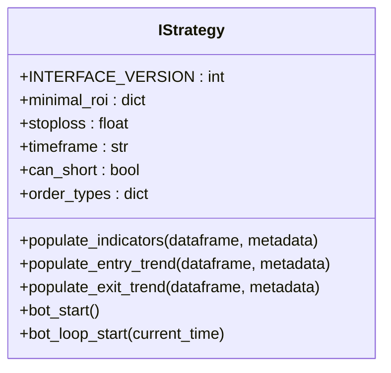
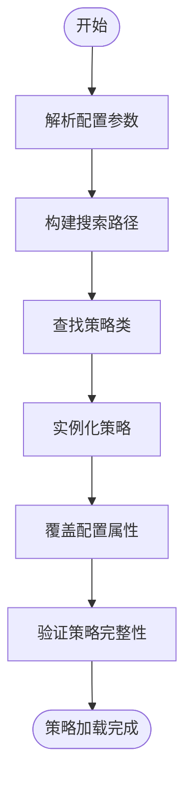

# 交易策略配置

<cite>
**本文档引用的文件**
- [interface.py](file://freqtrade/strategy/interface.py)
- [strategy_resolver.py](file://freqtrade/resolvers/strategy_resolver.py)
- [strategyupdater.py](file://freqtrade/strategy/strategyupdater.py)
- [load_config.py](file://freqtrade/configuration/load_config.py)
- [configuration.py](file://freqtrade/configuration/configuration.py)
- [config.json](file://user_data/config.json)
- [SampleStrategy.py](file://user_data/strategies/SampleStrategy.py)
</cite>

## 目录
1. [简介](#简介)
2. [策略配置项详解](#策略配置项详解)
3. [IStrategy接口分析](#istrategy接口分析)
4. [策略加载与验证机制](#策略加载与验证机制)
5. [策略更新与热重载](#策略更新与热重载)
6. [最佳实践与配置方案](#最佳实践与配置方案)

## 简介
本文档深入解析Freqtrade交易框架中与交易策略相关的配置项，重点阐述`strategy`、`strategy_path`和`recursive_strategy_search`参数的协同工作机制。文档将详细说明如何通过配置文件指定自定义策略类及其查找路径，以及递归搜索策略文件的启用条件。结合`strategy/interface.py`中的`IStrategy`接口，解释配置系统如何加载和验证策略模块。同时，将详细阐述策略更新机制和热重载功能的配置要求，并提供策略配置的最佳实践，包括命名规范、路径管理以及多策略环境的配置方案。

## 策略配置项详解

### 核心配置参数
交易策略的配置主要通过`config.json`文件中的几个核心参数来实现，这些参数共同决定了策略的加载方式和行为。

**Section sources**
- [config.json](file://user_data/config.json#L1-L94)
- [configuration.py](file://freqtrade/configuration/configuration.py#L150-L180)

### strategy
`strategy`参数是配置中最关键的一项，它指定了Freqtrade将要使用的策略类的名称。该参数的值必须是一个字符串，对应于策略文件中定义的类名。

例如，在`config.json`中：
```json
"strategy": "SampleStrategy"
```
这表示Freqtrade将加载名为`SampleStrategy`的策略类。系统会根据`strategy_path`和`recursive_strategy_search`等参数来定位并加载该类。

### strategy_path
`strategy_path`参数用于指定自定义策略文件的查找路径。当用户的策略文件不位于默认的`user_data/strategies`目录下时，可以通过此参数来添加额外的搜索路径。

该参数的值可以是：
- **绝对路径**：如`/home/user/my_strategies`。
- **相对路径**：相对于项目根目录或`user_data_dir`的路径。

在命令行中，可以通过`--strategy-path`参数来设置，该值会覆盖配置文件中的设置。

### recursive_strategy_search
`recursive_strategy_search`是一个布尔类型的参数，用于控制是否在策略路径下递归搜索子目录中的策略文件。

- 当设置为`true`时，Freqtrade会遍历`strategy_path`指定目录及其所有子目录，查找所有可能的策略文件。
- 当设置为`false`时，仅搜索`strategy_path`指定目录的根目录。

此参数的启用条件是当用户的策略文件分散在多个子目录中时，需要启用递归搜索以确保所有策略都能被发现。

**Section sources**
- [strategy_resolver.py](file://freqtrade/resolvers/strategy_resolver.py#L254-L307)
- [configuration.py](file://freqtrade/configuration/configuration.py#L160-L165)

## IStrategy接口分析

### 接口定义与版本
`IStrategy`是所有自定义交易策略必须继承的基类接口，定义在`freqtrade/strategy/interface.py`文件中。该接口规定了策略必须实现的方法和属性，确保了策略的标准化和可插拔性。

接口通过`INTERFACE_VERSION`常量来管理版本，当前版本为3。版本控制确保了策略与框架之间的兼容性。



**Diagram sources**
- [interface.py](file://freqtrade/strategy/interface.py#L50-L1882)

### 核心方法
`IStrategy`接口定义了多个核心方法，这些方法构成了策略的生命周期和交易逻辑。

#### populate_indicators
此方法用于计算和填充策略所需的所有技术指标。它接收一个包含市场数据的`DataFrame`和一个包含元数据的字典，并返回一个包含所有计算后指标的新`DataFrame`。

#### populate_entry_trend 和 populate_exit_trend
这两个方法分别用于生成入场（买入/做多）和离场（卖出/做空）信号。它们基于`populate_indicators`方法计算出的指标来判断交易信号。

#### bot_start 和 bot_loop_start
`bot_start`在机器人启动时仅调用一次，可用于执行一次性初始化任务。`bot_loop_start`在每个交易循环开始时调用，可用于执行与交易对无关的周期性任务。

**Section sources**
- [interface.py](file://freqtrade/strategy/interface.py#L227-L424)

## 策略加载与验证机制

### 加载流程
策略的加载由`StrategyResolver`类负责，其核心流程如下：

1.  **参数解析**：从配置中读取`strategy`、`strategy_path`和`recursive_strategy_search`等参数。
2.  **路径构建**：根据`strategy_path`和`recursive_strategy_search`构建搜索路径列表。
3.  **策略查找**：在构建的路径列表中查找指定名称的策略类。
4.  **实例化与配置**：创建策略类的实例，并根据配置文件中的参数覆盖策略的默认属性。
5.  **验证**：对加载的策略进行一系列完整性验证。



**Diagram sources**
- [strategy_resolver.py](file://freqtrade/resolvers/strategy_resolver.py#L37-L94)

### 验证与属性覆盖
`StrategyResolver`会对加载的策略进行严格的验证，确保其满足框架的要求。

#### 属性覆盖
策略的属性可以通过配置文件进行覆盖。优先级顺序为：配置文件 > 策略代码 > 默认值。例如，配置文件中的`stoploss`值会覆盖策略代码中定义的`stoploss`。

#### 完整性验证
验证过程会检查：
- `order_types`和`order_time_in_force`字典是否包含所有必需的键。
- 对于做空策略，交易模式不能为`SPOT`。
- 必须正确实现`populate_entry_trend`和`populate_exit_trend`等核心方法。

**Section sources**
- [strategy_resolver.py](file://freqtrade/resolvers/strategy_resolver.py#L173-L251)

## 策略更新与热重载

### 策略更新机制
Freqtrade提供了一个`StrategyUpdater`工具，用于将旧版本的策略代码自动更新到新版本。该工具利用`ast`（抽象语法树）模块来解析和修改Python代码，确保更新过程不会破坏原有的代码逻辑和注释。

其主要功能包括：
- 将已弃用的方法名（如`populate_buy_trend`）更新为新名称（`populate_entry_trend`）。
- 更新配置参数名（如`use_sell_signal`更新为`use_exit_signal`）。
- 在策略类中添加或更新`INTERFACE_VERSION`。

### 热重载功能
热重载功能允许在不重启整个机器人的情况下更新正在运行的策略。这在开发和调试阶段非常有用。

要启用热重载，需要确保：
1.  策略文件的修改已保存。
2.  机器人配置允许热重载（通常在开发模式下）。
3.  新策略代码与框架版本兼容。

当检测到策略文件发生变化时，机器人会自动重新加载策略模块，并应用新的交易逻辑。

**Section sources**
- [strategyupdater.py](file://freqtrade/strategy/strategyupdater.py#L0-L279)

## 最佳实践与配置方案

### 命名规范
- **策略类名**：使用大驼峰命名法（PascalCase），如`MyAwesomeStrategy`。
- **策略文件名**：与类名保持一致，如`MyAwesomeStrategy.py`。
- **超参数**：使用有意义的名称，如`buy_rsi_threshold`，并明确其所属空间（`buy`, `sell`, `roi`等）。

### 路径管理
- **单一项目**：将所有策略文件放在`user_data/strategies`目录下。
- **多项目/多环境**：使用`strategy_path`参数指向不同的策略库目录，并结合`recursive_strategy_search`进行管理。

### 多策略环境配置
在需要管理多个策略的复杂环境中，推荐以下配置方案：

1.  **目录结构**：
    ```
    strategies/
    ├── trend_following/
    │   ├── AdxSmas.py
    │   └── MACDStrategy.py
    ├── mean_reversion/
    │   ├── EMASkipPump.py
    │   └── Low_BB.py
    └── custom/
        └── MyStrategy.py
    ```

2.  **配置文件**：
    ```json
    {
      "strategy": "MyStrategy",
      "strategy_path": "user_data/strategies",
      "recursive_strategy_search": true,
      "max_open_trades": 5,
      "stake_amount": 50
    }
    ```

3.  **动态切换**：通过修改`config.json`中的`strategy`参数并重启机器人，或利用热重载功能来切换不同的策略。

**Section sources**
- [SampleStrategy.py](file://user_data/strategies/SampleStrategy.py#L51-L280)
- [config.json](file://user_data/config.json#L1-L94)