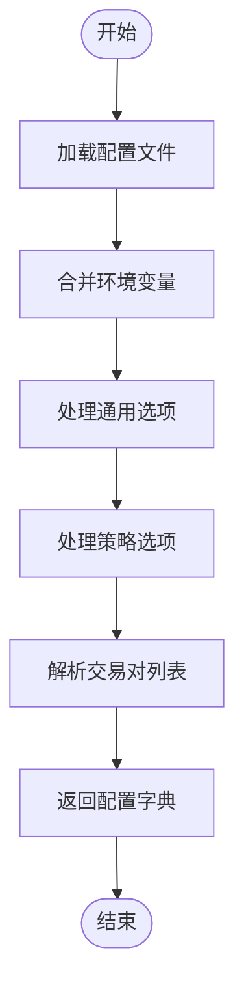

# 策略加载机制

<cite>
**Referenced Files in This Document**   
- [configuration.py](file://freqtrade/configuration/configuration.py)
- [strategy_resolver.py](file://freqtrade/resolvers/strategy_resolver.py)
- [load_config.py](file://freqtrade/configuration/load_config.py)
- [interface.py](file://freqtrade/strategy/interface.py)
- [iresolver.py](file://freqtrade/resolvers/iresolver.py)
</cite>

## 目录
1. [简介](#简介)
2. [配置解析流程](#配置解析流程)
3. [策略加载与实例化](#策略加载与实例化)
4. [策略接口版本兼容性检查](#策略接口版本兼容性检查)
5. [错误处理与回退策略](#错误处理与回退策略)
6. [最佳实践](#最佳实践)

## 简介
本文档深入解析了Freqtrade框架中的策略加载机制。该机制允许用户通过配置文件中的`strategy`参数指定自定义策略类名，并通过`strategy_resolver`根据`strategy_path`查找并实例化相应的策略模块。文档详细阐述了从配置文件解析到策略类导入、验证和初始化的完整流程，包括策略接口版本的兼容性检查、加载失败时的错误处理以及推荐的命名规范和模块结构。

## 配置解析流程
策略加载的第一步是解析配置文件，该过程由`configuration.py`模块中的`Configuration`类负责。该类通过`load_config`方法从命令行参数和配置文件中提取信息，并构建最终的配置字典。



**Diagram sources**
- [configuration.py](file://freqtrade/configuration/configuration.py#L130-L200)

**Section sources**
- [configuration.py](file://freqtrade/configuration/configuration.py#L130-L200)

## 策略加载与实例化
策略的加载和实例化由`strategy_resolver.py`中的`StrategyResolver`类完成。该类继承自`IResolver`，并实现了具体的策略加载逻辑。

### 核心流程
1.  **入口点**: `StrategyResolver.load_strategy(config)`是加载策略的入口方法。
2.  **验证策略名称**: 方法首先检查配置中是否指定了`strategy`参数，若未指定则抛出异常。
3.  **构建搜索路径**: 使用`build_search_paths`方法构建一个包含多个目录的搜索路径列表。这些路径包括：
    *   用户数据目录下的策略子目录 (`user_data_dir/strategies`)
    *   通过`--strategy-path`参数指定的额外目录
    *   通过`strategy_path`配置项指定的目录
4.  **加载策略对象**: 调用`_load_strategy`方法，该方法会遍历所有搜索路径，尝试在每个`.py`文件中查找与`strategy`参数同名的类。
5.  **实例化与验证**: 找到匹配的类后，会使用`config`作为参数进行实例化，并调用`validate_strategy`方法进行最终验证。

```mermaid
sequenceDiagram
participant Config as Configuration
participant Resolver as StrategyResolver
participant Loader as _load_object
participant Search as _search_object
Config->>Resolver : load_strategy(config)
Resolver->>Resolver : 验证strategy参数
Resolver->>Resolver : 构建搜索路径
loop 遍历每个搜索路径
Resolver->>Search : _search_object(path, strategy_name)
Search->>Search : 遍历目录下的.py文件
loop 遍历每个.py文件
Search->>Search : 导入模块并查找匹配的类
alt 找到匹配的类
Search-->>Resolver : 返回类和模块路径
Resolver->>Loader : _load_object(类, config)
Loader->>Loader : 实例化策略对象
Loader-->>Resolver : 返回实例化的策略
break
end
end
end
Resolver->>Resolver : validate_strategy(策略)
Resolver-->>Config : 返回已验证的策略实例
```

**Diagram sources**
- [strategy_resolver.py](file://freqtrade/resolvers/strategy_resolver.py#L37-L94)
- [iresolver.py](file://freqtrade/resolvers/iresolver.py#L150-L200)

**Section sources**
- [strategy_resolver.py](file://freqtrade/resolvers/strategy_resolver.py#L37-L307)

## 策略接口版本兼容性检查
为了确保策略的稳定性和向后兼容性，`StrategyResolver`在加载后会对策略实例进行一系列的兼容性检查。

### 检查内容
*   **必需的订单类型**: 检查策略的`order_types`字典是否包含所有必需的订单类型（如`entry`, `exit`, `stoploss`）。
*   **必需的订单有效时间**: 检查`order_time_in_force`字典是否包含所有必需的条目。
*   **交易模式兼容性**: 如果策略支持做空（`can_short=True`），但配置的交易模式为现货（`spot`），则会抛出错误。
*   **方法实现检查**: 根据交易模式，检查策略是否实现了必需的方法。例如，在非现货模式下，必须实现`populate_entry_trend`和`populate_exit_trend`方法。
*   **废弃方法检查**: 检查策略是否使用了已废弃的方法（如`custom_sell`），并提示用户迁移到新方法（如`custom_exit`）。

这些检查由`_strategy_sanity_validations`和`validate_strategy`方法执行，确保加载的策略符合当前框架的规范。

**Section sources**
- [strategy_resolver.py](file://freqtrade/resolvers/strategy_resolver.py#L148-L251)

## 错误处理与回退策略
策略加载机制内置了完善的错误处理机制，以应对各种异常情况。

### 常见错误与处理
*   **未指定策略**: 如果配置中没有`strategy`参数，`load_strategy`会抛出`OperationalException`，提示用户使用`--strategy`参数。
*   **策略类不存在**: 如果在所有搜索路径中都找不到指定的策略类，`_load_strategy`会抛出`OperationalException`。
*   **Python语法错误**: 在导入策略文件时，如果文件包含语法错误或缺少依赖，`_get_valid_object`方法会捕获`SyntaxError`、`ImportError`等异常，并记录警告日志，然后继续搜索下一个文件。
*   **配置循环**: `load_from_files`函数在递归加载配置文件时，会检查递归深度（`level > 5`），以防止无限循环。

该机制没有显式的“回退策略”，其核心原则是“失败即停止”。一旦发生致命错误（如找不到策略类），整个加载过程会立即终止并抛出异常，确保不会加载一个不完整或有缺陷的策略。

**Section sources**
- [strategy_resolver.py](file://freqtrade/resolvers/strategy_resolver.py#L37-L94)
- [load_config.py](file://freqtrade/configuration/load_config.py#L79-L119)

## 最佳实践
为了确保策略的可维护性和兼容性，建议遵循以下最佳实践。

### 策略命名规范
*   **类名**: 策略类名应具有描述性，并以`Strategy`结尾，例如`MyAwesomeStrategy`。
*   **文件名**: 策略文件名应与类名保持一致，例如`MyAwesomeStrategy.py`。
*   **避免冲突**: 确保自定义策略的类名不会与框架内置的策略或第三方策略发生冲突。

### 模块结构
*   **单一职责**: 每个策略文件应只包含一个策略类。
*   **目录结构**: 将所有自定义策略文件存放在`user_data/strategies/`目录下。可以创建子目录来组织不同类型的策略。
*   **依赖管理**: 在策略文件中明确声明所有外部依赖，并在文档中说明安装方法。

遵循这些最佳实践可以提高代码的可读性和可维护性，并减少在团队协作或长期维护中出现问题的风险。

**Section sources**
- [interface.py](file://freqtrade/strategy/interface.py#L150-L200)
- [configuration.py](file://freqtrade/configuration/configuration.py#L130-L200)