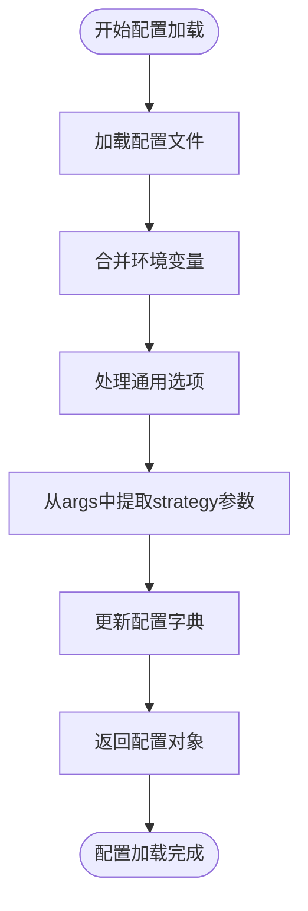
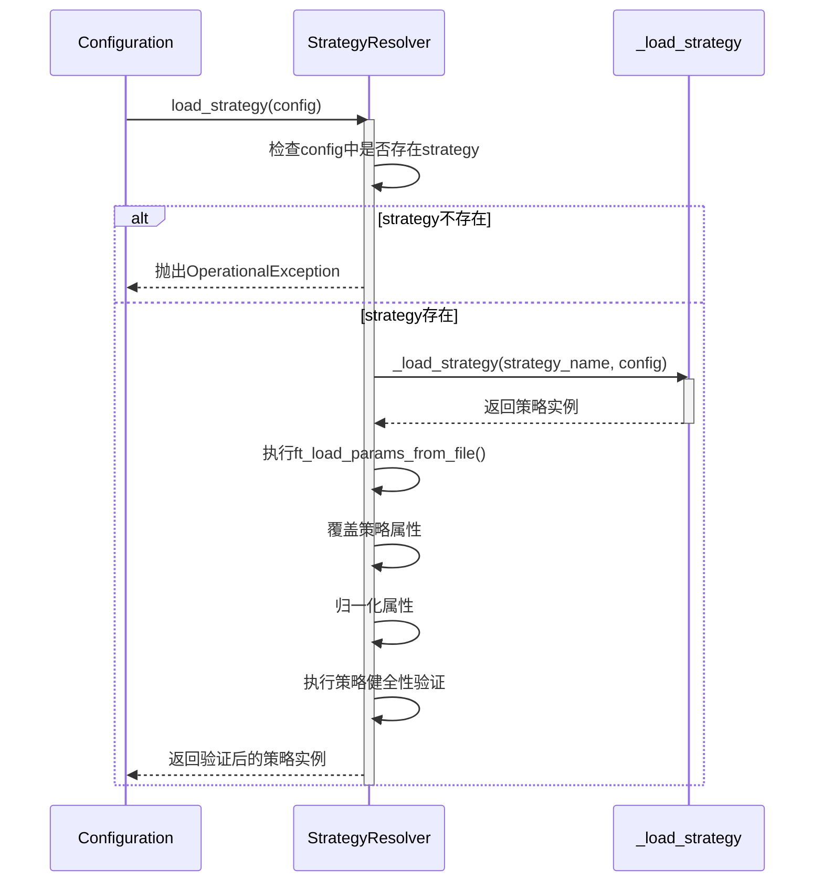
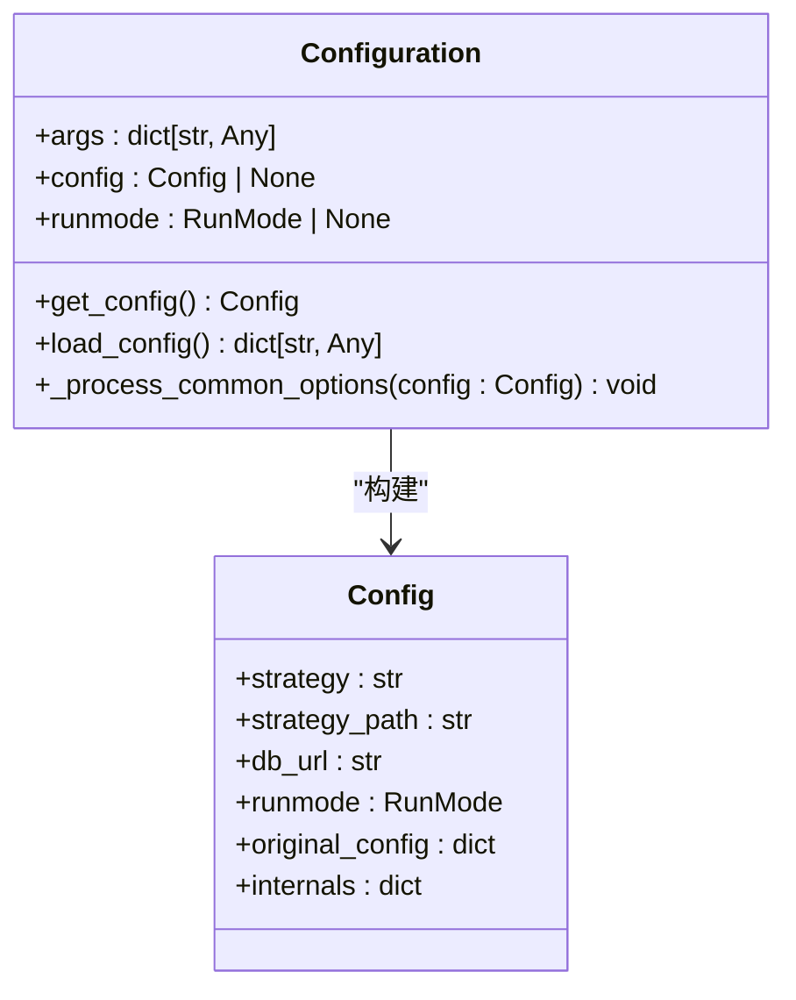
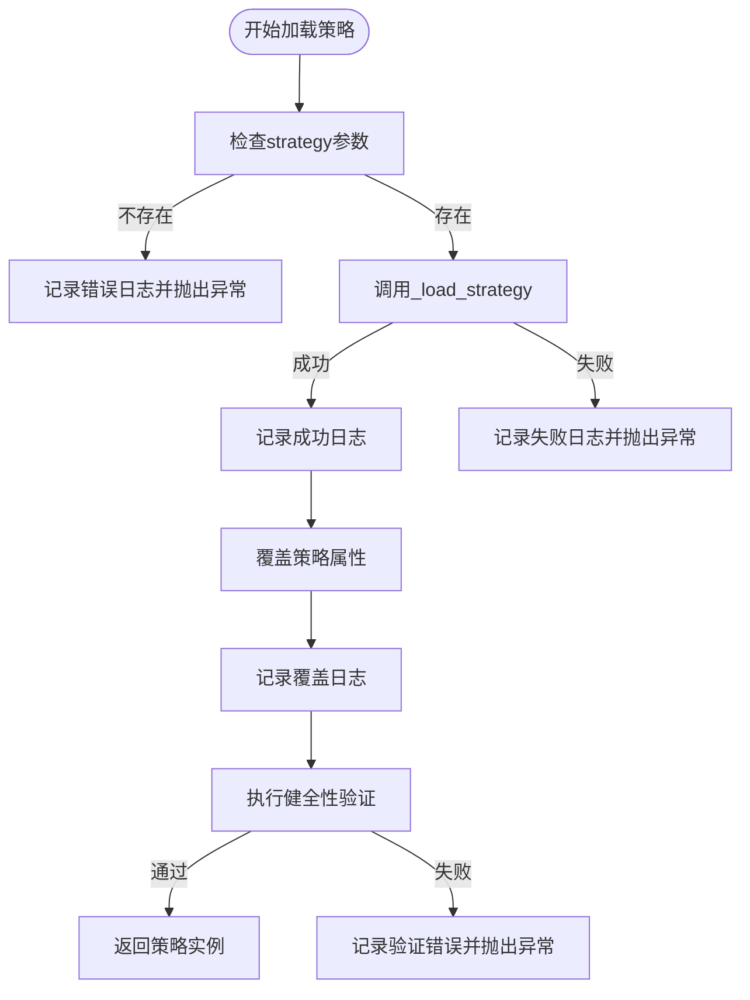

# 策略加载流程

<cite>
**本文档中引用的文件**  
- [configuration.py](file://freqtrade\configuration\configuration.py)
- [strategy_resolver.py](file://freqtrade\resolvers\strategy_resolver.py)
- [interface.py](file://freqtrade\strategy\interface.py)
</cite>

## 目录
1. [简介](#简介)
2. [配置解析与策略参数加载](#配置解析与策略参数加载)
3. [策略解析器调用流程](#策略解析器调用流程)
4. [配置对象构建与传递](#配置对象构建与传递)
5. [日志记录与错误处理](#日志记录与错误处理)
6. [配置字典结构与演变](#配置字典结构与演变)

## 简介
本文档详细阐述了Freqtrade框架中策略加载的完整流程。从用户配置的解析开始，到策略解析器（StrategyResolver）的`load_strategy`方法调用，全面解析了策略加载的各个阶段。文档重点说明了如何通过`configuration.py`中的`_get_config`方法加载用户配置，并将`strategy`参数传递给策略解析器。同时，详细描述了配置对象的构建过程、在加载过程中的演变、以及相关的日志记录和错误处理机制。

## 配置解析与策略参数加载

策略加载流程始于配置解析。`Configuration`类负责从命令行参数、配置文件和环境变量中加载和合并配置信息。`_process_common_options`方法是处理通用选项的核心，它从命令行参数中提取`strategy`参数，并将其更新到配置字典中。

**Section sources**
- [configuration.py](file://freqtrade\configuration\configuration.py#L200-L220)

## 策略解析器调用流程

当配置加载完成后，`StrategyResolver.load_strategy`方法被调用，启动策略加载的核心流程。该方法首先检查配置中是否设置了`strategy`参数，如果未设置则抛出`OperationalException`异常。

**Diagram sources**
- [strategy_resolver.py](file://freqtrade\resolvers\strategy_resolver.py#L37-L94)

**Section sources**
- [strategy_resolver.py](file://freqtrade\resolvers\strategy_resolver.py#L37-L94)

## 配置对象构建与传递

配置对象在加载过程中扮演着核心角色。它是一个字典（`Config`类型），在`Configuration.load_config`方法中被逐步构建。该对象不仅包含用户定义的配置，还包含框架自动生成的内部配置。

`load_strategy`方法接收这个配置对象作为参数，并将其传递给`_load_strategy`方法。配置对象中的`strategy`键值对决定了要加载的具体策略类名。

**Diagram sources**
- [configuration.py](file://freqtrade\configuration\configuration.py#L50-L100)
- [strategy_resolver.py](file://freqtrade\resolvers\strategy_resolver.py#L37-L94)

**Section sources**
- [configuration.py](file://freqtrade\configuration\configuration.py#L50-L100)
- [strategy_resolver.py](file://freqtrade\resolvers\strategy_resolver.py#L37-L94)

## 日志记录与错误处理

策略加载流程中包含了完善的日志记录和错误处理机制。`StrategyResolver`使用Python的`logging`模块记录关键操作，例如成功加载策略、覆盖策略属性等。

当发生错误时，例如找不到指定的策略类或策略代码存在语法错误，系统会抛出`OperationalException`或`ImportError`异常，并在日志中提供详细的错误信息。

**Diagram sources**
- [strategy_resolver.py](file://freqtrade\resolvers\strategy_resolver.py#L40-L50)
- [strategy_resolver.py](file://freqtrade\resolvers\strategy_resolver.py#L150-L170)

**Section sources**
- [strategy_resolver.py](file://freqtrade\resolvers\strategy_resolver.py#L40-L50)
- [strategy_resolver.py](file://freqtrade\resolvers\strategy_resolver.py#L150-L170)

## 配置字典结构与演变

配置字典的结构在加载过程中不断演变。初始时，它可能只包含从配置文件加载的基本信息。随着流程的推进，新的键值对被添加，现有值被覆盖。

| 阶段 | 配置字典关键字段 | 说明 |
| :--- | :--- | :--- |
| 初始加载后 | `strategy`, `db_url`, `runmode` | 从配置文件和命令行参数加载 |
| 属性覆盖后 | `minimal_roi`, `stoploss`, `order_types` | 从配置覆盖策略的默认属性 |
| 最终状态 | `max_open_trades`, `use_exit_signal`, `exit_profit_only` | 包含所有策略相关配置 |

`_override_attribute_helper`方法负责将配置中的值应用到策略实例上，确保用户配置优先于策略的默认设置。

**Section sources**
- [strategy_resolver.py](file://freqtrade\resolvers\strategy_resolver.py#L97-L126)