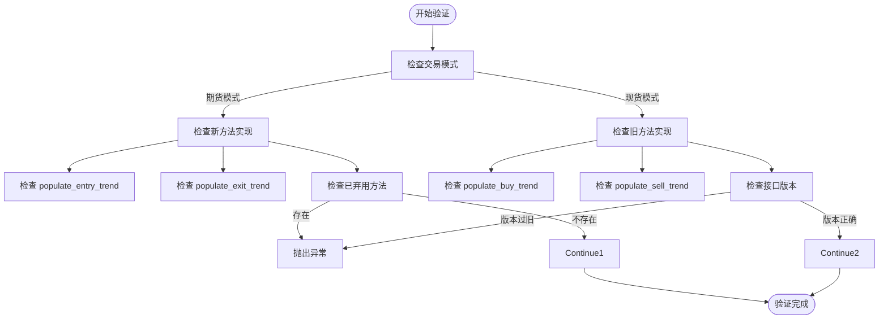
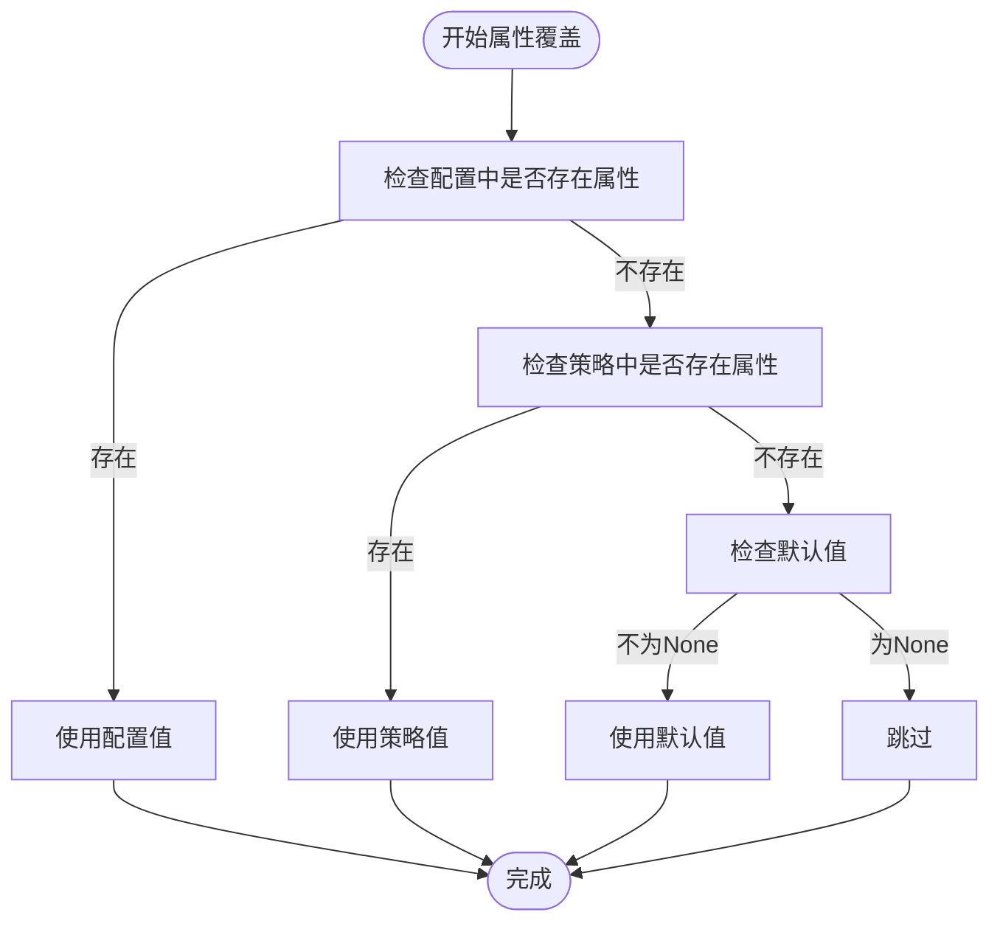
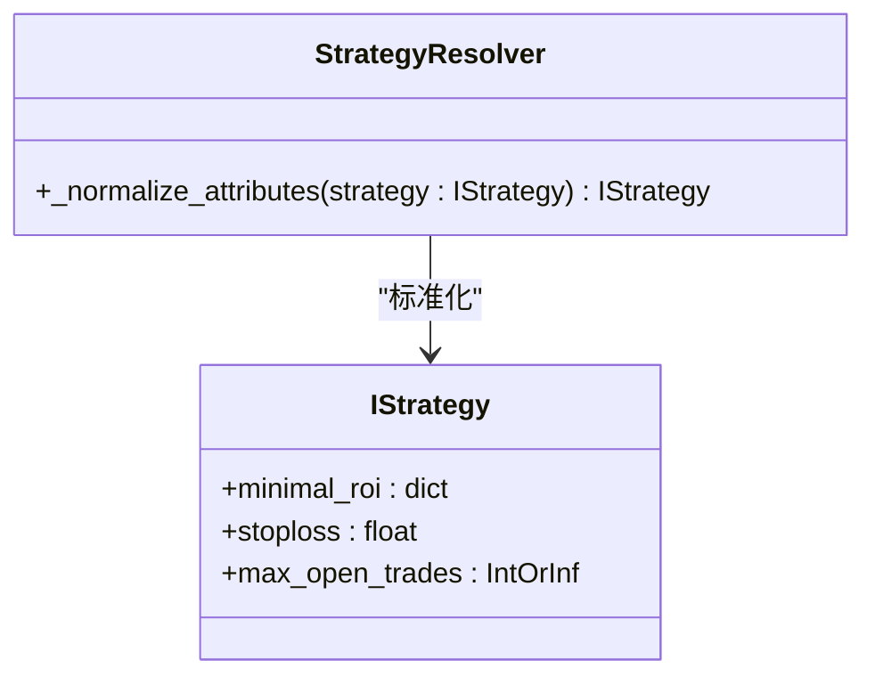
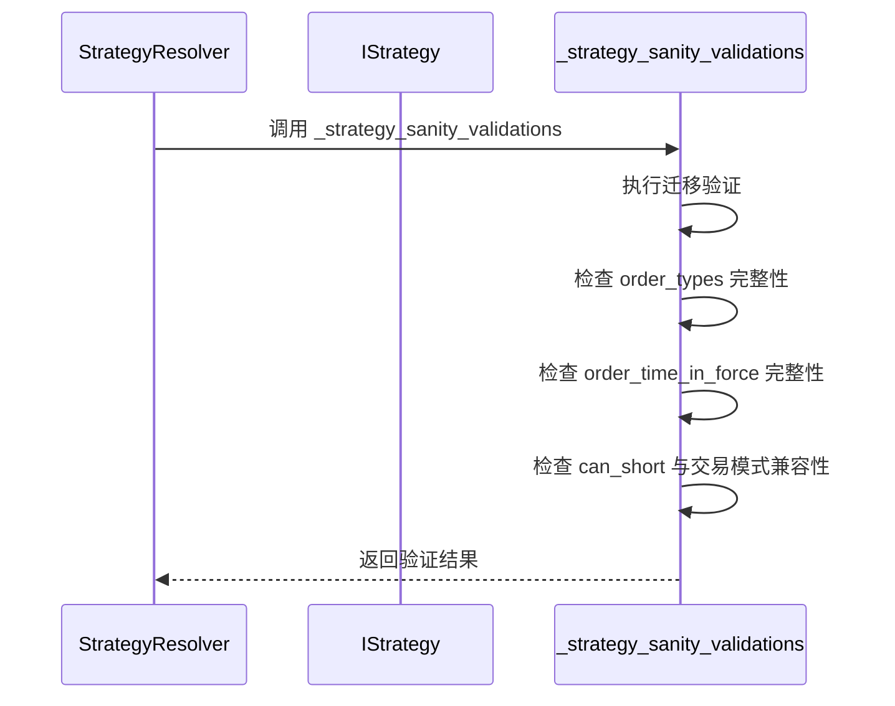

# 策略实例化与验证

<cite>
**Referenced Files in This Document**   
- [strategy_resolver.py](file://freqtrade/resolvers/strategy_resolver.py)
- [interface.py](file://freqtrade/strategy/interface.py)
- [tradingmode.py](file://freqtrade/enums/tradingmode.py)
</cite>

## 目录
1. [策略实例化与验证概述](#策略实例化与验证概述)
2. [接口兼容性检查](#接口兼容性检查)
3. [配置优先级处理](#配置优先级处理)
4. [数据类型标准化](#数据类型标准化)
5. [完整性校验](#完整性校验)

## 策略实例化与验证概述

在Freqtrade框架中，策略实例化与验证是一个关键的初始化过程，确保策略类在运行前满足所有必要的条件和配置要求。该过程主要由`StrategyResolver`类负责，通过一系列方法对策略进行验证和配置。整个流程包括接口兼容性检查、配置优先级处理、数据类型标准化以及最终的完整性校验。

**Section sources**
- [strategy_resolver.py](file://freqtrade/resolvers/strategy_resolver.py#L86-L325)

## 接口兼容性检查

`validate_strategy`方法负责执行策略的接口兼容性检查，确保策略实现了必要的方法并遵循了框架的接口规范。该方法根据交易模式的不同执行不同的验证逻辑。

在期货模式下（`trading_mode`不等于`SPOT`），该方法会强制要求策略实现`populate_entry_trend`和`populate_exit_trend`方法，并检查是否存在已弃用的方法。如果策略实现了`check_buy_timeout`、`check_sell_timeout`或`custom_sell`等旧方法，将抛出`OperationalException`异常，提示用户迁移到新的方法名（分别为`check_entry_timeout`、`check_exit_timeout`和`custom_exit`）。

在现货模式下（`trading_mode`等于`SPOT`），该方法会发出弃用警告，提示用户将`sell_profit_only`、`sell_profit_offset`、`use_sell_signal`和`ignore_roi_if_buy_signal`等设置迁移到新的命名约定。同时，它会检查策略是否实现了`populate_entry_trend`或`populate_buy_trend`（入口趋势）以及`populate_exit_trend`或`populate_sell_trend`（出口趋势）方法。此外，该方法还会检查策略接口版本，确保`populate_indicators`、`populate_buy_trend`和`populate_sell_trend`方法的参数数量符合要求，防止使用已废弃的策略接口v1。

**Diagram sources**
- [strategy_resolver.py](file://freqtrade/resolvers/strategy_resolver.py#L173-L251)

**Section sources**
- [strategy_resolver.py](file://freqtrade/resolvers/strategy_resolver.py#L173-L251)
- [interface.py](file://freqtrade/strategy/interface.py#L50-L759)

## 配置优先级处理

`_override_attribute_helper`方法实现了策略属性的配置优先级逻辑，遵循“配置 > 策略 > 默认值”的覆盖原则。该方法接收策略实例、配置字典、属性名和默认值作为参数，按优先级顺序确定属性的最终值。

首先，该方法检查配置中是否包含指定属性，且该属性不是策略类的属性（property）。如果是，则使用配置中的值覆盖策略属性，并记录日志信息。其次，如果配置中没有该属性，则检查策略实例本身是否具有该属性。如果是，则将该属性的值复制到配置中（`None`值除外）。最后，如果前两个条件都不满足，则使用提供的默认值（如果默认值不为`None`）。

该方法处理了多个关键策略属性，如`minimal_roi`、`stoploss`、`timeframe`、`trailing_stop`、`order_types`、`order_time_in_force`等。特别地，对于`max_open_trades`属性，如果策略中设置为-1，会被转换为无穷大（`float("inf")`），表示不限制最大开仓交易数。

**Diagram sources**
- [strategy_resolver.py](file://freqtrade/resolvers/strategy_resolver.py#L97-L126)

**Section sources**
- [strategy_resolver.py](file://freqtrade/resolvers/strategy_resolver.py#L97-L126)

## 数据类型标准化

`_normalize_attributes`方法负责对策略属性进行数据类型标准化，确保所有属性都具有正确的数据类型，以便后续处理。该方法对特定属性执行类型转换和排序操作。

对于`minimal_roi`属性，该方法将其转换为整数键的字典，并按键排序，确保ROI（投资回报率）阈值按时间顺序排列。对于`stoploss`属性，将其转换为浮点数类型。对于`max_open_trades`属性，如果其值小于0，则将其转换为无穷大（`float("inf")`），表示不限制最大开仓交易数。

这些标准化操作确保了策略属性在后续逻辑中的一致性和正确性，避免了因数据类型不匹配或顺序错误导致的问题。

**Diagram sources**
- [strategy_resolver.py](file://freqtrade/resolvers/strategy_resolver.py#L129-L145)

**Section sources**
- [strategy_resolver.py](file://freqtrade/resolvers/strategy_resolver.py#L129-L145)

## 完整性校验

`_strategy_sanity_validations`方法执行策略的最终完整性校验，确保策略在加载后处于一致和有效的状态。该方法在所有其他验证和配置步骤完成后调用。

首先，该方法调用`validate_migrated_strategy_settings`函数，确保必要的策略设置迁移已经完成。然后，它检查策略的`order_types`和`order_time_in_force`字典是否包含所有必需的键（由`REQUIRED_ORDERTYPES`和`REQUIRED_ORDERTIF`常量定义）。如果缺少任何必需的键，将抛出`ImportError`异常。

最后，该方法检查策略的做空能力（`can_short`）与交易模式的兼容性。如果策略设置了`can_short=True`但交易模式为现货（`SPOT`），将抛出`ImportError`异常，因为做空策略不能在现货市场运行。用户需要将`can_short`设置为`False`才能在现货市场运行该策略。

**Diagram sources**
- [strategy_resolver.py](file://freqtrade/resolvers/strategy_resolver.py#L148-L170)

**Section sources**
- [strategy_resolver.py](file://freqtrade/resolvers/strategy_resolver.py#L148-L170)
- [tradingmode.py](file://freqtrade/enums/tradingmode.py#L3-L14)