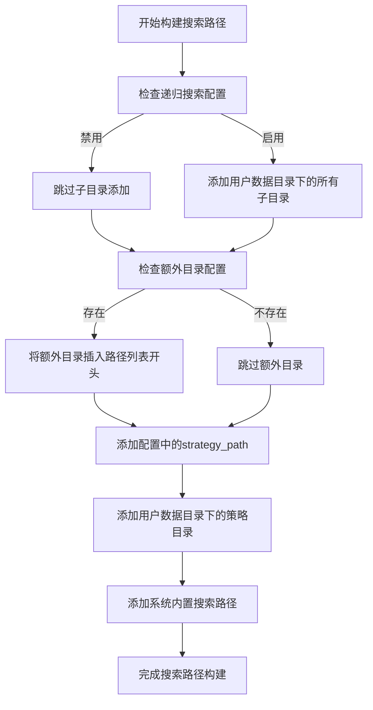
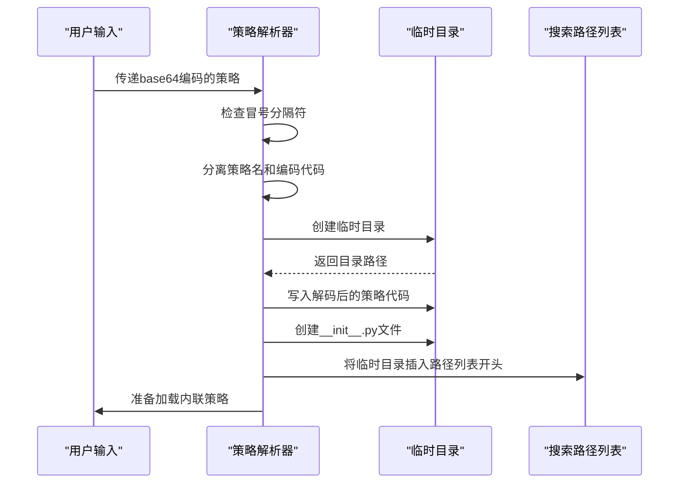
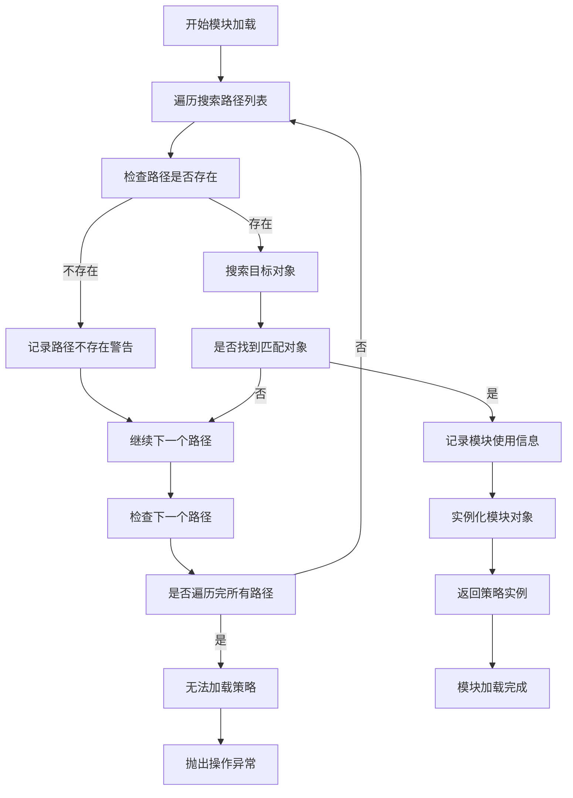

# 策略模块查找与导入

<cite>
**本文档中引用的文件**  
- [strategy_resolver.py](file://freqtrade/resolvers/strategy_resolver.py)
- [iresolver.py](file://freqtrade/resolvers/iresolver.py)
- [constants.py](file://freqtrade/constants.py)
</cite>

## 目录
1. [策略模块查找流程](#策略模块查找流程)
2. [搜索路径构建机制](#搜索路径构建机制)
3. [内联策略处理](#内联策略处理)
4. [模块加载与缓存](#模块加载与缓存)

## 策略模块查找流程

`StrategyResolver._load_strategy` 方法是策略模块加载的核心入口，负责根据配置信息查找并加载指定的策略类。该方法首先通过配置中的 `recursive_strategy_search` 参数决定是否启用递归搜索功能，然后构建完整的搜索路径列表。当策略名称中包含冒号（:）时，系统会识别为base64编码的内联策略，并进行特殊处理。最终通过 `_load_object` 方法在多个路径中定位并动态导入策略模块。

**Section sources**
- [strategy_resolver.py](file://freqtrade/resolvers/strategy_resolver.py#L253-L292)

## 搜索路径构建机制

`build_search_paths` 方法负责构建策略搜索路径列表，其构建过程遵循特定的优先级顺序。首先检查配置中是否启用了递归策略搜索，如果启用，则将用户数据目录下的策略子目录全部加入搜索路径。接着处理额外的策略路径（`extra_dir`），将其插入到搜索路径列表的开头。搜索路径的构建遵循以下优先级：

1. 额外指定的策略路径（`extra_dir`）
2. 配置中指定的 `strategy_path`
3. 用户数据目录下的策略目录（`user_data_dir/strategies`）
4. 系统内置的初始搜索路径

这种分层的搜索路径构建机制确保了策略模块的查找既灵活又有序，允许用户通过配置覆盖默认的查找行为。

**Diagram sources**
- [iresolver.py](file://freqtrade/resolvers/iresolver.py#L50-L86)
- [constants.py](file://freqtrade/constants.py#L103)

**Section sources**
- [iresolver.py](file://freqtrade/resolvers/iresolver.py#L50-L86)
- [constants.py](file://freqtrade/constants.py#L103)

## 内联策略处理

当策略名称中包含冒号（:）分隔符时，系统会识别为base64编码的内联策略，并启动特殊的处理流程。该流程首先创建一个临时目录，然后将base64解码后的策略代码写入该目录中的Python文件。同时，系统会创建一个空的 `__init__.py` 文件以确保临时目录被视为有效的Python包。

内联策略的处理流程包括以下关键步骤：
1. 解析策略名称和base64编码的代码
2. 创建临时目录用于存放策略文件
3. 将解码后的策略代码写入Python文件
4. 创建 `__init__.py` 文件以形成有效的Python包
5. 将临时目录的解析路径插入到搜索路径列表的最前面
6. 更新策略名称为解码后的类名

这种机制允许用户通过命令行直接传递策略代码，而无需将其保存为文件，为策略的快速测试和部署提供了便利。

**Diagram sources**
- [strategy_resolver.py](file://freqtrade/resolvers/strategy_resolver.py#L270-L286)

**Section sources**
- [strategy_resolver.py](file://freqtrade/resolvers/strategy_resolver.py#L270-L286)

## 模块加载与缓存

`_load_object` 方法负责在多个路径中定位并动态导入策略模块，实现了高效的模块查找和加载机制。该方法遍历构建好的搜索路径列表，逐个检查每个路径下的Python文件，寻找匹配的策略类。当找到匹配的模块时，系统会记录模块的源代码和文件路径，并通过关键字参数实例化策略对象。

模块加载过程包含以下关键特性：
- **源码加载**：当 `add_source` 参数为真时，系统会捕获并存储模块的源代码
- **路径验证**：系统会检查模块路径是否存在，对不存在的路径发出警告
- **缓存机制**：已加载的模块会被缓存，避免重复加载
- **异常处理**：对导入过程中可能出现的多种异常进行捕获和处理

这种分层的加载机制确保了策略模块的查找既高效又可靠，同时通过源码捕获和路径记录为调试和审计提供了必要的信息。

**Diagram sources**
- [iresolver.py](file://freqtrade/resolvers/iresolver.py#L161-L182)
- [iresolver.py](file://freqtrade/resolvers/iresolver.py#L131-L158)

**Section sources**
- [iresolver.py](file://freqtrade/resolvers/iresolver.py#L161-L182)
- [iresolver.py](file://freqtrade/resolvers/iresolver.py#L131-L158)