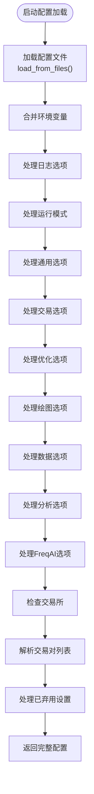
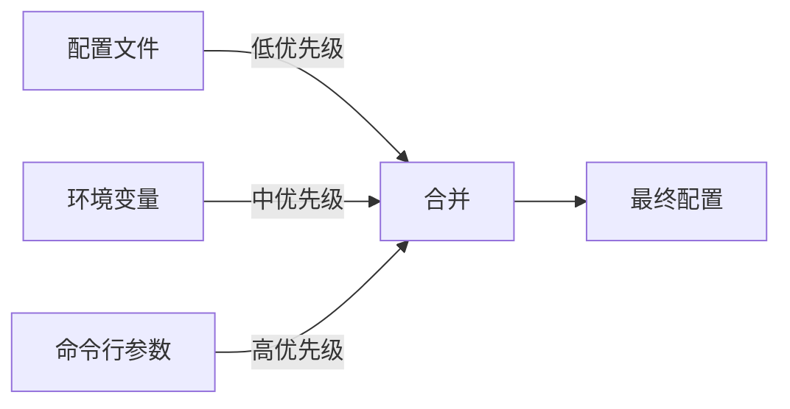
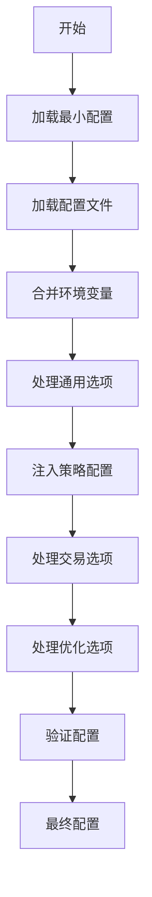

# 配置解析与加载

<cite>
**本文档引用的文件**  
- [configuration.py](file://freqtrade\configuration\configuration.py)
- [load_config.py](file://freqtrade\configuration\load_config.py)
- [config_validation.py](file://freqtrade\configuration\config_validation.py)
- [config_setup.py](file://freqtrade\configuration\config_setup.py)
- [constants.py](file://freqtrade\constants.py)
- [config_secrets.py](file://freqtrade\configuration\config_secrets.py)
</cite>

## 目录
1. [配置系统概述](#配置系统概述)
2. [配置加载流程](#配置加载流程)
3. [配置源合并机制](#配置源合并机制)
4. [配置对象构建过程](#配置对象构建过程)
5. [策略加载流程](#策略加载流程)
6. [配置验证与默认值填充](#配置验证与默认值填充)
7. [错误处理策略](#错误处理策略)

## 配置系统概述

Freqtrade的配置系统是一个复杂的多源配置管理框架，负责解析和合并来自多个来源的配置信息，包括配置文件、环境变量和命令行参数。该系统通过`Configuration`类实现，该类作为配置管理的核心组件，协调整个配置加载和验证过程。

配置系统的设计目标是提供灵活的配置选项，支持多种配置源的优先级覆盖，并确保配置的一致性和有效性。系统通过分层处理机制，逐步构建完整的配置对象，从基础配置文件开始，逐步合并环境变量和命令行参数，最终形成一个完整的、可用于交易机器人的配置字典。

**Section sources**
- [configuration.py](file://freqtrade\configuration\configuration.py#L33-L546)

## 配置加载流程

配置加载流程始于`Configuration`类的`load_config`方法，该方法作为配置系统的入口点，协调整个配置加载过程。当用户启动Freqtrade时，系统首先创建`Configuration`实例，传入命令行参数和运行模式，然后调用`get_config`方法触发配置加载。

`load_config`方法首先通过`load_from_files`函数加载配置文件，然后合并环境变量，最后处理各种配置选项。整个流程遵循严格的顺序，确保配置的正确性和一致性。配置加载过程是递归的，支持配置文件之间的相互引用，通过`add_config_files`字段实现配置文件的嵌套加载。



**Diagram sources**
- [configuration.py](file://freqtrade\configuration\configuration.py#L70-L120)

**Section sources**
- [configuration.py](file://freqtrade\configuration\configuration.py#L70-L120)

## 配置源合并机制

配置系统支持多种配置源的合并，包括配置文件、环境变量和命令行参数。这些配置源按照特定的优先级顺序进行合并，后加载的配置源会覆盖先前加载的相同配置项。这种合并机制确保了用户可以通过命令行参数覆盖配置文件中的设置，提供了极大的灵活性。

### 配置文件加载

配置文件通过`load_from_files`函数加载，该函数支持递归加载多个配置文件。当配置文件中包含`add_config_files`字段时，系统会递归加载指定的附加配置文件。配置文件的加载顺序决定了配置项的优先级，后加载的文件中的配置项会覆盖先前文件中的相同配置项。

```python
def load_from_files(
    files: list[str], base_path: Path | None = None, level: int = 0
) -> dict[str, Any]:
    """
    递归加载配置文件（如果指定了的话）。
    子文件假定相对于初始配置。
    """
    config: Config = {}
    if level > 5:
        raise ConfigurationError("检测到配置循环。")

    if not files:
        return deepcopy(MINIMAL_CONFIG)
    files_loaded = []
    # 我们期望这里是一个配置文件名列表
    for filename in files:
        logger.info(f"使用配置: {filename} ...")
        if filename == "-":
            # 立即加载标准输入并返回
            return load_config_file(filename)
        file = Path(filename)
        if base_path:
            # 添加基础路径以允许相对分配
            file = base_path / file

        config_tmp = load_config_file(str(file))
        if "add_config_files" in config_tmp:
            config_sub = load_from_files(
                config_tmp["add_config_files"], file.resolve().parent, level + 1
            )
            files_loaded.extend(config_sub.get("config_files", []))
            config_tmp = deep_merge_dicts(config_tmp, config_sub)

        files_loaded.insert(0, str(file))

        # 合并配置选项，覆盖先前的值
        config = deep_merge_dicts(config_tmp, config)

    config["config_files"] = files_loaded

    return config
```

**Section sources**
- [load_config.py](file://freqtrade\configuration\load_config.py#L79-L119)

### 环境变量合并

环境变量通过`environment_vars_to_dict`函数转换为字典，然后使用`deep_merge_dicts`函数与配置文件中的配置合并。环境变量的优先级高于配置文件但低于命令行参数，这种设计允许用户在不修改配置文件的情况下通过环境变量调整配置。

### 命令行参数处理

命令行参数通过`_args_to_config`和`_args_to_config_loop`方法处理，这些方法将命令行参数直接注入到配置字典中。命令行参数具有最高的优先级，可以覆盖配置文件和环境变量中的任何设置。这种设计使得用户可以在运行时灵活地调整配置，而无需修改配置文件。



**Diagram sources**
- [configuration.py](file://freqtrade\configuration\configuration.py#L452-L454)
- [configuration.py](file://freqtrade\configuration\configuration.py#L511-L546)

## 配置对象构建过程

配置对象的构建是一个逐步完善的过程，从最小配置开始，逐步添加和覆盖配置项。这个过程确保了即使在缺少某些配置项的情况下，系统也能提供合理的默认值。

### 最小配置

系统定义了一个`MINIMAL_CONFIG`常量，作为所有配置的基础。当没有提供配置文件时，系统会使用这个最小配置作为起点。最小配置包含了运行Freqtrade所需的基本配置项，如`stake_currency`、`dry_run`和交易所配置。

```python
MINIMAL_CONFIG = {
    "stake_currency": "",
    "dry_run": True,
    "exchange": {
        "name": "",
        "key": "",
        "secret": "",
        "pair_whitelist": [],
        "ccxt_async_config": {},
    },
}
```

**Section sources**
- [constants.py](file://freqtrade\constants.py#L178-L188)

### 配置字典演变

配置字典的演变过程从加载配置文件开始，然后逐步合并环境变量和命令行参数。在这个过程中，特定的配置项如`strategy`和`strategy_path`会被注入到配置字典中。`strategy`字段指定了要使用的交易策略，而`strategy_path`字段指定了策略文件的查找路径。



**Diagram sources**
- [configuration.py](file://freqtrade\configuration\configuration.py#L160-L186)

## 策略加载流程

策略加载流程是配置系统的重要组成部分，它确保了正确的交易策略被加载和使用。`_process_common_options`方法负责处理与策略相关的配置项，包括`strategy`和`strategy_path`。

当用户通过命令行参数指定策略时，`strategy`字段会被更新为指定的策略名称。如果配置文件中没有指定策略，系统也会使用命令行参数中的策略名称。`strategy_path`字段允许用户指定额外的策略查找路径，这在使用自定义策略时非常有用。

```python
def _process_common_options(self, config: Config) -> None:
    # 如果未在配置中指定或为非默认值，则设置策略
    if self.args.get("strategy") or not config.get("strategy"):
        config.update({"strategy": self.args.get("strategy")})

    self._args_to_config(
        config, argname="strategy_path", logstring="使用额外的策略查找路径: {}"
    )

    if (
        "db_url" in self.args
        and self.args["db_url"]
        and self.args["db_url"] != constants.DEFAULT_DB_PROD_URL
    ):
        config.update({"db_url": self.args["db_url"]})
        logger.info("检测到 --db-url 参数 ...")

    self._args_to_config(
        config, argname="db_url_from", logstring="检测到 --db-url-from 参数 ..."
    )

    if config.get("force_entry_enable", False):
        logger.warning("`force_entry_enable` RPC 消息已启用。")

    # 支持 sd_notify
    if self.args.get("sd_notify"):
        config["internals"].update({"sd_notify": True})
```

**Section sources**
- [configuration.py](file://freqtrade\configuration\configuration.py#L160-L186)

## 配置验证与默认值填充

配置验证是确保系统稳定运行的关键步骤。Freqtrade通过`validate_config_consistency`函数对配置进行验证，确保配置的一致性和有效性。验证过程包括检查配置模式、验证交易相关设置、检查白名单等。

### 配置验证

配置验证过程在`config_validation.py`文件中实现，包含多个验证函数，如`_validate_trailing_stoploss`、`_validate_price_config`和`_validate_whitelist`。这些函数检查配置中的特定设置是否符合要求，如果发现不一致或无效的配置，会抛出`ConfigurationError`异常。

```python
def validate_config_consistency(conf: dict[str, Any], *, preliminary: bool = False) -> None:
    """
    验证配置的一致性。
    应在加载配置和策略后运行，
    因为策略也可以设置某些配置设置。
    :param conf: JSON格式的配置
    :return: 如果一切正常则返回None，否则抛出ConfigurationError
    """

    # 验证跟踪止损
    _validate_trailing_stoploss(conf)
    _validate_price_config(conf)
    _validate_edge(conf)
    _validate_whitelist(conf)
    _validate_unlimited_amount(conf)
    _validate_ask_orderbook(conf)
    _validate_freqai_hyperopt(conf)
    _validate_freqai_backtest(conf)
    _validate_freqai_include_timeframes(conf, preliminary=preliminary)
    _validate_consumers(conf)
    validate_migrated_strategy_settings(conf)
    _validate_orderflow(conf)

    # 返回前验证配置
    logger.info("验证配置 ...")
    validate_config_schema(conf, preliminary=preliminary)
```

**Section sources**
- [config_validation.py](file://freqtrade\configuration\config_validation.py#L72-L97)

### 默认值填充

默认值填充通过扩展的JSON Schema验证器实现。`_extend_validator`函数创建了一个自定义验证器，该验证器在验证过程中自动填充默认值。这种设计确保了即使用户没有指定某些配置项，系统也能提供合理的默认值。

```python
def _extend_validator(validator_class):
    """
    扩展的验证器用于Freqtrade配置JSON Schema。
    目前仅处理子模式的默认值。
    """
    validate_properties = validator_class.VALIDATORS["properties"]

    def set_defaults(validator, properties, instance, schema):
        for prop, subschema in properties.items():
            if "default" in subschema:
                instance.setdefault(prop, subschema["default"])

        yield from validate_properties(validator, properties, instance, schema)

    return validators.extend(validator_class, {"properties": set_defaults})
```

**Section sources**
- [config_validation.py](file://freqtrade\configuration\config_validation.py#L45-L69)

## 错误处理策略

配置系统的错误处理策略旨在提供清晰的错误信息，帮助用户快速定位和解决问题。系统通过多种机制处理不同类型的错误，包括配置文件不存在、JSON解析错误和配置验证失败。

### 配置文件错误

当配置文件不存在时，系统会抛出`OperationalException`异常，并提供清晰的错误消息。对于JSON解析错误，系统会尝试定位错误位置，并显示错误周围的配置片段，帮助用户快速找到问题所在。

```python
def load_config_file(path: str) -> dict[str, Any]:
    """
    从给定路径加载配置文件
    :param path: 路径字符串
    :return: 字典格式的配置
    """
    try:
        # 如果选项中请求，从标准输入读取配置
        with Path(path).open() if path != "-" else sys.stdin as file:
            config = rapidjson.load(file, parse_mode=CONFIG_PARSE_MODE)
    except FileNotFoundError:
        raise OperationalException(
            f'配置文件 "{path}" 未找到！'
            " 请创建一个配置文件或检查它是否存在。"
        ) from None
    except rapidjson.JSONDecodeError as e:
        err_range = log_config_error_range(path, str(e))
        raise ConfigurationError(
            f"{e}\n请验证您的配置的以下部分：\n{err_range}"
            if err_range
            else "请验证您的配置文件是否存在语法错误。"
        )

    return config
```

**Section sources**
- [load_config.py](file://freqtrade\configuration\load_config.py#L53-L76)

### 配置验证错误

配置验证错误通过`ConfigurationError`异常处理。当验证失败时，系统会提供详细的错误信息，包括错误原因和建议的解决方案。这种设计帮助用户快速理解问题并进行修正。

```python
def validate_config_schema(conf: dict[str, Any], preliminary: bool = False) -> dict[str, Any]:
    """
    验证配置是否符合配置模式
    :param conf: JSON格式的配置
    :return: 如果配置有效则返回配置，否则抛出异常
    """
    try:
        FreqtradeValidator(conf_schema).validate(conf)
        return conf
    except ValidationError as e:
        logger.critical(f"无效的配置。原因: {e}")
        result = best_match(FreqtradeValidator(conf_schema).iter_errors(conf))
        raise ConfigurationError(result.message)
```

**Section sources**
- [config_validation.py](file://freqtrade\configuration\config_validation.py#L45-L69)