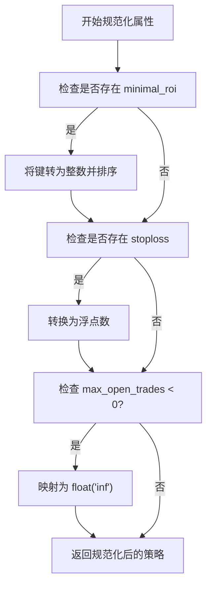
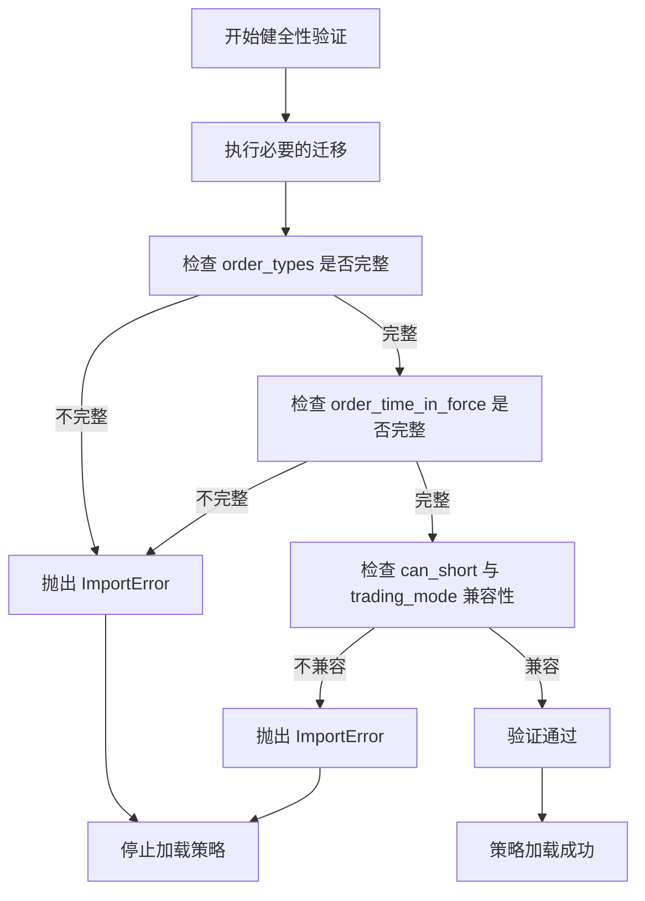

# 策略属性配置与覆盖

<cite>
**本文档中引用的文件**  
- [strategy_resolver.py](file://freqtrade/resolvers/strategy_resolver.py)
- [interface.py](file://freqtrade/strategy/interface.py)
- [constants.py](file://freqtrade/constants.py)
</cite>

## 目录
1. [引言](#引言)
2. [策略属性规范化机制](#策略属性规范化机制)
3. [_normalize_attributes 方法详解](#_normalize_attributes-方法详解)
4. [_strategy_sanity_validations 方法详解](#_strategy_sanity_validations-方法详解)
5. 关键属性处理规则
   - [stoploss 属性处理](#stoploss-属性处理)
   - [minimal_roi 属性处理](#minimal_roi-属性处理)
   - [max_open_trades 属性映射](#max_open_trades-属性映射)
6. [规范化操作对策略行为的影响](#规范化操作对策略行为的影响)
7. [结论](#结论)

## 引言

在 Freqtrade 量化交易框架中，策略（Strategy）的配置属性正确性和一致性对于交易系统的稳定运行至关重要。本文档详细解释了 `_strategy_sanity_validations` 和 `_normalize_attributes` 两个核心方法如何确保策略属性的正确性和一致性。我们将深入分析 `stoploss`、`minimal_roi` 等关键属性的类型转换和格式化规则，描述 `max_open_trades` 属性从 -1 到无穷大的映射逻辑，以及 `minimal_roi` 字典的按键排序机制。通过实际代码示例，展示这些规范化操作对策略行为的具体影响。

**Section sources**
- [strategy_resolver.py](file://freqtrade/resolvers/strategy_resolver.py#L1-L50)

## 策略属性规范化机制

Freqtrade 框架在加载和验证用户自定义策略时，通过 `StrategyResolver` 类中的两个关键方法：`_normalize_attributes` 和 `_strategy_sanity_validations` 来确保策略配置的正确性。这两个方法在策略实例化后立即执行，构成了策略配置的规范化和验证流程。

`_normalize_attributes` 方法负责对策略属性进行类型转换和格式化，确保所有属性都符合预期的数据类型和结构。而 `_strategy_sanity_validations` 方法则执行一系列健全性检查，验证策略配置的完整性和逻辑正确性，防止因配置错误导致的运行时异常。

这种分层的处理机制保证了策略在进入实际交易逻辑之前，其配置已经过严格的清洗和验证，从而提高了系统的健壮性和可靠性。

**Section sources**
- [strategy_resolver.py](file://freqtrade/resolvers/strategy_resolver.py#L129-L170)

## _normalize_attributes 方法详解

`_normalize_attributes` 方法是策略属性规范化的核心，它对特定的策略属性执行类型转换和值映射，确保它们以统一的格式被系统使用。

该方法通过检查策略对象是否具有特定属性，然后对其进行相应的处理：

1.  **minimal_roi 处理**：如果策略定义了 `minimal_roi` 属性，该方法会将其转换为一个字典。首先，它将所有键（通常是字符串）转换为整数类型，然后根据键的数值大小对字典进行升序排序。这确保了 ROI（投资回报率）阈值按时间顺序排列，便于后续逻辑按时间递增的顺序进行查找。

2.  **stoploss 处理**：如果策略定义了 `stoploss` 属性，该方法会将其强制转换为浮点数（float）。这保证了止损值始终以数值形式参与计算，避免了因字符串或其他类型导致的计算错误。

3.  **max_open_trades 映射**：如果策略定义了 `max_open_trades` 属性且其值小于 0，该方法会将其值映射为正无穷大（`float("inf")`）。在 Freqtrade 中，-1 通常被用作“无限制”的语义值，此映射将其转换为 Python 中表示无穷大的标准形式，便于在比较和逻辑判断中使用。



**Diagram sources**
- [strategy_resolver.py](file://freqtrade/resolvers/strategy_resolver.py#L129-L145)

## _strategy_sanity_validations 方法详解

`_strategy_sanity_validations` 方法执行一系列健全性检查，以确保策略配置的完整性和正确性。如果任何检查失败，该方法会抛出 `ImportError` 异常，阻止策略的加载。

主要的验证包括：

1.  **订单类型完整性检查**：验证策略的 `order_types` 字典是否包含了所有必需的订单类型（如 "entry", "exit", "stoploss" 等）。如果缺少任何必需的类型，将抛出异常，提示订单类型映射不完整。

2.  **订单时效性完整性检查**：验证策略的 `order_time_in_force` 字典是否包含了所有必需的订单时效性（如 "entry", "exit"）。如果缺少任何必需的时效性，同样会抛出异常。

3.  **做空与交易模式兼容性检查**：检查策略的 `can_short` 属性（是否允许做空）与配置中的 `trading_mode`（交易模式）是否兼容。如果策略允许做空但交易模式被设置为现货（SPOT），则会抛出异常，因为做空策略不能在现货市场运行。

这些检查确保了策略在加载时就具备了运行所需的所有基本配置，避免了在交易过程中因配置缺失或冲突而导致的错误。



**Diagram sources**
- [strategy_resolver.py](file://freqtrade/resolvers/strategy_resolver.py#L148-L170)

## 关键属性处理规则

### stoploss 属性处理

`stoploss` 属性用于定义策略的默认止损百分比。`_normalize_attributes` 方法确保该属性始终为浮点数类型。

**处理规则**：
- **类型转换**：无论用户在策略中以字符串（如 `"0.1"`）还是整数（如 `10`）形式定义 `stoploss`，该方法都会调用 `float()` 函数将其转换为浮点数。
- **目的**：统一的数据类型确保了在计算止损价格、比较当前利润等所有后续操作中，`stoploss` 值都能被正确地进行数学运算。

例如，用户在策略中定义 `stoploss = "0.05"`，经过 `_normalize_attributes` 处理后，`strategy.stoploss` 的值将变为 `0.05`（浮点数）。

**Section sources**
- [strategy_resolver.py](file://freqtrade/resolvers/strategy_resolver.py#L138-L140)

### minimal_roi 属性处理

`minimal_roi` 属性是一个字典，定义了在不同持有时间后触发卖出的最小投资回报率阈值。`_normalize_attributes` 方法对其执行了严格的格式化。

**处理规则**：
- **键类型转换**：字典中所有键（代表分钟数）都会被转换为整数。例如，`{"0": 0.1, "60": 0.05}` 会被转换为 `{0: 0.1, 60: 0.05}`。
- **按键排序**：转换后的字典会按键（即时间）的数值大小进行升序排序。排序后的字典保证了在查找满足条件的 ROI 时，可以按时间顺序进行，这对于实现“持有时间越长，所需回报率越低”的渐进式退出策略至关重要。

**排序示例**：
```python
# 用户定义（无序）
minimal_roi = {"120": 0.01, "0": 0.1, "60": 0.05}

# 经过 _normalize_attributes 处理后
minimal_roi = {0: 0.1, 60: 0.05, 120: 0.01}
```

**Section sources**
- [strategy_resolver.py](file://freqtrade/resolvers/strategy_resolver.py#L130-L136)

### max_open_trades 属性映射

`max_open_trades` 属性限制了策略可以同时持有的最大交易数量。`_normalize_attributes` 方法实现了一个特殊的值映射逻辑。

**映射逻辑**：
- 当 `max_open_trades` 的值小于 0 时（通常用户会设置为 -1 来表示“无限制”），该方法会将其值映射为 `float("inf")`。
- 这种映射将用户友好的语义值（-1）转换为编程中表示无穷大的标准值（`inf`）。

**目的**：
- 在后续的逻辑判断中（例如，检查是否可以开新仓），可以直接使用 `>` 或 `<` 操作符与 `inf` 进行比较。例如，`current_open_trades < max_open_trades` 在 `max_open_trades` 为 `inf` 时永远为真，从而实现了“无限制”的效果。这比在每次比较时都检查是否为 -1 要简洁和高效得多。

**Section sources**
- [strategy_resolver.py](file://freqtrade/resolvers/strategy_resolver.py#L142-L144)

## 规范化操作对策略行为的影响

这些规范化操作虽然在后台自动执行，但对策略的行为有着直接且重要的影响。

**实际影响示例**：
1.  **ROI 查找逻辑**：`minimal_roi` 的排序确保了 `min_roi_reached_entry` 方法能够正确工作。该方法会查找所有持有时间小于等于当前交易时长的 ROI 条目，并返回其中时间最长（即最接近当前时间）的那个。如果字典未排序，虽然查找逻辑本身可能仍然有效，但排序保证了数据结构的清晰和可预测性，避免了潜在的逻辑混乱。

2.  **无限制交易的实现**：`max_open_trades` 到 `inf` 的映射是实现“无限制同时交易”功能的关键。如果没有这个映射，系统在比较 `current_open_trades < -1` 时会产生错误的逻辑（因为任何非负数都大于 -1），从而错误地阻止所有新交易。映射为 `inf` 后，比较逻辑 `current_open_trades < inf` 始终为真，完美地实现了预期功能。

3.  **类型安全**：`stoploss` 的浮点数转换保证了在计算 `trade.calc_profit_ratio()` 等方法时，传入的参数类型是正确的，避免了因类型不匹配导致的 `TypeError`。

这些规范化操作共同作用，使得用户可以使用更灵活、更符合直觉的方式（如字符串、-1）来配置策略，而框架则负责将其转换为内部一致、安全可靠的数据格式，极大地提升了用户体验和系统稳定性。

**Section sources**
- [strategy_resolver.py](file://freqtrade/resolvers/strategy_resolver.py#L129-L145)
- [interface.py](file://freqtrade/strategy/interface.py#L1661-L1691)

## 结论

`_strategy_sanity_validations` 和 `_normalize_attributes` 方法是 Freqtrade 框架中确保策略配置正确性和一致性的基石。通过 `_normalize_attributes` 方法，框架对 `stoploss`、`minimal_roi` 和 `max_open_trades` 等关键属性执行了必要的类型转换、排序和值映射，将用户输入的多样化配置统一为内部标准格式。同时，`_strategy_sanity_validations` 方法通过一系列健全性检查，提前捕获了配置错误，防止了潜在的运行时问题。这些机制共同保障了策略在加载和运行过程中的健壮性，是 Freqtrade 框架设计精良的重要体现。