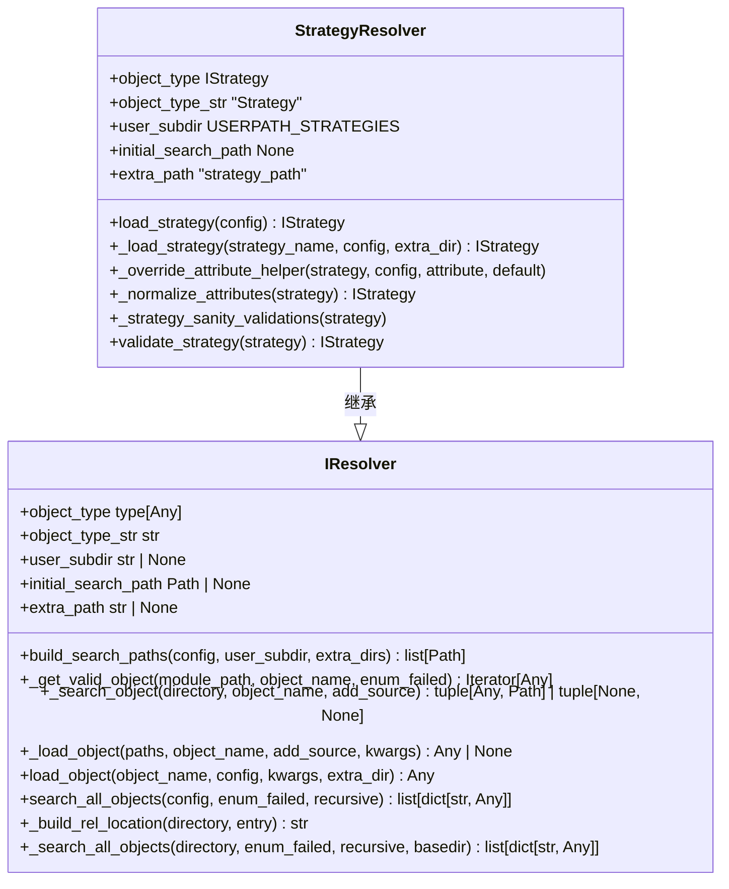
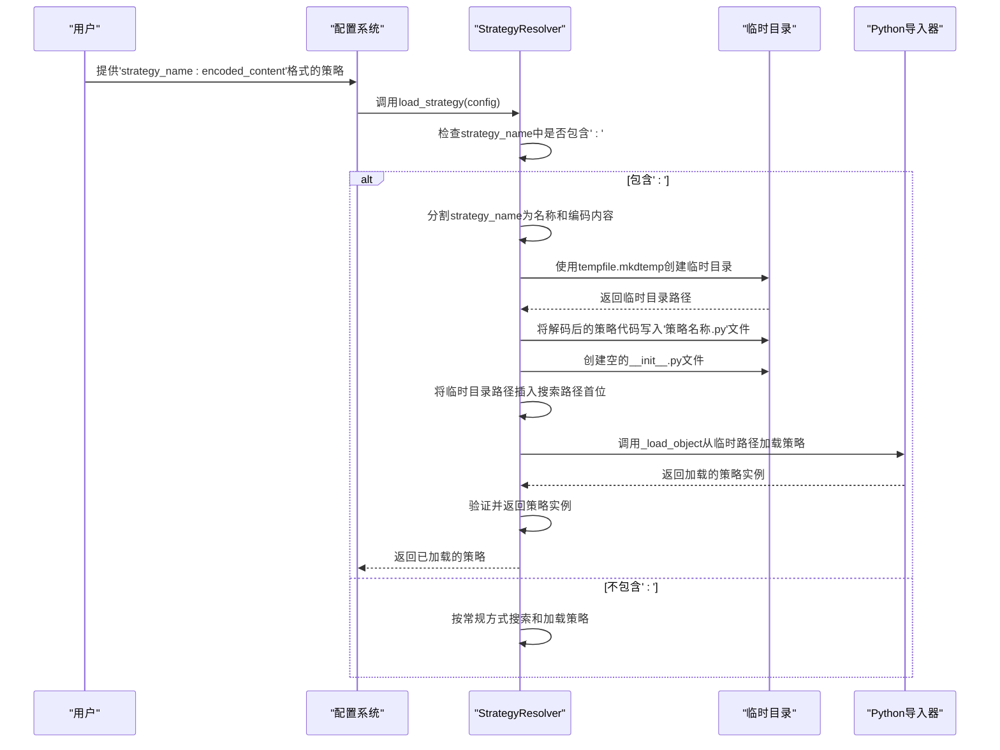
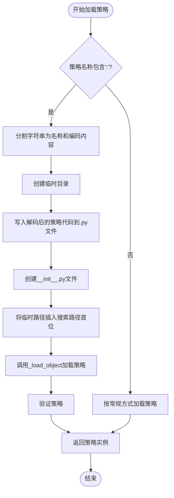

# Base64编码策略的动态加载

<cite>
**Referenced Files in This Document**   
- [strategy_resolver.py](file://freqtrade\resolvers\strategy_resolver.py)
- [interface.py](file://freqtrade\strategy\interface.py)
- [iresolver.py](file://freqtrade\resolvers\iresolver.py)
</cite>

## 目录
1. [简介](#简介)
2. [核心机制分析](#核心机制分析)
3. [Base64编码策略加载流程](#base64编码策略加载流程)
4. [临时目录与模块加载](#临时目录与模块加载)
5. [安全考虑与应用场景](#安全考虑与应用场景)
6. [结论](#结论)

## 简介
本文档深入解析Freqtrade框架中针对包含Base64编码内容的策略名称的特殊处理机制。该机制允许用户通过命令行或配置文件直接传递Base64编码的策略代码，实现远程策略部署和动态策略更新。文档将详细说明如何解析'strategy_name:encoded_content'格式的字符串，使用tempfile.mkdtemp创建临时目录，并将解码后的策略代码写入临时Python文件。同时，文档将阐述临时目录中__init__.py文件的创建目的，以及如何将临时路径插入搜索路径首位以确保优先加载。

**Section sources**
- [strategy_resolver.py](file://freqtrade\resolvers\strategy_resolver.py#L25-L307)

## 核心机制分析
Base64编码策略的动态加载机制主要由`StrategyResolver`类实现，该类继承自`IResolver`接口。`StrategyResolver`负责根据配置加载指定的策略类。当策略名称中包含冒号（:）时，系统会识别为Base64编码的策略并启动特殊处理流程。

**Diagram sources**
- [strategy_resolver.py](file://freqtrade\resolvers\strategy_resolver.py#L25-L307)
- [iresolver.py](file://freqtrade\resolvers\iresolver.py#L37-L290)

**Section sources**
- [strategy_resolver.py](file://freqtrade\resolvers\strategy_resolver.py#L25-L307)
- [iresolver.py](file://freqtrade\resolvers\iresolver.py#L37-L290)

## Base64编码策略加载流程
Base64编码策略的加载流程始于`StrategyResolver.load_strategy`方法，该方法首先检查配置中是否设置了策略名称。如果策略名称中包含冒号（:），则系统会将其视为Base64编码的策略。

**Diagram sources**
- [strategy_resolver.py](file://freqtrade\resolvers\strategy_resolver.py#L254-L307)

**Section sources**
- [strategy_resolver.py](file://freqtrade\resolvers\strategy_resolver.py#L254-L307)

## 临时目录与模块加载
当系统检测到Base64编码的策略时，会使用`tempfile.mkdtemp`创建一个临时目录。该目录的命名遵循"freq_strategy_随机字符串"的模式，确保其唯一性。在临时目录中，系统会创建两个关键文件：以策略名称命名的Python文件和一个空的`__init__.py`文件。

`__init__.py`文件的创建至关重要，它将临时目录转换为一个有效的Python包，使得Python的导入机制能够正确识别和加载该目录中的模块。随后，系统将临时目录的解析路径插入到搜索路径列表的首位，确保在加载策略时优先从该临时目录中查找。

**Diagram sources**
- [strategy_resolver.py](file://freqtrade\resolvers\strategy_resolver.py#L254-L307)

**Section sources**
- [strategy_resolver.py](file://freqtrade\resolvers\strategy_resolver.py#L254-L307)

## 安全考虑与应用场景
Base64编码策略的动态加载机制在提供便利性的同时，也带来了潜在的安全风险。由于该机制允许直接执行任意Python代码，因此必须确保编码内容的来源可信。在远程策略部署和动态策略更新场景下，此机制极大地简化了策略的分发和更新流程，无需将策略文件物理地放置在策略目录中。

然而，这种便利性也要求系统管理员实施严格的安全措施，例如对策略代码进行签名验证，或在受控环境中执行策略加载。此外，临时目录的创建和使用也应遵循最小权限原则，确保临时文件在使用后能够被及时清理，防止敏感信息泄露。

**Section sources**
- [strategy_resolver.py](file://freqtrade\resolvers\strategy_resolver.py#L254-L307)

## 结论
Freqtrade框架通过`StrategyResolver`类实现的Base64编码策略动态加载机制，为用户提供了极大的灵活性和便利性。该机制通过解析'strategy_name:encoded_content'格式的字符串，利用临时目录和Python的模块导入机制，实现了策略的远程部署和动态更新。尽管该机制在安全方面需要特别注意，但其在自动化交易系统中的应用价值不可忽视，为策略的快速迭代和部署提供了强有力的支持。

**Section sources**
- [strategy_resolver.py](file://freqtrade\resolvers\strategy_resolver.py#L25-L307)