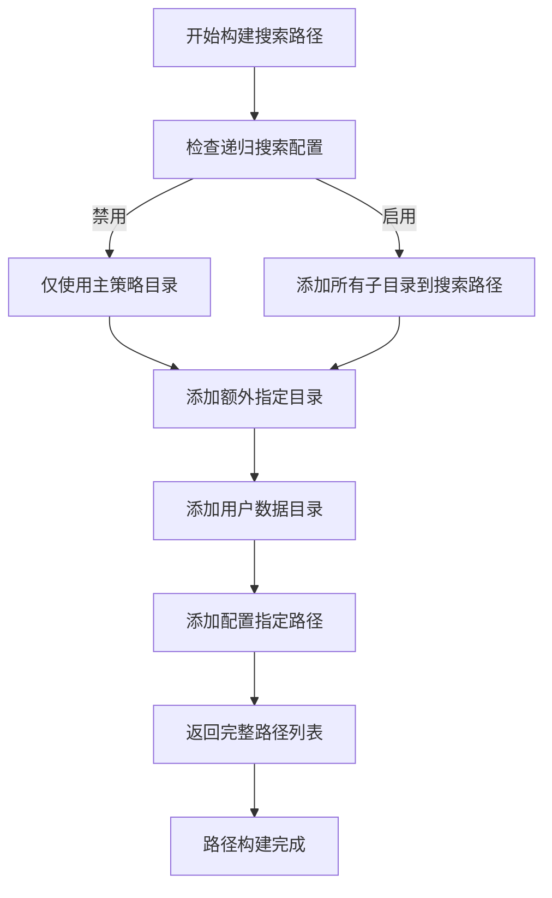
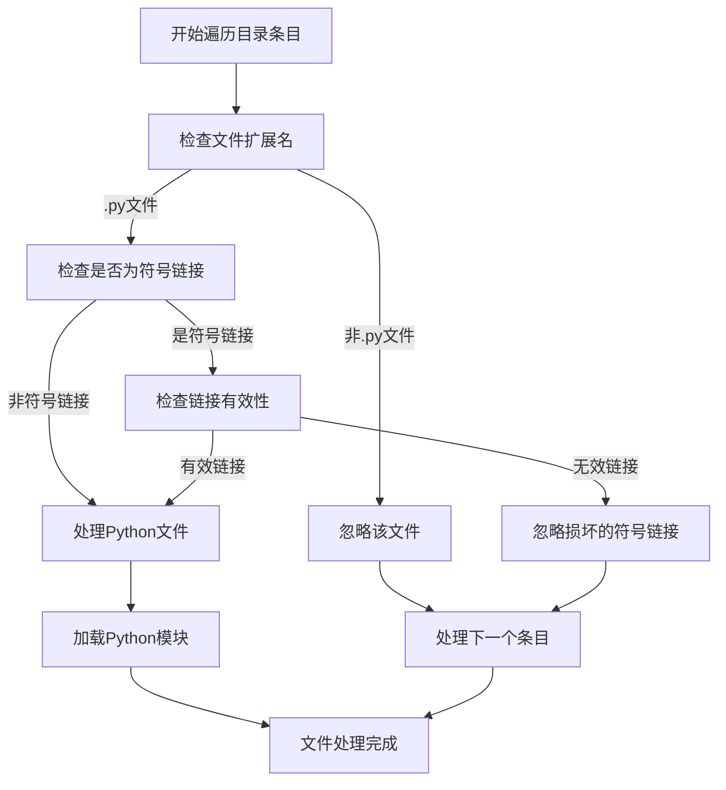
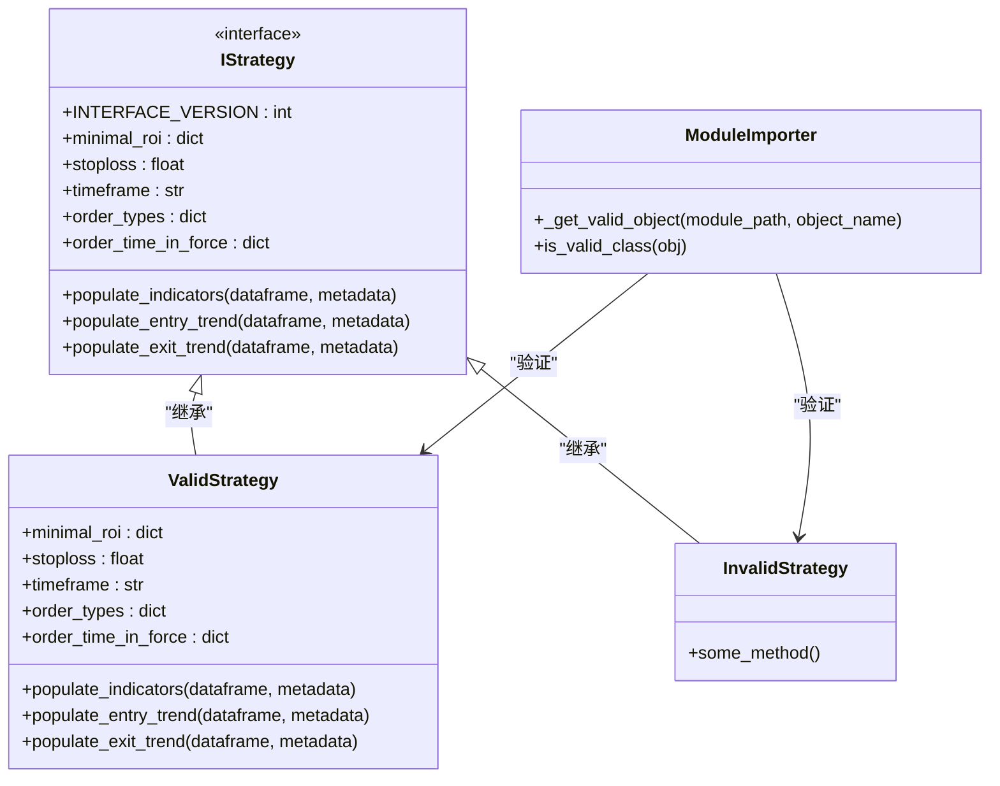
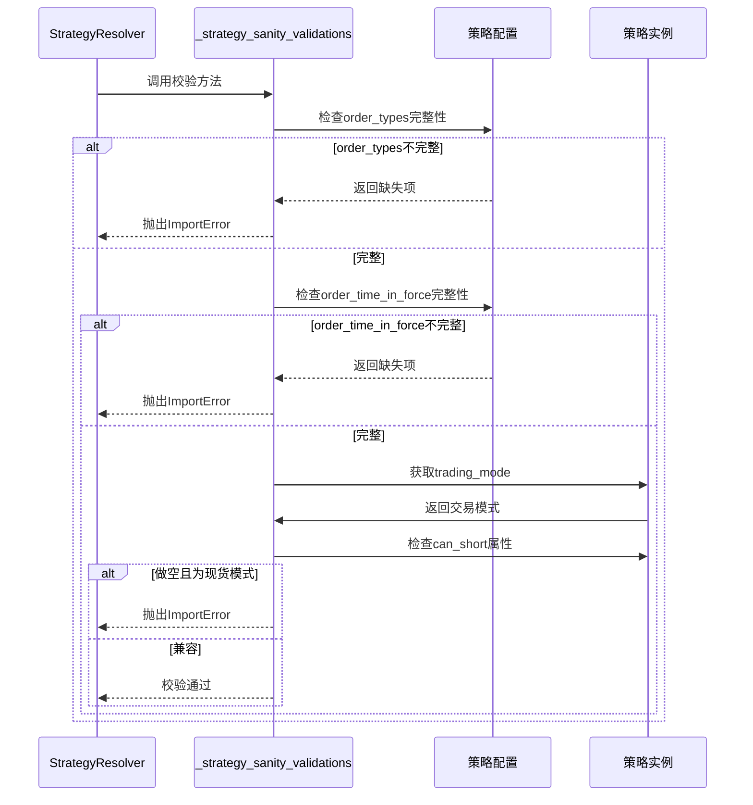

# 策略文件定位与加载

<cite>
**本文档中引用的文件**  
- [strategy_resolver.py](file://freqtrade/resolvers/strategy_resolver.py)
- [iresolver.py](file://freqtrade/resolvers/iresolver.py)
- [interface.py](file://freqtrade/strategy/interface.py)
</cite>

## 目录
1. [策略文件搜索流程](#策略文件搜索流程)
2. [路径构建与遍历机制](#路径构建与遍历机制)
3. [文件过滤与符号链接处理](#文件过滤与符号链接处理)
4. [模块导入与有效性验证](#模块导入与有效性验证)
5. [策略类完整性校验](#策略类完整性校验)

## 策略文件搜索流程

Freqtrade框架通过`StrategyResolver`类实现策略文件的动态加载。整个流程始于`_load_strategy`方法，该方法首先调用`build_search_paths`生成待搜索的路径列表，然后通过`_load_object`逐个尝试在这些路径中定位目标策略。核心搜索逻辑由`_search_object`方法实现，它会遍历每个目录中的Python文件，利用`_get_valid_object`生成器验证模块中的类是否为有效的`IStrategy`子类。一旦找到匹配的策略类，系统将实例化该类并进行完整性校验。

**节来源**
- [strategy_resolver.py](file://freqtrade/resolvers/strategy_resolver.py#L254-L307)
- [iresolver.py](file://freqtrade/resolvers/iresolver.py#L161-L182)

## 路径构建与遍历机制

策略文件的搜索路径由`build_search_paths`方法构建。该方法根据配置参数生成一个有序的路径列表，搜索优先级从高到低依次为：额外指定目录、用户数据目录下的策略子目录、以及配置中指定的策略路径。路径构建过程支持递归搜索，当配置项`recursive_strategy_search`启用时，系统会自动包含用户策略目录下的所有子目录。`_load_object`方法按顺序遍历这些路径，调用`_search_object`在每个目录中查找目标策略类，确保能够覆盖所有可能的策略文件位置。

**图来源**
- [iresolver.py](file://freqtrade/resolvers/iresolver.py#L51-L72)
- [iresolver.py](file://freqtrade/resolvers/iresolver.py#L161-L182)

**节来源**
- [iresolver.py](file://freqtrade/resolvers/iresolver.py#L51-L72)
- [strategy_resolver.py](file://freqtrade/resolvers/strategy_resolver.py#L254-L307)

## 文件过滤与符号链接处理

在目录遍历过程中，`_search_object`方法实施严格的文件过滤机制。系统仅处理以`.py`为扩展名的Python文件，其他类型的文件会被直接忽略。对于符号链接文件，系统会检查其是否为有效的文件引用，若为损坏的符号链接（即指向不存在的文件），则会被跳过。这种过滤机制确保了系统只加载合法的Python模块，避免了因处理非Python文件或损坏链接而导致的异常。文件验证过程通过`entry.suffix`和`entry.is_symlink()`等Pathlib方法实现，保证了跨平台的兼容性。

**图来源**
- [iresolver.py](file://freqtrade/resolvers/iresolver.py#L131-L158)

**节来源**
- [iresolver.py](file://freqtrade/resolvers/iresolver.py#L131-L158)

## 模块导入与有效性验证

策略类的有效性验证由`_get_valid_object`生成器方法完成。该方法首先通过`importlib.util.spec_from_file_location`创建模块规范，然后动态导入目标Python文件。在导入过程中，系统会捕获`AttributeError`、`ModuleNotFoundError`、`SyntaxError`等异常，确保即使某些模块存在语法错误也不会导致整个加载过程失败。验证逻辑通过`is_valid_class`内部函数实现，检查目标类是否满足三个条件：必须是类对象、必须继承自`IStrategy`接口、且不能是`IStrategy`本身。此外，系统还验证类的模块名称与文件名一致，确保策略类在正确的命名空间中定义。

**图来源**
- [iresolver.py](file://freqtrade/resolvers/iresolver.py#L75-L128)
- [interface.py](file://freqtrade/strategy/interface.py#L50-L759)

**节来源**
- [iresolver.py](file://freqtrade/resolvers/iresolver.py#L75-L128)
- [interface.py](file://freqtrade/strategy/interface.py#L50-L759)

## 策略类完整性校验

在策略类成功加载后，系统通过`_strategy_sanity_validations`方法进行完整性校验。该方法执行多项关键检查：首先验证`order_types`和`order_time_in_force`配置是否包含所有必需的订单类型，确保交易指令的完整性；然后检查做空策略与现货交易模式的兼容性，防止在不支持做空的市场中运行做空策略。这些校验在策略实例化后立即执行，作为最后的安全防线，确保加载的策略在语法和逻辑上都符合Freqtrade框架的要求。任何校验失败都会抛出`ImportError`异常，阻止无效策略的加载和执行。

**图来源**
- [strategy_resolver.py](file://freqtrade/resolvers/strategy_resolver.py#L148-L170)

**节来源**
- [strategy_resolver.py](file://freqtrade/resolvers/strategy_resolver.py#L148-L170)