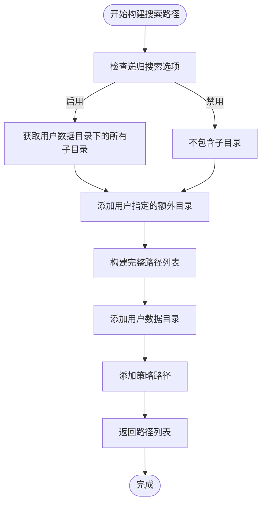
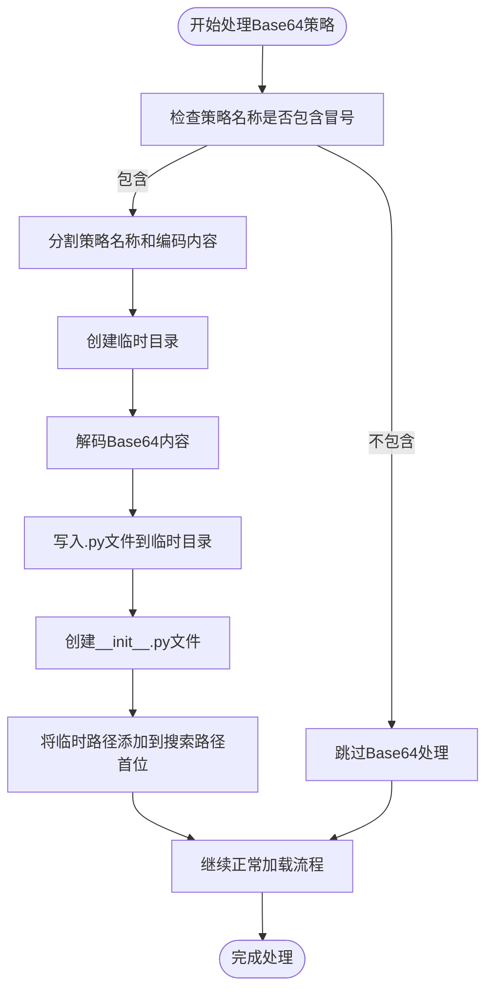
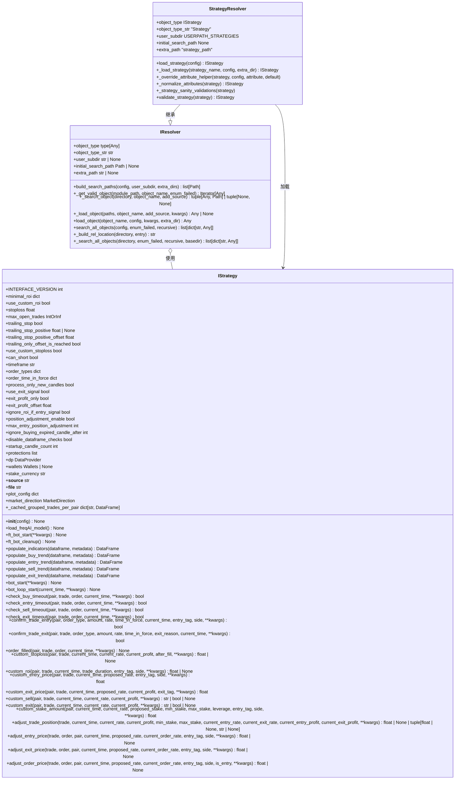

# 策略模块解析机制

<cite>
**本文档引用的文件**   
- [strategy_resolver.py](file://freqtrade\resolvers\strategy_resolver.py)
- [iresolver.py](file://freqtrade\resolvers\iresolver.py)
- [interface.py](file://freqtrade\strategy\interface.py)
- [constants.py](file://freqtrade\constants.py)
</cite>

## 目录
1. [简介](#简介)
2. [核心组件](#核心组件)
3. [搜索路径构建](#搜索路径构建)
4. [对象定位与加载](#对象定位与加载)
5. [Base64编码策略处理](#base64编码策略处理)
6. [依赖关系图](#依赖关系图)

## 简介
本文档深入解析Freqtrade框架中策略模块的解析机制，重点分析`StrategyResolver._load_strategy`方法的实现细节。文档详细说明了模块搜索路径的构建过程、对象定位与加载的协同工作机制，以及对Base64编码策略的特殊处理逻辑。

## 核心组件

策略解析机制的核心由`StrategyResolver`类实现，该类继承自`IResolver`基类，负责策略模块的加载和验证。`StrategyResolver`通过调用`_load_strategy`静态方法来完成策略的搜索和加载过程。

**Section sources**
- [strategy_resolver.py](file://freqtrade\resolvers\strategy_resolver.py#L25-L307)
- [iresolver.py](file://freqtrade\resolvers\iresolver.py#L37-L289)

## 搜索路径构建

`StrategyResolver`通过`build_search_paths`方法构建策略模块的搜索路径列表。该方法根据配置参数和目录结构，生成一个包含多个搜索路径的有序列表。

搜索路径的构建遵循以下优先级顺序：
1. 额外目录（extra_dirs）：包括递归搜索选项处理的子目录和用户指定的额外目录
2. 用户数据目录（user_data_dir）：位于`user_data/strategies`子目录下
3. 额外路径（strategy_path）：从配置中获取的特定策略路径



**Diagram sources**
- [strategy_resolver.py](file://freqtrade\resolvers\strategy_resolver.py#L240-L260)
- [iresolver.py](file://freqtrade\resolvers\iresolver.py#L60-L90)

**Section sources**
- [strategy_resolver.py](file://freqtrade\resolvers\strategy_resolver.py#L240-L260)
- [iresolver.py](file://freqtrade\resolvers\iresolver.py#L60-L90)

## 对象定位与加载

`IResolver`基类提供了`_search_object`和`_load_object`方法，与`StrategyResolver`协同工作来定位和加载策略模块。

```mermaid
sequenceDiagram
participant StrategyResolver as StrategyResolver
participant IResolver as IResolver
participant FileSystem as 文件系统
StrategyResolver->>IResolver : 调用_build_object
IResolver->>IResolver : 遍历搜索路径
loop 遍历每个路径
IResolver->>IResolver : 调用_search_object
IResolver->>FileSystem : 读取.py文件
FileSystem-->>IResolver : 返回模块
IResolver->>IResolver : 调用_get_valid_object
IResolver->>IResolver : 验证类是否为IStrategy子类
alt 找到有效对象
IResolver-->>StrategyResolver : 返回策略实例
break 返回结果
end
end
alt 未找到对象
StrategyResolver->>StrategyResolver : 抛出异常
end
```

**Diagram sources**
- [iresolver.py](file://freqtrade\resolvers\iresolver.py#L150-L200)
- [strategy_resolver.py](file://freqtrade\resolvers\strategy_resolver.py#L280-L300)

**Section sources**
- [iresolver.py](file://freqtrade\resolvers\iresolver.py#L150-L200)
- [strategy_resolver.py](file://freqtrade\resolvers\strategy_resolver.py#L280-L300)

## Base64编码策略处理

当策略名称包含Base64编码时，系统会执行特殊处理逻辑。该机制允许用户通过Base64编码的字符串直接传递策略代码，而无需创建物理文件。



**Diagram sources**
- [strategy_resolver.py](file://freqtrade\resolvers\strategy_resolver.py#L262-L280)

**Section sources**
- [strategy_resolver.py](file://freqtrade\resolvers\strategy_resolver.py#L262-L280)

## 依赖关系图



**Diagram sources**
- [strategy_resolver.py](file://freqtrade\resolvers\strategy_resolver.py)
- [iresolver.py](file://freqtrade\resolvers\iresolver.py)
- [interface.py](file://freqtrade\strategy\interface.py)

**Section sources**
- [strategy_resolver.py](file://freqtrade\resolvers\strategy_resolver.py)
- [iresolver.py](file://freqtrade\resolvers\iresolver.py)
- [interface.py](file://freqtrade\strategy\interface.py)